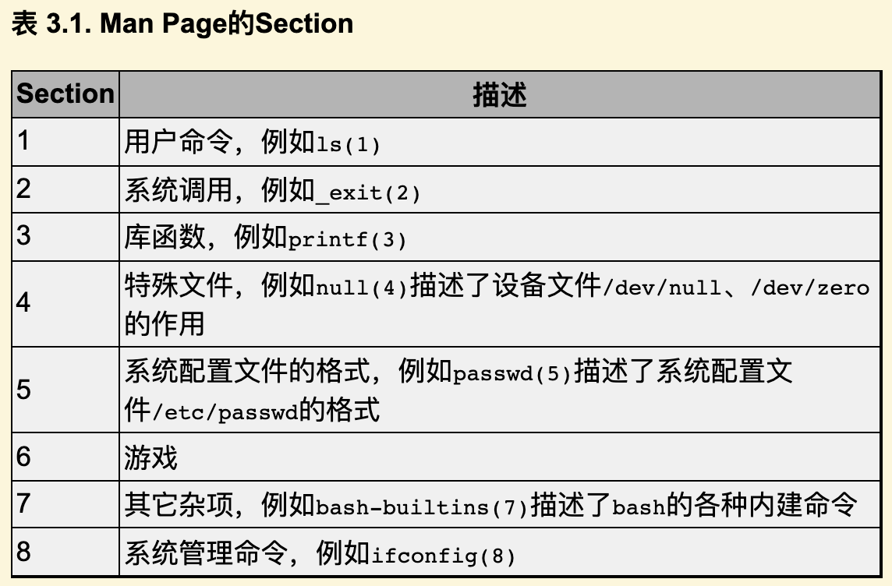

# 3. 简单函数

## 3.1 数学函数

### C 语言中的 sin 和 log

在数学中我们用过sin和ln这样的函数，例如sin(π/2)=1，ln1=0等，在C语言中也可以使用这些函数（数学函数sin在C标准库中就是sin函数，而数学函数ln在C标准库中对应的是log函数）。

``` c
#include <math.h>
#include <stdio.h>

int main(void)
{
    double pi = 3.1416;
    printf("sin(pi/2)=%f\nln1=%f\n", sin(pi/2), log(1.0));
    return 0;
}
```

编译运行这个程序，结果如下：

``` console
$ gcc main.c -lm
$ ./a.out
sin(pi/2)=1.000000
ln1=0.000000
```

### 函数调用

- 使用函数的时候一定要加上括号

  在数学中写一个函数有时候可以省略括号，而C语言要求一定要加上括号，例如log(1.0)。

- 参数、函数、函数调用

  在C语言的术语中，1.0是参数，log是函数（Function），log(1.0)是函数调用（Function Call）。

- 函数调用也是表达式，由函数名、函数调用运算符（后缀运算符）、参数组成

  sin(pi/2)和log(1.0)这两个函数调用在我们的printf语句中处于什么位置呢？

  在上一章讲过，这应该是写**表达式**的位置，因此函数调用也是一种表达式。

  log(1.0)这个表达式由操作数log和**函数调用运算符**()括号组成，函数调用运算符是一种后缀运算符（Postfix Operator），()括号及其中的**参数**是操作数log的后缀。

  操作数log是一个函数名（Function Designator），它的类型是一种函数类型（Function Type）。

- 函数调用表达式的值称为函数的返回值

  log(1.0)这个表达式的值是取自然对数运算的结果，类型是double型，在C语言中函数调用表达式的值称为函数的返回值（Return Value）。

### 总结新学语法规则

总结一下我们新学的语法规则：

表达式 → 函数名

表达式 → 表达式(参数列表)

参数列表 → 表达式, 表达式, ...

- printf 函数调用也是表达式，printf 语句也是表达式语句

  现在我们可以完全理解printf语句了：原来printf也是一个函数，上例中的printf("sin(pi/2)=%f\nln1=%f\n", sin(pi/2), log(1.0))是带三个参数的函数调用，而函数调用也是一种表达式，因此printf语句也是表达式语句的一种。

### Side Effects

- log 没有 side effects，printf 有

  但是printf感觉不像一个数学函数，为什么呢？因为像log这种函数，我们传进去一个参数会得到一个返回值，我们调用log函数就是为了得到它的返回值，至于printf，通常我们并不关心它的返回值（事实上它也有返回值，表示实际打印的字符数），我们调用printf不是为了得到它的返回值，而是为了利用它所产生的副作用（Side Effect）——打印。

- 数学函数不能有 side effects，C 语言可以有

  C语言的函数可以有Side Effect，这一点是它和数学函数在概念上的根本区别。

- 把运算符看成函数，运算符也有 Side Effect 的概念

  Side Effect这个概念也适用于运算符组成的表达式。

  比如a+b这个表达式也可以看成一个函数调用，把运算符+看作函数，它的两个参数是a和b，返回值是两个参数的和，传入两个参数，得到一个返回值，并没有产生任何Side Effect。

  而赋值运算符是有Side Effect的，如果把a=b这个表达式看成函数调用，返回值就是所赋的值，既是b的值也是a被赋予的值，但除此之外还产生了Side Effect，就是变量a被改变了。

- 哪些操作算 side effects

  改变计算机存储单元里的数据或者做输入输出操作都算Side Effect。

### 头文件、库文件、库函数

- #include 包含头文件

  程序第一行的#号（Pound Sign，Number Sign或Hash Sign）和include表示包含一个头文件（Header File），后面尖括号（Angle Bracket）中就是文件名。

- 头文件位置

  这些头文件通常位于/usr/include目录下。

- 头文件声明了库函数

  头文件中声明了我们程序中使用的库函数，根据先声明后使用的原则，要使用printf函数必须包含stdio.h，要使用数学函数必须包含math.h，如果什么库函数都不使用就不必包含任何头文件，例如写一个程序int main(void){int a;a=2;return 0;}，不需要包含头文件就可以编译通过，当然这个程序什么也做不了。

- 使用 libm.so 库文件中的库函数要加 -lm，使用 libc.so 可以加也可以不加

  使用math.h中声明的库函数还有一点特殊之处，gcc命令行必须加-lm选项，因为数学函数位于libm.so库文件中（这些库文件通常位于/lib目录下），-lm选项告诉编译器，我们程序中用到的数学函数要到这个库文件里找。

  注意库文件名是libm，但使用-l选项指定库文件时省略lib，只写成-lm。

  本书用到的大部分库函数（例如printf）位于libc.so库文件中，使用libc.so中的库函数在编译时不需要加-lc选项，当然加了也不算错，因为这个选项是gcc的默认选项。

  关于头文件和库函数目前理解这么多就可以了，到第19章再详细解释。

### C 标准库和 glibc 函数库

- C 标准由 C 的语法描述和 C 的标准库描述组成

  C标准主要由两部分组成，一部分描述C的语法，另一部分描述C标准库。

  C标准库定义了一组标准头文件，每个头文件中包含一些相关的函数、变量、类型声明和宏定义。

- 一个平台要支持 C 语言，要实现 C 编译器和 C 标准库

  要在一个平台上支持C语言，不仅要实现C编译器，还要实现C标准库，这样的实现才算符合C标准。

  不符合C标准的实现也是存在的，例如很多单片机的C语言开发工具中只有C编译器而没有完整的C标准库。

- glibc：Linux 平台上使用最广泛的 C 函数库

  - glibc 包括 C 标准库的实现和其他系统函数

    在Linux平台上最广泛使用的C函数库是glibc，其中包括C标准库的实现，也包括本书第三部分介绍的所有系统函数。

  - glibc 是 Linux 平台 C 程序运行的基础

    几乎所有C程序都要调用glibc的库函数，所以glibc是Linux平台C程序运行的基础。

  - glibc 提供一组头文件和一组库文件

    glibc提供一组头文件和一组库文件，最基本、最常用的C标准库函数和系统函数在libc.so库文件中，几乎所有C程序的运行都依赖于libc.so，有些做数学计算的C程序除了libc.so之外还依赖于libm.so，还有很多C程序依赖于glibc的其他库文件。

    以后我说libc时专指libc.so这个库文件，而说glibc时指的是glibc提供的所有库文件。

- Linux 平台上其他的函数库

  glibc并不是Linux平台唯一的基础C函数库，也有人在开发别的C函数库，比如适用于嵌入式系统的uClibc。

## 3.2 自定义函数

### main 函数

- main 函数就是一个自定义函数

  我们不仅可以调用C标准库提供的函数，也可以定义自己的函数，事实上我们已经这么做了：我们定义了main函数。例如：

  ``` c
  int main(void)
  {
      int hour = 11;
      int minute = 59;
      printf("%d and %d hours\n", hour, minute / 60);
      return 0;
  }
  ```

- main 函数在执行程序的时候会被操作系统自动调用

  main函数的特殊之处在于执行程序时它自动被操作系统调用，操作系统就认准了main这个名字，除了名字特殊之外，main函数和别的函数没有区别。

- C 程序总是从 main 的第一条语句开始执行 1.4

  要注意main是一个特殊的名字，C程序总是从main里面的第一条语句开始执行的。

### 自定义函数语法规则

我们对照着main函数的定义来看语法规则：

函数定义 → 返回值类型 函数名(参数列表) 函数体

函数体 → { 语句列表 }

语句列表 → 语句列表项 语句列表项 ...

语句列表项 → 语句

语句列表项 → 变量声明、类型声明或非定义的函数声明

非定义的函数声明 → 返回值类型 函数名(参数列表);

我们稍后再详细解释“函数定义”和“非定义的函数声明”的区别。从第7章开始我们才会看到类型声明，所以现在暂不讨论。

- 函数名起名限制

  给函数命名也要遵循上一章讲过的标识符命名规则。

- 没有参数时，参数列表要写成 void

  由于我们定义的main函数不带任何参数，参数列表应写成void。

- 函数体中语句和声明的位置

  函数体可以由若干条语句和声明组成，C89要求所有声明写在所有语句之前（本书的示例代码都遵循这一规定），而C99的新特性允许语句和声明按任意顺序排列，只要每个标识符都遵循先声明后使用的原则就行。

- main 的给操作系统的返回值可以用 $? 查看

  main函数的返回值是int型的，return 0;这个语句表示返回值是0，main函数的返回值是返回给操作系统看的，因为main函数是被操作系统调用的，通常程序执行成功就返回0，在执行过程中出错就返回一个非零值。

  比如我们将main函数中的return语句改为return 4;再执行它，执行结束后可以在Shell中看到它的退出状态（Exit Status）：

  ``` console
  $ ./a.out
  11 and 0 hours
  $ echo $?
  4
  ```

  $?是Shell中的一个特殊变量，表示上一条命令的退出状态。

- 函数定义不写返回值类型也不写参数列表

  参考文献[3]上的main函数定义写成main(){...}的形式，不写返回值类型也不写参数列表，这是Old Style C的风格。

  Old Style C规定不写返回值类型就表示返回**int**型，不写参数列表就表示参数类型和个数**没有明确指出**。

  这种宽松的规定使编译器无法检查程序中可能存在的Bug，增加了调试难度，不幸的是现在的C标准为了兼容旧的代码仍然保留了这种语法，但读者绝不应该继续使用这种语法。

- main 函数参数的两种标准形式

  其实操作系统在调用main函数时是传参数的，main函数最标准的形式应该是int main(int argc, char *argv[])，在第22.6节详细介绍。

  C标准也允许int main(void)这种写法，如果不使用系统传进来的两个参数也可以写成这种形式。

  但除了这两种形式之外，定义main函数的其他写法都是错误的或不可移植的。

- void 返回值类型

  返回值类型为void表示没有返回值。

  敏锐的读者可能会发现一个矛盾：如果函数newline没有返回值，那么表达式newline()不就没有值了吗？

  然而上一章讲过**任何表达式都有值和类型**两个基本属性。

  其实这正是设计void这么一个关键字的原因：首先从**语法**上规定没有返回值的函数调用表达式是void类型的，有一个void类型的值，这样任何表达式都有值，不必考虑特殊情况，编译器的语法解析比较容易实现；然后从**语义**上规定void类型的表达式不能参与运算，因此newline()+1这样的表达式不能通过语义检查，从而兼顾了语法上的一致和语义上的不矛盾。

  - Pascal 区分有返回值的函数（函数）和没有返回值的函数（过程）

    在C语言中这个问题通过**语义检查**来解决，而在别的编程语言中又有不同的解决办法，比如Pascal语言从**语法**上区分有返回值和没有返回值的函数，有返回值的称为函数，没有返回值的称为过程（Procedure），在本书中函数和过程表示相同的含义。

### 函数声明、函数定义、函数原型

现在澄清一下函数声明、函数定义、函数原型（Prototype）这几个概念。

- 函数原型

  比如void threelines(void)这一行，声明了一个函数的名字、参数类型和个数、返回值类型，这称为函数原型。

- 函数声明：函数原型加分号

  在代码中也可以单独写一个函数原型后面加;号结束，而不写函数体，例如：

  ``` c
  void threelines(void);
  ```

  这种写法只能叫函数声明而不能叫函数定义，上一章讲过，只有**带函数体的声明才叫函数定义**，因为编译器只有见到函数体才能生成指令，并且分配存储空间来保存这些指令。

  - 函数声明中的函数原型和函数定义中的函数原型的作用

    那么没有函数体的函数声明有什么用呢？

    它为编译器提供了有用的信息，编译器见到函数原型（不管带不带函数体）就明确了这个函数的名字、参数类型和返回值，之后编译器**碰到函数调用代码就知道该生成什么样的指令来实现函数调用**了，所以**函数原型应该出现在函数调用之前**，这也是遵循“先声明后使用”的原则。

- 函数声明不写参数列表

  由于有Old Style C语法的存在，并非所有函数声明都包含完整的函数原型，例如void threelines();这个声明并没有明确指出参数类型和个数，所以**不算函数原型**，这个声明提供给编译器的信息只有函数名和返回值类型。

  如果在这样的声明之后调用函数，编译器不知道参数的类型和个数，就**不会做语法检查**，所以很容易引入Bug。

  读者需要了解这个知识点以便维护别人用Old Style C风格写的代码，但绝不应该按这种风格写新的代码。

- 函数的隐式声明

  如果在调用函数之前没有声明会怎么样呢？有的读者也许碰到过这种情况，我可以解释一下，但绝不推荐这种写法。

  比如按上面的顺序定义这三个函数，但是把开头的两行声明去掉：

  ``` c
  #include <stdio.h>

  int main(void)
  {
      printf("Three lines:\n");
      threelines();
      printf("Another three lines.\n");
      threelines();
      return 0;
  }

  void newline(void)
  {
      printf("\n");
  }

  void threelines(void)
  {
      newline();
      newline();
      newline();
  }
  ```

  编译时会报警告：

  ``` console
  $ gcc main.c
  main.c:17: warning: conflicting types for 'threelines'
  main.c:6: note previous implicit declaration of 'threelines' was here
  ```

  但也能编译通过，运行结果也对。这里涉及的语法规则称为函数的隐式声明（Implicit Declaration）。

  由于在main函数中调用threelines()之前并没有声明它，编译器只能根据**函数调用来猜测它的原型**，比如根据调用foo(2.1, 3.3)可以猜测foo函数有两个double型的参数，而我们调用threelines()没有传任何参数，所以编译器认为threelines函数的参数类型是void，另外，编译器认为**所有隐式声明的返回值类型**都是**int**，所以threelines函数的隐式声明是int threelines(void);，这样参数和返回值类型都确定下来了，编译器可以根据这些信息为threelines()调用**生成相应的指令**。

  然后编译器接着往下看，看到threelines函数的原型是void threelines(void)，与先前建立的隐式声明不一致（返回值类型不同），所以报警告。好在我们也没用到这个函数的返回值，执行结果仍然正确。假如我们在main函数中写int i=threelines();就错了，但编译也能通过，也给出同样的警告信息。

- 区分参数列表为空的两种情况

  注意区分以下两个概念：

  - 如果调用函数时参数列表为空，并且缺少函数原型，则编译器根据隐式声明规则认为参数类型是void；

  - 如果声明函数<span class="thoughts">或定义函数</span>时参数列表为空，则这个声明属于Old Style C语法，不算函数原型，编译器认为参数类型和个数没有明确指出。

## 3.3 形参和实参

### 带参数函数的定义和声明

- 定义一个带参数的函数

  下面我们定义一个带参数的函数，我们需要在函数定义中指明参数的个数和每个参数的类型，定义参数就像定义变量一样，需要为每个参数指明类型，参数的命名也要遵循**标识符命名规则**。

  ``` c
  #include <stdio.h>

  void print_time(int hour, int minute)
  {
      printf("%d:%d\n", hour, minute);
  }

  int main(void)
  {
      print_time(23, 59);
      return 0;
  }
  ```

- 声明一个带参数的函数可以只写参数类型

  如果写一个非定义的函数声明，可以只写参数类型而不写参数名，例如：

  ``` c
  void print_time(int, int);
  ```

  这样的声明仍然包含了函数名、参数类型和个数、返回值类型的完整信息，所以也算**函数原型**。

- 定义一个带参数的函数时，多个参数不能用同一个类型声明

  注意，定义变量时可以把相同类型的变量列在一起，而定义参数却不可以，例如下面这样的定义是错的：

  ``` c
  void print_time(int hour, minute)
  {
      printf("%d:%d\n", hour, minute);
  }
  ```

  初学者肯定都乐意看到这句话：“变量是这样定义的，参数也是这样定义的，一模一样”，这意味着不用专门去记住参数应该怎么定义了。谁也不愿意看到这句话：“定义变量可以这样写，而定义参数却不可以”。

  - Rule of Least Surprise

    C语言的设计者也不希望自己设计的语法规则里到处都是例外，一个容易被用户接受的设计应该遵循**最少例外原则**（Rule of Least Surprise）。

  - 这条规定可以通过参数列表语法规则来解释

    其实这条规定也不算十分例外，也是可以理解的，我们看参数列表的语法规则：

    参数列表 → 列表项, 列表项, ...

    列表项 → 类型 标识符

    参数列表中的,号（Comma）是列表项之间的分隔符，如果允许写void foo(int hour, minute, char c)这样的声明，那就是允许一部分列表项有类型一部分列表项没有类型，还要规定没有类型的列表项和前一列表项的类型相同，那编译器实现起来就复杂了。

  - 用 , 而不用 ; 分隔列表项有历史原因

    另外一个问题是，如果仿照变量声明把参数列表的语法规则改成下面这样不是很好吗？

    参数列表 → 列表项; 列表项; ...

    列表项 → 类型 标识符, 标识符, ...

    按照这样的语法规则，函数声明就可以写成void foo(int hour, minute; char c)，但为什么C语言没有这样规定呢？

    这也是从Old Style C继承下来的，Old Style C是这样声明参数的：

    ``` c
    void foo(x, y, z)
    int x;
    char z;
    {
        ...
    }
    ```

    现在的C编译器仍然支持这种语法。上例中不写类型的参数y默认是int型。

  - Rationale

    学习编程语言不应该死记各种语法规定，如果能够想清楚设计者这么规定的原因（Rationale），不仅有助于记忆，而且会有更多收获。

    本书在必要的地方会解释一些Rationale，或者启发读者自己去思考，例如上一节在脚注中解释了void关键字的Rationale。

    参考文献[6]是随C99标准一起发布的，值得参考。

### 形参和实参

我们调用print_time(23, 59)时，函数中的参数hour就代表23，参数minute就代表59。

确切地说，当我们讨论函数中的hour这个参数时，我们所说的“参数”是指形参（Parameter），当我们讨论传一个参数23给函数时，我们所说的“参数”是指实参（Argument），但我习惯都叫参数而不习惯总把形参、实参这两个文绉绉的词挂在嘴边（事实上大多数人都不习惯），读者可以根据上下文判断我说的到底是形参还是实参。

- 形参相当于函数中定义的变量

  记住这条基本原理：形参相当于函数中定义的变量，调用函数传递参数的过程相当于定义形参变量并且用实参的值来初始化。

  例如这样调用：

  ``` c
  void print_time(int hour, int minute)
  {
      printf("%d:%d\n", hour, minute);
  }
  int main(void)
  {
      int h = 23, m = 59;
      print_time(h, m);
      return 0;
  }
  ```

  相当于在函数print_time中执行了以下代码：

  ``` c
  int hour = h;
  int minute = m;
  printf("%d:%d\n", hour, minute);
  ```

- Call by value

  main函数的变量h和print_time函数的参数hour是两个**不同的变量**，只不过它们的存储空间中都保存了相同的值23，因为变量h的值赋给了参数hour。同理，变量m的值赋给了参数minute。

  C语言的这种传递参数的方式称为Call by Value。

- 形参和实参的类型和数量都要对应上

  在调用函数时，每个参数都需要得到一个值，函数定义中有几个形参，在调用时就要传几个实参，不能多也不能少，每个参数的类型也必须对应上。

- 可变参数

  肯定有读者注意到了，为什么我们每次调用printf传的实参个数都不一样呢？因为C语言规定了一种特殊的参数列表格式，用命令man 3 printf可以查看到printf函数的原型：

  ``` c
  int printf(const char *format, ...);
  ```

  第一个参数是const char *类型的，后面的...可以代表0个或任意多个参数，这些参数的类型也是不确定的，这称为可变参数（Variable Argument），我们将在第23.6节详细讨论这种格式。

- 函数也被叫做接口

  总之，每个函数的原型都明确规定了返回值类型以及参数的类型和个数，即使像printf这样规定为“不确定”也是一种明确的规定，调用函数时要严格遵守这些规定，有时候我们把函数叫做接口（Interface），调用函数就是使用这个接口，使用接口的前提是必须和接口保持一致。

### Man Pages

Man Page是Linux开发最常用的参考手册，由很多页面组成，每个页面描述一个主题，这些页面被组织成若干个Section。

- FHS 标准规定了每个 man page 属于哪个 section

  FHS（Filesystem Hierarchy Standard）标准规定了Man Page各Section的含义如表3.1所示。

  

- 注意区分用户命令和系统管理命令

  注意区分用户命令和系统管理命令，用户命令通常位于/bin和/usr/bin目录，系统管理命令通常位于/sbin和/usr/sbin目录，一般用户可以执行用户命令，而执行系统管理命令经常需要root权限。

- 系统调用和库函数的区别

  系统调用和库函数的区别将在第18.2节说明。

- man pages 会重名

  Man Page中有些页面有重名，比如敲man printf命令看到的并不是C函数printf，而是位于第1个Section的命令printf，要查看位于第3个Section的printf函数应该敲man 3 printf，也可以敲man -k printf命令搜索哪些页面的主题包含printf关键字。

  本书会经常出现类似printf(3)这样的写法，括号中的3表示Man Page的第3个Section，或者表示“我这里想说的是printf库函数而不是printf命令”。

## 3.4 全局变量、局部变量和作用域

### 局部变量

我们把函数中定义的变量称为局部变量（Local Variable），由于形参相当于函数中定义的变量，所以形参也是一种局部变量。

在这里“局部”有两层含义：

1.  一个函数中定义的变量不能被另一个函数使用

    例如print_time中的hour和minute在main函数中没有定义，不能使用，同样main函数中的局部变量也不能被print_time函数使用。

    如果这样定义：

    ``` c
    void print_time(int hour, int minute)
    {
        printf("%d:%d\n", hour, minute);
    }

    int main(void)
    {
        int hour = 23, minute = 59;
        print_time(hour, minute);
        return 0;
    }
    ```

    main函数中定义了局部变量hour，print_time函数中也有参数hour，虽然它们名称相同，但仍然是两个不同的变量，代表不同的存储单元。main函数的局部变量minute和print_time函数的参数minute也是如此。

2.  每次调用函数时局部变量都表示不同的存储空间

    局部变量在**每次函数调用时分配存储空间**，在**每次函数返回时释放存储空间**，例如调用print_time(23, 59)时分配hour和minute两个变量的存储空间，在里面分别存上23和59，函数返回时释放它们的存储空间，下次再调用print_time(12, 20)时又分配hour和minute的存储空间，在里面分别存上12和20。

### 全局变量

与局部变量的概念相对的是全局变量（Global Variable），全局变量定义在所有的函数体之外，它们在**程序开始运行时分配存储空间**，在**程序结束时释放存储空间**，在任何函数中都可以访问全局变量。

- 慎用全局变量，尽量用函数传参代替

  正因为全局变量在任何函数中都可以访问，所以在程序运行过程中全局变量被读写的顺序从源代码中是看不出来的，源代码的书写顺序并不能反映函数的调用顺序。

  程序出现了Bug往往就是因为在某个不起眼的地方**对全局变量的读写顺序不正确**，如果代码规模很大，这种错误是很难找到的。

  而对局部变量的访问不仅局限在一个函数内部，而且局限在一次函数调用之中，从函数的源代码中很容易看出访问的先后顺序是怎样的，所以比较容易找到Bug。

  因此，虽然全局变量用起来很方便，但一定要慎用，能用函数传参代替的就不要用全局变量。

### 全局变量和局部变量重名

如果全局变量和局部变量重名了会怎么样呢？如果上面的例子改为：

``` c
#include <stdio.h>

int hour = 23, minute = 59;
int x = 10;

void print_time(void)
{
    printf("%d:%d in print_time\n", hour, minute);
}

int main(void)
{
    int hour = 0, minute = 30;
    print_time();
    printf("%d:%d in main\n", hour, minute);
    printf("x=%d\n", x):
    return 0;
}
```

则第一次调用print_time打印的是全局变量的值，第二次直接调用printf打印的则是main函数局部变量的值。

- 作用域：大纸和小纸

  在C语言中每个标识符都有特定的作用域，全局变量是定义在所有函数体之外的标识符，它的作用域从定义的位置开始直到源文件结束，而main函数局部变量的作用域仅限于main函数之中。

  如例3.6中方框所示，设想整个源文件是一张大纸，也就是全局变量的作用域，而main函数是盖在这张大纸上的一张小纸，也就是main函数局部变量的作用域。在小纸上用到标识符hour和minute时应该参考小纸上的定义，因为大纸（全局变量的作用域）被盖住了，如果在小纸上用到某个标识符却没有找到它的定义，那么再去翻看下面的大纸上有没有定义，例如例3.6中的变量x。

### 全局变量和局部变量的初始化

- 局部变量可以用类型相符的任意表达式初始化，全局变量只能用常量表达式初始化

  到目前为止我们在初始化一个变量时都是用常量做Initializer，其实也可以用表达式做Initializer，但要注意一点：局部变量可以用**类型相符的任意表达式**来初始化，而全局变量只能用**常量表达式**（Constant Expression）来初始化。

  例如，全局变量pi这样初始化是合法的：

  ``` c
  double pi = 3.14 + 0.016;
  ```

  但这样初始化是不合法的：

  ``` c
  double pi = acos(-1.0);
  ```

  然而局部变量这样初始化却是合法的。

- 原因

  为什么要这样规定呢？因为在程序运行一开始（在还没有执行main函数中的任何语句之前）就要用初始值来初始化全局变量，这样，main函数的第一条语句就可以取全局变量的初始值来做计算。

  要做到这一点，初始值必须保存在编译生成的可执行文件中，因此要求初始值必须在编译时就计算出来，然而上面第二种Initializer的值必须在程序运行时调用acos函数才能得到，所以不能用来初始化全局变量。请注意区分编译时和运行时这两个概念。

- 其实可以用不含函数调用的表达式初始化全局变量，但 C 强制规定了只能用常量表达式

  由于编译器负责计算全局变量的初始值，为了简化编译器的实现，C语言从语法上规定全局变量只能用**常量表达式**来初始化。

  比如有这样的初始化：

  ``` c
  int minute = 360 - 10;
  int hour = minute / 60;
  ```

  把minute初始化成360-10是合法的，编译器并不会生成一个系统指令来描述360-10的计算过程并把这些指令保存到可执行文件中，而是直接把计算结果350保存到可执行文件中。

  然而，把hour初始化成minute / 60是不合法的。虽然在编译时计算出hour的初始值是可能的（先算出minute的初始值再据此算出hour的初始值），但minute / 60不是常量表达式，不符合语法规定，所以编译器直接报错退出，而不去算这个初始值。

- 全局变量不进行初始化为0，局部变量不进行初始化为不定值

  如果全局变量在定义时不初始化则初始值是0，如果局部变量在定义时不初始化则初始值是不确定的。

  所以，局部变量在**使用之前一定要先赋值**，如果基于一个不确定的值做后续计算肯定会引入Bug。

  在这里“不确定”的准确含义是：每次调用这个函数时该局部变量的初值可能不一样，运行环境不同，函数的调用次序不同，都会影响到局部变量的初值。

### 函数体中的函数声明和函数定义

- 函数声明可以写在函数体中

  从第3.2节介绍的语法规则可以看出，非定义的函数声明也可以写在局部作用域中，例如：

  ``` c
  int main(void)
  {
      void print_time(int, int)；
      print_time(23, 59);
      return 0;
  }
  ```

  这样声明的标识符print_time具有局部作用域，只在main函数中是有效的函数名，出了main函数就不存在print_time这个标识符了。

  - 如 3.3 中所述，函数声明可以省略参数名

    写非定义的函数声明时参数可以只写类型而不起名，例如上面代码中的void print_time(int, int);，只要告诉编译器参数类型是什么，编译器就能为print_time(23, 59)函数调用生成正确的指令。

- C 语言不允许函数定义写在函数体中

  另外注意，虽然在一个函数体中可以声明另一个函数，但不能定义另一个函数，C语言不允许嵌套定义函数。

- GCC 允许函数定义写在函数体中

  但gcc的扩展特性允许嵌套定义函数，本书不做详细讨论。
