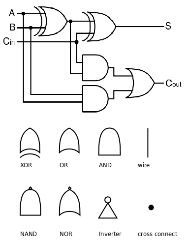
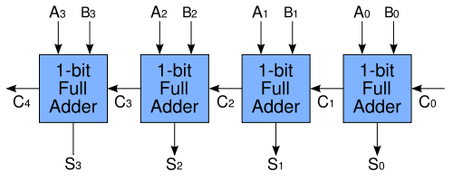
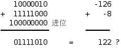
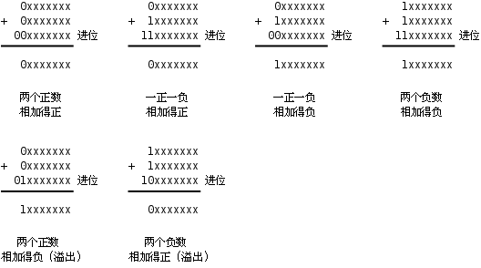
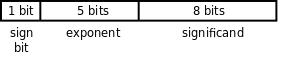
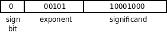
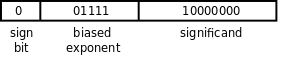
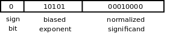

# 13. 计算机中数的表示

## 13.1 为什么计算机用二进制计数

### 二进制和十进制

- 十进制

  人类的计数方式通常是“逢十进一”，称为十进制（Decimal），大概因为人有十个手指，所以十进制是最自然的计数方式，很多民族的语言文字中都有十个数字，而阿拉伯数字0～9是目前最广泛采用的。

- 二进制

  计算机是用数字电路搭成的，数字电路中只有1和0两种状态，所以对计算机来说二进制（Binary）是最自然的计数方式。

- 二进制和十进制的对应

  根据“逢二进一”的原则，十进制的1、2、3、4分别对应二进制的1、10、11、100。

  二进制的一位数字称为一个位（bit），bit通常首字母小写，因为bit简写为b，而Byte简写为B。

  三个bit能够表示的最大的二进制数是111，也就是十进制的7。

  不管用哪种计数方式，数的大小并没有变，十进制的1+1等于2，二进制的1+1等于10，二进制的10和十进制的2大小是相等的。

### 加法器

- 一位全加器

  事实上，计算机采用如图13.1所示的逻辑电路计算两个bit的加法：

  

  图13.1的上半部分（出自Wikipedia）的电路称为一位全加器（1-bit Full Adder），图的下半部分是一些逻辑电路符号的图例。

- 逻辑电路由门电路和导线组成

  我们首先解释这些图例，逻辑电路由门电路（Gate）和导线（Wire）组成。

  - 导线上的电压值只能是高和低

    同一条导线上在某一时刻的电压值只能是高和低两种状态之一，分别用1和0表示。

  - 两条导线短接

    如果两条导线短接在一起则它们的电压值相同，在接点处画一个黑点，如果接点处没有画黑点则表示这两条线并没有短接在一起，只是在画图时无法避免交叉。

  - 门电路进行逻辑运算

    导线的电压值进入门电路的输入端，经过逻辑运算后在门电路的输出端输出运算结果的电压值，任何复杂的加减乘除运算都可以分解成简单的逻辑运算。

  - 逻辑运算（AND、OR、NOT、XOR、NAND、NOR）和对应门电路（与门、或门、反相器、无、与非门、或非门）

    AND、OR和NOT运算在第4.3节中讲过了，这三种逻辑运算分别用与门、或门和反相器（Inverter）实现。

    另外几种逻辑运算在这里补充一下。

    异或（XOR，eXclusive OR）运算的真值表如表13.1所示。

    用一句话概括就是：两个操作数相同则结果为0，两个操作数不同则结果为1。

    与非（NAND）和或非（NOR）运算就是在与、或运算的基础上取反，其真值表分别如表13.2和表13.3所示。

    - 有专门的与非门和或非门

      如果把与门、或门和反相器组合来实现NAND和NOR运算，则电路过于复杂了，因此逻辑电路中通常有专用的与非门和或非门。

- 多位加法器

  - Ripple carry adder

    如果把很多个一位全加器串接起来，就成了多位加法器，如图13.2所示（该图出自Wikipedia）：

    

    图中的一位全加器用方框表示，上一级全加器的Cout连接到下一级全加器的Cin，让进位像涟漪一样一级一级传开，所以叫做Ripple Carry Adder，这样就可以把两个4bit二进制数A3A2A1A0和B3B2B1B0加起来了。

  - 更复杂的多位加法器

    在这里介绍Ripple Carry Adder只是为了让读者理解计算机是如何通过逻辑运算来做算术运算的，实际上这种加法器效率很低，只能加完了一位再加下一位，更实用、更复杂的加法器可以多个位一起计算，有兴趣的读者可查阅参考文献[9]的5.4节。

## 13.2 不同进制之间的换算

### 二进制和十进制之间的转换

- 二进制转换为十进制

  在十进制中，个位的1代表10<sup>0</sup>=1，十位的1代表10<sup>1</sup>=10，百位的1代表10<sup>2</sup>=100，所以

  123=1×10<sup>2</sup>+2×10<sup>1</sup>+3×10<sup>0</sup>

  同样道理，在二进制中，个位的1代表2<sup>0</sup>=1，十位的1代表2<sup>1</sup>=2，百位的1代表2<sup>2</sup>=4，所以

  <p>(A<sub>3</sub>A<sub>2</sub>A<sub>1</sub>A<sub>0</sub>)<sub>2</sub>=A<sub>3</sub>×2<sup>3</sup>+A<sub>2</sub>×2<sup>2</sup>+A<sub>1</sub>×2<sup>1</sup>+A<sub>0</sub>×2<sup>0</sup></p>

- 区分二进制和十进制

  如果二进制和十进制数出现在同一个等式中，为了区别我们用(A<sub>3</sub>A<sub>2</sub>A<sub>1</sub>A<sub>0</sub>)<sub>2</sub>这种形式表示A<sub>3</sub>A<sub>2</sub>A<sub>1</sub>A<sub>0</sub>是二进制数，每个数字只能是0或1，其它没有套括号加下标的数仍表示十进制数。

- MSB 和 LSB

  对于(A<sub>3</sub>A<sub>2</sub>A<sub>1</sub>A<sub>0</sub>)<sub>2</sub>这样一个二进制数，最左边的A<sub>3</sub>位称为最高位（MSB，Most Significant Bit），最右边的A<sub>0</sub>位称为最低位（LSB，Least Significant Bit）。

  以后我们遵循这样的惯例：LSB称为第0位而不是第1位，所以如果一个数是32位的，则MSB是第31位。

- 十进制转换为二进制：除二反序取余法

  下面来看十进制数怎么换算成二进制数。我们知道

  13=1×2<sup>3</sup>+1×2<sup>2</sup>+0×2<sup>1</sup>+1×2<sup>0</sup>

  所以13换算成二进制应该是(1101)<sub>2</sub>。

  问题是怎么把13分解成等号右边的形式呢？注意到等号右边可以写成

  13=((((0×2+1<sub>3</sub>)×2+1<sub>2</sub>)×2+0<sub>1</sub>)×2+1<sub>0</sub>

  我们将13反复除以2取余数就可以提取出上式中的1101四个数字，为了让读者更容易看清楚是哪个1和哪个0，上式和下式中对应的数字都加了下标：

  13÷2=6...1<sub>0</sub>

  6÷2=3...0<sub>1</sub>

  3÷2=1...1<sub>2</sub>

  1÷2=0...1<sub>3</sub>

  把这四步得到的余数按相反的顺序排列就是13的二进制表示，因此这种方法称为除二反序取余法。

- 二进制小数和十进制小数

### 八进制和十六进制

计算机用二进制表示数，程序员也必须习惯使用二进制，但二进制写起来太啰嗦了，所以通常将二进制数分成每三位一组或者每四位一组，每组用一个数字表示。

- 八进制

  比如把(10100011)<sub>2</sub>从最低位开始每三位分成一组，分别是011、100、10（从高位到地位排列则是10、100、011），然后把每组写成一个0～7的数字，就是(243)<sub>8</sub>，这种表示法的特点是逢八进一，称为八进制（Octal）。

- 十六进制

  类似地，我们也可以把(10100011)<sub>2</sub>按每四位分成一组，即1010、0011，然后把每组写成一个数字，这个数的低位是3，高位已经大于9了，我们规定用字母A～F表示10～15，则这个数可以写成(A3)<sub>16</sub>，每一位数字的取值范围是0～F，逢十六进一，称为十六进制（Hexadecimal）。

所以，八进制、十六进制是程序员为了书写二进制数方便而发明的简便写法，好比草书和正楷的关系一样。

## 13.3 整数的加减运算

我们已经了解了计算机中正整数如何表示，加法如何计算，那么负数如何表示，减法又如何计算呢？

本节讨论这些问题。为了书写方便，本节举的例子都用8个bit表示一个数，实际计算机做整数加减运算的操作数可以是8位、16位、32位甚至64位的。

### Sign and Magnitude 表示法

- 最高位为符号位，其余位表示绝对值

  要用8个bit表示正数和负数，一种简单的想法是把最高位规定为符号位（Sign Bit），0表示正1表示负，剩下的7位表示绝对值的大小，这称为Sign and Magnitude表示法。

  例如-1表示成10000001，+1表示成00000001。

- 取值范围

  这样用8个bit表示整数的取值范围是-(2<sup>7</sup>-1)～2<sup>7</sup>-1，即-127～127。

- 加法运算

  采用这种表示法，计算机做加法运算需要处理以下逻辑：

  1.  如果两数符号位相同，就把它们的低7位相加，符号位不变。如果低7位相加时在最高位产生进位，说明结果的绝对值大于127，超出7位所能表示的数值范围，这称为溢出（Overflow），这时通常把计算机中的一个标志位置1表示当前运算产生了溢出。

  2.  如果两数符号位不同，首先比较它们的低7位谁大，然后用大数减小数，结果的符号位和大数相同。

- 减法运算需要减法器电路

  那么减法如何计算呢？

  由于我们规定了负数的表示，可以把减法转换成加法来计算，要计算a-b，可以先把b变号然后和a相加，相当于计算a+(-b)。

  但如果两个加数的符号位不同就要用大数的绝对值减小数的绝对值，这一步减法计算仍然是免不了的。我们知道加法要进位，减法要借位，计算过程是不同的，所以除了要有第13.1节提到的加法器电路之外，还要另外有一套减法器电路。

- 缺点

  如果采用Sign and Magnitude表示法，计算机做加减运算需要处理很多逻辑：比较符号位、比较绝对值、加法改减法、减法改加法、小数减大数改成大数减小数……这是非常低效率的。

  还有一个缺点是0的表示不唯一，既可以表示成10000000也可以表示成00000000，这进一步增加了逻辑的复杂性，所以我们迫切需要重新设计整数的表示方法使计算过程更简单。

### 1's Complement 表示法

本节介绍一种二进制补码表示法，为了便于理解，先从我们熟悉的十进制讲起。

- 9's complement

  - 表示方法

    现在我们用三位十进制数字表示正数和负数，具体规定如表13.5所示。

    | 数值 | 补码表示 |
    | -    | -   |
    | -499 | 500 |
    | -498 | 501 |
    | ...  | ... |
    | -1   | 998 |
    | 0    | 999 |
    | 0    | 0   |
    | 1    | 1   |
    | ...  | ... |
    | 498  | 498 |
    | 499  | 499 |

  - 例子

    下面看一个十进制计算的例子：

    167-59=167+(-59)=167+(999-59)-1000+1=167+940-1000+1=1107-1000+1=107+1=108

    167-59→减法转换成加法167+(-59)→负数取9的补码表示167+940→107进1→高位进的1加到低位上去，结果为108。

    首先-59要用999-59表示，就是940，这称为取9的补码（9's Complement）；然后把167和940相加，得到107进1；再把高位进的1加到低位上去，得108，本来应该加1000，结果加了1，少加了999，正好把先前取9的补码多加的999抵消掉了。

    我们本来要做167-59的减法运算，结果变成做999-59的减法运算，后者显然要容易一些，因为没有借位。

  - 概括

    这种补码表示法的计算规则用一句话概括就是：负数用9的补码表示，减法转换成加法，计算结果的最高位如果有进位则要加回到最低位上去。

  - 四种情况

    要验证这条规则得考虑四种情况：

    1.  两个正数，相加得正

    2.  一正一负，相加得正

    3.  一正一负，相加得负

    4.  两个负数，相加得负

    我们举的例子验证了第二种情况，另外三种情况请读者自己验证。

  - 溢出

    注意，如果计算结果超出了三位十进制数字所能表示的范围（−499～499）则产生溢出，我们暂时不考虑溢出的问题，稍后会讲到如何判定溢出。

- 1's complement（1 的补码也叫 1 的反码）

  上述规则也适用于二进制数：负数用1的补码（1's Complement）表示，减法转换成加法，计算结果的最高位如果有进位则要加回到最低位上去。

  取1的补码更简单，连减法都不用做，因为1-1=0，1-0=1，取1的补码就是把每个bit取反，所以1的补码也称为反码。比如：

  00001000-00000100→00001000+(-00000100)→00001000+11111011→00000011进1→高位进的1加到低位上去，结果为00000100。

- 1's complement 相对于 sign and magnitutde 的优势

  1's Complement表示法相对于Sign and Magnitude表示法的优势是非常明显的：不需要把符号和绝对值分开考虑，正数和负数的加法都一样算，计算逻辑更简单，甚至连减法器电路都省了，只要有一套加法器电路，再有一套把每个bit取反的电路，就可以做加法和减法运算。

  如果8个bit采用1's Complement表示法，负数的取值范围是从10000000到11111111（-127～0），正数是从00000000到01111111（0～127），仍然可以根据最高位判断一个数是正是负。

- 1's complement 表示法的缺点：引入 2's complement

  美中不足的是0的表示仍然不唯一，既可以表示成11111111也可以表示成00000000，为了解决这最后一个问题，我们引入2's Complement表示法。

- <span class="thoughts">1's complement 是怎么想出来的</span>

  - 两个例子

    我们先观察一个正数加负数结果为正数的例子，也就是被减数大于减数。可以尝试做变换，使减法变成加法。比较有用的变换是下面这种：

    ```
    0001 0000 - 0000 0100 =
    0001 0000 + (1111 1111 - 0000 0100) - 1000 00000 + 1
    ```

    我们可以看到 `0001 0000 + (1111 1111 - 0000 0100)` 绝对要进位，因为被减数大于减数。而这个进的位正好可以用 `1 0000 0000` 减掉。最后面还有个 `+1`，我们就可以说把这个进位放到最低位上。

    总结起来，如果一个正数加负数结果为正数，那么我们可以给负数做 `1111 1111 - 负数绝对值` 这样的变换。这个变换同样可以通过对负数绝对值每一位取反得到。变换好了以后，正数和负数的变换相加，然后在最低位加 1 就能得到结果。可以看到，每一步都没有用到减法。

    现在我们试试正数加负数结果为负数的例子，也就是被减数小于减数。我们同样给负数（减数）进行上面的变换，看看能得到什么。

    ```
    0000 0100 - 0000 1000 =
    0000 0100 + (1111 1111 - 0000 1000) - 1 0000 0000 + 1 = 结果

    0000 0100 + (1111 1111 - 0000 1000) = 1111 1111 + 结果
    ```

    我们知道，结果肯定是负数。而 `1111 1111 + 结果` 就是上面提到的变换。

    所以，在正数加负数结果为负数的例子中，我们也可以对负数（减数）进行变换。正数和负数（减数）的变换相加以后就是结果的变换。

  - 变换

    我们可以看到上面提到的这个 `1111 1111 - 负数绝对值` 变换非常有用。我们给它一个名字，把它叫做「对负数取 1 的补码」。

    因为对负数取 1 的补码同样可以通过对该负数绝对值每位取反得到，所以 1 的补码也叫反码。

  - 新的表示法：负数用 1 的补码表示，正数不变

    所以我们得到结论，遇到负数时，负数要用 1 的补码表示，然后把减法转换成加法，计算结果最高位如果有进位，则要加回到最低位上。

    结果中如果出现负数，同样是用 1 的补码表示。

    正数则是正常表示。

  - 取值范围

    我们限定二进制数是 8 位的，那么 -1 在新的表示法下就是 `1111 1110`，-0 就是 `1111 1111`。-127 是 `1000 0000`，+127 是 `0111 1111`，而 -128 是 `0111 1111`，+128 是 `1000 0000`。可以看到，产生了重复。为了根据最高位判断符号，所以 8 位二进制数用这种表示法取值范围是 -127～+127。0 有两种表示方法。

  - 另外两种情况

    上面我们讨论了正数加负数结果为正数以及正数加负数结果为负数这两种情况。两个数的加减还剩下正数加正数和负数加负数两种情况。正数加正数没什么好讨论的，下面看看负数加负数。

    ```
    - 0000 1000 - 0000 0100 = 结果
    (1111 1111 - 0000 1000) + (1111 1111 - 0000 0100) = 1111 1111 + 结果 + 1 0000 0000 - 1
    (1111 1111 - 0000 1000) + (1111 1111 - 0000 0100) - 1 0000 0000 + 1 = 1111 1111 + 结果
    ```

    如上面所说，负数要用 1 的补码表示。`(1111 1111 - 0000 1000) + (1111 1111 - 0000 0100)` 绝对会进位，不管两个负数是多少。因为要进位的话，两个负数的绝对值加起来要小于等于 1111 1110，即 254，而负数最小是 -127，满足条件。

    我们可以把 `(1111 1111 - 0000 1000) + (1111 1111 - 0000 0100)` 的进位加到最后一位，这个技巧上面也用过。即加法过程中最高位如果有进位，则回到最低位上。

    总结起来，即两个负数相加时，取两个负数 1 的补码，把两个补码加起来，把进位放在最低位，得到的结果即是结果的补码。

  - 溢出没有讨论

### 2's Complement 表示法

- 2's complement 表示法

  2's Complement表示法规定：正数不变，负数先取反码再加1。

  如果8个bit采用2's Complement表示法，负数的取值范围是从10000000到11111111（-128～-1），正数是从00000000到01111111（0～127），也可以根据最高位判断一个数是正是负，并且0的表示是唯一的，目前绝大多数计算机都采用这种表示法。

- 为什么叫 2 的补码

  为什么称为“2的补码”呢？因为对一位二进制数b取补码就是1-b+1=10-b，相当于从2里面减去b。类似地，要表示-4需要对00000100取补码，11111111-00000100+1=100000000-00000100，相当于从28里面减去4。

- 2's complement 计算规则有些不同

  2's Complement表示法的计算规则有些不同：减法转换成加法，忽略计算结果最高位的进位，不必加回到最低位上去。请读者自己验证上一节提到的四种情况下这条规则都能算出正确结果。

- <span class="thoughts">2's complement 是怎么想出来的</span>

  - 解决 1's Complement 缺点

    1's Complement 表示法中 0 有两种表示。我们尝试更改表示法，让 0 只有一种表示。我们可以变换完负数以后再加一个 1，这样 -0 变换完的 11111111 就变成 00000000 了。0 就只有一种表示了。

  - 取值范围

    -1 是 1111 1111，-127 是 1000 0001，-128 是 1000 0000，-129 是 0111 1111。

    +1 是 0000 0001，+127 是 0111 1111，+128 是 1000 0000。

    为了保证负数最高位是 1，取值范围为 -128～+127。

  - 三种情况

    - 正数加负数结果为正数

      我们观察一个正数加负数结果为正数的例子，也就是被减数大于减数。运算时尽量使用 2's Complement。

      ```
      0001 0000 - 0000 0100 =
      0001 0000 + (1111 1111 - 0000 0100 + 1) - 1 0000 0000 + 1 - 1
      ```

      我们可以看到 `0001 0000 + (1111 1111 - 0000 0100 + 1)` 绝对要进位，因为被减数大于减数。而这个进的位正好可以用 `1 0000 0000` 减掉。最后面还有个 `+1` 用 `-1` 抵消掉。我们可以说忽略这个进位。

      总结起来，如果正数加负数结果为正数，那么我们可以给负数做 `1111 1111 - 负数绝对值 + 1` 这样的变换。变换好了以后，正数和负数的变换相加，进位忽略就可以得到结果。可以看到，每一步都没有用到减法。

    - 正数加负数结果为 0

      ```
      0001 0000 - 0001 0000 =
      0001 0000 + (1111 1111 - 0001 0000 + 1) - 1 0000 0000 + 1 - 1
      ```

      `0001 0000 + (1111 1111 - 0001 0000 + 1)` 也要进位，这个进位也是忽略。

    - 正数加负数结果为负数

      现在我们试试正数加负数结果为负数的例子，也就是被减数小于减数。我们同样给负数（减数）进行上面的变换，看看能得到什么。

      ```
      0000 0100 - 0000 1000 =
      0000 0100 + (1111 1111 - 0000 1000 + 1) - 1 0000 0000 + 1 - 1 = 结果
      0000 0100 + (1111 1111 - 0000 1000 + 1) = 1111 1111 + 结果 + 1
      ```

      我们知道，结果肯定是负数。而 `1111 1111 + 结果 + 1` 就是上面提到的变换。

      所以，在正数加负数结果为负数的例子中，我们也可以对负数（减数）进行变换。正数和负数（减数）的变换相加以后就是结果的变换。

    - 负数加负数

      现在我们再来看负数加负数的例子。我们同样进行上面的变换，看看能得到什么。

      ```
      - 0000 0100 - 0000 0100 = 结果
      (1111 1111 - 0000 0100 + 1) + (1111 1111 - 0000 0100 + 1) = 1111 1111 + 1111 1111 + 1 + 1 + 结果
      (1111 1111 - 0000 0100 + 1) + (1111 1111 - 0000 0100 + 1) = 1111 1111 + 1 + 结果 + 1 0000 0000
      ```

      可以看到，等式右边出现了结果的变换和一个进位。忽略进位，负数的变换加负数的变换等于结果负数的变换。

  - 溢出在下面讨论

- 溢出

  8个bit采用2's Complement表示法的取值范围是-128～127，如果计算结果超出这个范围就会产生溢出，如图13.3所示。

  

  - 如何判断产生溢出

    如何判断产生了溢出呢？

    我们还是分四种情况讨论：如果两个正数相加溢出，结果一定是负数；如果两个负数相加溢出，结果一定是正数；一正一负相加，无论结果是正是负都不可能溢出，如图13.4所示。

    

    从图13.4可以得出结论：在相加过程中最高位产生的进位和次高位产生的进位如果相同则没有溢出，如果不同则表示有溢出。逻辑电路的实现可以把这两个进位连接到一个异或门，把异或门的输出连接到溢出标志位。

### 有符号数和无符号数

- 有符号数

  前面几节我们用8个bit表示正数和负数，讲了三种表示法，每种表示法对应一种计算规则，这称为有符号数（Signed Number）；

- 无符号数

  如果8个bit全部表示正数则取值范围是0～255，这称为无符号数（Unsigned Number）。

- 计算机做加法时不区分有符号数和无符号数

  其实计算机做加法时并不区分操作数是有符号数还是无符号数，计算过程都一样，比如上面的例子也可以看作无符号数的加法。

- 进位标志和溢出标志

  计算机的加法器在做完计算之后，根据最高位产生的进位设置**进位标志**，同时根据最高位和次高位产生的进位的异或设置**溢出标志**。

  至于这个加法到底是有符号数加法还是无符号数加法则取决于程序怎么理解了，如果程序把它理解成有符号数加法，下一步就要检查溢出标志，如果程序把它理解成无符号数加法，下一步就要检查进位标志。

- 零标志和负数标志

  通常计算机在做算术运算之后还可能设置另外两个标志，如果计算结果的所有bit都是零则设置零标志，如果计算结果的最高位是1则设置负数标志，如果程序把计算结果理解成有符号数，也可以检查负数标志判断结果是正是负。

## 13.4 浮点数

### 浮点数基于科学记数法：尾数、指数

浮点数在计算机中的表示是基于科学计数法（Scientific Notation）的，我们知道32767这个数用科学计数法可以写成3.2767×10<sup>4</sup>，3.2767称为尾数（Mantissa，或者叫Significand），4称为指数（Exponent）。

浮点数在计算机中的表示与此类似，只不过基数（Radix）是2而不是10。

### 浮点数模型：符号位、指数部分、尾数部分

- 基本模型

  下面我们用一个简单的模型来解释浮点数的基本概念。

  我们的模型由三部分组成：符号位、指数部分（表示2的多少次方）和尾数部分（小数点前面是0，尾数部分只表示小数点后的数字，如图13.6所示）。

  

  如果要表示17这个数，我们知道17=17.0×10<sup>0</sup>=0.17×10<sup>2</sup>，类似地，17=(10001)<sub>2</sub>×2<sup>0</sup>=(0.10001)<sub>2</sub>×2<sup>5</sup>，把尾数的有效数字全部移到小数点后，这样就可以表示为如图13.7所示的形式。

  

- 负数指数：偏移的指数

  如果我们要表示0.25就遇到新的困难了，因为0.25=1×2<sup>-2</sup>=(0.1)<sub>2</sub>×2<sup>-1</sup>，而我们的模型中指数部分没有规定如何表示负数。

  我们可以在指数部分规定一个符号位。

  然而更广泛采用的办法是使用偏移的指数（Biased Exponent）。规定一个偏移值，比如16，实际的指数要加上这个偏移值再填写到指数部分，这样比16大的就表示正指数，比16小的就表示负指数。要表示0.25，指数部分应该填16-1=15，如图13.8所示。

  

- 尾数最高位必须是 1（正规化），这个 1 不保存

  现在还有一个问题需要解决：每个浮点数的表示都不唯一，例如17=(0.10001)<sub>2</sub>×2<sup>5</sup>=(0.010001)<sub>2</sub>×2<sup>6</sup>，这样给计算机处理增加了复杂性。

  为了解决这个问题，我们规定尾数部分的最高位必须是1，也就是说尾数必须以0.1开头，对指数做相应的调整，这称为正规化（Normalize）。

  由于尾数部分的最高位必须是1，这个1就不必保存了，可以节省出一位来用于提高精度，我们说最高位的1是隐含的（Implied）。

  这样17就只有一种表示方法了，指数部分应该是16+5=21=(10101)<sub>2</sub>，尾数部分去掉最高位的1是0001，如图13.9所示。

  

### 浮点数精度损失

- 运算时要注意精度损失

  两个浮点数相加，首先把小数点对齐然后相加。

  由于浮点数表示的精度有限，计算结果末尾的10两位被舍去了。

  做浮点运算时要注意精度损失（Significance Loss）问题，有时计算顺序不同也会导致不同的结果，比如11.0010000+0.00000001+0.00000001=11.0010000+0.00000001=11.0010000，后面加的两个很小的数全被舍去了，没有对计算结果产生任何影响，但如果调一下计算顺序它们就能影响到计算结果了，0.00000001+0.00000001+11.0010000=0.00000010+11.0010000=11.0010001。

- 比较时也要注意精度损失

  再比如128.25=(10000000.01)<sub>2</sub>，需要10个有效位，而我们的模型中尾数部分是8位，算上隐含的最高位1，一共有9个有效位，那么128.25的浮点数表示只能舍去末尾的1，表示成(10000000.0)<sub>2</sub>，其实跟128相等。

  在第4.2节讲过浮点数不能做精确比较，现在读者应该知道为什么不能精确比较了。

### 浮点数溢出

整数运算会产生溢出，浮点运算也会产生溢出，浮点运算的溢出也分上溢和下溢两种，但和整数运算的定义不同。

假设整数采用8位2's Complement表示法，取值范围是-128～127，如果计算结果是-130则称为下溢，计算结果是130则称为上溢。

假设按本节介绍的浮点数表示法，取值范围是-(0.111111111)<sub>2</sub>×2<sup>15</sup>~(0.111111111)<sub>2</sub>×2<sup>15</sup>，如果计算结果超出这个范围则称为上溢；如果计算结果未超出这个范围但绝对值太小了，在-(0.1)<sub>2</sub>×2<sup>-16</sup>~(0.1)<sub>2</sub>×2<sup>-16</sup>之间，那么也同样无法表示，称为下溢。

### IEEE 754

浮点数是一个相当复杂的话题，不同平台的浮点数表示和浮点运算也有较大差异，本节只是通过这个简单的模型介绍一些基本概念而不深入讨论，理解了这些基本概念有助于你理解浮点数标准，目前业界广泛采用的浮点数标准是由IEEE（Institute of Electrical and Electronics Engineers）制定的IEEE 754。

### 浮点型的 0 所有 bit 都是 0

最后讨论一个细节问题。我们知道，定义全局变量时如果没有Initializer就用0初始化，定义数组时如果Initializer中提供的元素不够那么剩下的元素也用0初始化。例如：

``` c
int i;
double d;
double a[10] = { 1.0 };
```

“用0初始化”的意思是变量i、变量d和数组元素a[1]～a[9]的所有字节都用0填充，或者说所有bit都是0。

无论是用Sign and Magnitude表示法、1's Complement表示法还是2's Complement表示法，一个整数的所有bit都是0表示0值。

但一个浮点数的所有bit是0一定表示0值吗？严格来说不一定，某种平台可能会规定一个浮点数的所有bit是0并不表示0值，但参考文献[6]第6.7.8节提到：As far as the committee knows, all machines treat all bits zero as a representation of floating-point zero. But, all bits zero might not be the canonical representation of zero.因此在绝大多数平台上，一个浮点数的所有bit是0就表示0值。
