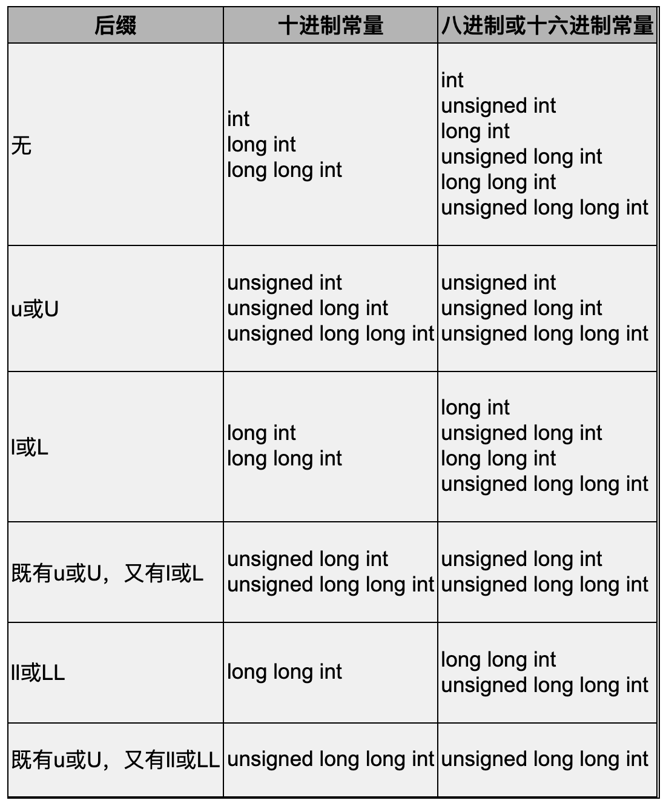
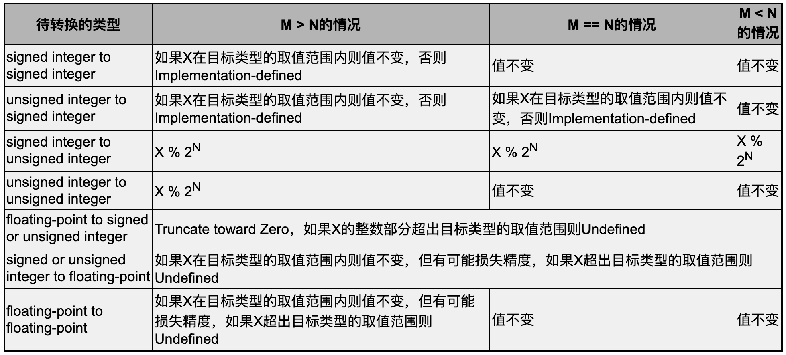

# 14. 数据类型详解

## 14.1 整型

### char

- char、signed、unsigned

  我们知道，在C语言中char型占一个字节的存储空间，一个字节通常是8个bit。

  如果这8个bit按无符号整数来解释，取值范围是0～255，如果按有符号整数来解释，采用2's Complement表示法，取值范围是-128～127。

  C语言规定了signed和unsigned两个关键字，unsigned char型表示无符号数，signed char型表示有符号数。

- 不带 signed 或 unsigned 关键字的 char 型：implementation defined

  那么以前我们常用的不带signed或unsigned关键字的char型是无符号数还是有符号数呢？

  C标准规定这是Implementation Defined，编译器可以定义char型是无符号的，也可以定义char型是有符号的，在该编译器所对应的体系结构上哪种实现效率高就可以采用哪种实现，**x86平台**的gcc定义char型是**有符号**的。

- C 标准优先考虑效率、可移植性尚在其次

  这也是C标准的Rationale之一：优先考虑效率，而可移植性尚在其次。

- 程序员要清楚哪些是可移植的代码，哪些是不可移植的

  这就要求程序员非常清楚这些规则，如果你要写可移植的代码，就必须清楚哪些写法是不可移植的，应该避免使用。

- 不可移植的代码有时候也有必要

  另一方面，写不可移植的代码有时候也是必要的，比如Linux内核代码使用了很多只有gcc支持的语法特性以得到最佳的执行效率，在写这些代码的时候就没打算用别的编译器编译，也就没考虑可移植性的问题。

- 一般没有理由写不可移植的代码

  如果要写不可移植的代码，你也必须清楚代码中的哪些部分是不可移植的，以及为什么要这样写，如果不是为了效率，一般来说就没有理由故意写不可移植的代码。

- Implementation defined

  从现在开始，我们会接触到很多Implementation Defined的特性，C语言与平台和编译器是密不可分的，离开了具体的平台和编译器讨论C语言，就只能讨论到本书第一部分的程度了。

- 有符号和无符号的 char 存 ASCII 码都没问题

  注意，ASCII码的取值范围是0～127，所以不管char型是有符号的还是无符号的，存一个ASCII码都没有问题。

- 用 char 存 ASCII码不用指定符号、用 char 表示整数要

  一般来说，如果用char型存ASCII码字符，就不必明确写是signed还是unsigned，如果用char型表示8位的整数，为了可移植性就必须写明是signed还是unsigned。

### Implementation-Defined, Unspecified, and Undefined

- 三种未明确定义的情况

  在C标准中没有做明确规定的地方会用Implementation-defined、Unspecified或Undefined来表述，在本书中有时把这三种情况统称为“未明确定义”的。这三种情况到底有什么不同呢？

- Implementation-defined: C 标准没有规定，编译器有规定

  我们刚才看到一种Implementation-defined的情况，C标准没有明确规定char是有符号的还是无符号的，但是要求编译器必须对此做出明确规定，并写在编译器的文档中。

- Unspecified：C 标准给出几种处理方式，编译器任选一种

  有些代码属于Unspecified的情况，通常有几种可选的处理方式，C标准没有规定必须按哪种方式处理，编译器可以任选一种处理方式，编译器选择不同的处理方式可能会导致程序的运行结果不同，但C标准承认这几种不同的结果都算对。

  - 例子

    比如求表达式i++ +i++的值，假设i的初值是2，则可以按以下任意一种方式处理：

    - 根据i的初值是2，得出两个i++的值都是2，整个表达式的值是2+2=4；两个i++都使变量i从2变成3，最后i的值就是3。

    - 根据i的初值是2，得出第一个i++的值是2，然后第一个i++使i从2变成3，这时再得出第二个i++的值是3，整个表达式的值是2+3=5，最后第二个i++使i从3变成4。

    - 根据i的初值是2，得出第二个i++的值是2，然后第二个i++使i从2变成3，这时再得出第一个i++的值是3，整个表达式的值是3+2=5，最后第一个i++使i从3变成4。

    可选的处理方式有三种，得到的结果有两种，C标准规定不管按哪种方式处理得到的结果都算对。

  - 原因

    之所以这样规定是为了编译器在生成指令时可以根据各自平台的特点和寄存器的使用情况做一些优化，在第15.3节我们还会详细讨论表达式求值顺序的问题。

  - 编译器没有指明选择哪一种处理方式

    对于Unspecified的代码的处理方式不必写在编译器的文档中，同样的代码即使用同一个编译器的不同版本编译也可能得到不同的结果，因为编译器没有在文档中明确写它会怎么处理，那么不同版本的编译器就可以选择不同的处理方式。

  - 避免写 unspecified 的代码

    很显然，我们应该避免写Unspecified的代码。

- Undefined：C 标准没有规定，编译器可能也没有规定

  有些代码属于Undefined的情况，C标准没规定该怎么处理，也没规定这种代码的运行结果是对的，编译器很可能也没规定，甚至有很多Undefined的代码编译器是检查不出来的，有些会导致运行时错误，比如数组访问越界就是Undefined的。

- C 语言并不完美，但只要小心，可以写出具有良好移植性的代码

  初学者看到这些规则通常会很不舒服，觉得这不是在学编程而是在啃法律条文，结果越学越泄气。

  是的，C语言并不像一个数学定理那么完美，现实世界里的东西总是不够完美。但还好啦，C程序员已经很幸福了，只要严格遵照C标准来写代码，不要去触碰那些阴暗角落，写出来的代码就有很好的可移植性。

  想想那些可怜的JavaScript程序员吧，他们甚至连一个可以遵照的标准都没有，一个浏览器一个样，甚至同一个浏览器的不同版本也差别很大，程序员不得不为每一种浏览器的每一个版本分别写不同的代码。

### 其他整数类型

- short int, int, long int, long long int

  除了char型之外，整型还包括short int（或者简写为short）、int、long int（或者简写为long）、long long int（或者简写为long long）等几种。

- Bit-field

  我们在第18.4节还要介绍一种特殊的整型——Bit-field。

- 这些类型都可以加上 signed 或 unsigned

  这些类型都可以加上signed或unsigned关键字表示有符号或无符号数。

  用这两个关键字修饰int型时，signed int和unsigned int可以简写为signed和unsigned。

- C 标准没有规定有符号数在计算机中的表示

  其实，对于有符号数在计算机中的表示是Sign and Magnitude、1's Complement还是2's Complement，C标准也没有明确规定，也是Implementation Defined。

  大多数体系结构都采用2's Complement表示法，x86平台也是如此，从现在开始我们只讨论2's Complement表示法的情况。

- 除了 char 以外的类型，不写 signed 或 unsigned 都表示 signed

  还有一点要注意，除了char型以外的这些类型如果不明确写signed或unsigned关键字都表示signed，这一点是C标准明确规定的，不是Implementation Defined。

- 除了 char 其他整型的大小都是 implementation defined：ILP32 或 LP64

  除了char型在C标准中明确规定占一个字节之外，其他整型占几个字节都是Implementation Defined。

  通常的编译器实现遵守ILP32或LP64规范，如表14.1所示。

  | 类型 | ILP32（位数） | LP64（位数） |
  | --------- | -- | -- |
  | char      | 8  | 8  |
  | short     | 16 | 16 |
  | int       | 32 | 32 |
  | long      | 32 | 64 |
  | long long | 64 | 64 |
  | 指针 | 32 | 64 |

  ILP32这个缩写的意思是int（I）、long（L）和指针（P）类型都占32位，通常32位计算机的C编译器采用这种规范，x86平台的gcc也是如此。

  LP64是指long（L）和指针（P）占64位，通常64位计算机的C编译器采用这种规范。

  指针类型的长度总是和计算机的位数一致，至于什么是计算机的位数，指针又是一种什么样的类型，我们到第16章和第22章再分别详细解释。

- 缺省平台

  从现在开始本书做以下约定：在以后的陈述中，缺省平台是x86/Linux/gcc，遵循ILP32，并且char是有符号的，我不会每次都加以说明，但说到其他平台时我会明确指出是什么平台。

### 整数常量

在第2.2节讲过C语言的常量有整数常量、字符常量、枚举常量和浮点数常量四种，其实字符常量和枚举常量的类型都是int型，因此前三种常量的类型都属于整型。

整数常量有很多种，不全是int型的，下面我们详细讨论整数常量。

- 八进制和十六进制的整数常量

  以前我们只用到十进制的整数常量，其实在C语言中也可以用八进制和十六进制的整数常量。

  八进制整数常量以0开头，后面的数字只能是0～7，例如022，因此十进制的整数常量就不能以0开头了，否则无法和八进制区分。

  十六进制整数常量以0x或0X开头，后面的数字可以是0～9、a～f和A～F。

  - ASCII 码转义序列

    在第2.6节讲过一种转义序列，以\或\x加八进制或十六进制数字表示，这种表示方式相当于把八进制和十六进制整数常量开头的0替换成\了。

- 有些编译器也支持二进制整数常量

  有些编译器（比如gcc）也支持二进制的整数常量，以0b或0B开头，比如0b0001111，但二进制的整数常量从未进入C标准，只是某些编译器的扩展，所以不建议使用，由于二进制和八进制、十六进制的对应关系非常明显，用八进制或十六进制常量完全可以代替使用二进制常量。

- 表示 unsigned、long、long long

  整数常量还可以在末尾加u或U表示“unsigned”，加l或L表示“long”，加ll或LL表示“long long”，例如0x1234U，98765ULL等。

  - 对应关系非常复杂

    但事实上u、l、ll这几种后缀和上面讲的unsigned、long、long long关键字并不是一一对应的。这个对应关系比较复杂，准确的描述如表14.2所示（出自参考文献[8]的6.4.4.1节条款5）。

    

  - 1234U

    给定一个整数常量，比如1234U，那么它应该属于“u或U”这一行的“十进制常量”这一列，这个表格单元中列了三种类型unsigned int、unsigned long int、unsigned long long int，从上到下找出第一个足够长的类型可以表示1234这个数，那么它就是这个整数常量的类型，如果int是32位的那么unsigned int就可以表示。

  - 0xffff0000

    再比如0xffff0000，应该属于第一行“无”的第二列“八进制或十六进制常量”，这一列有六种类型int、unsigned int、long int、unsigned long int、long long int、unsigned long long int，第一个类型int表示不了0xffff0000这么大的数，我们写这个十六进制常量是要表示一个正数，而它的MSB（第31位）是1，如果按有符号int类型来解释就成了负数了，第二个类型unsigned int可以表示这个数，所以这个十六进制常量的类型应该算unsigned int。

  - 0x7fffffff

    所以请注意，0x7fffffff和0xffff0000这两个常量虽然看起来差不多，但前者是int型，而后者是unsigned int型。

- -2147483648 和 -2147483647 - 1

  讲一个有意思的问题。我们知道x86平台上int的取值范围是-2147483648～2147483647，那么用printf("%d\n", -2147483648);打印int类型的下界有没有问题呢？

  如果用gcc main.c -std=c99编译会有警告信息：warning: format '%d' expects type 'int', but argument 2 has type 'long long int'。

  这是因为，虽然-2147483648这个数值能够用int型表示，但在C语言中却没法写出对应这个数值的int型常量，C编译器会把它当成一个整数常量2147483648和一个负号运算符组成的**表达式**，而整数常量2147483648已经超过了int型的取值范围，在x86平台上int和long的取值范围相同，所以这个常量也超过了long型的取值范围，根据表14.2第一行“无”的第一列十进制常量，这个整数常量应该算long long型的，前面再加个负号组成的表达式仍然是long long型，而printf的%d转换说明要求后面的参数是int型，所以编译器报警告。

  之所以编译命令要加-std=c99选项是因为C99以前对于整数常量的类型规定和表14.2有一些出入，即使不加这个选项也会报警告，但警告信息不准确，读者可以试试。

  如果改成printf("%d\n", -2147483647-1);编译器就不会报警告了，-号运算符的两个操作数-2147483647和1都是int型，计算结果也应该是int型，并且它的值也没有超出int型的取值范围；或者改成printf("%lld\n",-2147483648);也可以，转换说明%lld告诉printf后面的参数是long long型，有些转换说明格式目前还没讲到，详见第24.2.9节。

- 1234567890 * 1234567890

  怎么样，整数常量没有你原来想的那么简单吧。

  再看一个不简单的问题。long long i = 1234567890 \* 1234567890;编译时会有警告信息：warning: integer overflow in expression。1234567890是int型，两个int型相乘的表达式仍然是int型，而乘积已经超过int型的取值范围了，因此提示计算结果溢出。

  如果改成long long i = 1234567890LL \* 1234567890;，其中一个常量是long long型，另一个常量也会先转换成long long型再做乘法运算，两数相乘的表达式也是long long型，编译器就不会报警告了。有关类型转换的规则将在第14.3节详细介绍。

## 14.2 浮点型

### 浮点类型的大小、表示方式和实现

- C 标准没有规定三种浮点类型的大小和表示方式

  C标准规定的浮点型有float、double、long double，和整型一样，既没有规定每种类型占多少字节，也没有规定采用哪种表示形式。

- 浮点数的实现：硬浮点和软浮点

  浮点数的实现在各种平台上差异很大，有的处理器有浮点运算单元（Floating Point Unit，FPU），称为硬浮点（Hard-float）实现；

  有的处理器没有浮点运算单元，只能做整数运算，需要用整数运算来模拟浮点运算，称为软浮点（Soft-float）实现。

- 大部分平台的浮点数实现遵循 IEEE 754

  大部分平台的浮点数实现遵循IEEE 754，float型通常是32位，double型通常是64位。

- long double 的实现各平台有较大差异

  long double型通常是比double型精度更高的类型，但各平台的实现有较大差异。

  在x86平台上，大多数编译器实现的long double型是80位，因为x86的浮点运算单元具有80位精度，gcc实现的long double型是12字节（96位），这是为了对齐到4字节边界（在第18.4节详细讨论对齐的问题），也有些编译器实现的long double型和double型精度相同，没有充分利用x86浮点运算单元的精度。

  其他体系结构的浮点运算单元的精度不同，编译器实现也会不同，例如PowerPC上的long double型通常是128位。

### 浮点数常量

以前我们只用到最简单的浮点数常量，例如3.14，现在看看浮点数常量还有哪些写法。

- 浮点数常量可以写成科学计数法形式，基数是 10

  由于浮点数在计算机中的表示是基于科学计数法的，所以浮点数常量也可以写成科学计数法的形式，尾数和指数之间用e或E隔开，例如314e-2表示314×10<sup>-2</sup>，注意这种表示形式基数是10。

  如果尾数的小数点左边或右边没有数字则表示这一部分为零，例如3.e-1，.987等。

- 基数为 2 的浮点数常量表示

  C99引入一种新的十六进制浮点数表示，基数是2，本书不做详细介绍。

- 浮点数也可以加 f/F 或 l/L 后缀

  浮点数也可以加一个后缀，例如3.14f、.01L。

  浮点数的后缀和类型之间的对应关系比较简单，没有后缀的浮点数常量是double型的，有后缀f或F的浮点数常量是float型的，有后缀l或L的浮点数常量是long double型的。

## 14.3 类型转换

如果有人问C语法规则中最复杂的是哪一部分，我一定会说是类型转换。

从上面两节可以看出，有符号、无符号整数和浮点数加起来有那么多种类型，每两种类型之间都要定义一个转换规则，转换规则的数量自然很庞大，更何况由于各种体系结构对于整数和浮点数的实现很不相同，很多类型转换的情况都是C标准未做明确规定的阴暗角落。

虽然我们写代码时不会故意去触碰这些阴暗角落，但有时候会不小心犯错，所以了解一些未明确规定的情况还是有必要的，可以在出错时更容易分析错误原因。

本节分成几小节，首先介绍哪些情况下会发生类型转换，会把什么类型转成什么类型，然后介绍编译器如何处理这样的类型转换。

### Integer Promotion

- integer promotion 只影响 char、short、bit-field（不管有无符号）

  在一个表达式中，凡是可以使用int或unsigned int类型做右值的地方也都可以使用有符号或无符号的char型、short型和Bit-field。

  如果原始类型的取值范围都能用int型表示，则其类型被提升为int，如果原始类型的取值范围用int型表示不了，则提升为unsigned int型，这称为Integer Promotion。

  做Integer Promotion只影响上述几种类型的值，对其他类型无影响。

- integer promotion 出现的情况

  C99规定Integer Promotion适用于以下几种情况：

  1.  如果一个函数的形参类型未知，例如使用了Old Style C风格的函数声明（详见第3.2节），或者函数的参数列表中有...，那么调用函数时要对相应的实参做Integer Promotion，此外，相应的实参如果是float型的也要被提升为double型，这条规则称为Default Argument Promotion。我们知道printf的参数列表中有...，除了第一个形参之外，其他形参的类型都是未知的，比如有这样的代码：

      ``` c
      char ch = 'A';
      printf("%c", ch);
      ```

      ch要被提升为int型之后再传给printf。

  2.  算术运算中的类型转换。有符号或无符号的char型、short型和Bit-field在做算术运算之前首先要做Integer Promotion，然后才能参与计算。例如：

      ``` c
      unsigned char c1 = 255, c2 = 2;
      int n = c1 + c2;
      ```

      计算表达式c1＋c2的过程其实是先把c1和c2提升为int型然后再相加（unsigned char的取值范围是0～255，完全可以用int表示，所以提升为int就可以了，不需要提升为unsigned int），整个表达式的值也是int型，最后的结果是257。假如没有这个提升的过程，c1+c2就溢出了，溢出会得到什么结果是Undefined，在大多数平台上会把进位截掉，得到的结果应该是1。

      除了+号之外还有哪些运算符在计算之前需要做Integer Promotion呢？我们在下一小节先介绍Usual Arithmetic Conversion规则，然后再解答这个问题。

### Usual Arithmetic Conversion

两个算术类型的操作数做算术运算，比如a+b，如果两边操作数的类型不同，编译器会自动做类型转换，使两边类型相同之后才做运算，这称为Usual Arithmetic Conversion。转换规则如下：

1.  如果有一边的类型是long double，则把另一边也转成long double。

2.  否则，如果有一边的类型是double，则把另一边也转成double。

3.  否则，如果有一边的类型是float，则把另一边也转成float。

4.  否则，两边应该都是整型，首先按上一小节讲过的规则对a和b做Integer Promotion，然后如果类型仍不相同，则需要继续转换。我们规定char、short、int、long、long long的转换级别（Integer Conversion Rank）一个比一个高，同一类型的有符号和无符号数具有相同的Rank。转换规则如下：

    a.如果两边都是有符号数，或者都是无符号数，那么较低Rank的类型转换成较高Rank的类型。例如unsigned int和unsigned long做算术运算时都转成unsigned long。

    b.否则，如果一边是无符号数另一边是有符号数，无符号数的Rank不低于有符号数的Rank，则把有符号数转成另一边的无符号类型。例如unsigned long和int做算术运算时都转成unsigned long，unsigned long和long做算术运算时也都转成unsigned long。

    c.剩下的情况是：一边有符号另一边无符号，并且无符号数的Rank低于有符号数的Rank。这时又分为两种情况，如果这个有符号数类型能够覆盖这个无符号数类型的取值范围，则把无符号数转成另一边的有符号类型。例如遵循LP64的平台上unsigned int和long在做算术运算时都转成long。

    d.否则，也就是这个有符号数类型不足以覆盖这个无符号数类型的取值范围，则把两边都转成有符号数的Rank对应的无符号类型。例如在遵循ILP32的平台上unsigned int和long在做算术运算时都转成unsigned long。

- 有符号整数和无符号整数转换规则十分复杂，避免混用有符号数和无符号数

  可见有符号和无符号整数的转换规则是十分复杂的，虽然这是有明确规定的，不属于阴暗角落，但为了程序的可读性不应该依赖这些规则来写代码。

  我讲这些规则，不是为了让你用，而是为了让你了解有符号数和无符号数混用会非常麻烦，从而避免触及这些规则，并且在程序出错时记得往这上面找原因。

  所以这些规则不需要牢记，但要知道有这么回事，以便在用到的时候能找到我书上的这一段。

- 需要做 usual arithmetic conversion 的运算符

  到目前为止我们学过的+ - * / % ><>= <= == !=运算符都需要做Usual Arithmetic Conversion，因为都要求两边操作数的类型一致，在下一章会介绍几种新的运算符也需要做Usual Arithmetic Conversion。

- 不需要做 usual arithmetic conversion 的运算符

  单目运算符+ - ~只有一个操作数，移位运算符<<>>两边的操作数类型不要求一致，这些运算不需要做Usual Arithmetic Conversion，但也需要做Integer Promotion，运算符~ <<>>将在下一章介绍。

### 由赋值产生的类型转换

- 赋值或初始化时等号两边类型不同

  如果赋值或初始化时等号两边的类型不相同，则编译器会把等号右边的类型转换成等号左边的类型再做赋值。例如int c=3.14;，编译器会把右边的double型转成int型再赋给变量c。

- 函数调用传参和函数返回

  我们知道，函数调用传参的过程相当于定义形参并且用实参对其做初始化，函数返回的过程相当于定义一个临时变量并且用return的表达式对其做初始化，所以由赋值产生的类型转换也适用于这两种情况。

  例如一个函数的原型是int foo(int, int);，则调用foo(3.1, 4.2)时会自动把两个double型的实参转成int型赋给形参，如果这个函数定义中有返回语句return 1.2;，则返回值1.2会自动转成int型再返回。

- 函数调用和返回过程中发生的类型转换容易被忽视

  在函数调用和返回过程中发生的类型转换往往容易被忽视，因为函数原型和函数调用并没有写在一起。例如char c=getchar();，看到这一句往往会想当然地认为getchar的返回值是char型，而事实上getchar的返回值是int型，这样赋值会引起类型转换，可能产生Bug，我们在第24.2.5节详细讨论这个问题。

### 强制类型转换

- 隐式类型转换

  以上三种情况通称为隐式类型转换（Implicit Conversion，或者叫Coercion），编译器根据它自己的一套规则将一种类型自动转换成另一种类型。

- 显式类型转换/强制类型转换、类型转换运算符

  除此之外，程序员也可以通过类型转换运算符（Cast Operator）自己规定某个表达式要转换成何种类型，这称为显式类型转换（Explicit Conversion）或强制类型转换（Type Cast）。

  例如计算表达式(double)3+i，首先将整数3强制转换成double型（值为3.0），然后和整型变量i相加，这时适用Usual Arithmetic Conversion规则，首先把i也转成double型，然后两者相加，最后整个表达式也是double型的。

- 类型转换运算符

  这里的(double)就是一个类型转换运算符，这种运算符由一个类型名套()括号组成，属于单目运算符，后面的3是这个运算符的操作数。

  注意操作数的类型必须是标量类型，转换之后的类型必须是标量类型或者void型。

### 编译器如何处理类型转换

以上几小节介绍了哪些情况下会发生类型转换，并且明确了每种情况下会把什么类型转成什么类型，本节介绍编译器如何处理任意两种类型之间的转换。

现在要把一个M位的类型（值为X）转换成一个N位的类型，所有可能的情况如表14.3所示。



- X % 2<sup>N</sup>

  注意表14.3中的“X % 2<sup>N</sup>”，我想表达的意思是“把X加上或者减去2<sup>N</sup>的整数倍，使结果落入[0, 2<sup>N</sup>-1]的范围内”，当X是负数时运算结果也得是正数，即运算结果和除数同号而不是和被除数同号，这不同于C语言%运算的定义。

- 写程序不要故意用上面的规则，但程序出错了可以借助上面规则分析

  写程序时不要故意用表14.3中的规则，尤其不要触碰Implementation-defined和Undefined的情况，但程序出错时可以借助表14.3分析错误原因。

- 例子

  下面举几个例子说明表14.3的用法。

  比如把double型转换成short型，对应表中的“floating-point to signed or unsigned integer”，如果原值在(-32769.0, 32768.0)之间则截掉小数部分得到转换结果，否则产生溢出，结果是Undefined，例如对于short s=32768.4;这样的代码gcc会报警告。

  比如把int型转换成unsigned short型，对应表中的“signed integer to unsigned integer”，如果原值是正的，则把它除以2<sup>16</sup>取模，其实就是取它的低16位，如果原值是负的，则加上2<sup>16</sup>的整数倍，使结果落在[0, 65535]之间。

  比如把int类型转换成short类型，对应表中的“signed integer to signed integer”，如果原值在[-32768, 32767]之间则值不变，否则产生溢出，结果是Implementation-defined，例如对于short s=-32769;这样的代码gcc会报警告。

- 符号扩展

  最后一个例子，把short型转换成int型，对应表中的“signed integer to signed integer”，转换之后应该值不变。那怎么维持值不变呢？是不是在高位补16个0就行了呢？如果原值是-1，十六进制表示就是ffff，要转成int型的-1需要变成ffffffff，因此需要在高位补16个1而不是16个0。

  换句话说，要维持值不变，在高位补1还是补0取决于原来的符号位，这称为符号扩展（Sign Extension）。
