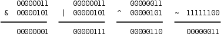
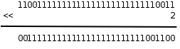
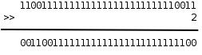

# 15. 运算符详解

## 15.1 位运算

- 位运算：直接操作整数的位

  整数在计算机中用二进制的位来表示，C语言提供一些运算符可以直接操作整数中的位，称为位运算，这些运算符的操作数都必须是**整型**的。

- 有些信息只利用整数的某几个位

  在以后的学习中你会发现，有些信息利用整数中的某几个位来存储，要访问这些位，仅仅有对整数的操作是不够的，必须借助位运算。

  例如第A.2节介绍的UTF-8编码就是如此，学完本节之后你应该能自己写出UTF-8的编码和解码程序。

本节首先介绍各种位运算符，然后介绍与位运算有关的编程技巧。

### 按位与、或、异或、取反运算

在第4.3节讲过逻辑与、或、非运算，并列出了真值表，对于整数中的位也可以做与、或、非运算，&是按位与（Bitwise AND）运算符、|是按位或（Bitwise OR）运算符，~（Tilde）是按位取反（Bitwise NOT）运算符，此外还有^（Caret）是按位异或（Bitwise XOR）运算符，我们在第13.1节讲过异或运算。

- 例子

  下面用二进制的形式举几个例子，如图15.1所示。

  

- & | ^ ~ 都要对操作数做 integer promotion，不存在 8 位整数的位运算

  注意，&、|、^运算符都是要做Usual Arithmetic Conversion的（其中有一步是Integer Promotion），~运算符也要做Integer Promotion，所以在C语言中其实并不存在8位整数的位运算，操作数在做位运算之前都至少被提升为int型了，上面用8位整数举例只是为了书写方便。比如：

  ``` c
  unsigned char c = 0xfc;
  unsigned int i = ~c;
  ```

  计算过程是这样的：常量0xfc是int型的，赋给c要转成unsigned char，值不变；c的十六进制表示是fc，计算～c时先提升为整型（000000fc）然后取反，最后结果是ffffff03。注意，如果把～c看成是8位整数的取反，最后结果就得3了，这就错了。

- 避免出错

  为了避免出错，一是尽量避免不同类型之间的赋值，二是每一步计算都要按上一章讲的类型转换规则仔细检查。

### 移位运算

移位运算符（Bitwise Shift）包括左移<<和右移>>。

- 左移

  左移将一个整数的各二进制位全部左移若干位，例如0xcfffffff3<<2得到0x3fffffcc，如图15.2所示。

  

  - 低位补 0

    最高两位的11被移出去了，最低两位又补了两个0，其他位依次左移两位。

  - 移动的位数必须小于左操作数的总位数，如果大于结果是 undefined

    但要注意，移动的位数必须小于左操作数的总位数，比如上面的例子，左边是unsigned int型，如果左移的位数大于等于32位，则结果是Undefined。

- 移位运算符两边操作数不要求一致，但两个数都要做 integer promotion，表达式类型

  移位运算符不同于+ - * / ==等运算符，两边操作数的类型不要求一致，但两边操作数都要做Integer Promotion，整个表达式的类型和左操作数提升后的类型相同。

- 左移 1 位相当于乘 2

  复习一下第13.2节讲过的知识可以得出结论，在一定的取值范围内，将一个整数左移1位相当于乘以2。

  比如二进制11（十进制3）左移一位变成110，就是6，再左移一位变成1100，就是12。

  读者可以自己验证这条规律对有符号数和无符号数都成立，对负数也成立。

  当然，如果左移改变了最高位（符号位），那么结果肯定不是乘以2了，所以我加了个前提“在一定的取值范围内”。

  - 乘法指令可以优化成移位指令

    由于计算机做移位比做乘法快得多，编译器可以利用这一点做优化，比如看到源代码中有i * 8，可以编译成移位指令而不是乘法指令。

- 右移

  - 无符号数右移：高位补 0

    当操作数是无符号数时，右移运算的规则和左移类似，例如0xcfffffff3>>2得到0x33fffffc，如图15.3所示。

    

    最低两位的11被移出去了，最高两位又补了两个0，其他位依次右移两位。

  - 移动的位数必须小于左操作数的总位数，如果大于结果是 undefined

    和左移类似，移动的位数也必须小于左操作数的总位数，否则结果是Undefined。

  - 右移 1 位相当于除以 2

    在一定的取值范围内，将一个整数右移1位相当于除以2，小数部分截掉。

  - 有符号数右移：正数高位补 0，负数高位补什么是 implementation defined

    当操作数是有符号数时，右移运算的规则比较复杂：

    - 如果是正数，那么高位移入0。

    - 如果是负数，那么高位移入1还是0不一定，这是Implementation-defined的。对于x86平台的gcc编译器，最高位移入1，也就是仍保持负数的符号位，这种处理方式对负数仍然保持了“右移1位相当于除以2”的性质。

- 建议只对无符号数做位运算

  综上所述，由于类型转换和移位等问题，用有符号数做位运算是很不方便的，所以，建议只对无符号数做位运算，以减少出错的可能。

### 掩码

如果要对一个整数中的某些位进行操作，怎样表示这些位在整数中的位置呢？

可以用掩码（Mask）来表示。比如掩码0x0000ff00表示对一个32位整数的8～15位进行操作，举例如下。

1.  取出8～15位。

    ``` c
    unsigned int a, b, mask = 0x0000ff00;
    a = 0x12345678;
    b = (a & mask) >> 8; // 0x00000056
    ```

    这样也可以达到同样的效果：

    ``` c
    b = (a >> 8) & ~(~0U << 8);
    ```

2.  将8～15位清0。

    ``` c
    unsigned int a, b, mask = 0x0000ff00;
    a = 0x12345678;
    b = a & ~mask; // 0x12340078
    ```

3.  将8～15位置1。

    ``` c
    unsigned int a, b, mask = 0x0000ff00;
    a = 0x12345678;
    b = a | mask; // 0x1234ff78
    ```

### 异或运算的一些特性

1.  一个数和自己做异或的结果是0。

    如果需要一个常数0，x86平台的编译器可能会生成这样的指令：xorl %eax, %eax。

    不管eax寄存器里的值原来是多少，做异或运算都能得到0，这条指令比同样效果的movl $0, %eax指令快，直接对寄存器做位运算比生成一个立即数再传送到寄存器要快一些，x86指令将在第17章详细介绍。

2.  从异或的真值表可以看出，不管是0还是1，和0做异或保持原值不变，和1做异或得到原值的相反值。

    可以利用这个特性配合掩码实现**某些位的翻转**，例如：

    ``` c
    unsigned int a, b, mask = 1U << 6;
    a = 0x12345678;
    b = a ^ mask; /* flip the 6th bit */
    ```

3.  如果a1^a2^a3^...^an的结果是1，则表示a1、a2、a3...an之中1的个数为奇数个，否则为偶数个。

    这条性质可用于奇偶校验（Parity Check），比如在串口通信过程中，每个字节的数据都计算一个校验位，数据和校验位一起发送出去，这样接收方可以根据校验位粗略地判断接收到的数据是否有误。

4.  x ^ x ^ y == y，因为x ^ x == 0，0 ^ y == y。

    这个性质有什么用呢？我们来看这样一个问题：交换两个变量的值，不得借助额外的存储空间，所以就不能采用temp = a; a = b; b = temp;的办法了。

    利用位运算可以这样做交换：

    ``` c
    a = a ^ b;
    b = b ^ a;
    a = a ^ b;
    ```

    分析一下这个过程。为了避免混淆，把a和b的初值分别记为a0和b0。第一行，a = a0 ^ b0；第二行，把a的新值代入，得到b = b0 ^ a0 ^ b0，等号右边的b0相当于上面公式中的x，a0相当于y，所以结果为a0；第三行，把a和b的新值代入，得到a = a0 ^ b0 ^ a0，结果为b0。

    注意这个过程不能把同一个变量自己跟自己交换，而利用中间变量temp则可以交换。

## 15.2 其他运算符

### 复合赋值运算符

复合赋值运算符（Compound Assignment Operator）包括*= /= %= += -= <<= >>= &= ^= |=，一边做运算一边赋值。

- 复合赋值表达式和对应的赋值表达式的区别

  例如a += 1相当于a = a + 1。

  - 前者只对左值求值一次，后者求值两次，效率不一样

    但有一点细微的差别，前者对表达式a只求值一次，而后者求值两次，如果a是一个复杂的表达式，求值一次和求值两次的效率是不同的，例如a[i+j] += 1和a[i+j] = a[i+j] + 1。

  - 对于没有 side effect 的左值，两者结果一样；有 side effect 的左值，结果不一定一样

    那么仅仅是效率上的差别吗？对于没有Side Effect的表达式，求值一次和求值两次的结果是一样的，但对于有Side Effect的表达式则不一定，例如a[foo()] += 1和a[foo()] = a[foo()] + 1，如果foo()函数调用有Side Effect，比如会打印一条消息，那么前者只打印一次，而后者打印两次。

- 自增自减运算符等价于复合赋值运算符，表达式只求值一次

  在第6.3节讲自增、自减运算符时说++i相当于i = i + 1，其实更准确地说应该是等价于i += 1，表达式i只求值一次，而--i等价于i -= 1。

### 条件运算符

- 条件运算符是唯一一个三目运算符

  条件运算符（Conditional Operator）是C语言中唯一一个三目运算符（Ternary Operator），带三个操作数，它的形式是表达式1 ? 表达式2 : 表达式3，这个运算符所组成的整个表达式的值等于表达式2或表达式3的值，取决于表达式1的值是否为真。

- 等价函数

  可以把它想象成这样的函数：

  ``` c
  if (表达式1)
      return 表达式2;
  else
      return 表达式3;
  ```

- 表达式 1 要为标量类型，表达式 2 和表达式 3 要做 usual arithmetic conversion

  表达式1相当于if语句的控制表达式，因此它的值必须是标量类型，而表达式2和表达式3相当于同一个函数在不同情况下的返回值，因此它们的类型要求一致，也要做Usual Arithmetic Conversion。

- 例子

  下面举个例子，定义一个函数求两个参数中较大的一个。

  ``` c
  int max(int a, int b)
  {
      return (a > b) ? a : b;
  }
  ```

- Dangling-else 15.4

  在第4.2节讲过Dangling-else问题，条件运算符也有类似的问题。

  例如a ? b : c ? d : e是看成(a ? b : c) ? d : e还是a ? b : (c ? d : e)呢？C语言规定是后者。

### 逗号运算符

逗号运算符（Comma Operator）也是一种双目运算符，它的形式是表达式1，表达式2，两个表达式不要求类型一致，左边的表达式1先求值，求完了直接把值丢掉，再求右边表达式2的值作为整个表达式的值。

- 嵌套逗号表达式

  逗号运算符是左结合的，类似于+ - * /运算符，根据组合规则可以写出表达式1，表达式2，表达式3，…，表达式n这种形式，表达式1，表达式2可以看作一个子表达式，先求表达式1的值，然后求表达式2的值作为这个子表达式的值，然后这个值再和表达式3组成一个更大的表达式，求表达式3的值作为这个更大的表达式的值，依此类推，整个计算过程就是从左到右依次求值，最后一个表达式的值成为整个表达式的值。

- 函数调用时的逗号不是逗号运算符

  注意，函数调用时各实参之间也是用逗号隔开，这种逗号是分隔符而不是逗号运算符。

  但可以这样使用逗号运算符：

  ``` c
  f(a, (t=3, t+2), c)
  ```

  传给函数f的参数有三个，其中第二个参数的值是表达式t+2的值。

### sizeof 运算符与 typedef 类型声明

- sizeof

  sizeof是一个很特殊的运算符，它有两种形式：“sizeof 表达式”和“sizeof(类型名)”。

  - sizeof 表达式

    这个运算符很特殊，“sizeof 表达式”中的子表达式并不求值，而只是根据类型转换规则求得子表达式的类型，然后把这种类型所占的字节数作为整个表达式的值。

    有些人喜欢写成“sizeof(表达式)”的形式也可以，这里的括号和return(1);的括号一样，不起任何作用。

  - sizeof(类型名)

    但另外一种形式“sizeof(类型名)”的括号则是必须写的，整个表达式的值也是这种类型所占的字节数。

  - sizeof 表达式 例子

    比如用sizeof运算符求一个数组的长度：

    ``` c
    int a[12];
    printf("%u\n", sizeof a/sizeof a[0]);
    ```

    - sizeof a 中的 a 表示整个数组

      注意sizeof a中的a做左值，表示整个数组，而不是做右值转换成指向首元素的指针。

    - sizeof a 和 sizeof a[0] 编译时就可以确定

      表达式a的类型在编译时就可以确定，所以sizeof a的值在编译时计算，12×4=48，sizeof a[0]的值是4，所以sizeof a/sizeof a[0]是**常量表达式**，在编译时就被替换成12了。

    - VLA

      VLA是一个例外，对VLA取sizeof是在运行时计算的，因为数组的长度在运行时才知道。

    - sizeof 表达式 表达式不求值，因为类型在编译时就知道了，不用等到运行时求值才知道

      事实上，即使写成sizeof i++，表达式i++也不求值，这是sizeof运算符的特殊之处，求sizeof i++就是求表达式i++的类型所占的字节数，而i++的类型在编译时就知道了，不需要到运行时求值之后才知道。

    - %u

      注意上面的printf中使用了%u转换说明，表示后面的参数是无符号整型，这是一个小细节，用%d通常也可以，但在一些极限情况下可能会出问题，比如后面的参数值很大，结果打印出来是负数。

  - sizeof 字符串字面值

    在第8.4节提到，字符串字面值和数组类型相似，"Hello"可以看作是由'H'、'e'、'l'、'l'、'o'加一个Null字符组成的数组，因此sizeof("Hello")的值是6。

  - sizeof 运算符结果类型是 size_t

    sizeof运算符的结果是size_t类型的，这个类型定义在stddef.h头文件中，不过你的代码中只要不出现size_t这个类型名就不用包含这个头文件，比如像上面的例子就不用包含这个头文件。

    C标准规定size_t是一种无符号整型，编译器可以用typedef做一个类型声明：

    ``` c
    typedef unsigned long size_t；
    ```

    那么size_t就代表unsigned long型。

    - 不同平台编译器 size_t 的实际类型不一样

      不同平台的编译器可能会根据自己平台的具体情况定义size_t所代表的类型，比如有的平台定义为unsigned long型，有的平台定义为unsigned long long型，C标准规定size_t这个名字就是为了隐藏这些细节，使代码具有可移植性。

    - 不要把 size_t 类型和真实类型混用

      所以注意不要把size_t类型和它所代表的真实类型混用，例如：

      ``` c
      unsigned long x;
      size_t y;
      x = y;
      ```

      如果在一种ILP32平台上定义size_t代表unsigned long long型，这段代码把y赋给x时就把高位截掉了，结果可能是错的。

    - <span class="thoughts">不要用有符号数和 size_t 类型比较</span>

      ``` c
      #include <stdio.h>
      #define LEN (sizeof(array) / sizeof(array[0]))
      int array[] = { 123, 43, 21, 171, 42, 99, 216 };

      int main(void)
      {
          int i, sum = 0;

          for (i = -1; i < LEN - 1; i++)
              sum += array[i+1];
          printf("%d\n", sum);

          return 0;
      }
      ```

      i 和 LEN - 1 比较的时候，根据 usual arithmetic conversion，i 要转成无符号类型。因为 i 是 -1，转成无符号类型会变得非常大，所以 for 循环一次都不执行。

- typedef

  typedef这个关键字用于给某种类型起个新名字。

  - 给普通类型取一个新名字

    比如上面的typedef声明可以这么看：去掉typedef就成了一个变量声明unsigned long size_t;，size_t是一个变量名，类型是unsigned long，那么加上typedef之后，size_t就是一个类型名，就代表unsigned long类型。

  - 给数组类型取一个新名字

    再举个例子：

    ``` c
    typedef char array_t[10];
    array_t a;
    ```

    这相当于声明char a[10];。

  - 类型名也遵循标识符的命名规则，通常加 _t

    类型名也遵循标识符的命名规则，并且通常加个_t后缀表示Type。

  - 常见的 typedef 类型名

    C标准库的头文件stdint.h中定义了很多这样的类型名，如表15.1所示，使用这些类型名写代码就可以屏蔽ILP32和LP64之间的差异了：

    | 类型名 | 说明 |
    | int8_t int16_t int32_t int64_t     | 8位、16位、32位、64位的有符号整数 |
    | uint8_t uint16_t uint32_t uint64_t | 8位、16位、32位、64位的无符号整数 |
    | intptr_t  | 一种有符号整数类型，指针类型可以转换成这种类型而不丢失信息 |
    | uintptr_t | 一种无符号整数类型，指针类型可以转换成这种类型而不丢失信息 |

## 15.3 Side Effect 与 Sequence Point

如果你只想规规矩矩地写代码，那么基本用不着看这一节。

本节的内容基本上是钻牛角尖儿的，除了Short-circuit比较实用，其他写法都应该避免使用。

但没办法，有时候不是你想钻牛角尖儿，而是有人逼你去钻牛角尖儿。比如有的公司招聘喜欢出这样的笔试题：

``` c
int a = 0;
a = a++;
```

答案应该是Unspecified，我甚至怀疑有些出题人是否真的知道答案。

下面我们来看看到底哪些情况是Specified，哪些情况是Unspecified。

- 如果一个表达式中有多个 side effect，它们的发生顺序是什么：sequence point

  我们知道，调用一个函数可能产生Side Effect，使用某些运算符（++ -- = 复合赋值）也会产生Side Effect，如果一个表达式中隐含着多个Side Effect，究竟哪个先发生哪个后发生呢？

  C标准规定代码中的某些点是Sequence Point，当执行到一个Sequence Point时，在此之前的Side Effect必须全部作用完毕，在此之后的Side Effect必须一个都没发生，这是Specified。

  至于两个Sequence Point之间的多个Side Effect哪个先发生哪个后发生则没有规定，编译器可以任意选择各Side Effect的作用顺序，这是Unspecified。

  下面详细解释各种Sequence Point。

  1.  调用一个函数时，在所有准备工作做完之后、函数调用开始之前是Sequence Point。

      比如调用foo(f(), g())时，函数调用运算符()的操作数foo、参数f()、参数g()这三个表达式哪个先求值哪个后求值是Unspecified，但是必须都求值完了才能做最后的函数调用，所以f()和g()的Side Effect按什么顺序发生不一定，但必定在这些Side Effect全部作用完之后才开始调用foo(f(), g())。

  2.  条件运算符?:、逗号运算符、逻辑与&&、逻辑或||的第一个操作数求值之后是Sequence Point。

      我们刚讲过条件运算符和逗号运算符，条件运算符要根据表达式1的值是否为真决定下一步求表达式2还是表达式3的值，如果决定求表达式2的值，表达式3就不会被求值了，反之也一样；逗号运算符也是这样，表达式1求值结束才继续求表达式2的值。

      逻辑与和逻辑或早在第4.3节就讲了，但在初学阶段我一直回避它们的操作数求值顺序问题。这两个运算符和条件运算符类似，先求左操作数的值，然后根据这个值是否为真，右操作数可能被求值，也可能不被求值。

      比如例8.5这个程序中的这几句：

      ``` c
      ret = scanf("%d", &scan);
      if (ret != 1 || man < 0 || man > 2) {
          printf("Invalid input!\n");
          return 1;
      }
      ```

      其实可以写得更简单（类似于参考文献[3]的简洁风格）：

      ``` c
      if (scanf("%d", &man) != 1 || man < 0 || man > 2) {
          printf("Invalid input!\n");
          return 1;
      }
      ```

      其中控制表达式scanf("%d", &man) != 1 || man < 0 || man > 2的求值顺序是这样的：

      1.  ||运算符是左结合的，即man < 0和左边的||运算符结合，所以先求子表达式scanf("%d", &man) != 1 || man < 0的值作为第二个||运算符的左操作数。

      2.  在这个子表达式中先求左操作数scanf("%d", &man) != 1的值。

          如果scanf调用失败，则“返回值不等于1”成立（即左操作数的值为1），可以立刻得到子表达式的值为1，而其右操作数man < 0不会被求值，既然子表达式（即第二个||运算符的左操作数）的值是1，那么整个控制表达式的值就是1，其右操作数man > 2也不会被求值，接下来执行下一句printf("Invalid input!\n");。

          如果scanf调用成功，则读入的数保存在变量man中，并且返回值等于1，那么说“返回值不等于1”就不成立了，子表达式的左操作数为0，就会去求右操作数man < 0的值从而得出子表达式的值，这时变量man的值正是scanf读上来的，我们判断它是否在[0, 2]之间，如果man < 0不成立，则子表达式的值为0，即整个控制表达式的左操作数为0，就会去求右操作数man > 2的值，从而得出整个控制表达式的值，如果man > 2也不成立，则整个控制表达式的值为0，控制流程将跳过{}中的语句块。

          如果scanf调用成功，但保存在变量man中的值不在[0, 2]之间，则整个控制表达式的值为0，也会执行printf("Invalid input!\n");。

      &&运算与||运算类似，a && b的计算过程是：首先求表达式a的值，如果a的值是假（即0）则整个表达式的值是0，不会再去求b的值；如果a的值是真（非零），则下一步求b的值从而得出整个表达式的值。

      所以，a && b相当于“if a then b”，而a || b相当于“if not a then b”。这种特性称为Short-circuit，很多人喜欢利用Short-circuit特性简化代码。

  3.  在一个完整的声明末尾是Sequence Point，所谓完整的声明是指这个声明不是另外一个声明的一部分。比如声明int a[10], b[20];，在a[10]末尾是Sequence Point，在b[20]末尾也是。

  4.  在一个完整的表达式末尾是Sequence Point，所谓完整的表达式是指这个表达式不是另外一个表达式的一部分。所以如果有f(); g();这样两条语句，f()和g()是两个完整的表达式，f()的Side Effect必定在g()之前发生。

  5.  在库函数即将返回时是Sequence Point。这条规则似乎可以包含在上一条规则里面，因为函数返回时必然会结束掉一个完整的表达式。而事实上很多库函数是以宏定义的形式实现的（函数式宏定义在第20.2.1节介绍），并不是真正的函数，所以才需要有这条规则。

  还有两种Sequence Point和某些C标准库函数的执行过程相关，此处从略，有兴趣的读者可查阅参考文献[8]的Annex C。

- 分析开头例子

  现在分析一下本节开头的例子：int a = 0; a = a++;。

  a = a++这个表达式按照运算符优先级应该先算a++，再把表达式a++的值赋给a。

  已知a的初值是0，则表达式a++的值是0。现在有两个Side Effect，一个是在计算表达式a++之后应该把a改成1，另一个是把表达式a++的值0赋给等号左边的a，哪个先发生不一定，只知道在整个表达式求值结束时这两个Side Effect一定都发生了，最后a的值可能是0也可能是1，所以是Unspecified。

  这行代码用不同平台的不同编译器来编译结果可能是不同的，甚至在同一平台上用同一编译器的不同版本来编译也可能不同。

- 两个 sequence point 之间，同一个变量的值最好只改变一次

  由于两个Sequence Point之间的多个Side Effect可以按任意顺序发生，所以在写代码时要注意，在两个Sequence Point之间，同一个变量的值最多只允许改变一次。

- 一个变量只改变一次也保证不了结果是确定的

  但是做到这一点还不足以保证代码的执行结果是确定的，一个变量被改变了一次，就有改变之前和改变之后两个不同的值，如果这个变量在一个表达式中出现多次，它应该代表哪个值呢？

  比如在a[i++] = i;中变量i只改变了一次，但结果仍是Unspecified，我们分析一下：设i的初值是0，则表达式i++的值是0，有一个Side Effect是把i改成1，但这个Side Effect什么时候发生不一定，如果在这个Side Effect发生之后才取等号右边i的值，则把a[0]赋值为1，如果在这个Side Effect发生之前就取等号右边i的值，则把a[0]赋值为0。

- i = i + 1 是确定的

  再比如i = i + 1;，它的执行结果是确定的，它会读取i的值，也会产生Side Effect改写i的值，但必须先读再改写，所以读取到的i值一定是初值而不是改写之后的值。C99的6.5节条款2规定：“Between the previous and next sequence point an object shall have its stored value modified at most once by the evaluation of an expression. Furthermore, the prior value shall be read only to determine the value to be stored.”

## 15.4 运算符总结

到此为止，除了和指针相关的运算符还没讲之外，其他运算符都讲过了，是时候做一个总结了。

运算符+ - * / % ><>= <= == != & | ^ 以及各种复合赋值运算符要求两边的操作数类型一致，条件运算符?:要求后两个操作数类型一致，这些运算符在计算之前都需要做Usual Arithmetic Conversion。

下面按优先级从高到低的顺序总结一下C语言的运算符，每一条所列的各运算符具有相同的优先级，对于同一优先级的多个运算符按什么顺序计算也有说明，双目运算符就简单地用“左结合”或“右结合”来说明了。和指针有关的运算符* &->也在这里列出来了，到第22章再详细解释。

1．标识符、常量、字符串和用()括号套起来的表达式是组成表达式的最基本单元，在运算中做操作数，优先级最高。

2．后缀运算符，包括数组取下标[]、函数调用()、结构体取成员“.”、指向结构体的指针取成员->、后缀自增++、后缀自减--。如果一个操作数后面有多个后缀，按照离操作数从近到远的顺序（也就是从左到右）依次计算，比如a.name++，先算a.name，再++，这里的.name应该看成a的一个后缀，而不是把.看成双目运算符。

3．单目运算符，包括前缀自增++、前缀自减--、sizeof、类型转换()、取地址运算&、指针间接寻址*、正号+、负号-、按位取反~、逻辑非!。如果一个操作数前面有多个前缀，按照离操作数从近到远的顺序（也就是从右到左）依次计算，比如!~a，先算~a，再求!。

4．乘*、除/、模%运算符。这三个运算符是左结合的。

5．加+、减-运算符。左结合。

6．移位运算符<<和>>。左结合。

7．关系运算符<><= >=。左结合。

8．相等性运算符==和!=。左结合。

9．按位与&。左结合。

10．按位异或^。左结合。

11．按位或|。左结合。

12．逻辑与&&。左结合。

13．逻辑或||。左结合。

14．条件运算符:?。在第4.2节讲过Dangling-else问题，条件运算符也有类似的问题。例如a ? b : c ? d : e是看成(a ? b : c) ? d : e还是a ? b : (c ? d : e)呢？C语言规定是后者。

15．赋值=和各种复合赋值（*= /= %= += -= <<= >>= &= ^= |=）。在双目运算符中只有赋值和复合赋值是右结合的。

16．逗号运算符。左结合。

参考文献[3]第2章也有这样一个列表，但是对于结合性解释得不够清楚。左结合和右结合这两个概念只对双目运算符有意义，对于前缀、后缀和三目运算符我单独做了说明。

C语言表达式的详细语法规则可以查阅参考文献[8]的Annex A.2，其实语法规则并不是用优先级和结合性这两个概念来表述的，有一些细节用优先级和结合性是表达不了的，只有看C99才能了解完整的语法规则。
