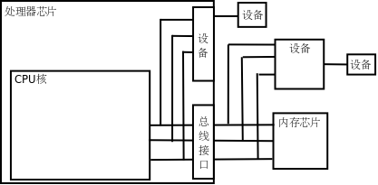
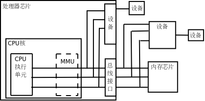
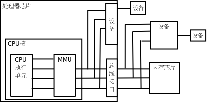
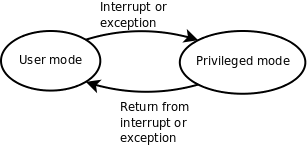

# 16. 计算机体系结构基础

<!-- 16.1 16.2 16.5 no highlight -->

## 16.1 内存与地址

- 多字节数据的地址

  以前讲过的int、float等多字节的数据类型保存在内存中要占用连续的多个地址，这种情况下数据的地址是它所占内存单元的起始地址。

## 16.2 CPU

- 地址线、数据线、CPU 寄存器位数通常一样

  图16.2中画了32条地址线和32条数据线，CPU寄存器也是32位，可以说这种体系结构是32位的，比如x86就是这样的体系结构，目前主流的处理器是32位或64位的。

  地址线、数据线和CPU寄存器的位数通常是一致的，从图16.2可以看出数据线和CPU寄存器的位数应该一致，另外有些寄存器（比如程序计数器）需要保存一个内存地址，因而地址线和CPU寄存器的位数也应该一致。

- 字

  处理器的位数也称为字长，字（Word）这个概念用得比较混乱，在有些上下文中指16位，在有些上下文中指32位（这种情况下16位被称为半字Half Word），在有些上下文中指处理器的字长，如果处理器是32位那么一个字就是32位，如果处理器是64位那么一个字就是64位。

- 外总线和内总线

  最后还要说明一点，本节所说的地址线、数据线是指CPU的内总线，是直接和CPU的执行单元相连的，内总线经过MMU和总线接口的转换之后引出到芯片引脚才是外总线，外地址线和外数据线的位数都有可能和内总线不同，例如32位处理器的外地址总线可寻址的空间可以大于4GB，到第16.4节再详细解释。

## 16.3 设备

### 设备

CPU执行指令除了访问内存之外还要访问很多设备（Device），如键盘、鼠标、硬盘、显示器等，那么它们和CPU之间如何连接呢？如图16.4所示。

- Memory-mapped I/O

  有些设备像内存芯片一样连接到处理器的地址总线和数据总线，正因为地址线和数据线上可以挂多个设备和内存芯片所以才叫“总线”，但不同的设备和内存芯片应该占不同的地址范围。

  访问这种设备就像访问内存一样，按地址读写即可，但和访问内存不同的是，往一个地址写数据只是给设备发一个命令，数据不一定要保存，而从一个地址读数据也不一定是读先前保存在这个地址的数据，而是得到设备的当前状态。

  - 设备寄存器

    设备中可供读写访问的单元通常称为设备寄存器（注意和CPU寄存器不是一回事），操作设备的过程就是读写这些设备寄存器的过程，比如向串口发送寄存器里写数据，串口设备就会把数据发送出去，读串口接收寄存器的值，就可以读取串口设备接收到的数据。

  - 集成在处理器中的设备

    还有一些设备集成在处理器芯片中。

    在图16.4中，从CPU核引出的地址和数据总线有一端经总线接口引出到芯片引脚上了，还有一端没有引出，而是接到芯片内部集成的设备上，无论是在CPU外部接总线的设备还是在CPU内部接总线的设备都有各自的地址范围，都可以像访问内存一样访问，很多体系结构（比如ARM）采用这种方式操作设备，称为内存映射I/O（Memory-mapped I/O）。

- Port I/O

  但是x86比较特殊，x86对于设备有独立的端口地址空间，CPU核需要引出额外的地址线来连接片内设备（和访问内存所用的地址线不同），访问设备寄存器时用特殊的in/out指令，而不是和访问内存用同样的指令，这种方式称为端口I/O（Port I/O）。

- 设备总线和设备总线控制器

  从CPU的角度来看，访问设备只有内存映射I/O和端口I/O两种，要么像内存一样访问，要么用一种专用的指令访问。

  其实访问设备是相当复杂的，计算机的设备五花八门，各种设备的性能要求都不一样，有的要求带宽大，有的要求响应快，有的要求热插拔，于是出现了各种适应不同要求的设备总线，比如PCI、AGP、USB、1394、SATA等，这些设备总线并不直接和CPU相连，CPU通过内存映射I/O或端口I/O访问相应的总线控制器，通过总线控制器再去访问挂在总线上的设备。

  所以上图中标有“设备”的框可能是实际的设备，也可能是设备总线的控制器。

### 程序变成进程

- 程序、加载、进程

  在x86平台上，硬盘是挂在IDE、SATA或SCSI总线上的设备，保存在硬盘上的程序是不能被CPU直接取指令执行的，操作系统在执行程序时会把它从硬盘拷贝到内存，这样CPU才能取指令执行，这个过程称为加载（Load）。

  程序加载到内存之后，成为操作系统调度执行的一个任务，就称为进程（Process）。

  - 进程和程序不是一一对应的

    进程和程序不是一一对应的。一个程序可以多次加载到内存，成为同时运行的多个进程，例如可以同时开多个终端窗口，每个窗口都运行一个Shell进程，而它们对应的程序都是磁盘上的/bin/bash文件。

- 操作系统本身也是程序，也需要通过 bootloader 加载

  操作系统（Operating System）本身也是一段保存在磁盘上的程序，计算机在启动时执行一段固定的启动代码（称为Bootloader）首先把操作系统从磁盘加载到内存，然后执行操作系统中的代码把用户需要的其他程序加载到内存。

  - 操作系统和用户程序的区别：操作系统常驻内存

    操作系统和其他用户程序的不同之处在于：操作系统是常驻内存的，而其他用户程序则不一定，用户需要运行哪个程序，操作系统就把它加载到内存，用户不需要哪个程序，操作系统就把它终止掉，释放它所占的内存。

  - 内核

    操作系统最核心的功能是管理进程调度、管理内存的分配使用和管理各种设备，做这些工作的程序称为内核（Kernel），在我的系统上内核程序是/boot/vmlinuz-2.6.28-13-generic文件，它在计算机启动时加载到内存并常驻内存。

  - 用户程序

    广义上操作系统的概念还包括一些必不可少的用户程序，比如Shell是每个Linux系统必不可少的，而Office办公套件则是可有可无的，所以前者也属于广义上操作系统的范畴，而后者属于应用软件。

### 中断

- 内存不会产生新的数据、设备会

  访问设备还有一点和访问内存不同。

  内存只是保存数据而不会产生新的数据，如果CPU不去读它，它也不需要主动提供数据给CPU，所以内存总是被动地等待被读或者被写。

  而设备往往会自己产生数据，并且需要主动通知CPU来读这些数据，例如敲键盘产生一个输入字符，用户希望计算机马上响应自己的输入，这就要求键盘设备主动通知CPU来读这个字符并做相应处理，给用户响应。

- 设备产生的数据需要 CPU 马上处理：中断机制

  这是由中断（Interrupt）机制实现的，每个设备都有一条**中断线**，通过**中断控制器**连接到CPU，当设备需要主动通知CPU时就引发一个**中断信号**，CPU正在执行的指令将被打断，程序计数器会指向某个固定的地址（这个地址由体系结构定义），于是CPU从这个地址开始取指令（或者说跳转到这个地址），执行**中断服务程序**（Interrupt Service Routine，ISR），完成中断处理之后再返回先前被打断的地方执行后续指令。

  - ISR 程序

    比如某种体系结构规定发生中断时跳转到地址0x00000010执行，那么就要事先把一段ISR程序加载到这个地址，ISR程序是内核代码的一部分，在这段代码中首先判断是哪个设备引发了中断，然后调用该设备的中断处理函数做进一步处理。

  - 设备驱动程序

    由于各种设备的操作方法各不相同，每种设备都需要专门的设备驱动程序（Device Driver），一个操作系统为了支持广泛的设备就需要有大量的设备驱动程序，事实上Linux内核源代码中绝大部分是设备驱动程序。

    设备驱动程序通常是内核里的一组函数，通过读写设备寄存器实现对设备的初始化、读、写等操作，有些设备还要提供一个中断处理函数供ISR调用。

## 16.4 MMU

现代操作系统普遍采用虚拟内存管理（Virtual Memory Management）机制，这需要处理器中的MMU（Memory Management Unit，内存管理单元）提供支持，本节简要介绍MMU的作用。

- 没启用 MMU：物理地址

  首先引入两个概念，虚拟地址和物理地址。如果处理器没有MMU，或者有MMU但没有启用，CPU执行单元发出的内存地址将直接传到芯片引脚上，被内存芯片（以下称为物理内存，以便与虚拟内存区分）接收，这称为物理地址（Physical Address，以下简称PA），如图16.5所示。

  

- 启用了 MMU：虚拟地址翻译成物理地址

  如果处理器启用了MMU，CPU执行单元发出的内存地址将被MMU截获，从CPU到MMU的地址称为虚拟地址（Virtual Address，以下简称VA），而MMU将这个地址翻译成另一个地址发到CPU芯片的外部地址引脚上，也就是将VA映射成PA，如图16.6所示。

  

- 32 位处理器虚拟地址空间是 4 GB，物理地址空间可以大于也可以小于 4 GB

  如果是32位处理器，则内地址总线是32位的，与CPU执行单元相连（图中只是示意性地画了4条地址线），而经过MMU转换之后的外地址总线则不一定是32位的。

  也就是说，虚拟地址空间和物理地址空间是独立的，32位处理器的虚拟地址空间是4GB，而物理地址空间既可以大于也可以小于4GB。

- VA 映射到 PA 以页为单位

  MMU将VA映射到PA是以页（Page）为单位的，32位处理器的页尺寸通常是4KB。

  例如，MMU可以通过一个映射项将VA的一页0xb7001000～0xb7001fff映射到PA的一页0x2000～0x2fff，如果CPU执行单元要访问虚拟地址0xb7001008，则实际访问到的物理地址是0x2008。

  - Page frame

    物理内存中的页称为物理页面或者页帧（Page Frame）。

  - Page table: page -> page frame

    虚拟内存的哪个页面映射到物理内存的哪个页帧是通过页表（Page Table）来描述的，页表保存在物理内存中，MMU会查找页表来确定一个VA应该映射到什么PA。

- 操作系统和 MMU 的配合

  操作系统和MMU是这样配合的：

  1．操作系统在初始化或分配、释放内存时会执行一些指令在物理内存中填写页表，然后用指令设置MMU，告诉MMU页表在物理内存中的什么位置。

  2．设置好之后，CPU每次执行访问内存的指令都会自动引发MMU做查表和地址转换操作，地址转换操作由硬件自动完成，不需要用指令控制MMU去做。

- 启用 MMU 的情况下，程序使用的地址都是虚拟地址

  我们在程序中使用的变量和函数都有各自的地址，程序被编译后，这些地址就成了指令中的地址，指令中的地址被CPU解释执行，就成了CPU执行单元发出的内存地址，所以在启用MMU的情况下，程序中使用的地址都是虚拟地址，都会引发MMU做查表和地址转换操作。

- VA 到 PA 的转换看似增加了工作量，有什么好处

  那为什么要设计这么复杂的内存管理机制呢？多了一层VA到PA的转换到底换来了什么好处？All problems in computer science can be solved by another level of indirection.还记得这句话吗？多了一层间接必然是为了解决什么问题的，等讲完了必要的预备知识之后，将在第19.5节讨论虚拟内存管理机制的作用。

- MMU 还提供内存保护

  MMU除了做地址转换之外，还提供内存保护机制。

  - 处理器模式：用户模式和特权模式

    各种体系结构都有用户模式（User Mode）和特权模式（Privileged Mode）之分，如图16.7所示。

    

  - 操作系统可以在页表中设置每个页面的访问权限

    操作系统可以在页表中设置每个内存页面的访问权限，有些页面不允许访问，有些页面只有在CPU处于特权模式时才允许访问，有些页面在用户模式和特权模式都可以访问，访问权限又分为可读、可写和可执行三种。

    这样设定好之后，当CPU要访问一个VA时，MMU会检查CPU当前处于用户模式还是特权模式，访问内存的目的是读数据、写数据还是取指令，如果和操作系统设定的页面权限相符，就允许访问，把它转换成PA，否则不允许访问，产生一个异常（Exception）。

  - 异常

    异常的处理过程和中断类似，不同的是中断由外部设备产生而异常由CPU内部产生，中断产生的原因和CPU当前执行的指令无关，而异常的产生就是由于CPU当前执行的指令出了问题，例如访问内存的指令被MMU检查出权限错误，除法指令的除数为0等都会产生异常。

  - 虚拟内存分为用户空间和内核空间

    通常操作系统把虚拟地址空间划分为用户空间和内核空间，例如x86平台的Linux系统虚拟地址空间是0x00000000～0xffffffff，前3GB（0x00000000～0xbfffffff）是用户空间，后1GB（0xc0000000～0xffffffff）是内核空间。

  - 用户程序被加载到用户空间，在用户模式下执行

    用户程序加载到用户空间，在用户模式下执行，不能访问内核中的数据，也不能跳转到内核代码中执行。这样可以保护内核，如果一个进程访问了非法地址，顶多这一个进程崩溃，而不会影响到内核和整个系统的稳定性。

  - CPU 在产生中断或异常时会切换模式，中断或异常服务程序就可以跳转到内核代码

    CPU在产生中断或异常时不仅会跳转到中断或异常服务程序，还会自动切换模式，从用户模式切换到特权模式，因此从中断或异常服务程序可以跳转到内核代码中执行。

  - 总结

    事实上，整个内核就是由各种中断和异常处理程序组成的。总结一下：在正常情况下处理器在用户模式执行用户程序，在中断或异常情况下处理器切换到特权模式执行内核程序，处理完中断或异常之后再返回用户模式继续执行用户程序。

  - 段错误

    段错误我们已经遇到过很多次了，它是这样产生的：

    1．用户程序要访问的一个VA，经MMU检查无权访问。

    2．MMU产生一个异常，CPU从用户模式切换到特权模式，跳转到内核代码中执行异常服务程序。

    3．内核把这个异常解释为段错误，把引发异常的进程终止掉。

## 16.5 Memory Hierarchy
