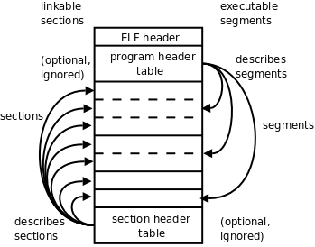
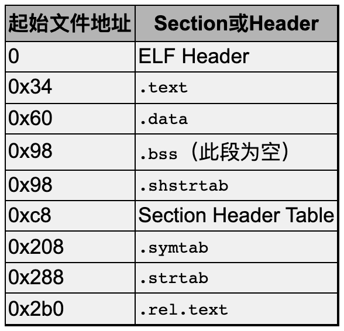

# 17. x86 汇编程序基础

<!-- 17.3 17.4 17.5.2 no highlight-->

要彻底搞清楚C语言的原理，就必须深入到指令一层去理解。

你写一行C代码，编译器会生成什么样的指令，要做到心中有数。本章介绍汇编程序的一些基础知识。汇编不是本书的重点，本书要求读者能看懂基本的汇编程序而不要求会写汇编程序，下一章将在汇编的基础上讨论C语言的原理。

## 17.1 最简单的汇编程序

``` unix-assembly
#PURPOSE: Simple program that exits and returns a
#         status code back to the Linux kernel
#
#INPUT:   none
#
#OUTPUT:  returns a status code. This can be viewed
#         by typing
#
#         echo $?
#
#         after running the program
#-
#VARIABLES:
#         %eax holds the system call number
#         %ebx holds the return status
#
 .section .data

 .section .text
 .globl _start
_start:
 movl $1, %eax  # this is the linux kernel command
                # number (system call) for exiting
                # a program

 movl $4, %ebx  # this is the status number we will
                # return to the operating system.
                # Change this around and it will
                # return different things to
                # echo $?

 int $0x80      # this wakes up the kernel to run
                # the exit command
```

- 用汇编器把助记符翻译成机器指令，生成目标文件

  把这个程序保存成文件hello.s（汇编程序通常以.s作为文件名后缀），用汇编器as把汇编程序中的助记符翻译成机器指令，生成目标文件hello.o：

  ``` console
  as hello.s -o hello.o
  ```

- 用链接器把目标文件链接成可执行文件

  然后用链接器（Linker，或Link Editor）ld把目标文件hello.o链接成可执行文件hello：

  ``` console
  ld hello.o -o hello
  ```

  为什么用汇编器翻译成机器指令了还不行，还要有一个链接的步骤呢？链接主要有两个作用，一是修改目标文件中的信息，对地址做重定位，在第17.5.2节详细解释，二是把多个目标文件合并成一个可执行文件，在第18.2节详细解释。我们这个例子虽然只有一个目标文件，但也需要经过链接才能成为可执行文件。

- 这个程序相当于 return 4

  现在执行这个程序，它只做了一件事就是退出，退出状态是4，第3.2节讲过在Shell中可以用特殊变量$?得到上一条命令的退出状态：

  ``` console
  $ ./hello
  $ echo $?
  4
  ```

  所以这段汇编代码相当于在C程序的main函数中return 4;。为什么呢？我们在第18.2节详细解释。

- 逐行分析汇编程序

  下面逐行分析这个汇编程序。

  - 单行注释

    首先，#号表示单行注释，类似于C语言的//注释。

  - 汇编指示或伪指令

    ``` unix-assembly
     .section .data
    ```

    汇编程序中以.开头的名称并不是指令的助记符，不会被翻译成机器指令，而是给汇编器一些特殊指示，称为汇编指示（Assembler Directive）或伪指令（Pseudo-operation），由于它不是真正的指令所以加个“伪”字。

  - .section 指示

    .section指示把代码划分成若干个段（Section），程序被操作系统加载执行时，每个段被加载到不同的地址，操作系统对不同的页面设置不同的读、写、执行权限。

    .data段保存程序的数据，是可读可写的，相当于C程序的全局变量。本程序中没有定义数据，所以.data段是空的。

    ``` unix-assembly
      .section .text
    ```

    .text段保存代码，是只读和可执行的，后面那些指令都属于.text段。

  - 符号

    _start是一个符号（Symbol），符号在汇编程序中代表一个地址，可以用在指令中，汇编程序经过汇编器的处理之后，所有的符号都被替换成它所代表的地址值。

    在C语言中我们通过变量名访问一个变量，其实就是读写从某个地址开始的内存单元，我们通过函数名调用一个函数，其实就是跳转到该函数第一条指令所在的地址，所以变量名和函数名都是符号，本质上是代表内存地址的。

  - .globl 指示

    ``` unix-assembly
      .globl _start
    ```

    .globl指示告诉汇编器，_start这个符号要被链接器用到，所以要在目标文件的符号表中标记它是一个全局符号（在第17.5.1节详细解释）。

    - 每个汇编程序都要提供一个 _start 并用 .globl 声明

      _start就像C程序的main函数一样特殊，是整个程序的入口，链接器在链接时会查找目标文件中的_start符号代表的地址，把它设置为整个程序的入口地址，所以每个汇编程序都要提供一个_start符号并且用.globl声明。

    如果一个符号没有用.globl声明，就表示这个符号不会被链接器用到。

  - _start 符号

    ``` unix-assembly
    _start:
    ```

    这里定义了_start符号，汇编器在翻译汇编程序时会计算每个数据对象和每条指令的地址，当看到这样一个符号定义时，就把它后面一条指令的地址作为这个符号所代表的地址。

    而_start这个符号又比较特殊，它所代表的地址是整个程序的入口地址，所以下一条指令movl $1, %eax就成了程序中第一条被执行的指令。

  - movl 指令

    ``` unix-assembly
    movl $1, %eax
    ```

    这是一条数据传送指令，这条指令要求CPU内部产生一个数字1并保存到eax寄存器中。

    mov的后缀l表示long，说明是32位的传送指令。

    这条指令不要求CPU读内存，1这个数是在CPU内部产生的，称为立即数（Immediate）。

    在汇编程序中，立即数前面要加$，寄存器名前面要加%，以便跟符号名区分开。

    以后我们会看到mov指令还有另外几种形式，但数据传送方向都是一样的，第一个操作数总是源操作数，第二个操作数总是目标操作数。

    ``` unix-assembly
    movl $4, %ebx
    ```

    和上一条指令类似，生成一个立即数4并保存到ebx寄存器中。

  - int 指令

    ``` unix-assembly
      int $0x80
    ```

    前两条指令都是为这条指令做准备的，执行这条指令时发生以下动作：

    1．int指令称为软中断指令，可以用这条指令故意产生一个异常，上一章讲过，异常的处理和中断类似，CPU从用户模式切换到特权模式，然后跳转到内核代码中执行异常处理程序。

    2．int指令中的立即数0x80是一个参数，在异常处理程序中要根据这个参数决定如何处理，在Linux内核中int $0x80这种异常称为系统调用（System Call）。

    内核提供了很多系统服务供用户程序使用，但这些系统服务不能像库函数（比如printf）那样调用，因为在执行用户程序时CPU处于用户模式，不能直接调用内核函数，所以需要通过系统调用切换CPU模式，经由异常处理程序进入内核，用户程序只能通过寄存器传几个参数，之后就要按内核设计好的代码路线走，而不能由用户程序随心所欲，想调哪个内核函数就调哪个内核函数，这样可以保证系统服务被安全地调用。

    在调用结束之后，CPU再切换回用户模式，继续执行int$0x80的下一条指令，在用户程序看来就像函数调用和返回一样。

    3．eax和ebx的值是传递给系统调用的两个参数。

    eax的值是系统调用号，Linux的各种系统调用都是由int $0x80指令引发的，内核需要通过eax判断用户要调哪个系统调用，_exit的系统调用号是1。

    ebx的值是传给_exit的参数，表示退出状态。

    大多数系统调用完成之后会返回用户空间继续执行后面的指令，而_exit系统调用比较特殊，它会终止掉当前进程，而不是返回用户空间继续执行。

- x86汇编的两种语法

  x86汇编一直存在两种不同的语法，在intel的官方文档中使用intel语法，Windows也使用intel语法，而UNIX平台的汇编器一直使用AT&T语法，所以本书使用AT&T语法。

  movl %edx,%eax这条指令如果用intel语法来写，就是mov eax,edx，寄存器名不加%号，源操作数和目标操作数的位置互换，字长也不是用指令的后缀l表示而是用另外的方式表示。

  本书不详细讨论这两种语法之间的区别，读者可以查阅参考文献[22]。

  介绍x86汇编的书很多，UNIX平台的书都采用AT&T语法，例如参考文献[2]，其他书一般采用intel语法，例如参考文献[23]。

## 17.2 x86 的寄存器

- 通用寄存器

  x86的通用寄存器有eax、ebx、ecx、edx、edi、esi。

  - 大多数指令可以任意用这些寄存器

    这些寄存器在大多数指令中是可以任意选用的，比如movl指令可以把一个立即数传送到eax中，也可传送到ebx中。

  - 有一些指令用特定寄存器做某种用途

    但也有一些指令规定只能用其中某个寄存器做某种用途，例如除法指令idivl要求被除数在eax寄存器中，edx寄存器必须是0，而除数可以在任意寄存器中，计算结果的商数保存在eax寄存器中（覆盖原来的被除数），余数保存在edx寄存器中。

    也就是说，通用寄存器对于某些特殊指令来说也不是通用的。

- 特殊寄存器

  x86的特殊寄存器有ebp、esp、eip、eflags。

  eip是程序计数器。

  eflags保存着计算过程中产生的标志位，其中包括第13.3节讲过的进位标志、溢出标志、零标志和负数标志，在intel的手册中这几个标志位分别称为CF、OF、ZF、SF。

  ebp和esp用于维护函数调用的栈帧，在第18.1节详细讨论。

## 17.3 第二个汇编程序

``` unix-assembly
#PURPOSE: This program finds the maximum number of a
#         set of data items.
#
#VARIABLES: The registers have the following uses:
#
# %edi - Holds the index of the data item being examined
# %ebx - Largest data item found
# %eax - Current data item
#
# The following memory locations are used:
#
# data_items - contains the item data. A 0 is used
# to terminate the data
#
 .section .data
data_items:             # These are the data items
 .long 3,67,34,222,45,75,54,34,44,33,22,11,66,0

 .section .text
 .globl _start
_start:
 movl $0, %edi          # move 0 into the index register
 movl data_items(,%edi,4), %eax # load the first item
 movl %eax, %ebx        # since %eax is the first and only item, it's
                        # the biggest

start_loop:             # start loop
 cmpl $0, %eax          # check to see if we've hit the end
 je loop_exit
 incl %edi              # load next value
 movl data_items(,%edi,4), %eax
 cmpl %ebx, %eax        # compare values
 jle start_loop         # jump to loop beginning if the new one isn't
                        # bigger
 movl %eax, %ebx        # the new one is the biggest
 jmp start_loop         # jump to loop beginning

loop_exit:
 # %ebx is the status code for the _exit system call
 # and it already has the maximum number
 movl $1, %eax          #1 is the _exit() syscall
 int $0x80
```

## 17.4 寻址方式

## 17.5 ELF 文件

- ELF 有三种不同的类型

  ELF（Executable and Linking Format）是一个开放标准，各种UNIX系统都支持ELF格式的可执行文件，它有三种不同的类型：

  - 可重定位的目标文件（Relocatable，或者Object File）

  - 可执行文件（Executable）

  - 共享库（Shared Object，或者Shared Library）

  共享库留到第19.4节再详细介绍，本节我们以例17.2为例讨论目标文件和可执行文件的格式。

- 汇编、链接、运行

  现在详细解释一下这个程序的汇编、链接、运行过程：

  1．写一个汇编程序保存成文本文件max.s。

  2．汇编器读取这个文本文件转换成目标文件max.o，目标文件由若干个Section组成，我们在汇编程序中声明的.section会成为目标文件中的Section，此外汇编器还会自动添加一些Section（比如符号表）。

  3．然后链接器把目标文件中的Section合并成几个Segment，生成可执行文件max。

  4．最后加载器（Loader）根据可执行文件中的Segment信息加载运行这个程序。

- ELF 格式提供的两种视角

  ELF格式提供了两种不同的视角，链接器把ELF文件看成是Section的集合，而加载器把ELF文件看成是Segment的集合，如图17.1所示。

  

  - 链接器的视角

    左边是从链接器的视角来看ELF文件，开头的ELF Header描述了体系结构和操作系统等基本信息，并指出Section Header Table和Program Header Table在文件中的什么位置，Program Header Table在链接过程中用不到，所以是可有可无的，Section Header Table中保存了所有Section的描述信息，通过Section Header Table可以找到每个Section在文件中的位置。

  - 加载器的视角

    右边是从加载器的视角来看ELF文件，开头是ELF Header，Program Header Table中保存了所有Segment的描述信息，Section Header Table在加载过程中用不到，所以是可有可无的。

    从图17.1可以看出，一个Segment由一个或多个Section组成，这些Section加载到内存时具有相同的访问权限。有些Section只对链接器有意义，在运行时用不到，也不需要加载到内存，那么就不属于任何Segment。

  注意Section Header Table和Program Header Table并不是一定要位于文件的开头和结尾，其位置由ELF Header指出，图17.1这么画只是为了清晰。

- 三种 ELF 文件和 section header table、program header table

  目标文件需要链接器做进一步处理，所以一定有Section Header Table；可执行文件需要加载运行，所以一定有Program Header Table；而共享库既要加载运行，又要在加载时做动态链接，所以既有Section Header Table又有Program Header Table。

### 目标文件

下面用readelf工具读出目标文件max.o的ELF Header和Section Header Table，然后我们逐段分析。

``` console
$ readelf -a max.o
ELF Header:
  Magic:   7f 45 4c 46 01 01 01 00 00 00 00 00 00 00 00 00
  Class:                             ELF32
  Data:                              2's complement, little endian
  Version:                           1 (current)
  OS/ABI:                            UNIX - System V
  ABI Version:                       0
  Type:                              REL (Relocatable file)
  Machine:                           Intel 80386
  Version:                           0x1
  Entry point address:               0x0
  Start of program headers:          0 (bytes into file)
  Start of section headers:          200 (bytes into file)
  Flags:                             0x0
  Size of this header:               52 (bytes)
  Size of program headers:           0 (bytes)
  Number of program headers:         0
  Size of section headers:           40 (bytes)
  Number of section headers:         8
  Section header string table index: 5
...
```

- readelf 中 ELF header

  ELF Header中描述了这样一些信息：

  ⦁　每个ELF文件开头四个字节都是0x7f、0x45、0x4c、0x46，其中后三个字节就是“ELF”的ASCII码，在文件开头用几个特殊字符来标识文件类型是UNIX系统的惯用伎俩，这称为Magic Number，file(1)命令就是通过分析Magic Number和其它一些特征来确定文件类型的；

  ⦁　文件格式是ELF32；

  ⦁　字节序是小端；

  ⦁　操作系统是UNIX；

  ⦁　文件类型是Relocatable file（即可重定位的目标文件）；

  ⦁　体系结构是Intel 80386；

  ⦁　程序的入口地址是0x0，因为目标文件的入口地址还没确定，链接成可执行文件时才能确定入口地址；

  ⦁　Program Header Table在文件中的开始位置是0，因为目标文件没有Program Header Table，链接成可执行文件时才会有Program Header Table；

  ⦁　Section Header Table在文件中的开始位置是200，以下我们称其为文件地址，规定文件开头第一个字节的地址是0，然后每个字节占一个地址，所以200是文件中的第201个字节；

  ⦁　此ELF Header的大小是52字节；

  ⦁　Section Header Table中有8个Section Header表项，每个表项占40字节，共320字节，所以Section Header Table在文件中的地址范围是200～519（0xc8～0x207）；

  ⦁　Section Header String Table也是一个Section，它由Section Header Table中的第5个表项来描述。

- readelf 中 Section headers

  ``` console
  ...
  Section Headers:
    [Nr] Name              Type            Addr     Off    Size   ES Flg Lk Inf Al
    [ 0]                   NULL            00000000 000000 000000 00      0   0  0
    [ 1] .text             PROGBITS        00000000 000034 00002a 00  AX  0   0  4
    [ 2] .rel.text         REL             00000000 0002b0 000010 08      6   1  4
    [ 3] .data             PROGBITS        00000000 000060 000038 00  WA  0   0  4
    [ 4] .bss              NOBITS          00000000 000098 000000 00  WA  0   0  4
    [ 5] .shstrtab         STRTAB          00000000 000098 000030 00      0   0  1
    [ 6] .symtab           SYMTAB          00000000 000208 000080 10      7   7  4
    [ 7] .strtab           STRTAB          00000000 000288 000028 00      0   0  1
  Key to Flags:
    W (write), A (alloc), X (execute), M (merge), S (strings)
    I (info), L (link order), G (group), x (unknown)
    O (extra OS processing required) o (OS specific), p (processor specific)

  There are no section groups in this file.

  There are no program headers in this file.
  ...
  ```

  从Section Header中读出各Section的描述信息，其中.text和.data是我们在汇编程序中声明的Section，而其他Section是汇编器自动添加的。

  Addr列指出这些Section加载到内存中的地址（虚拟地址），目标文件中各Section的加载地址是待定的，所以是00000000，到链接时再确定这些地址。Off和Size列指出各Section的起始文件地址和长度。比如.data段从文件地址0x60开始，一共0x38个字节，回去翻一下程序，.data段定义了14个4字节的整数，一共是56个字节，也就是0x38。根据以上信息可以描绘出整个目标文件的布局，如表17.1所示。

  

- 目标文件的所有内容

  这个文件不大，我们直接用hexdump工具把目标文件的字节全部打印出来看。

  ``` console
  $ hexdump -C max.o
  00000000  7f 45 4c 46 01 01 01 00  00 00 00 00 00 00 00 00  |.ELF............|
  00000010  01 00 03 00 01 00 00 00  00 00 00 00 00 00 00 00  |................|
  00000020  c8 00 00 00 00 00 00 00  34 00 00 00 00 00 28 00  |........4.....(.|
  00000030  08 00 05 00 bf 00 00 00  00 8b 04 bd 00 00 00 00  |................|
  00000040  89 c3 83 f8 00 74 10 47  8b 04 bd 00 00 00 00 39  |.....t.G.......9|
  00000050  d8 7e ef 89 c3 eb eb b8  01 00 00 00 cd 80 00 00  |.~..............|
  00000060  03 00 00 00 43 00 00 00  22 00 00 00 de 00 00 00  |....C...".......|
  00000070  2d 00 00 00 4b 00 00 00  36 00 00 00 22 00 00 00  |-...K...6..."...|
  00000080  2c 00 00 00 21 00 00 00  16 00 00 00 0b 00 00 00  |,...!...........|
  00000090  42 00 00 00 00 00 00 00  00 2e 73 79 6d 74 61 62  |B.........symtab|
  000000a0  00 2e 73 74 72 74 61 62  00 2e 73 68 73 74 72 74  |..strtab..shstrt|
  000000b0  61 62 00 2e 72 65 6c 2e  74 65 78 74 00 2e 64 61  |ab..rel.text..da|
  000000c0  74 61 00 2e 62 73 73 00  00 00 00 00 00 00 00 00  |ta..bss.........|
  000000d0  00 00 00 00 00 00 00 00  00 00 00 00 00 00 00 00  |................|
  *
  000000f0  1f 00 00 00 01 00 00 00  06 00 00 00 00 00 00 00  |................|
  00000100  34 00 00 00 2a 00 00 00  00 00 00 00 00 00 00 00  |4...*...........|
  00000110  04 00 00 00 00 00 00 00  1b 00 00 00 09 00 00 00  |................|
  00000120  00 00 00 00 00 00 00 00  b0 02 00 00 10 00 00 00  |................|
  00000130  06 00 00 00 01 00 00 00  04 00 00 00 08 00 00 00  |................|
  00000140  25 00 00 00 01 00 00 00  03 00 00 00 00 00 00 00  |%...............|
  00000150  60 00 00 00 38 00 00 00  00 00 00 00 00 00 00 00  |`...8...........|
  00000160  04 00 00 00 00 00 00 00  2b 00 00 00 08 00 00 00  |........+.......|
  00000170  03 00 00 00 00 00 00 00  98 00 00 00 00 00 00 00  |................|
  00000180  00 00 00 00 00 00 00 00  04 00 00 00 00 00 00 00  |................|
  00000190  11 00 00 00 03 00 00 00  00 00 00 00 00 00 00 00  |................|
  000001a0  98 00 00 00 30 00 00 00  00 00 00 00 00 00 00 00  |....0...........|
  000001b0  01 00 00 00 00 00 00 00  01 00 00 00 02 00 00 00  |................|
  000001c0  00 00 00 00 00 00 00 00  08 02 00 00 80 00 00 00  |................|
  000001d0  07 00 00 00 07 00 00 00  04 00 00 00 10 00 00 00  |................|
  000001e0  09 00 00 00 03 00 00 00  00 00 00 00 00 00 00 00  |................|
  000001f0  88 02 00 00 28 00 00 00  00 00 00 00 00 00 00 00  |....(...........|
  00000200  01 00 00 00 00 00 00 00  00 00 00 00 00 00 00 00  |................|
  00000210  00 00 00 00 00 00 00 00  00 00 00 00 00 00 00 00  |................|
  00000220  00 00 00 00 03 00 01 00  00 00 00 00 00 00 00 00  |................|
  00000230  00 00 00 00 03 00 03 00  00 00 00 00 00 00 00 00  |................|
  00000240  00 00 00 00 03 00 04 00  01 00 00 00 00 00 00 00  |................|
  00000250  00 00 00 00 00 00 03 00  0c 00 00 00 0e 00 00 00  |................|
  00000260  00 00 00 00 00 00 01 00  17 00 00 00 23 00 00 00  |............#...|
  00000270  00 00 00 00 00 00 01 00  21 00 00 00 00 00 00 00  |........!.......|
  00000280  00 00 00 00 10 00 01 00  00 64 61 74 61 5f 69 74  |.........data_it|
  00000290  65 6d 73 00 73 74 61 72  74 5f 6c 6f 6f 70 00 6c  |ems.start_loop.l|
  000002a0  6f 6f 70 5f 65 78 69 74  00 5f 73 74 61 72 74 00  |oop_exit._start.|
  000002b0  08 00 00 00 01 02 00 00  17 00 00 00 01 02 00 00  |................|
  000002c0
  ```

  左边一列是文件地址，中间是每个字节的十六进制表示，右边是把这些字节解释成ASCII码所对应的字符。中间有一个*号表示省略的部分全是0。

  - .data 段

    .data段对应的是这一块：

    ``` console
    ...
    00000060  03 00 00 00 43 00 00 00  22 00 00 00 de 00 00 00  |....C...".......|
    00000070  2d 00 00 00 4b 00 00 00  36 00 00 00 22 00 00 00  |-...K...6..."...|
    00000080  2c 00 00 00 21 00 00 00  16 00 00 00 0b 00 00 00  |,...!...........|
    00000090  42 00 00 00 00 00 00 00
    ...
    ```

    .data段将被原封不动地加载到内存中，下一小节会看到.data段被加载到内存地址0x080490a0～0x080490d7。

  - .shstrtab 段和 .strtab 段

    .shstrtab和.strtab这两个Section中存放的都是ASCII码：

    ``` console
    ...
                                       00 2e 73 79 6d 74 61 62  |B.........symtab|
    000000a0  00 2e 73 74 72 74 61 62  00 2e 73 68 73 74 72 74  |..strtab..shstrt|
    000000b0  61 62 00 2e 72 65 6c 2e  74 65 78 74 00 2e 64 61  |ab..rel.text..da|
    000000c0  74 61 00 2e 62 73 73 00                           |ta..bss.........|
    ...
                                       00 64 61 74 61 5f 69 74  |.........data_it|
    00000290  65 6d 73 00 73 74 61 72  74 5f 6c 6f 6f 70 00 6c  |ems.start_loop.l|
    000002a0  6f 6f 70 5f 65 78 69 74  00 5f 73 74 61 72 74 00  |oop_exit._start.|
    ...
    ```

    可见.shstrtab段保存着各Section的名字，.strtab段保存着程序中用到的符号的名字，每个名字都是以Null结尾的字符串。

  - .bss 段

    我们知道，C语言的全局变量如果在代码中没有初始化，就会在程序加载时用0初始化。这种数据属于.bss段，在加载时它和.data段一样都是可读可写的数据，但是在ELF文件中.data段需要占用一部分空间保存初始值，而.bss段则不需要。也就是说，.bss段在文件中只占一个Section Header而没有对应的Section，程序加载时.bss段占多大内存空间在Section Header中描述。在我们这个例子中没有用到.bss段，在第18.3节会看到这样的例子。

- readelf 中 .rel.text 和 .symtab

  我们继续分析readelf输出的最后一部分，是从.rel.text和.symtab这两个Section中读出的信息。

  ``` console
  ...
  Relocation section '.rel.text' at offset 0x2b0 contains 2 entries:
   Offset     Info    Type            Sym.Value  Sym. Name
  00000008  00000201 R_386_32          00000000   .data
  00000017  00000201 R_386_32          00000000   .data

  There are no unwind sections in this file.

  Symbol table '.symtab' contains 8 entries:
     Num:    Value  Size Type    Bind   Vis      Ndx Name
       0: 00000000     0 NOTYPE  LOCAL  DEFAULT  UND
       1: 00000000     0 SECTION LOCAL  DEFAULT    1
       2: 00000000     0 SECTION LOCAL  DEFAULT    3
       3: 00000000     0 SECTION LOCAL  DEFAULT    4
       4: 00000000     0 NOTYPE  LOCAL  DEFAULT    3 data_items
       5: 0000000e     0 NOTYPE  LOCAL  DEFAULT    1 start_loop
       6: 00000023     0 NOTYPE  LOCAL  DEFAULT    1 loop_exit
       7: 00000000     0 NOTYPE  GLOBAL DEFAULT    1 _start

  No version information found in this file.
  ```

  .rel.text告诉链接器指令中的哪些地方需要做重定位，在下一小节详细讨论。

  .symtab是符号表。Ndx列是每个符号所在的Section编号，例如符号data_items在第3个Section里（也就是.data段），各Section的编号见Section Header Table。Value列是每个符号所代表的地址，在目标文件中，符号地址都是相对于该符号所在Section的相对地址，比如data_items位于.data段的开头，所以地址是0，_start位于.text段的开头，所以地址也是0，但是start_loop和loop_exit相对于.text段的地址就不是0了。从Bind这一列可以看出_start这个符号是GLOBAL的，而其他符号是LOCAL的，在汇编程序中用.globl指示声明过的符号会成为全局符号，否则成为局部符号。

- 将 .text 反汇编

  现在剩下.text段没有分析，objdump工具可以把程序中的机器指令反汇编（Disassemble），那么反汇编的结果是否跟原来写的汇编代码一模一样呢？我们对比分析一下。

  ``` console
  $ objdump -d max.o

  max.o:     file format elf32-i386


  Disassembly of section .text:

  00000000 <_start>:
     0:   bf 00 00 00 00          mov    $0x0,%edi
     5:   8b 04 bd 00 00 00 00    mov    0x0(,%edi,4),%eax
     c:   89 c3                   mov    %eax,%ebx

  0000000e <start_loop>:
     e:   83 f8 00                cmp    $0x0,%eax
    11:   74 10                   je     23 <loop_exit>
    13:   47                      inc    %edi
    14:   8b 04 bd 00 00 00 00    mov    0x0(,%edi,4),%eax
    1b:   39 d8                   cmp    %ebx,%eax
    1d:   7e ef                   jle    e <start_loop>
    1f:   89 c3                   mov    %eax,%ebx
    21:   eb eb                   jmp    e <start_loop>

  00000023 <loop_exit>:
    23:   b8 01 00 00 00          mov    $0x1,%eax
    28:   cd 80                   int    $0x80
  ```

  左边是机器指令的字节，右边是反汇编结果。显然，所有的符号都被替换成地址了，比如je 23，注意没有加$的数表示内存地址，而不表示立即数。这条指令后面的<loop_exit>并不是指令的一部分，而是反汇编器从.symtab和.strtab中查到的符号名称，写在后面是为了有更好的可读性。目前所有指令中用到的符号地址都是相对地址，下一步链接器要修改这些指令，把其中的地址都改成加载时的内存地址，这些指令才能正确执行。

### 可执行文件

现在我们按上一节的步骤分析可执行文件max，看看链接器都做了什么改动。

``` console
$ readelf -a max
ELF Header:
  Magic:   7f 45 4c 46 01 01 01 00 00 00 00 00 00 00 00 00
  Class:                             ELF32
  Data:                              2's complement, little endian
  Version:                           1 (current)
  OS/ABI:                            UNIX - System V
  ABI Version:                       0
  Type:                              EXEC (Executable file)
  Machine:                           Intel 80386
  Version:                           0x1
  Entry point address:               0x8048074
  Start of program headers:          52 (bytes into file)
  Start of section headers:          256 (bytes into file)
  Flags:                             0x0
  Size of this header:               52 (bytes)
  Size of program headers:           32 (bytes)
  Number of program headers:         2
  Size of section headers:           40 (bytes)
  Number of section headers:         6
  Section header string table index: 3

Section Headers:
  [Nr] Name              Type            Addr     Off    Size   ES Flg Lk Inf Al
  [ 0]                   NULL            00000000 000000 000000 00      0   0  0
  [ 1] .text             PROGBITS        08048074 000074 00002a 00  AX  0   0  4
  [ 2] .data             PROGBITS        080490a0 0000a0 000038 00  WA  0   0  4
  [ 3] .shstrtab         STRTAB          00000000 0000d8 000027 00      0   0  1
  [ 4] .symtab           SYMTAB          00000000 0001f0 0000a0 10      5   6  4
  [ 5] .strtab           STRTAB          00000000 000290 000040 00      0   0  1
Key to Flags:
  W (write), A (alloc), X (execute), M (merge), S (strings)
  I (info), L (link order), G (group), x (unknown)
  O (extra OS processing required) o (OS specific), p (processor specific)

There are no section groups in this file.

Program Headers:
  Type           Offset   VirtAddr   PhysAddr   FileSiz MemSiz  Flg Align
  LOAD           0x000000 0x08048000 0x08048000 0x0009e 0x0009e R E 0x1000
  LOAD           0x0000a0 0x080490a0 0x080490a0 0x00038 0x00038 RW  0x1000

 Section to Segment mapping:
  Segment Sections...
   00     .text
   01     .data

There is no dynamic section in this file.

There are no relocations in this file.

There are no unwind sections in this file.

Symbol table '.symtab' contains 10 entries:
   Num:    Value  Size Type    Bind   Vis      Ndx Name
     0: 00000000     0 NOTYPE  LOCAL  DEFAULT  UND
     1: 08048074     0 SECTION LOCAL  DEFAULT    1
     2: 080490a0     0 SECTION LOCAL  DEFAULT    2
     3: 080490a0     0 NOTYPE  LOCAL  DEFAULT    2 data_items
     4: 08048082     0 NOTYPE  LOCAL  DEFAULT    1 start_loop
     5: 08048097     0 NOTYPE  LOCAL  DEFAULT    1 loop_exit
     6: 08048074     0 NOTYPE  GLOBAL DEFAULT    1 _start
     7: 080490d8     0 NOTYPE  GLOBAL DEFAULT  ABS __bss_start
     8: 080490d8     0 NOTYPE  GLOBAL DEFAULT  ABS _edata
     9: 080490d8     0 NOTYPE  GLOBAL DEFAULT  ABS _end

No version information found in this file.
```

在ELF Header中，Type改成了EXEC，由目标文件变成可执行文件了，Entry point address改成了0x8048074（这是_start符号的地址），还可以看出，多了两个Program Header，少了两个Section Header。

在Section Header Table中，.text和.data段的加载地址分别改成了0x08048074和0x080490a0。.bss段没有用到，所以被删掉了。.rel.text段就是用于链接过程的，做完链接就没用了，所以也删掉了。

多出来的Program Header Table描述了两个Segment的信息。.text段和前面的ELF Header、Program Header Table一起组成一个Segment（FileSiz指出总长度是0x9e），.data段组成另一个Segment（总长度是0x38），以后我们把这两个Segment分别叫做Text Segment和Data Segment。VirtAddr列指出Text Segment加载到虚拟地址0x08048000（注意在x86平台上后面的PhysAddr列是没有意义的，并不代表实际的物理地址），Data Segment加载到地址0x080490a0。Flg列指出Text Segment的访问权限是可读可执行，Data Segment的访问权限是可读可写。最后一列Align的值0x1000（4K）是x86平台的内存页面大小。在加载时文件也要按内存页面大小分成若干页，文件中的一页对应内存中的一页，对应关系如图17.2所示。
