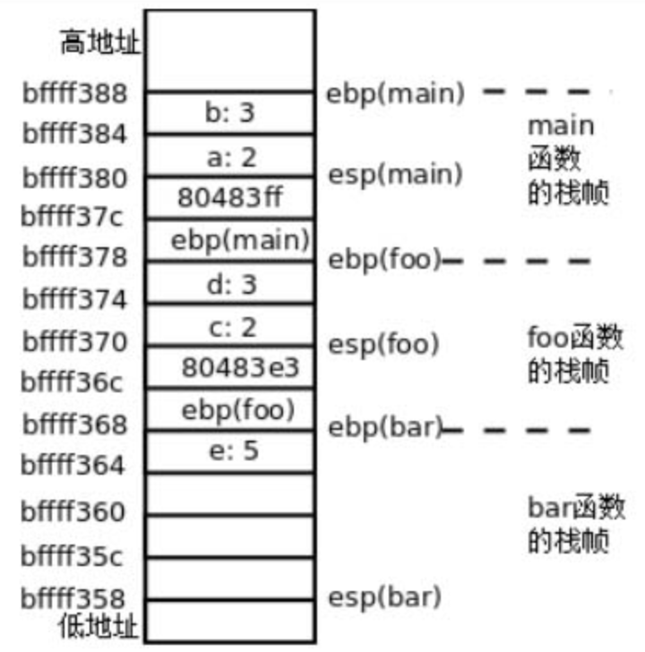
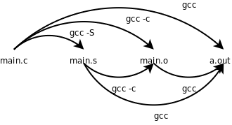
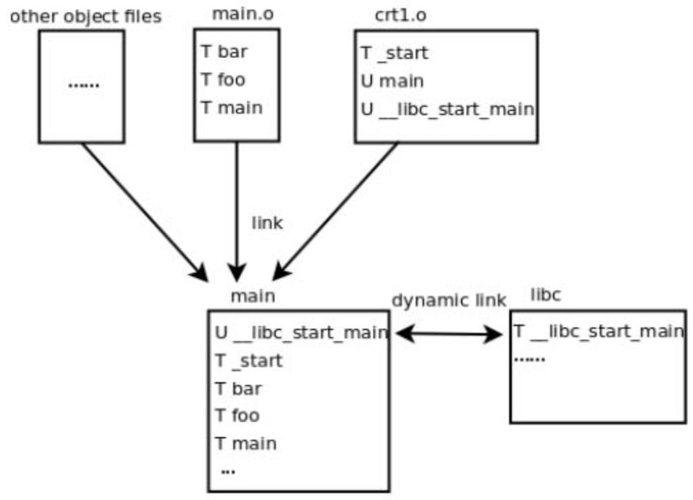
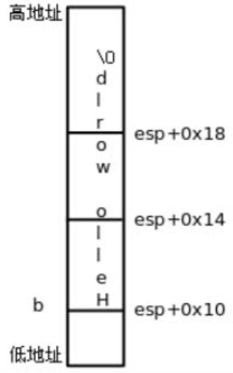
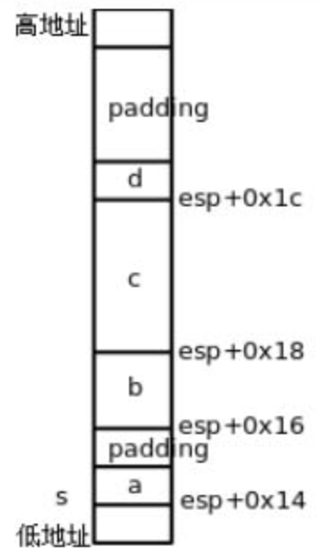
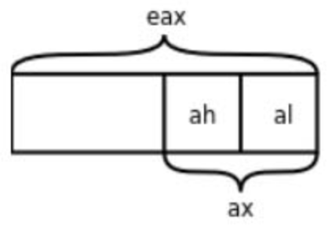
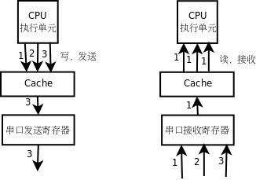

# 18. 汇编与 C 之间的关系

<!-- 18.1 no highlight -->

## 18.1 函数调用

### gdb 新命令

这里又用到几个新的gdb命令：

⦁　disassemble可以反汇编当前函数或者指定的函数，单独用disassemble命令是反汇编当前函数，如果disassemble命令后面跟函数名或地址则反汇编指定的函数或地址。

⦁　以前我们讲过step命令可以一行代码一行代码地单步调试，而这里用到的si命令可以一条指令一条指令地单步调试。

⦁　info registers可以显示所有寄存器的当前值。

⦁  在gdb中表示寄存器名时前面要加个$，例如p $esp可以打印esp寄存器的值。在上例中用info registers命令看到esp寄存器的值是0xbffff358，所以用x/12x $esp命令可以查看内存中从0xbffff358地址开始的12个32位数。

### 操作系统给进程分配的栈空间

在执行程序时，操作系统为进程分配一块栈空间来保存函数栈帧，esp寄存器总是指向栈顶。

在x86平台上这个栈是从高地址向低地址增长的，我们知道每次调用一个函数都要分配一个栈帧来保存参数和局部变量，现在我们详细分析这些数据在栈空间的布局，根据gdb的输出结果如图18.1所示。

为了安全性，Linux内核为每个新进程指定的栈空间起始地址是随机的，所以每次运行这个程序得到的地址都不一样，但通常都是0xbf??????这样的一个地址。



图18.1中每个小方格表示4个字节的内存单元，例如b: 3这个小方格占的内存地址是0xbffff384～0xbffff387，我把地址写在每个小方格的下边界线上，是为了强调该地址是内存单元的起始地址。

### lea 指令

lea指令根据第一个操作数的寻址方式计算出所代表的地址，但并不通过这个地址访问内存，而是直接把这个地址传给第二个操作数，我们知道x86的内存寻址方式涉及加法和乘法，lea指令只是利用寻址电路做加法和乘法，而不是真的寻址，lea (%edx,%eax,1),%eax这条指令的意思是eax = edx + eax * 1。

### <span class="thoughts">Calling convention</span>

- gcc 默认的 calling convention

  1．参数压栈传递，并且是从右到左依次压栈，传参所使用的栈空间由调用者分配和释放。

  2．ebp总是指向当前栈帧的栈底，esp 总是指向栈顶。

  3．返回值通过eax寄存器传递。

  4．栈从高地址往低地址增长。

- 其他 calling convention

  这些规则并不是体系结构所强加的，ebp寄存器并不是必须这么用，函数的参数和返回值也不是必须这么传，不同的操作系统和编译器可以规定不同的方式来实现C代码中的函数调用，每种实现方式称为一种Calling Convention。

  本章介绍的规则是gcc默认的Calling Convention，称为cdecl，其它常见的Calling Convention可参考http://en.wikipedia.org/wiki/X86_calling_conventions。

- 调用 callee 前 caller 的准备工作

  - movl 将实参压栈

    调用 callee 首先要把实参准备好。

    实参用 movl 从右向左依次压栈。如果有两个参数，第二个参数保存在esp+4指向的内存位置，第一个参数保存在esp指向的内存位置。

    实参可以是 caller 自己产生的立即数，也可以是 caller 的参数。caller 的参数通过 ebp 获得。ebp + 8 一定是第一个参数，这个地址就是当前 caller 的 caller 存放实参的地方。ebp+c 一定是第二个参数。

  - call

    call 指令相当于做了以下工作：

    1．函数调用完之后要返回到call的下一条指令继续执行，所以把call的下一条指令的地址0x80483ff压栈，同时把esp的值减4，esp的值现在是0xbffff37c。

    2．修改程序计数器eip，CPU 下一次执行指令会跳转到foo函数的开头执行。

- 进入 callee 后的准备工作

  - push %ebp

    push %ebp指令把ebp寄存器的值压栈，同时把esp的值减4。

    被压栈的 ebp 寄存器指向 caller 的栈底。

  - mov %esp, %ebp

    caller 的栈底已经被保存。现在 esp 为 callee 的栈底，将 esp 的值传给 ebp，ebp 被更新为 callee 的栈底。

  - sub ..., %esp

    esp 向下移动若干字节，为 callee 的局部变量留出空间。

    如果 callee 要调用函数，那么它同时也是一个 caller。准备工作的第一步就是将实参压栈。所以如果 callee 要调用函数，esp 向下移动也是为这些实参留出空间。

- callee 返回

  - mov ...,%eax

    返回值是通过eax寄存器传递的。这条指令把返回值读到eax寄存器中。

  - leave

    这个指令是 callee 开头的push%ebp和mov %esp,%ebp的逆操作：

    1．把ebp的值赋给esp，现在esp的值是0xbffff368。

    2．现在esp所指向的栈顶保存着foo函数栈帧的ebp，把这个值恢复给ebp，同时esp增加4，esp的值变成0xbffff36c。

  - ret

    最后是ret指令，它是call指令的逆操作：

    1．现在esp所指向的栈顶保存着返回地址0x80483e3，把这个值恢复给eip，同时esp增加4，esp的值变成0xbffff370。

    2．由于修改了程序计数器eip，程序跳转到返回地址处继续执行。

- 函数的参考和局部变量

  函数的参数和局部变量都是通过ebp的值加上一个偏移量来访问。

  一个函数如果要使用参数，那么当前 ebp + 8 的地址一定存放第一个参数，这个地址就是当前函数的 caller 存放实参的地方。ebp+c 一定是第二个参数。

  第一个布局变量可以通过 ebp - 4 访问。

### gdb 中 bt 和 frame 的原理

我们知道在gdb中可以用bt命令和frame命令查看每层栈帧上的参数和局部变量，现在可以解释它的工作原理了：如果我当前在bar函数中，我可以通过ebp找到bar函数的参数和局部变量，也可以找到foo函数的ebp保存在栈上的值，有了foo函数的ebp，又可以找到它的参数和局部变量，也可以找到main函数的ebp保存在栈上的值，因此各层函数栈帧通过保存在栈上的ebp的值串起来了。

## 18.2 main函数、启动例程和退出状态

### gcc -S -c -o 选项

继续用上一节的代码做实验，以前我们常用gcc main.c -o main命令编译一个程序，其实也可以分三步做，第一步生成汇编代码，第二步生成目标文件，第三步生成可执行文件：

``` console
gcc -S main.c
gcc -c main.s
gcc main.o
```

-S选项生成汇编代码，-c选项生成目标文件，此外在第8.2节还讲过-E选项只做预处理而不编译，如果这些选项都不加，则gcc执行完整的编译步骤，直到最后链接生成可执行文件为止，如图18.2所示。



这些选项都可以和-o搭配使用，给输出文件重新命名而不使用gcc默认的输出文件名（xxx.s、xxx.o和a.out），例如gcc main.o -o main将main.o链接生成可执行文件main。

### gcc -v 选项

即使用gcc main.c -o main一步完成编译，gcc内部也还是要分三步来做，用-v选项可以了解详细的编译过程：

``` console
gcc -v main.c -o main
```

gcc只是一个外壳而不是真正的编译器，真正的C编译器是/usr/lib/gcc/i486-linuxgnu/4.4.3/cc1，gcc调动C编译器、汇编器和链接器完成C代码的编译链接工作。

/usr/lib/gcc/i486-linux-gnu/4.4.3/collect2是链接器ld的外壳，它调动ld完成链接。

具体步骤如下：

1．main.c被cc1编译成汇编程序/tmp/ccMTcipT.s。

2．这个汇编程序被as汇编成目标文件/tmp/ccY0lGoS.o。

3．这个目标文件连同另外几个目标文件（crt1.o、crti.o、crtbegin.o、crtend.o、crtn.o）一起链接成可执行文件main。在链接过程中还用-l选项指定了一些库文件，有libc、libgcc、libgcc_s，其中有些库是共享库，需要动态链接，所以用-dynamic-linker选项指定动态链接器是/lib/ld-linux.so.2。这些链接选项到下一章再详细解释，目前我们只要理解可执行文件main是由main.c生成的目标文件和编译器提供的另外几个目标文件链接在一起生成的就可以了。

### crt1.o 中的符号

现在看看编译器提供的目标文件里都有什么，我们只看符号表，可以用readelf命令的-s选项，也可以用nm命令。

我们重点分析crt1.o中的符号。

``` console
$ nm /usr/lib/crt1.o
00000000 R _IO_stdin_used
00000000 D __data_start
         U __libc_csu_fini
         U __libc_csu_init
         U __libc_start_main
00000000 R _fp_hw
00000000 T _start
00000000 W data_start
         U main
```

符号表的每一行由地址、符号类型和符号名组成，目标文件中的地址是待定的，所以是00000000，符号类型用一个字母表示，大写字母是全局符号，小写字母是局部符号，具体每种类型的含义请参考nm(1)。

U main这一行表示main这个符号在crt1.o中引用了，但是没有定义（U表示Undefined），因此需要别的目标文件提供一个定义并且和crt1.o链接在一起。

T_start这一行表示_start这个符号在crt1.o中提供了定义，这个符号的类型是代码（T表示Text）。

### C 程序入口点：crt1.o 的 _start

C程序的入口点其实是crt1.o提供的_start，它首先做一些初始化工作（以下称为启动例程，Startup Routine），然后调用我们写的main函数。

所以，以前我们说main函数是程序的入口点其实不准确，_start才是真正的入口点，而main函数是被_start调用的。

下面我们反汇编查看_start的定义：

``` console
$ objdump -d /usr/lib/crt1.o
/usr/lib/crt1.o:     file format elf32-i386


Disassembly of section .text:

00000000 <_start>:
   0:   31 ed                   xor    %ebp,%ebp
   2:   5e                      pop    %esi
   3:   89 e1                   mov    %esp,%ecx
   5:   83 e4 f0                and    $0xfffffff0,%esp
   8:   50                      push   %eax
   9:   54                      push   %esp
   a:   52                      push   %edx
   b:   68 00 00 00 00          push   $0x0
  10:   68 00 00 00 00          push   $0x0
  15:   51                      push   %ecx
  16:   56                      push   %esi
  17:   68 00 00 00 00          push   $0x0
  1c:   e8 fc ff ff ff          call   1d <_start+0x1d>
  21:   f4                      hlt
  22:   90                      nop
  23:   90                      nop
```

call指令前面的那条push $0x0指令其实想把main这个符号所代表的地址压栈，但不知道这个地址是多少，因为这个符号在另一个目标文件中定义，到链接时才能确定其地址，所以在指令中暂时写成0x0。

### 分析可执行文件 main

现在我们把main.c编译成目标文件main.o，然后和编译器提供的目标文件链接，对生成的可执行文件main做反汇编分析：

``` console
$ gcc -c main.c
$ gcc main.o -o main
$ objdump -d main
...
Disassembly of section .text:

08048300 <_start>:
 8048300:   31 ed                   xor    %ebp,%ebp
 8048302:   5e                      pop    %esi
 8048303:   89 e1                   mov    %esp,%ecx
 8048305:   83 e4 f0                and    $0xfffffff0,%esp
 8048308:   50                      push   %eax
 8048309:   54                      push   %esp
 804830a:   52                      push   %edx
 804830b:   68 10 84 04 08          push   $0x8048410
 8048310:   68 20 84 04 08          push   $0x8048420
 8048315:   51                      push   %ecx
 8048316:   56                      push   %esi
 8048317:   68 e5 83 04 08          push   $0x80483e5
 804831c:   e8 c7 ff ff ff          call   80482e8 <__libc_start_main@plt>
 8048321:   f4                      hlt
...
080483b4 <bar>:
 80483b4:   55                      push   %ebp
 80483b5:   89 e5                   mov    %esp,%ebp
 80483b7:   83 ec 10                sub    $0x10,%esp
...
080483cb <foo>:
 80483cb:   55                      push   %ebp
 80483cc:   89 e5                   mov    %esp,%ebp
 80483ce:   83 ec 08                sub    $0x8,%esp
...
080483e5 <main>:
 80483e5:   55                      push   %ebp
 80483e6:   89 e5                   mov    %esp,%ebp
 80483e8:   83 ec 08                sub    $0x8,%esp
...
```

main.c中除了main函数还定义了foo、bar两个函数，链接完成后，crt1.o中定义的符号_start和main.o中定义的符号bar、foo、main都合并到可执行文件的.text段中。符号main的地址是0x080483e5，因此_start中的push $0x0指令被链接器改成了push $0x80483e5。

- 符号解析

  一个目标文件中引用了某个符号，链接器在另一个目标文件中找到这个符号的定义并确定它的地址，这个过程叫做符号解析（Symbol Resolution）。

- 链接器也是编辑器，编辑的是目标文件指令中的地址

  符号解析和重定位都是通过修改指令中的地址实现的，链接器也是一种编辑器，vi和emacs编辑的是源文件，而链接器编辑的是目标文件，所以链接器叫做Link Editor。链接的过程如图18.3所示。

  

- __libc_start_main

  - 加载 main 的时候动态链接器加载 libc，查找 __libc_start_main 符号，完成链接

    从图18.3可以看出，crt1.o还引用了一个未定义符号__libc_start_main，这个符号在其他几个目标文件中也没有定义，所以链接生成可执行文件之后仍然是个未定义符号。

    事实上这个符号在libc中定义，libc是一个共享库，它并不像其他目标文件一样链接到可执行文件main中，而是在运行时做动态链接：

    1．操作系统在加载执行main这个程序时，首先查看它有没有需要动态链接的未定义符号。

    2．如果需要做动态链接，就查看这个程序指定了哪些共享库，以及用什么动态链接器来做动态链接。我们在链接时用-lc选项指定了共享库libc，用-dynamic-linker/lib/ld-linux.so.2指定了动态链接器，这些信息都会写到可执行文件中。

    3．动态链接器加载共享库，在其中查找这些未定义符号的定义，完成链接过程。

  - _start 将参数压栈，调用库函数 __libc_start_main 做初始化工作，__libc_start_main 完成工作后会调用 main 函数

    我们回头看_start的反汇编。首先将一系列参数压栈，然后通过call 80482e8指令调用库函数__libc_start_main做初始化工作，其中最后一个压栈的参数push$0x80483e5正是main函数的首地址，__libc_start_main在做完初始化工作之后会根据这个参数调用main函数。

  - .plt 段

    由于__libc_start_main需要动态链接，所以这个库函数的指令在可执行文件main的反汇编中肯定是找不到的，然而我们在地址0x80482e8处找到了这几条指令：

    ``` console
    Disassembly of section .plt:
    ...
    080482e8 <__libc_start_main@plt>:
     80482e8:   ff 25 04 a0 04 08       jmp    *0x804a004
     80482ee:   68 08 00 00 00          push   $0x8
     80482f3:   e9 d0 ff ff ff          jmp    80482c8 <_init+0x30>
    ```

    这几条指令位于.plt段而不是.text段，.plt段协助完成动态链接，我们到下一章再详细解释。

### main 函数参数

main函数最标准的原型应该是int main(int argc, char *argv[]);，也就是说启动例程会传两个参数给main函数，这两个参数的含义将在第22.6节介绍。

到目前为止我们都把main函数的原型写成int main(void);，这也是C标准允许的，如果你认真分析了上一节的习题就应该知道，多传了参数而不用是没有问题的，少传了参数却用了则会出问题。

### 启动历程用 main 函数的返回值调用 exit 函数

由于main函数是被启动例程调用的，所以从main函数return时就返回到启动例程中，main函数的返回值被启动例程得到，如果将启动例程表示成等价的C代码（实际上启动例程一般是直接用汇编写的），则它调用main函数的形式是：

``` console
exit(main(argc, argv));
```

也就是说，启动例程得到main函数的返回值后，会立刻用它做参数调用exit函数。

- exit 库函数调用 _exit 系统调用

  exit也是libc的库函数，它首先做一些清理工作，然后调上一章讲过的_exit系统调用终止进程，main函数的返回值最终被传给_exit系统调用，成为进程的退出状态。

- main 函数中可以直接调用 exit 函数

  我们也可以在main函数中直接调用exit函数终止进程而不返回到启动例程，例如：

  ``` console
  #include <stdio.h>
  int main(void)
  {
      exit(4);
  }
  ```

  如果声明一个函数的返回值类型是int，函数中每个分支控制流程必须写return语句指定返回值，否则返回值不确定（想想这是为什么），在启用-Wall选项时编译器是会报警告的。但如果某个分支控制流程调用了exit而不写return，编译器是允许的，因为它都没机会返回了，指不指定返回值也就无所谓了。

  - 头文件

    注意要包含头文件stdlib.h。

  - exit(4) 和 return 4 效果一样

    这样和int main(void) { return 4; }的效果是一样的。在Shell中运行这个程序并查看它的退出状态：

    ``` console
    $ ./a.out
    $ echo $?
    4
    ```

- 退出状态为 8 位无符号数

  按照惯例，退出状态为0表示程序执行成功，退出状态非0表示出错。

  注意，退出状态只有8位，而且被Shell解释成无符号数，如果将上面的代码改为exit(-1);或return -1;，则运行结果为：

  ``` console
  $ ./a.out
  $ echo $?
  255
  ```

- main 函数也可以用 _exit 函数退出

  在C程序中也可以调用_exit函数退出（需要包含头文件unistd.h），它是_exit系统调用的简单包装。

  怎么包装呢？它可能是一个C函数，其中内嵌了movl $1,%eax、movl ?, %ebx和int $0x80三条指令（稍后在第18.5节介绍这种语法）。

  它也可能是纯用汇编写的，但要符合C编译器的Calling Convention，这样才能当成一个C函数来调用。

  - 对 int $0x80 的简单包装也称为系统调用

    这种对int $0x80指令简单包装的C函数通常也称为系统调用，在Man Page中系统调用位于第2个Section，例如_exit(2)，而库函数位于第3个Section，例如exit(3)。

  - exit(3) 库函数做清理工作，然后调用 _exit(2)

    第3个Section的库函数有些完全工作在用户模式，例如第23.1.1节要介绍的strcpy(3)，而有些要调第2个Section的系统调用完成它的工作，例如exit(3)函数首先做一些清理工作，然后调用_exit(2)进内核终止当前进程。

    那么所谓“清理工作”到底指哪些工作呢？到第24.2.10节再详细解释。

  - 头文件unistd.h中声明的函数并不是C标准库函数，而是POSIX标准定义的UNIX系统函数，但也在libc中实现

### UNIX 标准

- POSIX 标准

  POSIX（Portable Operating System Interface）是由IEEE制定的标准，致力于统一各种UNIX系统的接口，促进各种UNIX系统向互相兼容的方向发展。

  IEEE 1003.1（也称为POSIX.1）定义了UNIX系统的函数接口，既包括C标准库函数，也包括系统调用和其他UNIX库函数。

  - POSIX.1 不区分库函数和系统调用

    POSIX.1只定义接口而不定义实现，所以并不区分一个函数是库函数还是系统调用，至于哪些函数在用户空间实现，哪些函数在内核中实现，由操作系统的开发者决定，各种UNIX系统都不太一样。

  - IEEE 1003.2

    IEEE 1003.2定义了Shell的语法和各种基本命令的选项等。

  - POSIX 有些接口借鉴 BSD，有些借鉴 SYSV，有些自己发明

    在UNIX的发展历史上有BSD和SYSV两个分支，各自实现了很多不同的接口，比如BSD的网络编程接口是socket，而SYSV的网络编程接口是基于STREAMS的TLI。

    POSIX在统一接口的过程中，有些接口借鉴BSD的，有些接口借鉴SYSV的，还有些接口既不是来自BSD也不是来自SYSV，而是凭空发明出来的（例如线程库pthread就属于这种情况），通过Man Page的COMFORMING TO部分可以看出来一个函数接口属于哪种情况。

- Linux 内核

  Linux内核是完全从头编写的，并不继承BSD或SYSV的源代码，为了兼容现有的应用程序，Linux既实现了BSD的部分特性也实现了SYSV的部分特性，此外还有一些Linux独有的特性，比如epoll(7)，依赖于epoll这种接口的应用程序难以移植到其他系统，但在Linux系统上运行效率很高。

- POSIX 规定有些接口必须实现，有些接口可选实现

  POSIX规定有些接口是必须实现的，而另外一些接口是可以选择实现的。

  - 实现了 POSIX 中必须实现的部分，可以声称是 POSIX 兼容的

    有些非UNIX系统也实现了POSIX中必须实现的部分，那么也可以声称自己是POSIX兼容的。

- SUS 标准

  然而要想声称自己是UNIX，还必须实现一部分在POSIX中规定为可选实现的接口，这由另外一个标准SUS（Single UNIX Specification）规定。

  - 一部分在 POSIX 中可选实现的接口在 SUS 中必须实现，参考 SUS 的系统为 XSI 兼容的

    SUS是POSIX的超集，一部分在POSIX中规定为可选实现的接口在SUS中规定为必须实现，完整实现了这些接口的系统称为XSI（X/Open System Interface）兼容的。

  - SUS 标准由 the open group 维护，该组织可以授权 XSI 兼容系统使用 UNIX 商标

    SUS标准由The Open Group维护，该组织拥有UNIX的注册商标（http://www.unix.org/），XSI兼容的系统可以从该组织获得授权使用UNIX这个商标。

### 正常终止和异常终止

- 正常终止、退出

  一个进程调用exit或_exit终止，或者从main函数返回而终止，都属于正常终止（Normal Termination），也称为退出（Exit）。

- 异常终止

  但并非所有的进程终止都是正常的，比如按Ctrl+C组合键终止一个进程，或者运行时产生段错误，或者用kill命令终止一个进程，这几种情况本质上都是进程收到一个信号然后内核把进程强行终止掉了，进程并没有执行_exit系统调用，也没有退出状态，这称为异常终止（Abnormal Termination）。关于信号请查阅参考文献[31]的第10章。

## 18.3 变量的存储布局

首先看下面的例子：

``` c
#include <stdio.h>

const int A = 10;
int a = 20;
static int b = 30;
int c;
int main(void)
{
    static int a = 40;
    char b[] = "Hello world";
    register int c = 50;

    printf("Hello world %d\n", c);

    return 0;
}
```

我们在全局作用域和main函数的局部作用域各定义了一些变量，并且引入一些新的关键字const、static、register来修饰变量，那么这些变量的存储空间怎么分配呢？

我们编译之后用readelf命令看它的符号表，了解各变量的地址分布。注意在下面的清单中我把符号表按地址从低到高的顺序重新排列了，并且只截取我们关心的那几行。

``` console
$ gcc main.c -g
$ readelf -a a.out
...
    65: 08048570     4 OBJECT  GLOBAL DEFAULT   16 A
    66: 0804a018     4 OBJECT  GLOBAL DEFAULT   24 a
    49: 0804a01c     4 OBJECT  LOCAL  DEFAULT   24 b
    50: 0804a020     4 OBJECT  LOCAL  DEFAULT   24 a.1706
    78: 0804a02c     4 OBJECT  GLOBAL DEFAULT   25 c
...
```

### 函数体外 const 变量

- 函数体外 const 变量位于 .rodata 段

  变量A用const修饰，表示A是只读的，不可修改，它被分配的地址是0x8048570，从readelf的输出可以看到这个地址位于.rodata段：

  ``` console
  Section Headers:
    [Nr] Name              Type            Addr     Off    Size   ES Flg Lk Inf Al
  ...
    [14] .text             PROGBITS        08048390 000390 0001bc 00  AX  0   0 16
  ...
    [16] .rodata           PROGBITS        08048568 000568 00001c 00   A  0   0  4
  ...
    [24] .data             PROGBITS        0804a010 001010 000014 00  WA  0   0  4
    [25] .bss              NOBITS          0804a024 001024 00000c 00  WA  0   0  4
  ...
  ```

  .rodata段在内存中的地址是0x08048568～0x08048583，在文件中的地址是0x568～0x583，我们用hexdump命令看看这个段的内容：

  ``` console
  $ hexdump -C a.out
  ...
  00000560  5c fe ff ff 59 5b c9 c3  03 00 00 00 01 00 02 00  |\...Y[..........|
  00000570  0a 00 00 00 48 65 6c 6c  6f 20 77 6f 72 6c 64 20  |....Hello world |
  00000580  25 64 0a 00 00 00 00 00  00 00 00 00 00 00 00 00  |%d..............|
  ...
  ```

  其中0x570地址处的0a 00 00 00就是变量A。

- printf 中的字符串字面值都相当于在函数体外定义了一个 const 数组

  我们还看到程序中的字符串字面值"Hello world %d\n"分配在.rodata段的末尾，在第8.4节讲过字符串字面值是只读的，相当于在全局作用域定义了一个const数组：

  ``` c
  const char helloworld[] = {'H', 'e', 'l', 'l', 'o', ' ',
              'w', 'o', 'r', 'l', 'd', ' ', '%', 'd', '\n', '\0'};
  ```

- .rodata 段和 .text 段合并到 text segment 中，加载运行时 text segment 被只读保护

  在链接时.rodata段和.text段合并到Text Segment中，在加载运行时操作系统把Text Segment的页面只读保护起来，防止意外改写。

  从readelf的输出可以看出.rodata段和.text段被合并到一个Segment，.data段和.bss段被合并到另一个Segment。

  ``` console
   Section to Segment mapping:
    Segment Sections...
     00
     01     .interp
     02     .interp .note.ABI-tag .note.gnu.build-id .hash .gnu.hash .dynsym .dynstr .gnu.version .gnu.version_r .rel.dyn .rel.plt .init .plt .text .fini .rodata .eh_frame
     03     .ctors .dtors .jcr .dynamic .got .got.plt .data .bss
     04     .dynamic
     05     .note.ABI-tag .note.gnu.build-id
     06
     07     .ctors .dtors .jcr .dynamic .got
  ```

- const 变量的保护

  - 函数体外 const 变量在定义时必须初始化，有操作系统和编译器双重保护

    注意，像A这种const变量在定义时必须初始化。因为只有初始化时才有机会给它一个值，一旦定义之后就不能再改写了，如果给它赋值编译器会报错，也就是说，操作系统的内存管理和编译器的语义检查为全局const变量提供了双重保护。

  - 函数体内 const 变量没有操作系统保护，但还有编译器保护

    我们知道函数的局部变量在栈上分配，如果把局部变量声明为const就少了一层保护，操作系统无法对栈空间只读保护（因为栈上的其他数据要求可读可写），但编译器仍可以做语义检查。

### 函数体外变量、函数体外 static 变量、函数体内 static 变量

- 函数体外变量、函数体外 static 变量、函数体内 static 变量位于 .data 段

  .data段在内存中的地址是0x804a010～0x804a023，在.data段中有三个变量，a，b和a.1706。

- 函数体外 static 变量在 symbol table 里为 local

  a是一个全局符号，而b被static关键字修饰了，导致它成为一个局部符号，所以static在这里的作用是声明b为局部符号。

  如果把多个目标文件链接在一起，局部符号只能在某一个目标文件中定义和使用，而不能在一个目标文件中定义却在另一个目标文件中引用，因为链接器不会对局部符号做符号解析。

- 函数定义前也可以加 static，表示函数名是 local

  一个函数定义前面也可以用static修饰，表示这个函数名是局部符号。

- 函数体内 static 变量

  还有一个a.1706是什么呢？它就是main函数中的static int a。

  - 函数体中的 static 变量不是调用函数时分配，函数返回时释放

    函数中的static变量不同于我们以前讲的局部变量，它并不是在调用函数时分配，在函数返回时释放，而是像全局变量一样静态分配，所以用“static”（静态）这个词。

  - 函数体中的 static 变量依然只在函数体中起作用

    另一方面，函数中的static变量也是局部作用域的，和以前讲的局部变量一样，a这个变量名只在main函数中起作用，在别的函数中说变量a就不是指它了，所以编译器给它的符号名加了一个后缀，变成a.1706，以便和全局变量a以及其他函数的静态变量a区分开。

### 未初始化的函数体外变量

- 未初始化的函数体外变量位于 .bss 段

  .bss段在内存中的地址是0x804a024～0x804a02f（紧挨着.data段），变量c位于这个段。

- .bss 段在 ELF 文件中不占存储空间，section header 中的size指的是在内存中的大小，内存用 0 填充

  .data段和.bss段在链接时合并到Data Segment中，在加载运行时Data Segment的页面是可读可写的。

  .bss段和.data段的不同之处在于，.bss段在文件中不占存储空间，加载到内存时这个段用0填充。

- 未初始化和初始化为 0 的全局变量、static 变量（不管函数体内外）都分配在 .bss

  C语言规定全局变量和static变量（不管是函数里的还是函数外的）如果不初始化则初值为0，未初始化的和明确初始化为0的全局变量、static变量都会分配在.bss段。

- bss

  “bss”是历史遗留下来的名词，它的全称是“Block Started by Symbol”，最初是IBM 704汇编器的一条伪指令的名字，一直沿用至今。不过你也可以记成“Better Save Space”，因为.bss段在文件中不占存储空间。

### 函数体内的字符数组变量和 register 变量

现在还剩下main函数中的变量b和c没有分析。

- 初始化函数体内的字符数组变量的字符串不在 .rodata 在栈上

  b是一个数组，在栈上分配。

  我们看main函数的反汇编代码：

  ``` console
  $ objdump -dS a.out
  ...
      char b[] = "Hello world";
   804845a:   c7 44 24 10 48 65 6c    movl   $0x6c6c6548,0x10(%esp)
   8048461:   6c
   8048462:   c7 44 24 14 6f 20 77    movl   $0x6f77206f,0x14(%esp)
   8048469:   6f
   804846a:   c7 44 24 18 72 6c 64    movl   $0x646c72,0x18(%esp)
   8048471:   00
      register int c = 50;
   8048472:   bb 32 00 00 00          mov    $0x32,%ebx

      printf("Hello world %d\n", c);
   8048477:   b8 74 85 04 08          mov    $0x8048574,%eax
   804847c:   89 5c 24 04             mov    %ebx,0x4(%esp)
   8048480:   89 04 24                mov    %eax,(%esp)
   8048483:   e8 dc fe ff ff          call   8048364 <printf@plt>
  ...
  ```

  可见，给b初始化用的这个字符串"Hello world"不需要在.rodata段分配，而是直接写在指令里，通过三条movl指令把12个字节写到栈上，这就是b的存储空间，如图18.4所示。

  

- 数组从低地址向高地址排列

  注意，虽然栈是从高地址向低地址增长的，但数组总是从低地址向高地址排列的，按从低地址到高地址的顺序依次是b[0]、b[1]、b[2]等。

- 函数体内 register 变量直接把寄存器当作存储空间

  变量c并没有在栈上分配存储空间，而是直接存在ebx寄存器里，后面调用printf也是直接从ebx寄存器里取出c的值当参数压栈，这就是register关键字的作用，指示编译器尽可能分配一个寄存器来保存这个变量。

- printf 把字符串参数的首地址压栈，而不是整个字符串压栈

  我们还看到调用printf时对于"Hello world %d\n"这个参数压栈的是它在.rodata段中的首地址0x8048574，而不是把整个字符串压栈。在第8.4节讲过，字符串字面值和数组名类似，做右值使用时表示首元素的地址（或者说指向首元素的指针），我们在第22.4节还要继续讨论这个问题。

### 标识符的作用域

以前我们用“全局变量”和“局部变量”这两个概念，主要是从作用域上区分的，现在看来用这两个概念给变量分类太笼统了，需要进一步细分。我们总结一下相关的C语法。

作用域（Scope）这个概念适用于所有标识符，而不仅仅是变量，C语言的作用域分为以下几类：

- 函数作用域（Function Scope），标识符在整个函数中都有效

  只有标号属于函数作用域。标号在函数中不需要先声明后使用，在前面用一个goto语句也可以跳转到后面的某个标号，但仅限于同一个函数之中。

  即使在函数内的某个语句块中定义一个标号，它也不局限于这个语句块，也是在整个函数中都有效。

- 文件作用域（File Scope），标识符在函数外声明，从它声明的位置开始直到这个源文件末尾都有效

  严格说应该是直到编译单元（Translation Unit）末尾都有效。比如有源文件a.c包含了b.h和c.h，那么经过预处理把b.h和c.h在a.c中展开之后得到的代码称为一个编译单元。编译器将每个编译单元分别编译成一个目标文件，最后链接器把这些目标文件链接到一起成为一个可执行文件。

  上例中在函数外声明的标识符A、a、b、c以及标识符main都是文件作用域的，标识符printf在stdio.h中声明然后被包含到这个编译单元中，所以也是文件作用域的。

  此外，在函数外声明的类型名或Tag也属于文件作用域。

- 块作用域（Block Scope）

  标识符在一对{}括号中声明，即在函数体或语句块中声明，那么从它声明的位置开始到右}括号之间有效。上例中main函数里的a、b、c都是块作用域的。

  此外，函数定义中的形参也算块作用域的，从声明的位置开始到函数末尾之间有效。

- 函数原型作用域（Function Prototype Scope）

  如果标识符出现在函数原型中，这个函数原型只是一个声明而不是定义（没有函数体），那么标识符从声明的位置开始到这个原型结束之前有效。例如int foo(int a, int b);中的a和b。

  这样的函数原型只是告诉编译器函数返回值类型、参数个数以及各参数的类型，参数名其实是无关紧要的，省略掉也可以，比如写成int foo(int, int);也可以。

### 标识符的命名空间

对属于同一命名空间（Name Space）的重名标识符，内层作用域的标识符将覆盖外层作用域的标识符，例如局部变量名在它的函数中将覆盖重名的全局变量。

命名空间可分为以下几类：

- 语句标号单独属于一个命名空间

  例如在函数中局部变量和语句标号可以重名，互不影响。

  由于使用标号的语法和使用其他标识符的语法都不一样，编译器不会把它和别的标识符弄混。

- struct、enum和union（下一节介绍union）的Tag属于一个命名空间

  由于Tag前面总是带struct、enum或union关键字，所以编译器不会把它和别的标识符弄混。

- struct和union的成员名属于一个命名空间

  由于成员名总是通过.或->运算符来访问而不会单独使用，所以编译器不会把它和别的标识符弄混。

- 所有其他标识符

  例如变量名、函数名、宏定义、typedef定义的类型名、enum成员等都属于同一个命名空间，如果有重名则按内层作用域覆盖外层作用域的规则处理。

  如果宏定义和其他标识符重名，则宏定义覆盖所有其他标识符，因为宏定义在预处理阶段先处理，而其他标识符在编译阶段处理。

### 标识符的链接属性

标识符的链接属性（Linkage）有三种：

- 外部链接（External Linkage）

  一个标识符在不同的编译单元中可能被声明多次，当这些编译单元链接成一个可执行文件时，如果这些声明都代表同一个变量或函数（即代表同一个内存地址），则这个标识符具有External Linkage。

  具有External Linkage的标识符编译后在目标文件中是全局符号。上例中在函数外声明的标识符a、c以及main和printf都具有External Linkage。

- 内部链接（Internal Linkage）

  一个标识符在某个编译单元中可能被声明多次，这些声明都代表同一个内存地址，但如果这个标识符在不同的编译单元中被声明多次，在链接时这些声明就不代表同一个内存地址，这样的标识符具有Internal Linkage。

  上例中在函数外声明的标识符b具有Internal Linkage。如果有另一个程序foo.c和上例的main.c链接在一起，在foo.c中也声明一个static int b;，则这个b和那个b不代表同一个变量。

  具有Internal Linkage的标识符编译后在目标文件中是局部符号，在链接时不做符号解析。

  注意上例中main函数里面声明的那个static int a = 40;不能算Internal Linkage的。如果在同一编译单元的另一个函数中也声明一个static int a;，则这个a和那个a不代表同一个变量，在编译时会把这两个标识符改名成两个不同的符号。

- 无链接属性（No Linkage）：除了外部链接（函数、全局变量）和内部链接（static 全局变量）

  除以上情况之外的标识符都属于No Linkage，例如函数的局部变量，以及不表示变量和函数的其他标识符。

  除了函数、全局变量、静态变量之外的标识符在编译时不会变成符号，所以没有链接属性。

- 两个问题

  最后还有两个问题，具有External Linkage的标识符如何在多个编译单元中声明多次？具有Internal Linkage的标识符如何在一个编译单元中声明多次？我们将在下一章详细介绍，读者在学习第19.2节时应该回到这里复习Linkage的概念。

### 存储类修饰符

存储类修饰符（Storage Class Specifier）指的是以下几个关键字，可以修饰变量或函数声明：

- static

  用它修饰的变量的存储空间是静态分配的，用它修饰的文件作用域的变量或函数具有Internal Linkage。

- auto

  用它修饰的变量在函数调用时自动在栈上分配存储空间，函数返回时自动释放，上例中main函数里的b其实就是用auto修饰的，只不过auto可以省略不写，auto不能修饰文件作用域的变量。

- register

  编译器对于用register修饰的变量会尽可能分配一个专门的寄存器来存储，但如果实在分配不开寄存器，编译器就把它当auto变量处理了，register不能修饰文件作用域的变量。现在一般编译器的优化都做得很好了，编译器自己会想办法有效地利用CPU寄存器，所以现在register关键字也用得比较少了。

- extern

  用于多次声明同一个具有External Linkage或Internal Linkage的标识符，下一章再详细介绍它的用法。

- typedef

  在第15.2.4节讲过这个关键字，它并不是用来修饰变量的，而是定义一个类型名。在那一节也讲过，看typedef声明怎么看呢，首先去掉typedef把它看成变量声明，看这个变量是什么类型的，那么typedef就给什么类型起了一个类型名。因此，typedef在语法结构中出现的位置和前面几个关键字一样，也是修饰变量声明的，所以从语法（而不是语义）的角度把它和前面几个关键字归类到一起。

- const 不是 storage class specifier，是 type qualifier

  注意，上面介绍的const关键字不是一个Storage Class Specifier，虽然看起来它也修饰一个变量声明，但是在以后介绍的更复杂的声明中const在语法结构中允许出现的位置和Storage Class Specifier是不完全相同的。

  const和volatile、restrict关键字属于同一类语法元素，称为类型限定符（Type Qualifier），volatile关键字在第18.6节介绍，restrict关键字在第24.1.3节介绍。

- 变量或函数声明前面修饰或限定的排序

  在一个变量或函数声明的开头如果有修饰或限定，通常按Storage Class Specifier、Function Specifier（即第20.2.2节要讲的inline关键字）、Type Qualifier、Type Specifier（例如int、double等关键字）的顺序来写，例如：

  ``` c
  static const int i = 1;
  ```

  其实在语法上这四种修饰限定的位置可以任意排列，例如int const typedef constant_t;也是合乎语法的，但是可读性很差。

### 变量的生存期

变量的生存期（Storage Duration，或者Lifetime）分为以下几类：

- 静态生存期（Static Storage Duration）

  具有External或Internal Linkage，或者被static修饰的变量，在程序开始执行时分配内存和初始化，此后便一直存在直到程序结束。这种变量通常位于.rodata、.data或.bss段，上例中在函数外声明的变量A、a、b、c以及main函数里声明的变量a都属于静态生存期。

- 自动生存期（Automatic Storage Duration）

  无链接属性并且没有被static修饰的变量，这种变量在进入块作用域时在栈上或寄存器中分配，在退出块作用域时释放。上例中main函数里声明的变量b和c属于自动生存期。

- 动态分配生存期（Allocated Storage Duration）

  在第23.1.2节会讲到调用malloc函数可以在进程的堆空间分配内存，调用free函数可以释放这块内存。动态分配生存期不同于静态生存期，因为它不是在程序开始执行时就分配，直到程序结束才释放，它是在某个函数中调用malloc分配的；也不同于自动生存期，因为它不是在调用函数时自动分配，也不在函数返回时自动释放，而是需要调用free来释放。

## 18.4 结构体和联合体

### 结构体

我们再用反汇编的方法研究一下C语言的结构体：

``` c
#include <stdio.h>

int main(void)
{
    struct {
        char a;
        short b;
        int c;
        char d;
    } s;

    s.a = 1;
    s.b = 2;
    s.c = 3;
    s.d = 4;
    printf("%u\n", sizeof(s));

    return 0;
}
```

main函数中几条语句的反汇编结果如下：

``` console
    s.a = 1;
 80483ed:   c6 44 24 14 01          movb   $0x1,0x14(%esp)
    s.b = 2;
 80483f2:   66 c7 44 24 16 02 00    movw   $0x2,0x16(%esp)
    s.c = 3;
 80483f9:   c7 44 24 18 03 00 00    movl   $0x3,0x18(%esp)
 8048400:   00
    s.d = 4;
 8048401:   c6 44 24 1c 04          movb   $0x4,0x1c(%esp)
```

从访问结构体成员的指令可以看出，结构体的四个成员在栈上的排列如图18.5所示。



- 结构体成员从低地址到高地址排列

  虽然栈是从高地址向低地址增长的，但结构体成员也是从低地址向高地址排列的，这一点和数组类似。

- padding

  - 结构体成员之间有 padding

    但有一点和数组不同，结构体的各成员并不是一个紧挨一个排列的，中间有空隙，称为填充（Padding），不仅如此，在这个结构体的末尾也有三个字节的填充，所以sizeof(s)的值是12。

  - 为什么有 padding：指令访问内存，访问地址要是倍数

    为什么编译器要这样处理呢？

    有一个知识点我此前一直回避没讲，大多数计算机体系结构对于访问内存的指令是有限制的，在32位平台上，如果一条指令访问4个字节（比如上面的movl），起始内存地址应该是4的整数倍，如果一条指令访问两个字节（比如上面的movw），起始内存地址应该是2的整数倍，这称为对齐（Alignment），访问一个字节的指令（比如上面的movb）没有对齐要求。

  - padding 不正确会怎么样

    如果指令所访问的内存地址没有正确对齐会怎么样呢？

    在有些平台上将不能访问内存，引发一个异常，在x86平台上倒是能访问内存，但是不对齐的指令比对齐的指令执行效率要低，所以编译器在安排各种变量的地址时都会考虑到对齐的问题。

  - 分析上面例子

    对于本例中的结构体，编译器会把它的基地址对齐到4字节边界，也就是说，esp+0x14这个地址一定是4的整数倍。

    s.a占一个字节，没有对齐的问题。

    s.b占两个字节，如果s.b紧挨在s.a后面，它的地址就不能是2的整数倍了，所以编译器会在结构体中插入一个填充字节，使s.b的地址是2的整数倍。

    s.c占4字节，紧挨在s.b的后面就可以了，因为esp+0x18这个地址也是4的整数倍。

    为什么s.d的后面也要有填充位填充到4字节边界呢？

    这是为了便于安排这个结构体后面的变量地址，假如用这种结构体类型组成一个数组，那么由于前一个结构体的末尾已经有填充字节对齐到4字节边界了，后一个结构体只需和前一个结构体紧挨着排列就可以了。事实上，C标准规定数组元素必须紧挨着排列，不能有空隙，这样才能保证每个元素的地址可以按“基地址+n×每个元素的字节数”简单计算出来。

  - 合理设计结构体成员的排列顺序可以避免产生 padding

    合理设计结构体各成员的排列顺序可以节省存储空间，如果上例中的结构体改成这样就可以避免产生填充字节：

    ``` c
    struct {
        char a;
        char d;
        short b;
        int c;
    } s;
    ```

  - gcc 扩展语法可以消除结构体中的 padding

    此外，gcc提供了一种扩展语法可以消除结构体中的填充字节：

    ``` c
    struct {
        char a;
        char d;
        short b;
        int c;
    } __attribute__((packed)) s;
    ```

    但这样就不能保证结构体成员的对齐了，在访问b和c的时候可能会有效率问题，甚至无法访问，所以除非有特别的理由，一般不要使用这种语法。

### bit-field

以前我们讲过的数据类型最少也要占一个字节，而结构体中还可以使用Bit-field语法定义只占几个bit的成员。

下面这个例子出自王聪的网站（http://www.wangcong.org/）：

``` c
#include <stdio.h>

typedef struct {
    unsigned int one:1;
    unsigned int two:3;
    unsigned int three:10;
    unsigned int four:5;
    unsigned int :2;
    unsigned int five:8;
    unsigned int six:8;
} demo_type;

int main(void)
{
    demo_type s = { 1, 5, 513, 17, 129, 0x81 };
    printf("sizeof demo_type = %u\n", sizeof(demo_type));
    printf("values: s=%u,%u,%u,%u,%u,%u\n",
           s.one, s.two, s.three, s.four, s.five, s.six);

    return 0;
}
```

s这个结构体的布局如图18.6所示：


- 声明格式

  Bit-field也属于整型，可以用int或unsigned int声明，表示有符号数或无符号数，但它不像普通的int型一样占4个字节，冒号后面的数字表示这个Bit-field占几个bit。

- 未命名的 bit-field

  上例中的unsigned int: 2;定义一个未命名的Bit-field占两个bit。

- 编译器可能会在两个成员之间插入 padding

  即使不写未命名的Bit-field，编译器也有可能在两个成员之间插入填充位，例如图18.6的five和six之间有填充位，这样six这个成员就刚好单独占一个字节了，访问效率会比较高，这个结构体的末尾还填充了3个字节，以便对齐到4字节边界。

- bit order

  以前我们说过x86的Byte Order是小端的，从图18.6中one和two的排列顺序可以看出，如果对一个字节再细分，则字节中的Bit Order也是小端的，因为排在结构体前面的成员（靠近低地址一边的成员）取字节中的低位。

- bit-field 的排列没有明确规定

  关于如何排列Bit-field在C标准中没有明确规定，这跟Byte Order、Bit Order、对齐等问题都有关，不同的平台和编译器可能会排列得很不一样，要编写可移植的代码就不能假定Bit-field是按某种固定方式排列的。

- bit-field 在驱动程序中很有用

  Bit-field在驱动程序中是很有用的，因为经常需要单独操作设备寄存器中的一个或几个bit，但一定要小心使用，首先弄清楚每个Bit-field和设备寄存器中每个bit的对应关系。

### union

在上例中我没有给出反汇编结果，直接画了个图说这个结构体的布局是这样的，那我有什么证据这么说呢？上例的反汇编结果比较繁琐，我们可以用另一种手段得到这个结构体的内存布局：

``` c
#include <stdio.h>

typedef union {
    struct {
        unsigned int one:1;
        unsigned int two:3;
        unsigned int three:10;
        unsigned int four:5;
        unsigned int :2;
        unsigned int five:8;
        unsigned int six:8;
    } bitfield;
    unsigned char byte[8];
} demo_type;

int main(void)
{
    demo_type u = {{ 1, 5, 513, 17, 129, 0x81 }};
    printf("sizeof demo_type = %u\n", sizeof(demo_type));
    printf("values: u=%u,%u,%u,%u,%u,%u\n",
           u.bitfield.one, u.bitfield.two, u.bitfield.three,
           u.bitfield.four, u.bitfield.five, u.bitfield.six);
    printf("hex dump of u: %x %x %x %x %x %x %x %x \n",
           u.byte[0], u.byte[1], u.byte[2], u.byte[3],
           u.byte[4], u.byte[5], u.byte[6], u.byte[7]);

    return 0;
}
```

关键字union定义一种新的数据类型，称为联合体，其语法类似于结构体。一个联合体的各个成员占用相同的内存空间，联合体的长度等于其中最长成员的长度。比如u这个联合体占8个字节，如果访问成员u.bitfield，则把这8个字节看成一个由Bit-field组成的结构体，如果访问成员u.byte，则把这8个字节看成一个数组。

- 只初始化联合体的第一个成员

  联合体如果用Initializer初始化，则只初始化它的第一个成员，例如demo_type u ={{ 1, 5, 513, 17, 129, 0x81 }};初始化的是u.bitfield，这样我们只知道u.bitfield结构体各成员的值是多少，却不知道它的内存布局是什么样的，然后我们换一个视角，同样是这8个字节，我们把它看成一个u.byte数组，就可以看出每个字节分别是多少，内存布局是什么样了。

- 用 Memberwise 语法，可以初始化联合体的任意一个成员

  如果用C99的Memberwise初始化语法，则可以初始化联合体的任意一个成员，例如：

  ``` c
  demo_type u = { .byte = {0x1b, 0x60, 0x24, 0x10, 0x81, 0, 0, 0} };
  ```

### ABI

最后回顾一下我们讲过的这些概念：

1.  数据类型的长度（例如ILP32、LP64）
2.  Calling Convention
3.  访问内存地址的对齐要求
4.  结构体和Bit-field的填充方式
5.  字节序（大端、小端）
6.  用什么指令做系统调用，各种系统调用的参数
7.  可执行文件和库文件格式（例如ELF格式）

这些统称为应用程序二进制接口规范（ABI，Application Binary Interface），如果两个平台具有相同的体系结构，并且遵循相同的ABI，就可以保证一个平台上的二进制程序直接拷贝到另一个平台就能运行，不用重新编译。

比如有两台x86计算机，一台是PC，另一台是上网本，分别装了不同的Linux发行版，那么从一台机器拷贝一个二进制程序到另一台机器同样也能运行，因为这两台机器具有相同的体系结构，并且操作系统遵循相同的ABI。

如果在同一台计算机上装了Linux和Windows两个操作系统，在Windows系统中运行一个Linux的二进制程序是不行的，因为这两个操作系统的ABI不同。

## 18.5 C 内联汇编

用C写程序比直接用汇编写程序更简洁，可读性更好，但效率可能不如汇编程序，因为C程序毕竟要经由编译器生成汇编代码，尽管现代编译器的优化已经做得很好了，但还是不如手写的汇编代码。

另外，有些平台相关的指令必须手写，在C语言中没有等价的语法，因为C语言中的概念是对各种平台的抽象，每种平台特有的一些东西就不会在C语言中出现了，例如x86是端口I/O，而C语言就没有这个概念，所以in/out指令必须用汇编来写。

C语言简洁易读，容易组织规模较大的代码，汇编效率高，而且写一些特殊指令必须用汇编，为了把这两方面的好处都占全了，gcc提供了一种扩展语法可以在C代码中使用内联汇编（Inline Assembly）。

### 单条汇编指令

最简单的格式是__asm__("assembly code");，例如__asm__("nop");，nop这条指令什么都不做，只是让CPU空转一个指令执行周期。

### 用 \n\t 分隔多条汇编指令

如果需要执行多条汇编指令，则应该用\n\t将各条指令分隔开，例如：

``` c
__asm__("movl $1, %eax\n\t"
        "movl $4, %ebx\n\t"
        "int $0x80");
```

### 完整的内联汇编格式

通常内联汇编需要和C代码中的变量建立关联，要用到完整的内联汇编格式：

``` c
__asm__(assembler template
        : output operands /* optional */
        : input operands /* optional */
        : list of clobbered registers /* optional */
        );
```

这种格式由四部分组成，第一部分是汇编指令，和上面的例子一样，第二部分和第三部分是约束条件，第二部分告诉编译器汇编指令的运算结果要输出到哪些C语言操作数中，这些操作数应该是左值表达式，第三部分告诉编译器汇编指令需要从哪些C语言操作数获得输入，第四部分是在汇编指令中被修改的寄存器列表（称为Clobber List），告诉编译器哪些寄存器的值在执行这条__asm__语句时会改变。

后三个部分是可选的，如果有就填写，没有就空着只写个冒号，例如：

- 例子

  ``` c
  #include <stdio.h>

  int main(void)
  {
      int a = 10, b;

      __asm__("movl %1, %%eax\n\t"
              "movl %%eax, %0\n\t"
              :"=r"(b)        /* output */
              :"r"(a)         /* input */
              :"%eax"         /* clobbered register */
              );
      printf("Result: %d, %d\n", a, b);
      return 0;
  }
  ```

  这个程序将变量a的值赋给b。

  "r"(a)告诉编译器分配一个寄存器保存变量a的值，作为汇编指令的输入，也就是指令中的%1（按照约束条件的顺序，b对应%0，a对应1%），至于%1究竟代表哪个寄存器则由编译器自己决定。

  汇编指令首先把%1所代表的寄存器的值传给eax（为了和%1这种占位符区分，eax前面要求加两个%号），然后把eax的值再传给%0所代表的寄存器。

  "=r"(b)表示把%0所代表的寄存器的值输出给变量b。

  在执行这两条指令的过程中，寄存器eax的值被改变了，所以把"%eax"写在第四部分，告诉编译器在执行这条__asm__语句时eax要被改写，所以在此期间不要用eax保存其他值。

- 例子的反汇编

  我们看一下这个程序的反汇编结果：

  ``` console
      __asm__("movl %1, %%eax\n\t"
   80483f5:       8b 54 24 1c             mov    0x1c(%esp),%edx
   80483f9:       89 d0                   mov    %edx,%eax
   80483fb:       89 c2                   mov    %eax,%edx
   80483fd:       89 54 24 18             mov    %edx,0x18(%esp)
              "movl %%eax, %0\n\t"
              :"=r"(b)        /* output */
              :"r"(a)         /* input */
              :"%eax"         /* clobbered register */
              );
  ```

  可见%0和%1都代表edx寄存器，首先把变量a（位于esp+0x1c的位置）的值传给edx然后执行内联汇编的两条指令，然后把edx的值传给b（位于esp+0x18的位置）。

关于内联汇编就介绍这么多，本书不做深入讨论，关于gcc的各种扩展语法读者可以查阅参考文献[24]或参考文献[25]。

## 18.6 volatile 限定符

本节探讨一下编译器优化会对生成的指令产生什么影响，在此基础上介绍C语言的volatile限定符。首先看下面的例子。

``` c
/* artificial device registers */
unsigned char recv;
unsigned char send;

/* memory buffer */
unsigned char buf[3];

int main(void)
{
    buf[0] = recv;
    buf[1] = recv;
    buf[2] = recv;
    send = ~buf[0];
    send = ~buf[1];
    send = ~buf[2];

    return 0;
}
```

- recv 和 send 模拟设备寄存器

  我们用recv和send这两个全局变量来模拟设备寄存器。

  假设某种平台采用内存映射I/O，串口发送寄存器和串口接收寄存器位于固定的内存地址，而recv和send这两个全局变量也有固定的内存地址，所以在这个例子中把它们假想成串口接收寄存器和串口发送寄存器。

### 没有编译优化的反汇编结果

在main函数中，首先从串口接收三个字节存到buf数组，然后把这三个字节取反，依次从串口发送出去。我们查看这段代码的反汇编结果：

``` console
    buf[0] = recv;
 80483b7:    0f b6 05 19 a0 04 08     movzbl 0x804a019,%eax
 80483be:    a2 1a a0 04 08           mov    %al,0x804a01a
    buf[1] = recv;
 80483c3:    0f b6 05 19 a0 04 08     movzbl 0x804a019,%eax
 80483ca:    a2 1b a0 04 08           mov    %al,0x804a01b
    buf[2] = recv;
 80483cf:    0f b6 05 19 a0 04 08     movzbl 0x804a019,%eax
 80483d6:    a2 1c a0 04 08           mov    %al,0x804a01c
    send = ~buf[0];
 80483db:    0f b6 05 1a a0 04 08     movzbl 0x804a01a,%eax
 80483e2:    f7 d0                    not    %eax
 80483e4:    a2 18 a0 04 08           mov    %al,0x804a018
    send = ~buf[1];
 80483e9:    0f b6 05 1b a0 04 08     movzbl 0x804a01b,%eax
 80483f0:    f7 d0                    not    %eax
 80483f2:    a2 18 a0 04 08           mov    %al,0x804a018
    send = ~buf[2];
 80483f7:    0f b6 05 1c a0 04 08     movzbl 0x804a01c,%eax
 80483fe:    f7 d0                    not    %eax
 8048400:    a2 18 a0 04 08           mov    %al,0x804a018
```

- movz 和 movs

  movz指令把字长较短的值存到字长较长的存储单元中，存储单元的高位用0填充。

  该指令可以有b（byte）、w（word）、l（long）三种后缀，分别表示单字节、两字节和四字节。

  比如movzbl 0x804a019,%eax表示把地址0x804a019处的一个字节存到eax寄存器中，而eax寄存器的长度是4个字节，高3个字节用0填充，如果高3个字节采用符号扩展则应该用movsbl指令，z表示zero而s表示sign。

- eax, ax, ah, al

  下一条指令mov %al,0x804a01a中的al寄存器正是eax寄存器的低字节，这条指令把eax寄存器的低字节存到地址0x804a01a处的一个字节中。

  可以用不同的名字单独访问x86寄存器的低8位、次低8位、低16位或者完整的32位，以eax为例，al表示低8位，ah表示次低8位，ax表示低16位，如图18.7所示。

  

### -O 优化选项

如果指定优化选项-O编译，反汇编的结果就不一样了：

``` console
$ gcc 18.6.c -g -O
$ objdump -dS a.out|less
...
    buf[0] = recv;
 80483b7:       0f b6 05 19 a0 04 08    movzbl 0x804a019,%eax
 80483be:       a2 1a a0 04 08          mov    %al,0x804a01a
    buf[1] = recv;
 80483c3:       a2 1b a0 04 08          mov    %al,0x804a01b
    buf[2] = recv;
 80483c8:       a2 1c a0 04 08          mov    %al,0x804a01c
    send = ~buf[0];
    send = ~buf[1];
    send = ~buf[2];
 80483cd:       f7 d0                   not    %eax
 80483cf:       a2 18 a0 04 08          mov    %al,0x804a018
...
```

前三条语句从串口接收三个字节，而编译生成的指令显然不符合我们的意图：只有第一条语句从内存地址0x804a019读一个字节到寄存器eax中，然后从寄存器al保存到buf[0]，后两条语句就不再从内存地址0x804a019读取，而是直接把寄存器al的值保存到buf[1]和buf[2]。

后三条语句把buf中的三个字节取反再发送到串口，编译生成的指令也不符合我们的意图：只有最后一条语句把eax取反然后写到内存地址0x804a018了，前两条语句形同虚设，根本不生成指令。

- 为什么优化以后的可执行文件里指令不对

  为什么编译器优化的结果会错呢？

  因为编译器并不知道0x804a018和0x804a019是设备寄存器的地址，把它们当成普通的内存单元了。

  如果是普通的内存单元，只要程序不去改写它，它就不会变，可以先把内存单元里的值读到寄存器缓存起来，以后每次用到这个值就直接从寄存器读取，这样效率更高，我们知道读寄存器远比读内存要快。

  另一方面，如果对一个普通的内存单元连续做三次写操作，只有最后一次的值会保存到内存单元中，所以前两次写操作是多余的，可以优化掉。

  然而访问设备寄存器的代码这样优化就错了，因为设备寄存器通常具有以下特性：

  -　设备寄存器中的数据不需要改写就可以自己发生变化，每次读上来的值可能不一样。

  -　连续多次向设备寄存器中写数据并不是在做无用功，而是给设备发命令，是有意义的。

### volatile 可以避免优化内存单元的读取和写入

用优化选项编译生成的指令明显效率更高，但使用不当会出错，为了避免编译器自作聪明，把不该优化的也优化了，程序员应该明确告诉编译器哪些内存单元的访问是不能优化的，在C语言中可以用volatile限定符修饰变量，就是告诉编译器，即使在编译时指定了优化选项，每次读这个变量仍然要老老实实从内存读取，每次写这个变量也仍然要老老实实写回内存，不能省略任何步骤。

我们把代码的开头几行改成：

``` c
/* artificial device registers */
volatile unsigned char recv;
volatile unsigned char send;
```

然后指定优化选项-O编译，查看反汇编的结果：

``` console
    buf[0] = recv;
 80483b7:       0f b6 0d 19 a0 04 08    movzbl 0x804a019,%ecx
 80483be:       88 0d 1a a0 04 08       mov    %cl,0x804a01a
    buf[1] = recv;
 80483c4:       0f b6 15 19 a0 04 08    movzbl 0x804a019,%edx
 80483cb:       88 15 1b a0 04 08       mov    %dl,0x804a01b
    buf[2] = recv;
 80483d1:       0f b6 05 19 a0 04 08    movzbl 0x804a019,%eax
 80483d8:       a2 1c a0 04 08          mov    %al,0x804a01c
    send = ~buf[0];
 80483dd:       f7 d1                   not    %ecx
 80483df:       88 0d 18 a0 04 08       mov    %cl,0x804a018
    send = ~buf[1];
 80483e5:       f7 d2                   not    %edx
 80483e7:       88 15 18 a0 04 08       mov    %dl,0x804a018
    send = ~buf[2];
 80483ed:       f7 d0                   not    %eax
 80483ef:       a2 18 a0 04 08          mov    %al,0x804a018
```

确实每次读recv都从内存地址0x804a019读取，每次写send也都写到内存地址0x804a018了。值得注意的是，每次写send并不需要取出buf中的值，而是取出先前缓存在寄存器eax、edx、ecx中的值，做取反运算然后写下去，这是因为buf并没有用volatile限定，读者可以试着在buf的定义前面也加上volatile，再优化编译，再查看和比较反汇编的结果。

### gcc 编译优化选项

gcc的编译优化选项有-O0、-O、-O1、-O2、-O3、-Os几种。

-O0表示不优化，这是缺省的选项。

-O1、-O2和-O3这几个选项一个比一个优化得更多，编译时间也更长。

-O和-O1相同。

-Os表示为缩小目标文件的尺寸而优化。具体每种选项做了哪些优化请参考gcc(1)。

### 为调试而编译时不要指定优化选项

从上面的例子还可以看到，如果在编译时指定了优化选项，源代码和生成指令的次序可能无法对应，甚至有些源代码可能不对应任何指令，被彻底优化掉了。

这一点在用gdb做源码级调试时尤其需要注意（做指令级调试没关系），在为调试而编译时不要指定优化选项，否则可能无法一步步跟踪源代码的执行过程。

### cache 会优化对设备寄存器的访问

有了volatile限定符可以防止编译器优化对设备寄存器的访问，但对于有Cache的平台仅仅这样还不够，还是无法防止Cache优化对设备寄存器的访问。

- 在访问内存地址时 cache 对程序员是透明的

  在访问内存地址时Cache对程序员是透明的，比如执行movzbl 0x804a019,%eax这样一条指令，我们并不知道eax的值是真的从内存地址0x804a019读到的，还是从Cache中读到的，如果Cache已经缓存了这个地址的数据就从Cache读，如果Cache没有缓存就从内存读，这些步骤都是硬件自动做的，而不是用指令控制Cache去做的，程序员写的指令中只有寄存器、内存地址，而没有Cache，程序员甚至不需要知道Cache的存在。

  同样道理，如果执行了mov %al,0x804a01a这样一条指令，我们并不知道寄存器的值是真的写回内存了，还是只写到了Cache中，以后再由Cache写回内存，即使只写到了Cache中而暂时没有写回内存，下次读0x804a01a这个地址时仍然可以从Cache中读到上次写的数据。

- 串口寄存器的地址被 cache 缓存会出现什么问题

  然而，在读写设备寄存器时Cache的存在就不容忽视了，如果串口发送和接收寄存器的内存地址被Cache缓存了会有什么问题呢？如图18.8所示。

  

  如果串口发送寄存器的地址被Cache缓存，CPU执行单元对串口发送寄存器做写操作都写到Cache中去了，串口发送寄存器并没有及时得到数据，也就不能及时发送，CPU执行单元先后发出的1、2、3三个字节都会写到Cache中的同一个单元，最后Cache中只保存了第3个字节，如果这时Cache把数据写回到串口发送寄存器，只能把第3个字节发出去，前两个字节就丢失了。

  与此类似，如果串口接收寄存器的地址被Cache缓存，CPU执行单元在读第1个字节时，Cache会从串口接收寄存器读上来并缓存，然而串口接收寄存器后面收到的2、3两个字节Cache并不知道，因为Cache把串口接收寄存器当做普通内存单元，并且相信内存单元中的数据是不会自己变的，以后每次读串口接收寄存器时，Cache都会把缓存的第1个字节提供给CPU执行单元。

- 如何解决这种问题：禁用 cache

  通常，有Cache的平台都有办法对某一段地址范围禁用Cache，一般是在页表中设置的，可以设定哪些页面允许Cache缓存，哪些页面不允许Cache缓存，MMU不仅要做地址转换和访问权限检查，也要配合Cache工作。

### 其他需要使用 volatile 的地方

除了设备寄存器需要用volatile限定之外，当一个全局变量被同一进程中的多个控制流程访问时也要用volatile限定，比如信号处理函数和多线程就属于这种情况，读者可以查阅参考文献[31]的10.15节。
