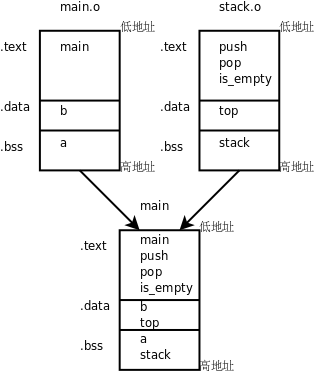
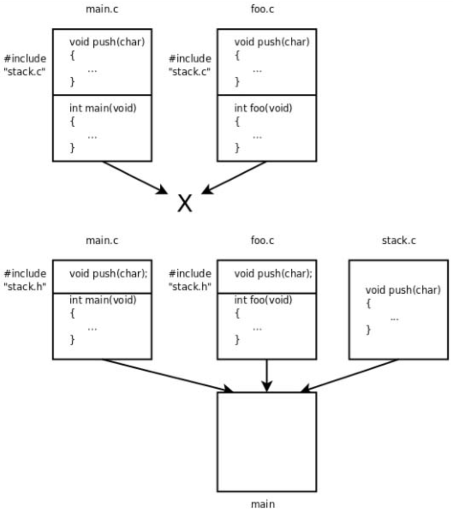
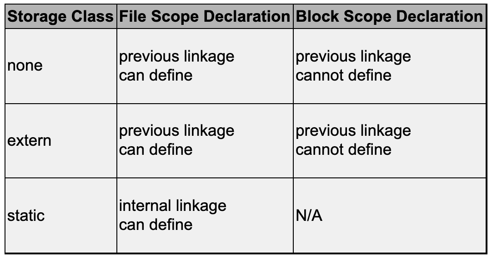
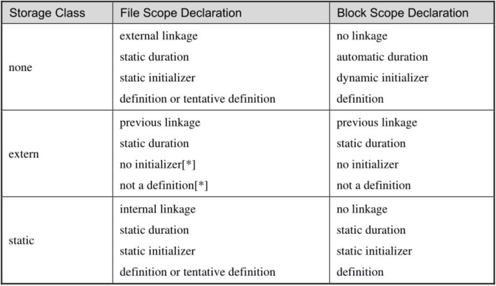
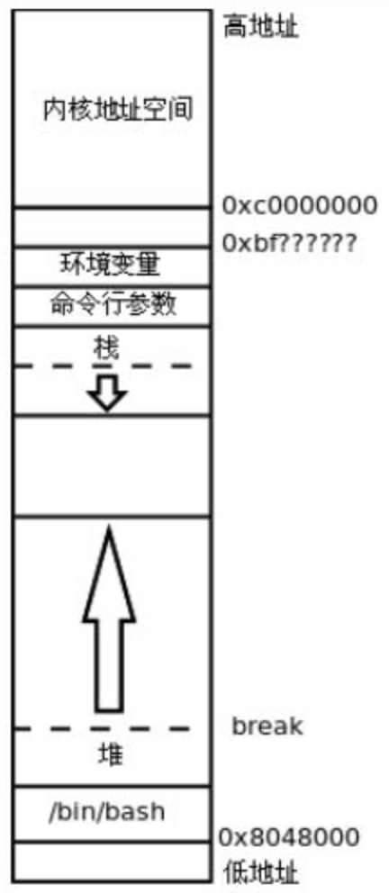
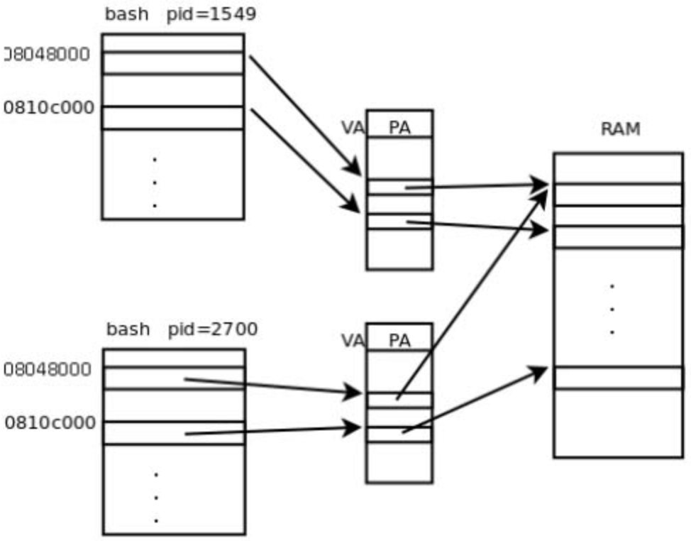
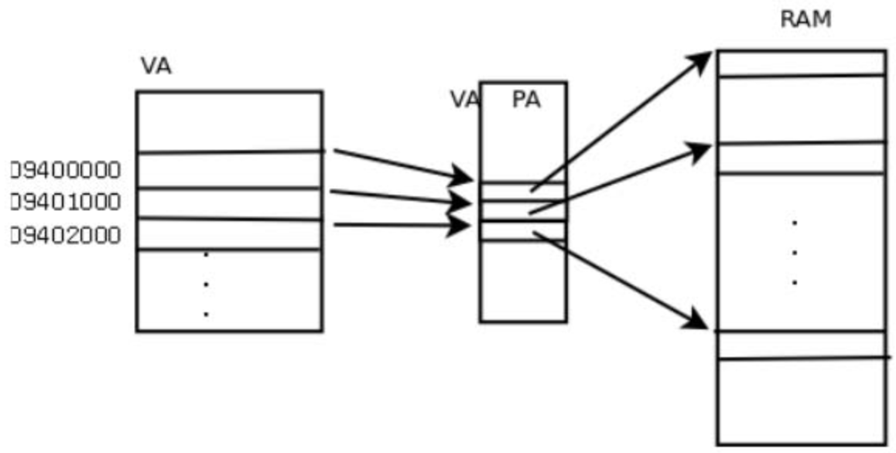
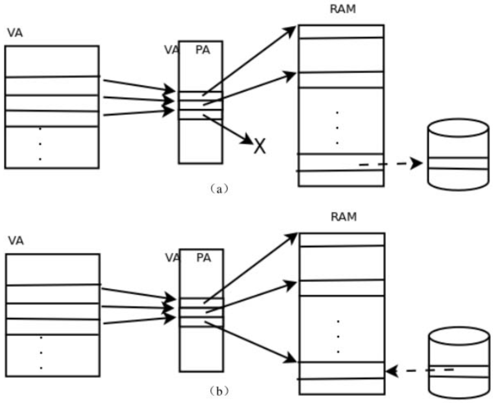

# 19. 链接详解

## 19.1 多目标文件的链接

### 两个 c 文件编译成一个可执行文件

现在我们把例12.1拆成两个.c文件，stack.c实现堆栈，而main.c使用堆栈：

``` c
/* stack.c */
char stack[512];
int top = -1;

void push(char c)
{
    stack[++top] = c;
}

char pop(void)
{
    return stack[top--];
}

int is_empty(void)
{
    return top == -1;
}
```

这段程序和原来有点不同，在例12.1中top总是指向栈顶元素的下一个元素，而在这段程序中top总是指向栈顶元素，所以要初始化成-1才表示空堆栈，这两种堆栈使用习惯都很常见。

``` c
/* main.c */
#include <stdio.h>

int a, b = 1;

int main(void)
{
    push('a');
    push('b');
    push('c');

    while(!is_empty())
        putchar(pop());
    putchar('\n');

    return 0;
}
```

a和b这两个变量没有用，只是为了顺便说明链接过程才加上的。编译的步骤和以前一样，可以一步编译：

``` console
gcc main.c stack.c -o main
```

也可以分多步编译：

``` console
gcc -c main.c
gcc -c stack.c
gcc main.o stack.o -o main
```

如果用nm命令查看目标文件的符号表，会发现main.o中有未定义的符号push、pop、is_empty、putchar，前三个符号在stack.o中定义了，在链接时做符号解析，而putchar是libc的库函数，在可执行文件main中仍然是未定义的，要在程序运行时做动态链接。

### 多目标文件的链接

通过readelf -a main命令可以看到：main的.bss段合并了main.o和stack.o的.bss段，其中包含了变量a和stack；main的.data段合并了main.o和stack.o的.data段，其中包含了变量b和top；main的.text段合并了main.o和stack.o的.text段，包含了各函数的指令，如图19.1所示。



为什么在可执行文件main的每个段中来自main.o的变量或函数都在前面，而来自stack.o的变量或函数都在后面呢？我们可以试试把gcc命令中的两个目标文件反过来写：

``` console
gcc stack.o main.o -o main
```

结果正如我们所预料，可执行文件main的每个段中来自main.o的变量或函数都排到后面了。

### 链接脚本

实际上链接过程是由一个链接脚本（Linker Script）控制的，链接脚本决定了给每个段分配什么地址，如何对齐，哪个段在前，哪个段在后，哪些段合并到同一个Segment。

另外链接脚本还要把一些特殊地址定义成符号，例如__bss_start代表.bss段的起始地址，_end代表.bss段的结束地址，这些符号会出现在可执行文件的符号表中，加载器可以由这些符号得知.bss段的地址范围，以便把它清零。

如果用ld做链接时没有通过-T选项指定链接脚本，则使用ld的默认链接脚本，默认链接脚本可以用ld --verbose命令查看（由于比较长，只列出一些片断）：

``` console
$ ld --verbose
...
using internal linker script:
==================================================
/* Script for -z combreloc: combine and sort reloc sections */
OUTPUT_FORMAT("elf32-i386", "elf32-i386",
              "elf32-i386")
OUTPUT_ARCH(i386)
ENTRY(_start)
SEARCH_DIR("/usr/i486-linux-gnu/lib32"); SEARCH_DIR("/usr/local/lib32"); SEARCH_DIR("/lib32"); SEARCH_DIR("/usr/lib32"); SEARCH_DIR("/usr/i486-linux-gnu/lib"); SEARCH_DIR("/usr/local/lib"); SEARCH_DIR("/lib"); SEARCH_DIR("/usr/lib");
SECTIONS
{
  /* Read-only sections, merged into text segment: */
  PROVIDE (__executable_start = SEGMENT_START("text-segment", 0x08048000)); . = SEGMENT_START("text-segment", 0x08048000) + SIZEOF_HEADERS;
  .interp         : { *(.interp) }
  .note.gnu.build-id : { *(.note.gnu.build-id) }
  .hash           : { *(.hash) }
  .gnu.hash       : { *(.gnu.hash) }
  .dynsym         : { *(.dynsym) }
  .dynstr         : { *(.dynstr) }
  .gnu.version    : { *(.gnu.version) }
  .gnu.version_d  : { *(.gnu.version_d) }
  .gnu.version_r  : { *(.gnu.version_r) }
  .rel.dyn        :
...
  .rel.plt        :
...
  .init           :
...
  .plt            : { *(.plt) *(.iplt) }
  .text           :
...
  .fini           :
...
  .rodata         : { *(.rodata .rodata.* .gnu.linkonce.r.*) }
...
  .eh_frame       : ONLY_IF_RO { KEEP (*(.eh_frame)) }
...
  /* Adjust the address for the data segment.  We want to adjust up to
     the same address within the page on the next page up.  */
  . = ALIGN (CONSTANT (MAXPAGESIZE)) - ((CONSTANT (MAXPAGESIZE) - .) & (CONSTANT (MAXPAGESIZE) - 1)); . = DATA_SEGMENT_ALIGN (CONSTANT (MAXPAGESIZE), CONSTANT (COMMONPAGESIZE));
...
  .ctors          :
...
  .dtors          :
...
  .jcr            : { KEEP (*(.jcr)) }
...
  .dynamic        : { *(.dynamic) }
  .got            : { *(.got) *(.igot) }
...
  .got.plt        : { *(.got.plt) *(.igot.plt) }
  .data           :
...
  _edata = .; PROVIDE (edata = .);
  __bss_start = .;
  .bss            :
...
  _end = .; PROVIDE (end = .);
  . = DATA_SEGMENT_END (.);
  /* Stabs debugging sections.  */
...
  /* DWARF debug sections.
     Symbols in the DWARF debugging sections are relative to the beginning
     of the section so we begin them at 0.  */
...
}


==================================================
```

ENTRY(_start)指明整个程序的入口点是_start，这并不是规定死的，修改链接脚本就可以改用其他符号做入口点。

``` console
  /* Read-only sections, merged into text segment: */
  PROVIDE (__executable_start = SEGMENT_START("text-segment", 0x08048000)); . = SEGMENT_START("text-segment", 0x08048000) + SIZEOF_HEADERS;
  .interp         : { *(.interp) }
  .note.gnu.build-id : { *(.note.gnu.build-id) }
...
```

PROVIDE (__executable_start = SEGMENT_START("text-segment", 0x08048000));语句导出一个GLOBAL的符号__executable_start，它的值是Text Segment的起始地址（默认值是0x8048000）。

再看. = SEGMENT_START("text-segment", 0x08048000) + SIZEOF_HEADERS;这一句。“.”表示当前链接地址，即程序加载运行时的虚拟地址，链接器每组装一个段就把当前链接地址自动加上这个段的长度，因此各段在加载时一般是紧挨着的，中间没有空隙，只有一种情况例外：如果在链接脚本中给“.”赋值，那么链接器组装下一个段就从赋值的新地址开始，而不是和前一个段紧挨着了。所以这条语句表示把当前链接地址改成Text Segment的起始地址加上SIZEOF_HEADERS偏移量，后面的段从这里开始组装，后面的段依次是.interp段、.note.gnu.build-id段等（其中包括我们熟悉的.plt段、.text段和.rodata段），这些段都被组装到Text Segment中。

每个段的描述格式都是“段名 : { 组成 }”，例如`.plt : { *(.plt) *(.iplt) }`，左边表示链接生成的文件的.plt段，右边表示所有目标文件的.plt段和.iplt段，意思是链接生成的文件的.plt段由各目标文件的.plt段和.iplt段组成。

组装完Text Segment之后又给当前链接地址赋了新值，从新的虚拟地址开始组装Data Segment：

``` console
  /* Adjust the address for the data segment.  We want to adjust up to
     the same address within the page on the next page up.  */
  . = ALIGN (CONSTANT (MAXPAGESIZE)) - ((CONSTANT (MAXPAGESIZE) - .) & (CONSTANT (MAXPAGESIZE) - 1)); . = DATA_SEGMENT_ALIGN (CONSTANT (MAXPAGESIZE), CONSTANT (COMMONPAGESIZE));
...
```

计算Data Segment的起始地址要做一系列对齐操作，可以结合图17.2来理解，Data Segment从Text Segment的下一个页面开始，并且不是从该页面的起始地址开始，而是有一个偏移量。上面这两个表达式的详细计算过程我们就不深入讨论了。计算出当前地址之后，从该地址开始组装链接脚本后面列出的几个段，例如.data段、.bss段等。

组装完Data Segment之后又给当前链接地址赋了新值，从新的虚拟地址开始组装调试信息等其他Segment：

``` console
  . = DATA_SEGMENT_END (.);
  /* Stabs debugging sections.  */
...
  /* DWARF debug sections.
     Symbols in the DWARF debugging sections are relative to the beginning
     of the section so we begin them at 0.  */
...
```

关于链接脚本就介绍这么多，本书不做深入讨论，读者可以查阅参考文献[26]。

### gdb 调试多个 c 文件

从现在开始我们写的很多程序都是由多个.c文件编译链接在一起的，在gdb调试时如何指定某个.c文件中的某一行代码呢？现在我们调试这个程序，在push函数和pop函数里设断点，注意gdb命令的写法。

``` console
$ gcc stack.c main.c -g -o main
$ gdb main
GNU gdb (GDB) 7.1-ubuntu
Copyright (C) 2010 Free Software Foundation, Inc.
License GPLv3+: GNU GPL version 3 or later <http://gnu.org/licenses/gpl.html>
This is free software: you are free to change and redistribute it.
There is NO WARRANTY, to the extent permitted by law.  Type "show copying"
and "show warranty" for details.
This GDB was configured as "i486-linux-gnu".
For bug reporting instructions, please see:
<http://www.gnu.org/software/gdb/bugs/>...
Reading symbols from /home/juhan/main...done.
(gdb) l
1   /* main.c */
2   #include <stdio.h>
3
4   int a, b = 1;
5
6   int main(void)
7   {
8       push('a');
9       push('b');
10      push('c');
(gdb) l stack.c:1
1   /* stack.c */
2   char stack[512];
3   int top = -1;
4
5   void push(char c)
6   {
7       stack[++top] = c;
8   }
9
10   char pop(void)
(gdb) b push
Breakpoint 1 at 0x8048448: file stack.c, line 7.
(gdb) b stack.c:10
Breakpoint 2 at 0x8048469: file stack.c, line 10.
(gdb) r
Starting program: /home/juhan/main

Breakpoint 1, push (c=97 'a') at stack.c:7
7       stack[++top] = c;
(gdb) c
Continuing.

Breakpoint 1, push (c=98 'b') at stack.c:7
7       stack[++top] = c;
(gdb) c
Continuing.

Breakpoint 1, push (c=99 'c') at stack.c:7
7       stack[++top] = c;
(gdb) c
Continuing.

Breakpoint 2, pop () at stack.c:12
12       return stack[top--];
```

在gdb命令中指定某个.c文件中的某一行或某个函数，可以用“文件名:行号”或“文件名:函数名”的语法。

## 19.2 定义和声明

### extern 和 static 关键字

- main.c 中没有 push、pop、is_empty 函数原型

  在上一节我们把两个.c文件放在一起编译链接，main.c用到的函数push、pop和is_empty由stack.c提供，其实有一点小问题，我们用-Wall选项编译main.c可以看到：

  ``` console
  $ gcc -c main.c -Wall
  main.c: In function ‘main’:
  main.c:8: warning: implicit declaration of function ‘push’
  main.c:12: warning: implicit declaration of function ‘is_empty’
  main.c:13: warning: implicit declaration of function ‘pop’
  ```

- 找不到函数原型，编译器只能做隐式声明

  这个问题我们在第3.2节讨论过，编译器在处理main.c中的函数调用时找不到函数原型，也就不知道函数的参数和返回值类型，而只能根据函数调用的实参类型做隐式声明，并假定返回值是int型。编译器把这三个函数隐式声明为：

  ``` c
  int push(char);
  int pop(void);
  int is_empty(void);
  ```

- 为什么编译器需要函数原型

  结合上一章讲过的知识想想，为什么编译器在处理函数调用时需要知道函数原型？因为必须知道参数的类型和个数以及返回值类型才知道应该生成什么样的指令。

- 为什么隐式声明靠不住

  为什么隐式声明靠不住呢？

  因为隐式声明是根据函数调用代码推测的，第一，函数的形参类型可能跟函数调用的实参类型不一致，第二，如果函数定义带有可变参数（例如printf），从函数调用代码也看不出来它带可变参数，第三，从函数调用代码看不出来返回值应该是什么类型，隐式声明只能假定返回值都是int型。

- 编译器自己找不到函数原型，需要我们提供

  既然隐式声明靠不住，那编译器为什么不自己去找函数定义，非要我们在调用之前提供函数原型呢？

  因为编译器不知道去哪里找函数定义，像上面的例子，我让编译器编译main.c，而这几个函数的定义却在stack.c里，编译器怎么会知道呢？

- 编译器做的隐式声明往往是错的，但也能用

  所以编译器只能通过隐式声明来推测函数原型，这种推测往往是错的，但在比较简单的情况下还算可用，比如上一节的例子这么编译过去了也能得到正确结果。

- 用 extern 声明函数的原型，函数名有 external linkage

  现在我们在main.c中声明这几个函数的原型：

  ``` c
  /* main.c */
  #include <stdio.h>

  extern void push(char);
  extern char pop(void);
  extern int is_empty(void);

  int main(void)
  {
      push('a');
      push('b');
      push('c');

      while(!is_empty())
          putchar(pop());
      putchar('\n');

      return 0;
  }
  ```

  这样编译器就不会报警告了。

  用extern关键字修饰的函数名具有External Linkage。External Linkage的定义在上一章讲过，现在应该更容易理解了，push这个标识符具有External Linkage指的是：push在main.c和stack.c中都有声明（stack.c中的声明同时也是定义），如果把main.c和stack.c链接在一起，那么这些声明指的是同一个函数，在链接时各目标文件中的全局符号push代表同一个地址。

- extern 也可以不写

  函数声明中的extern关键字也可以省略不写。

- 用 static 声明函数，函数名具有 internal linkage

  用static关键字修饰的函数名具有Internal Linkage。例如有以下两个.c文件：

  ``` c
  /* foo.c */
  static void foo(void) {}
  /* main.c */
  void foo(void);
  int main(void) { foo(); return 0; }
  ```

  编译链接在一起会出错：

  ``` console
  $ gcc foo.c main.c
  /tmp/ccRC2Yjn.o: In function `main':
  main.c:(.text+0x12): undefined reference to `foo'
  collect2: ld returned 1 exit status
  ```

  虽然foo.c中定义了函数foo，但这个函数名只有Internal Linkage，只有在foo.c中引用这个函数名才表示同一个函数，而在main.c中声明的那个foo应该表示另一个具有External Linkage的函数名。

  如果把foo.c编译成目标文件，函数名foo在其中是一个局部符号，在链接时不参与符号解析。

  所以，在main.c中引用了一个具有External Linkage的函数名foo，但链接器却找不到它的定义在哪儿，无法确定它的地址，只好报错。

  - 凡是被多次声明的变量或函数，必须有且只有一个声明是定义

    凡是被多次声明的变量或函数，必须有且只有一个声明是定义，如果有多个定义，或者一个定义都没有，链接器就无法完成链接。

- 用 static 和 extern 修饰变量声明

  以上讲了用static和extern修饰函数声明的情况，现在来看用它们修饰变量声明的情况。

  仍然用stack.c和main.c的例子，如果我想在main.c中直接访问stack.c中定义的变量top，可以用extern声明它：

  ``` c
  /* main.c */
  #include <stdio.h>

  void push(char);
  char pop(void);
  int is_empty(void);
  extern int top;

  int main(void)
  {
      push('a');
      push('b');
      push('c');
      printf("%d\n", top);

      while(!is_empty())
          putchar(pop());
      putchar('\n');
      printf("%d\n", top);

      return 0;
  }
  ```

  变量top具有External Linkage，extern int top;只是一个声明而不是定义，因为它不在main.c中分配存储空间，而是在stack.c中定义和分配存储空间，main.c只是引用这个变量名。

  以上函数和变量声明也可以写在main函数体里面，使所声明的标识符具有块作用域：

  ``` c
  int main(void)
  {
      void push(char);
      char pop(void);
      int is_empty(void);
      extern int top;

      push('a');
      push('b');
      push('c');
      printf("%d\n", top);

      while(!is_empty())
          putchar(pop());
      putchar('\n');
      printf("%d\n", top);

      return 0;
  }
  ```

  - 函数声明的 extern 可以省略，变量声明的 extern 省略意思就变了

    注意，变量声明和函数声明有一点不同，函数声明的extern关键字可以省略，而变量声明如果不写extern意思就完全变了，如果上面的例子不写extern就表示在main函数中定义一个局部变量top。

  - 变量定义可以初始化，变量声明不可以

    另外要注意，变量定义可以初始化而声明不可以，stack.c中的定义可以写成int top = -1;，而main.c中的声明却不能写成extern int top = -1;，否则编译器会报错。

  - 用 static 声明变量阻止外界访问

    在main.c中可以通过extern声明来访问stack.c中的变量top，但是从实现stack.c这个模块的角度来看，top这个变量是不希望被外界访问到的，变量top和stack都属于这个模块的内部状态，外界应该只允许通过push、pop函数来改变模块的内部状态，这样才能保证堆栈的LIFO访问特性，如果外界可以随机访问stack或者随便修改top，那么堆栈的状态就乱了。

    怎么才能阻止外界访问top和stack呢？答案就是用static关键字把它们声明为Internal Linkage的：

    ``` c
    /* stack.c */
    static char stack[512];
    static int top = -1;
    void push(char c)
    {
        stack[++top] = c;
    }

    char pop(void)
    {
        return stack[top--];
    }

    int is_empty(void)
    {
        return top == -1;
    }
    ```

    这样，即使在main.c中用extern声明也访问不到stack.c的变量top和stack，从而保护了stack.c模块的内部状态，这也是一种封装。

- 给外界使用的函数声明为 external linkage，不给外界访问的函数声明为 internal linkage

  用static关键字声明具有Internal Linkage的函数也是出于这个目的。

  在一个模块中，有些函数是提供给外界使用的，或者说导出（Export）给外界使用，这些函数声明为External Linkage的。

  有些函数只在模块内部使用而不希望被外界访问到，则声明为Internal Linkage的。

### 头文件

我们继续前面关于stack.c和main.c的讨论。

- 使用 stack.c 中三个函数的 c 文件每次都要写这三个函数的声明，麻烦

  stack.c这个模块封装了top和stack两个变量，导出了push、pop、is_empty三个函数接口，已经设计得比较完善了。

  但是使用这个模块的每个.c文件都要写三个函数声明也是很麻烦的，假设又有一个foo.c也使用这个模块，main.c和foo.c中各自要写三个函数声明。

- 避免重复声明：头文件

  重复的代码总是应该尽量避免的，比如在第8.2节讲过用宏定义避免硬编码。

  要避免写重复的声明也有办法，可以自己写一个头文件stack.h：

  ``` c
  /* stack.h */
  #ifndef STACK_H
  #define STACK_H
  extern void push(char);
  extern char pop(void);
  extern int is_empty(void);
  #endif
  ```

  main.c和foo.c都可以包含这个头文件，就相当于声明了这三个函数。

  比如main.c可以改成这样：

  ``` c
  /* main.c */
  #include <stdio.h>
  #include "stack.h"

  int main(void)
  {
      push('a');
      push('b');
      push('c');

      while(!is_empty())
          putchar(pop());
      putchar('\n');

      return 0;
  }
  ```

- 两种 include 形式

  首先说为什么#include <stdio.h>用角括号，而#include "stack.h"用引号。

  对于用角括号包含的头文件，gcc首先查找-I选项指定的目录，然后查找系统的头文件目录（在我的系统上是按/usr/local/include、/usr/lib/gcc/i486-linux-gnu/4.4.3/include、/usr/i486-linux-gnu/include、/usr/include的顺序依次查找）；

  而对于用引号包含的头文件，gcc首先查找正在被处理的#include指示所在的当前文件所在的目录，然后查找-I选项指定的目录，然后查找系统的头文件目录。

  假如三个代码文件都放在当前目录下：

  ``` console
  $ tree
  .
  |-- main.c
  |-- stack.c
  `-- stack.h

  0 directories, 3 files
  ```

  则可以用gcc -c main.c编译，gcc会自动在main.c所在的目录中找到stack.h。

  假如把stack.h移到一个子目录下：

  ``` console
  $ tree
  .
  |-- main.c
  `-- stack
      |-- stack.c
      `-- stack.h

  1 directory, 3 files
  ```

  则需要用gcc -c main.c -Istack编译，用-I选项告诉gcc头文件要到子目录stack里找。

  在#include预处理指示中可以使用相对路径，例如把上面的代码改成#include"stack/stack.h"，那么编译时就不需要加-Istack选项了，因为是main.c要包含头文件，gcc会自动在main.c所在的目录中查找，而头文件相对于main.c所在目录的相对路径正是stack/stack.h。

  注意，-I选项可以指定相对路径也可以指定绝对路径，如果指定相对路径，它是相对于gcc进程的当前工作目录的路径，而不是相对于正在被处理的#include指示所在的当前文件的路径。

  在这里先解释一下当前工作目录（Current Working Directory）的概念。每个进程都有自己的当前工作目录，Shell进程的当前工作目录可以用pwd命令查看：

  ``` console
  $pwd
  /home/akaedu
  ```

  通常Linux发行版缺省配置的Shell提示符会显示当前工作目录，例如~$表示当前工作目录是主目录，/etc$表示当前工作目录是/etc目录。用cd命令可以改变Shell进程的当前工作目录。

  如果在Shell下敲命令启动新进程（比如gcc），则新进程会继承Shell的当前工作目录，新进程也可以调用chdir(2)改变自己的当前工作目录。

  下面再举个例子来加深理解。比如有以下目录结构：

  ``` console
  $ tree
  .
  `-- foo
      |-- bar.h
      `-- foo.h

  1 directory, 2 files
  ```

  在foo.h中有一行代码#include "bar.h"，用gcc -E命令可以查看预处理的结果：

  ``` console
  $ gcc -E foo/foo.h
  # 1 "foo/foo.h"
  # 1 "<built-in>"
  # 1 "<command-line>"
  # 1 "foo/foo.h"
  # 1 "foo/bar.h" 1
  content of bar.h
  # 1 "foo/foo.h" 2
  ```

  如果在foo.h中有一行代码#incldue <bar.h>，则用gcc -E命令做预处理会出错，因为gcc不会查找foo.h所在的目录：

  ``` console
  $ gcc -E foo/foo.h
  # 1 "foo/foo.h"
  # 1 "<built-in>"
  # 1 "<command-line>"
  # 1 "foo/foo.h"
  foo/foo.h:1:17: error: bar.h: No such file or directory
  ```

  指定了-I.选项也不管用，因为gcc的当前工作目录是bar.h的上一层目录：

  ``` console
  $ gcc -E -I. foo/foo.h
  # 1 "foo/foo.h"
  # 1 "<built-in>"
  # 1 "<command-line>"
  # 1 "foo/foo.h"
  foo/foo.h:1:17: error: bar.h: No such file or directory
  ```

  如果先cd到foo子目录中再指定-I.选项就管用了，这时gcc的当前工作目录正是bar.h所在的目录：

  ``` console
  $ cd foo/
  $ gcc -E foo.h
  # 1 "foo.h"
  # 1 "<built-in>"
  # 1 "<command-line>"
  # 1 "foo.h"
  foo.h:1:17: error: bar.h: No such file or directory
  $ gcc -E -I. foo.h
  # 1 "foo.h"
  # 1 "<built-in>"
  # 1 "<command-line>"
  # 1 "foo.h"
  # 1 "./bar.h" 1
  content of bar.h
  # 1 "foo.h" 2
  ```

- #ifndef 和 #endif

  回到正题。在stack.h中我们又看到两个新的预处理指示#ifndef STACK_H和#endif，意思是说，如果STACK_H这个宏没有定义过，那么从#ifndef到#endif之间的代码就包含在预处理的输出结果中，否则这一段代码就不出现在预处理的输出结果中。

  stack.h这个头文件的内容全部被#ifndef和#endif括起来了，如果在包含这个头文件时STACK_H这个宏已经定义过了，则相当于这个头文件里什么都没有，包含了一个空文件。

  - 用处：防止重复包含

    这有什么用呢？假如main.c包含了两次stack.h：

    ``` c
    ...
    #include "stack.h"
    #include "stack.h"

    int main(void)
    {
    ...
    ```

    则第一次包含stack.h时并没有定义STACK_H这个宏，因此头文件的内容包含在预处理的输出结果中：

    ``` c
    ...
    #define STACK_H
    extern void push(char);
    extern char pop(void);
    extern int is_empty(void);
    #include "stack.h"

    int main(void)
    {
    ...
    ```

    其中已经定义了STACK_H这个宏，第二次再包含stack.h就相当于包含了一个空文件，这就避免了头文件的内容被重复包含。

  - Header Guard

    这种保护头文件的写法称为Header Guard，以后我们写的每个头文件都要加上Header Guard，宏定义名就用头文件名的大写形式，这是规范的做法。

  - 为什么要防止重复包含

    为什么需要防止重复包含呢？谁会把一个头文件包含两次呢？

    像上面这样明显的错误没人会犯，但有时候重复包含的错误并不是那么明显的。比如：

    ``` c
    #include "stack.h"
    #include "foo.h"
    ```

    foo.h里又包含了bar.h，bar.h里又包含了stack.h。

    在规模较大的项目中头文件包含头文件的情况很常见，经常会包含四五层，这时候重复包含的问题就很难发现了。比如在我的系统头文件目录/usr/include中，errno.h包含了bits/errno.h，后者又包含了linux/errno.h，后者又包含了asm/errno.h，后者又包含了asm-generic/errno.h。

  - 重复包含的危害

    另外一个问题是，就算我重复包含了头文件，那有什么危害么？像上面的三个函数声明，在一个编译单元中多出现几次也没有错。

    重复包含头文件主要有以下问题：

    1．预处理和编译的速度变慢了，要处理很多本来不需要处理的代码。

    2．如果不小心出现foo.h包含bar.h、bar.h又包含foo.h的情况，就陷入死循环了。其实一般编译器都会规定一个包含层数的上限，超过这个上限就报错。

    3．头文件里有些代码不允许重复出现，虽然变量和函数允许多次声明（只要不是多次定义就行），但头文件里有些代码是不允许多次出现的，比如用typedef定义一个类型名，在一个编译单元中只允许定义一次。

- 包含 c 文件不好

  还有一个问题，既然要#include头文件，那我不如直接在main.c中#include "stack.c"得了。这样把stack.c和main.c合并成一个编译单元，相当于又回到最初例12.1的代码了，用gcc main.c -o main也能编译通过。这样不是更简单吗？连头文件都不用写了。

  假如又有一个foo.c也要用stack.c这个模块怎么办呢？如果在foo.c里面也#include"stack.c"，就相当于push、pop、is_empty这三个函数在main.c和foo.c的编译单元中都有定义，那么main.c和foo.c就不能链接在一起了。

  如果采用包含头文件的办法，这三个函数只在stack.c中定义一次，在main.c和foo.c中只是声明，就可以把main.c、stack.c、foo.c三个编译单元链接在一起，如图19.2所示。

  

- c 文件和头文件应该遵守的原则

  一般来说，应遵循以下原则：

  1．.c文件中可以有变量或函数定义，而.h文件中应该只有变量或函数声明而没有定义。

  2．不要把一个.c文件包含到另一个.c文件中。

  “二般”来说，也有些特别的Convention不遵循这两条原则：有些程序员喜欢在.h文件中定义static inline函数，也有些情况下确实会在一个.c文件中include另一个.c文件（例如在单元测试代码中include被测代码），在此不深入探讨这些问题。

### 定义和声明的详细规则

以上两节关于变量、函数的定义和声明只介绍了最基本的规则，在写代码时掌握这些基本规则就够用了，但其实C语言关于定义和声明还有很多复杂的规则，在维护别人的代码时还是有必要了解这些规则的。首先看关于函数声明的规则，表19.1和表19.2出自参考文献[4]，我做了一些修改。

- 函数声明的规则

  

  前面我说“extern关键字表示这个标识符具有External Linkage”其实是不准确的，准确地说应该是Previous Linkage。

  Previous Linkage的定义是：当前声明的这个标识符具有什么样的Linkage取决于该编译单元中前面对这个标识符的声明（而且必须是文件作用域的声明），如果在前面找不到这个标识符的声明，即当前声明是该编译单元中对这个标识符的第一次声明，那么这个标识符具有External Linkage。

  例如在一个编译单元中在文件作用域两次声明同一个函数：

  ``` c
  static int f(void); /* internal linkage */
  extern int f(void); /* previous linkage */
  ```

  则这里的extern修饰的标识符f具有Interanl Linkage而不是External Linkage。

  从表19.1的前两行可以总结出我们先前所说的规则——函数声明中的extern关键字可以省略不写。

  表19.1也说明了在文件作用域允许定义函数，而在块作用域不允许定义函数，或者说函数定义不能嵌套。

  另外，在块作用域中不允许用static关键字声明函数。

- 变量声明的规则

  关于变量声明的规则要复杂一些，如表19.2所示。

  

  表19.2的每个单元格里分成四行，分别描述变量的链接属性、变量的生存期、这种变量如何初始化，以及这种声明是否算变量定义。

  链接属性有External Linkage、Internal Linkage、No Linkage和Previous Linkage四种情况。

  生存期有Static Duration和Automatic Duration两种情况。

  初始化有Static Initializer和Dynamic Initializer两种情况，前者表示Initializer中只能使用常量表达式，表达式的值必须在编译时确定，后者表示Initializer中可以使用任意右值表达式，表达式的值可以在运行时计算。

  是否算变量定义有三种情况，Definition、Not a Definition和Tentative Definition。

  前面我说“有extern的变量声明不是定义，没有extern的才是定义，变量定义可以初始化而声明不可以”，其实也不准确。C标准是这么规定的：有初始化的变量声明是定义；没有初始化的变量声明如果加了extern修饰则属于Previous Linkage，这种声明不是定义；如果没加extern修饰也没有初始化则属于Tentative Definition。

  什么叫Tentative Definition呢？如果一个变量声明具有文件作用域，没有初始化，没有用Storage Class关键字修饰，或者用static关键字修饰，那么编译器认为这个变量是在该编译单元中定义的，但初始值待定，然后继续编译下面的代码，到整个编译单元编译结束时如果没有遇到这个变量的带初始化的定义，就用0来初始化它。

  在参考文献[8]的6.9.2节有一个例子：

  ``` c
  int i1 = 1; // definition, external linkage
  static int i2 = 2; // definition, internal linkage
  extern int i3 = 3; // definition, external linkage
  int i4; // tentative definition, external linkage
  static int i5; // tentative definition, internal linkage
  int i1; // valid tentative definition, refers to previous
  int i2; // 6.2.2 renders undefined, linkage disagreement
  int i3; // valid tentative definition, refers to previous
  int i4; // valid tentative definition, refers to previous
  int i5; // 6.2.2 renders undefined, linkage disagreement
  extern int i1; // refers to previous, whose linkage is external
  extern int i2; // refers to previous, whose linkage is internal
  extern int i3; // refers to previous, whose linkage is external
  extern int i4; // refers to previous, whose linkage is external
  extern int i5; // refers to previous, whose linkage is internal
  ```

  变量i2和i5第一次声明为Internal Linkage，第二次又声明为External Linkage，这是不允许的，编译器会报错。

  - gcc 和 C99 一些不同

    注意表19.2中标有[*]的单元格，对于文件作用域的extern变量声明，C99是允许带Initializer的，并且认为它是一个定义，但是gcc对于这种写法会报警告，为了兼容性应避免这种写法。

    gcc对于Tentative Definition的处理也和C99的规定不一致。比如在foo.c中用int i;定义一个变量i，是Tentative Definition，C99规定这个变量应该在foo.c中定义，初始值是0，而gcc编译的结果是：

    ``` console
    $ gcc -c foo.c
    $ nm foo.o
    00000004 C i
    ```

    符号i的类型是Common，nm(1)中说Common符号的定义在链接时确定。如果bar.c中定义int i = 1;，则foo.c和bar.c链接在一起时foo.c的那个只能算声明而不算定义。如果bar.c中也定义int i;，也是一个Tentative Definition，则foo.c和bar.c链接在一起时才定义变量i，并且用0初始化。也就是说，C99对Tentative Definition的处理是在编译一个单元时做，而gcc是推迟到链接时才做。如果编译时加上-fno-common选项则不会生成Common符号，gcc对Tentative Definition的处理就和C99一致了。

## 19.3 静态库

## 19.4 共享库

## 19.5 虚拟内存管理

### cat /proc/进程号/maps

我们知道操作系统利用体系结构提供的VA到PA的转换机制实现虚拟内存管理机制，在第16.4节只是简单一提，现在有了共享库的基础知识，可以再深入讨论一下。

首先分析一个例子：

``` console
$ ps
  PID TTY          TIME CMD
26033 pts/2    00:00:00 bash
31021 pts/2    00:00:00 ps
$ cat /proc/26033/maps
00110000-00263000 r-xp 00000000 08:01 135494     /lib/tls/i686/cmov/libc-2.11.1.so
00263000-00264000 ---p 00153000 08:01 135494     /lib/tls/i686/cmov/libc-2.11.1.so
00264000-00266000 r--p 00153000 08:01 135494     /lib/tls/i686/cmov/libc-2.11.1.so
00266000-00267000 rw-p 00155000 08:01 135494     /lib/tls/i686/cmov/libc-2.11.1.so
00267000-0026a000 rw-p 00000000 00:00 0
0027c000-00284000 r-xp 00000000 08:01 135515     /lib/tls/i686/cmov/libnss_nis-2.11.1.so
00284000-00285000 r--p 00007000 08:01 135515     /lib/tls/i686/cmov/libnss_nis-2.11.1.so
00285000-00286000 rw-p 00008000 08:01 135515     /lib/tls/i686/cmov/libnss_nis-2.11.1.so
00376000-00380000 r-xp 00000000 08:01 135511     /lib/tls/i686/cmov/libnss_files-2.11.1.so
00380000-00381000 r--p 00009000 08:01 135511     /lib/tls/i686/cmov/libnss_files-2.11.1.so
00381000-00382000 rw-p 0000a000 08:01 135511     /lib/tls/i686/cmov/libnss_files-2.11.1.so
004c3000-004d6000 r-xp 00000000 08:01 135505     /lib/tls/i686/cmov/libnsl-2.11.1.so
004d6000-004d7000 r--p 00012000 08:01 135505     /lib/tls/i686/cmov/libnsl-2.11.1.so
004d7000-004d8000 rw-p 00013000 08:01 135505     /lib/tls/i686/cmov/libnsl-2.11.1.so
004d8000-004da000 rw-p 00000000 00:00 0
005b5000-005d0000 r-xp 00000000 08:01 131098     /lib/ld-2.11.1.so
005d0000-005d1000 r--p 0001a000 08:01 131098     /lib/ld-2.11.1.so
005d1000-005d2000 rw-p 0001b000 08:01 131098     /lib/ld-2.11.1.so
009a4000-009a5000 r-xp 00000000 00:00 0          [vdso]
00b65000-00b99000 r-xp 00000000 08:01 131175     /lib/libncurses.so.5.7
00b99000-00b9a000 ---p 00034000 08:01 131175     /lib/libncurses.so.5.7
00b9a000-00b9c000 r--p 00034000 08:01 131175     /lib/libncurses.so.5.7
00b9c000-00b9d000 rw-p 00036000 08:01 131175     /lib/libncurses.so.5.7
00c4e000-00c50000 r-xp 00000000 08:01 135500     /lib/tls/i686/cmov/libdl-2.11.1.so
00c50000-00c51000 r--p 00001000 08:01 135500     /lib/tls/i686/cmov/libdl-2.11.1.so
00c51000-00c52000 rw-p 00002000 08:01 135500     /lib/tls/i686/cmov/libdl-2.11.1.so
00cc4000-00cca000 r-xp 00000000 08:01 135507     /lib/tls/i686/cmov/libnss_compat-2.11.1.so
00cca000-00ccb000 r--p 00006000 08:01 135507     /lib/tls/i686/cmov/libnss_compat-2.11.1.so
00ccb000-00ccc000 rw-p 00007000 08:01 135507     /lib/tls/i686/cmov/libnss_compat-2.11.1.so
08048000-0810b000 r-xp 00000000 08:01 1048581    /bin/bash
0810b000-0810c000 r--p 000c2000 08:01 1048581    /bin/bash
0810c000-08111000 rw-p 000c3000 08:01 1048581    /bin/bash
08111000-08116000 rw-p 00000000 00:00 0
08905000-08a78000 rw-p 00000000 00:00 0          [heap]
b7705000-b7744000 r--p 00000000 08:01 2498202    /usr/lib/locale/en_US.utf8/LC_CTYPE
b7744000-b7745000 r--p 00000000 08:01 2498168    /usr/lib/locale/en_US.utf8/LC_NUMERIC
b7745000-b7746000 r--p 00000000 08:01 2500884    /usr/lib/locale/en_US.utf8/LC_TIME
b7746000-b7864000 r--p 00000000 08:01 2498045    /usr/lib/locale/en_US.utf8/LC_COLLATE
b7864000-b7865000 r--p 00000000 08:01 2500885    /usr/lib/locale/en_US.utf8/LC_MONETARY
b7865000-b7867000 rw-p 00000000 00:00 0
b7867000-b7868000 r--p 00000000 08:01 2500886    /usr/lib/locale/en_US.utf8/LC_MESSAGES/SYS_LC_MESSAGES
b7868000-b7869000 r--p 00000000 08:01 2498585    /usr/lib/locale/en_US.utf8/LC_PAPER
b7869000-b786a000 r--p 00000000 08:01 2498193    /usr/lib/locale/en_US.utf8/LC_NAME
b786a000-b786b000 r--p 00000000 08:01 2500887    /usr/lib/locale/en_US.utf8/LC_ADDRESS
b786b000-b786c000 r--p 00000000 08:01 2500888    /usr/lib/locale/en_US.utf8/LC_TELEPHONE
b786c000-b786d000 r--p 00000000 08:01 2498555    /usr/lib/locale/en_US.utf8/LC_MEASUREMENT
b786d000-b7874000 r--s 00000000 08:01 2496993    /usr/lib/gconv/gconv-modules.cache
b7874000-b7875000 r--p 00000000 08:01 2500889    /usr/lib/locale/en_US.utf8/LC_IDENTIFICATION
b7875000-b7877000 rw-p 00000000 00:00 0
bf9d4000-bf9e9000 rw-p 00000000 00:00 0          [stack]
```

- 每个进程在 /proc 下都有子目录，子目录中的文件保存着进程的相关信息

  用ps命令查看当前终端下的进程，得知bash进程的id是26033，然后用cat/proc/26033/maps命令查看它的虚拟地址空间。

  用pmap 26033命令也可以得到类似的输出结果。

  /proc目录下的文件并不是真正的磁盘文件，而是由内核虚拟出来的，当前运行的每个进程在/proc下都有一个子目录，目录名就是进程的id，查看子目录下的文件可以得到该进程的相关信息。

  - /proc/进程号/maps

    比如/proc/进程号/maps文件是进程地址空间的信息，当用户敲cat命令查看maps文件时，内核将该进程地址空间的信息按上面的格式打印输出，就好像这些信息保存在maps文件中一样如图19.4所示。

    

### 进程地址空间

- 用户空间、内核空间

  在第16.4节讲过，x86平台的虚拟地址空间是0x00000000～0xffffffff，大致上前3GB（0x00000000～0xbfffffff）是用户空间，后1GB（0xc0000000～0xffffffff）是内核空间，在这里得到了印证，我们看到的进程地址空间全部位于0xc0000000之下。

- /bin/bash

  /bin/bash程序分三个地址段加载到进程地址空间，每一段有不同的访问权限，0x08048000～0x0810b000的访问权限是r-x（只读可执行），0x0810b000～0x0810c000的访问权限是r--（只读），0x0810c000～0x08111000的访问权限是rw-（可读可写）。

- 动态链接器和共享库

  动态链接器和各共享库的加载与此类似，也是根据不同的访问权限分几段加载到进程地址空间的。

- 三个特殊地址段

  有三个特殊的地址段不是从磁盘文件加载的，而是直接从内存里分配：

  - 标有[vdso]的地址段0x00c57000～0x00c58000是linux-gate.so.1的映射空间，在第19.4.1节讲过这个共享库是由内核虚拟出来的。

  - 0x08262000～0x084ad000这一段称为堆（Heap），在第23.1.2节会讲到用malloc函数动态分配内存是在这里分配的。

    可以看到，堆空间的结束地址下面有很大的地址空洞（0x084ad000～b75d8000），动态分配内存时堆空间可以向高地址增长，并且有很大的增长余地。

    堆空间的结束地址（0x084ad000）称为Break，堆空间要向高地址增长就要抬高Break，映射新的虚拟内存页面到物理内存，这是通过系统调用brk实现的，malloc函数也是调用brk向内核请求分配内存的。

  - 0xbfbeb000～0xbfc00000是栈空间，其中高地址的部分保存着进程的环境变量和命令行参数（命令行参数详见第22.6节），低地址的部分是栈空间。

    栈空间从高地址向低地址增长，但显然没有堆空间那么大的可供增长的余地，因为实际的应用程序动态分配大量内存的并不少见，但是需要很大栈空间的非常少见。

    设想一个应用程序有几十层深的函数调用，并且每层调用都有非常多的局部变量，这十分罕见。

    总之，栈空间是可能用尽的，并且比堆空间更容易用尽，比如在第5.3节讲过无穷递归会用尽栈空间，最终导致段错误。

### 虚拟内存管理机制的作用

操作系统的虚拟内存管理机制起到了什么作用呢？可以从以下几个方面来理解。

- 第一，可以控制物理内存的访问权限

  物理内存本身是不限制访问的，任何地址都可以读写，而操作系统要求不同的页面具有不同的访问权限，这是利用CPU模式和MMU的内存保护机制实现的。

  例如，Text Segment被只读保护起来，防止执行了错误的指令意外改写Text Segment，内核地址空间也被保护起来，防止在用户模式下访问内核数据或执行内核代码。这样，错误的指令或恶意代码的破坏能力受到了限制，顶多使当前进程因段错误而终止，不会影响到整个系统的稳定性。

- 第二，使每个进程有独立的地址空间

  不同进程中相同的VA被MMU映射到不同的PA，因此在某一个进程中访问任何虚拟地址都不可能访问到属于另外一个进程的物理内存页面，并且每个进程都认为自己独占0x00000000～0xbfffffff的整个用户地址空间。

  独立地址空间的好处是：任何一个进程由于执行了错误指令或恶意代码而导致的非法内存访问都不会意外改写其他进程的数据，不会影响其他进程的运行；链接器和加载器的实现也比较容易，不必考虑各进程的地址范围是否冲突。

- 例子：一个可执行文件的两个进程

  继续前面的实验，再打开一个终端窗口，看一下这个新的bash进程的地址空间，可以发现和先前的bash进程地址空间的布局差不多。

  - /bin/bash 加载地址不变

    该进程也占据了0x00000000～0xbfffffff的地址空间，并且/bin/bash的加载地址和先前的进程一模一样，因为这些加载地址是在编译链接时写进/bin/bash程序的，两个进程都加载这个程序，地址当然应该相同。

  - 共享库加载地址变了

    但共享库的加载地址是在运行时由动态链接器决定的，可以看到两个进程的共享库加载地址大不相同。

  - 两个进程相同的虚拟地址范围被映射到不同的物理页面：每个进程有一套 VA 到 PA 的映射

    现在想一下，这两个进程在同一个系统中同时运行着，它们的可读可写地址段占据相同的虚拟地址范围（0x0810c000～0x08111000），显然Data Segment也位于这个地址范围之中，但是两个进程各自干各自的事情，显然Data Segment中的数据应该是不同的，相同的虚拟地址范围中怎么会有不同的数据呢？

    因为它们被映射到不同的物理页面，而每个进程都有自己的一套VA到PA的映射表，在一个进程中通过VA只能访问到属于自己的物理页面，而不会访问到其他进程的物理页面，如图19.5所示。

    

  - 两个进程相同的虚拟地址范围共享相同的物理页面

    从图19.5还可以看到，操作系统可以安排两个进程的Text Segment（位于地址范围0x08048000～0x0810b000之间）共享相同的物理页面，因为这两个进程的Text Segment都是从/bin/bash程序加载而来的，而且是只读的不会被改写，所以它们始终都应该是相同的，共享相同的物理页面也不会有问题。

  - 两个进程不同的虚拟地址范围共享相同的物理页面：共享库

    另外，虽然两个进程的共享库加载地址并不相同，但共享库中的只读部分也可以像/bin/bash的Text Segment一样加载到物理页面中被多个进程共享，只要每个进程中不同的VA映射到相同的PA就可以实现共享。

    使用共享库可以节省物理内存，比如libc，系统中几乎所有的进程都要加载libc到自己的进程地址空间，而libc的只读部分在物理内存中只需要保存一份就可以被所有进程共享访问，这就是“共享库”这个名字的由来了。

    现在我们也可以理解为什么共享库必须是**位置无关代码**了。比如libc，不同的进程虽然共享libc所在的物理页面，但这些物理页面被映射到各进程的虚拟地址空间时却位于不同的虚拟地址，所以要求libc中的指令不管加载到什么虚拟地址都能正确执行。

- 第三，VA到PA的映射会给分配和释放内存带来方便

  物理地址不连续的几块内存可以映射成虚拟地址连续的一块内存。比如要用malloc分配一块很大的内存空间，虽然有足够多的空闲物理内存，却没有足够大的连续空闲内存，这时就可以分配多个不连续的物理页面而映射到连续的虚拟地址范围，如图19.6所示。

  

- 第四，一个系统如果同时运行着很多进程，为各进程分配的内存之和可能会大于实际可用的物理内存，虚拟内存管理机制使这种情况下各进程仍然能够正常运行

  进程访问的是虚拟内存页面，这些页面的数据可以保存在物理页面中，也可以临时保存在磁盘上而不占用物理页面，可以在磁盘上开一个分区或者建一个文件专门用于临时保存虚拟内存页面的数据，这称为交换设备（Swap Device）。

  启用了交换设备之后，系统中可分配的内存总量＝物理内存的大小＋交换设备的大小。

  当物理内存不够用时，操作系统将一些不常用的物理页面中的数据临时保存到交换设备，同时解除VA到PA的映射，这个物理页面就可以认为是空闲的了，可以重新分配给进程使用，这称为换出（Page out），如图19.7（a）所示。

  如果进程访问到被换出的虚拟内存页面，由于VA到PA的映射不存在，访问内存的指令会引发一个异常，称为缺页错误（Page Fault），这时进入异常处理程序，操作系统把缺失的页面从交换设备再加载回物理内存，并建立VA到PA的映射，然后回到用户模式重新执行那条访问内存的指令，这称为换入（Page in），如图19.7（b）所示。换出和换入操作统称为换页（Paging）。

  
