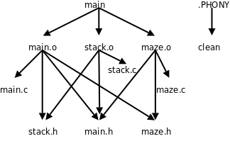

# 21. Makefile 基础

## 21.1 基本规则

### Makefile 使用例子

写一个Makefile文件和源代码放在同一个目录下：

``` makefile
main: main.o stack.o maze.o
	gcc main.o stack.o maze.o -o main

main.o: main.c main.h stack.h maze.h
	gcc -c main.c

stack.o: stack.c stack.h main.h
	gcc -c stack.c

maze.o: maze.c maze.h main.h
	gcc -c maze.c
```

然后在这个目录下敲make命令编译：

``` console
$ make
gcc -c main.c
gcc -c stack.c
gcc -c maze.c
gcc main.o stack.o maze.o -o main
```

make程序会自动读取当前目录下的Makefile文件，完成相应的编译步骤。

只要符合本章所描述的语法的文件我们都叫它Makefile，而它的文件名则不一定是Makefile。事实上make程序依次查找文件名GNUmakefile、makefile和Makefile，找到第一个存在的文件并执行它，一般建议使用Makefile做文件名。各种平台的make程序所支持的Makefile语法会有些差异，Linux系统的make程序一般是GNU make，如果你写的Makefile包含GNU make的特殊语法，可以起名为GNUmakefile，其他系统的make程序如果不是GNU make则不会查找GNUmakefile这个文件名。

### Makefile 组成

- Makefile 由规则组成，规则由目标、条件和多条命令组成

  Makefile由一组规则（Rule）组成，每条规则的格式是：

  ``` makefile
  target ... : prerequisites ...
  	command1
  	command2
  	...
  ```

  例如：

  ``` makefile
  main: main.o stack.o maze.o
  	gcc main.o stack.o maze.o -o main
  ```

  main是这条规则的目标（Target），main.o、stack.o和maze.o是这条规则的条件（Prerequisite）。

  目标和条件之间的关系是：欲更新目标，必须先更新它的所有条件；所有条件中只要有一个条件被更新了，目标也必须随之被更新。

  所谓“更新”就是执行一遍规则中的命令列表。

  命令列表中的每条命令必须以一个Tab开头，注意不能用空格代替这个Tab，Makefile的格式不像C语言的缩进那么随意。

  对于Makefile中的每个以Tab开头的命令，make会启动一个Shell进程去执行它。

### make 如何使用上面的 makefile 例子

- 第一次 make

  对于上面这个例子，make执行如下步骤：

  1.  尝试更新Makefile中第一条规则的目标main，第一条规则的目标称为缺省目标，只要缺省目标更新了就算完成任务了，其他工作都是为这个目标而做的。

      由于我们是第一次编译，main文件还没生成，显然需要更新，但规则说必须先更新了main.o、stack.o和maze.o这三个条件，然后才能更新main。

  2.  所以make会进一步查找以这三个条件为目标的规则，这些目标文件也没有生成，也需要更新，所以执行相应的命令（gcc -c main.c、gcc -c stack.c和gcc -c maze.c）更新它们。

  3.  最后执行gcc main.o stack.o maze.o -o main更新main。

- 没有任何改动 make

  如果没有做任何改动，再次运行make：

  ``` console
  $ make
  make: `main' is up to date.
  ```

  make会提示缺省目标已经是最新的了，不需要执行任何命令更新它。

- 修改了一个文件 make

  再做个实验，如果修改了maze.h（比如加个无关痛痒的空格）再运行make：

  ``` console
  $ make
  gcc -c main.c
  gcc -c maze.c
  gcc main.o stack.o maze.o -o main
  ```

  make会自动选择那些受影响的源文件重新编译，不受影响的源文件则不重新编译，这是怎么做到的呢？

  在这种情况下make的处理步骤是：

  1.  检查目标main是否需要更新，由于它依赖于三个条件，因此要先检查main.o、stack.o和maze.o这三个条件是否需要更新。

  2.  make进一步查找以这三个条件为目标的规则，然后发现main.o和maze.o需要更新，因为它们都有一个条件是maze.h，而这个文件的修改时间比main.o和maze.o晚，所以执行相应的命令更新main.o和maze.o。

  3.  既然main的三个条件中有两个被更新过了，那么main也需要更新，所以执行命令gcc main.o stack.o maze.o -o main更新main。

### make 执行规则的步骤

假设Makefile中有一条规则A，我们总结一下make执行规则A的步骤：

1.  首先检查规则A的每个条件P。

    - 如果存在以P为目标的规则B，则执行规则B。在执行规则A的过程中要执行规则B，这是个递归的执行过程。

    - 如果找不到以P为目标的规则，并且文件P已存在，表示P不需要更新。

    - 如果找不到以P为目标的规则，并且文件P不存在，则报错退出。

2.  在检查完规则A的所有条件后，检查它的目标T，如果属于以下情况之一，表示T需要更新，就执行它的命令列表，执行完命令之后无论是否生成文件T，都认为T被更新过。

    - 文件T不存在。

    - 文件T存在，但是某个条件P是一个文件，该文件的修改时间比T晚。

    - 某个条件P被更新过（并不一定生成文件P）。

以上步骤描述得比较抽象，请读者拿前面的例子套用这些步骤来理解Makefile的执行过程。

### clean 规则

通常Makefile都会有一个clean规则，用于清除编译过程中产生的二进制文件，保留源文件：

``` makefile
clean:
	@echo "cleanning project"
	-rm main *.o
	@echo "clean completed"
```

把这条规则添加到我们的Makefile末尾，然后执行这条规则：

``` console
$ make clean
cleanning project
rm main *.o
clean completed
```

- 使用 make 可以指定目标也可以不指定

  在make的命令行中可以指定一个或多个目标，比如指定了目标clean，则执行Makefile中更新目标clean的规则，如果在make的命令行中不指定任何目标，则更新Makefile中第一条规则的目标（缺省目标）。

- clean 目标没有任何条件

  和前面介绍的规则不同，clean目标不依赖于任何条件，并且执行它的命令列表不会生成clean这个文件。

  刚才说过，只要执行了命令列表就算更新了目标，即使没有生成以目标为文件名的文件也算。

- 命令前可以加 @ 和 -

  在这个例子中还演示了命令前面加@和-字符的效果：

  如果make执行的命令前面加了@字符（At Sign），则不显示命令本身而只显示它的输出结果；

  通常make执行的命令如果出错（该命令的退出状态非0）就立刻终止，不再执行后续命令，但如果命令前面加了-字符（Hyphen），即使这条命令出错，make也会继续执行后续命令。

  通常rm命令和mkdir命令前面要加上-字符，因为rm要删除的文件可能不存在，mkdir要创建的目录可能已存在，这两个命令都有可能出错，但这种错误其实不算什么错，应该继续执行下去。

  例如上面已经执行过一遍make clean，再执行一遍就没有文件可删了，这时rm命令会报错，但make忽略这一错误，继续执行后面的echo命令：

  ``` console
  $ make clean
  cleanning project
  rm main *.o
  rm: cannot remove `main': No such file or directory
  rm: cannot remove `*.o': No such file or directory
  make: [clean] Error 1 (ignored)
  clean completed
  ```

  读者可以把命令前面的@和-去掉再试试，对比一下结果有何不同。

- 如果存在一个叫 clean 的文件会怎么样

  这里还有一个问题，如果当前目录下存在一个文件叫clean会怎么样呢？

  ``` console
  $ touch clean
  $ make clean
  make: `clean' is up to date.
  ```

  如果存在clean这个文件，clean目标又不依赖于任何条件，make就认为它不需要更新了。

- 特殊目标 .PHONY 将 clean 声明为一个伪目标

  而我们希望把clean当做一个特殊的名字使用，不管clean文件存在不存在都要更新clean目标，可以添加一条特殊规则，把clean声明成一个伪目标：

  ``` makefile
  .PHONY: clean
  ```

  这条规则没有命令列表。

  类似.PHONY这种make内建的特殊目标还有很多，各有不同的用途，详见参考文献[27]的4.8节。

- .PHONY: clean 写在 clean: 前后都没关系

  在C语言中要求变量和函数先声明后使用，而Makefile不太一样，这条规则写在clean:规则的后面也行，也能起到声明clean是伪目标的作用：

  ``` makefile
  clean:
  	@echo "cleanning project"
  	-rm main *.o
  	@echo "clean completed"

  .PHONY: clean
  ```

  当然写在前面也行。

- make 处理 Makefile 也分为两个阶段

  gcc处理一个C程序分为预处理和编译两个阶段，类似地，make处理Makefile的过程也分为两个阶段：

  1.  从前到后读取所有规则，建立起完整的依赖关系图，如图21.1所示。

      

  2.  从缺省目标或者命令行指定的目标开始，根据依赖关系图选择适当的规则执行，执行Makefile中的规则和执行C代码不一样，并不是从前到后按顺序执行，也不是所有规则都要执行一遍，例如在make缺省目标时不会更新clean目标，因为从图21.1可以看出，clean目标和缺省目标main没有任何依赖关系。

- 约定俗成的目标名字

  clean目标是一个约定俗成的名字，在所有软件项目的Makefile中都表示清除编译生成的文件，类似这样的约定俗成的目标名字有：

  - all，执行主要的编译工作，通常用作缺省目标。

  - install，执行编译后的安装工作，把可执行文件、配置文件、文档等分别拷贝到不同的安装目录。

  - clean，删除编译生成的二进制文件。

  - distclean，不仅删除编译生成的二进制文件，也删除其他的生成文件，比如内核源代码make menuconfig配置之后会生成.config文件，一些文档源文件（比如本书的Docbook源文件）经过make之后会转换生成HTML或PDF文件，执行make distclean应该清除所有的生成文件，只留下源文件。

## 21.2 隐含规则和模式规则

上一节的Makefile写得中规中矩，比较繁琐，主要是为了讲清楚基本概念，其实Makefile有很多灵活的写法，可以写得更简洁，同时减少人为出错的可能。本节我们来看看这样一个Makefile还有哪些改进的余地。

### 可以存在多条目标一样的规则

一个目标依赖的所有条件不一定非得写在一条规则中，也可以拆开写，例如：

``` makefile
main.o: main.h stack.h maze.h

main.o: main.c
	gcc -c main.c
```

相当于：

``` makefile
main.o: main.c main.h stack.h maze.h
	gcc -c main.c
```

### 只有一条规则可以有命令列表

如果一个目标拆开写多条规则，其中只有一条规则允许有命令列表，其他规则应该没有命令列表，否则make会报警告并且采用最后一条规则的命令列表。

### 例子改写成存在多条目标一样的规则

这样我们的例子可以改写成：

``` makefile
main: main.o stack.o maze.o
	gcc main.o stack.o maze.o -o main

main.o: main.h stack.h maze.h
stack.o: stack.h main.h
maze.o: maze.h main.h

main.o: main.c
	gcc -c main.c

stack.o: stack.c
	gcc -c stack.c

maze.o: maze.c
	gcc -c maze.c

clean:
	-rm main *.o

.PHONY: clean
```

### 例子删除规则，使用隐含规则

这不是比原来更繁琐了吗？现在可以把提出来的三条规则删去，写成：

``` makefile
main: main.o stack.o maze.o
	gcc main.o stack.o maze.o -o main

main.o: main.h stack.h maze.h
stack.o: stack.h main.h
maze.o: maze.h main.h

clean:
	-rm main *.o

.PHONY: clean
```

这就比原来简单多了。

可是现在main.o、stack.o和maze.o这三个目标连编译命令都没有了，怎么编译呢？试试看：

``` console
$ make
cc    -c -o main.o main.c
cc    -c -o stack.o stack.c
cc    -c -o maze.o maze.c
gcc main.o stack.o maze.o -o main
```

前三条编译命令是怎么来的？

如果一个目标在Makefile中的所有规则都没有命令列表，make会尝试在内建的隐含规则（Implicit Rule）中查找适用的规则。

### make 内建的隐含规则和变量定义

make在解析Makefile时会把其中的规则及变量定义与make内建的隐含规则及变量定义融合在一起，用make -p命令可以查看所有这些规则和变量定义。

如果在一个没有Makefile的目录下使用make -p命令，则只显示make内建的隐含规则及变量定义。

从make -p命令的输出可以看到，在我们这个例子中起作用的隐含规则及变量定义有：

```
# default
OUTPUT_OPTION = -o $@

# default
CC = cc

# default
COMPILE.c = $(CC) $(CFLAGS) $(CPPFLAGS) $(TARGET_ARCH) -c

%.o: %.c
#  commands to execute (built-in):
        $(COMPILE.c) $(OUTPUT_OPTION) $<
```

- 注释

  #号在Makefile中表示单行注释，类似于C语言的//注释。

- 变量定义

  CC = cc定义一个变量CC并给它赋值，Makefile变量就像环境变量或者C语言的宏定义一样，代表一串字符（或者空字符串），并且按照惯例通常用大写字母加下划线命名。

- 展开变量 CC

  变量名加上括号和$符（Dollar Sign）写成$(CC)表示将变量CC的值展开，在这里要展开成cc。

  也可以写成${CC}，在本书中都采用$(CC)这种写法。

- cc 表示 C 编译器

  在Linux系统上cc是指向gcc的符号链接，在其他UNIX系统上cc可能指向另外一种C编译器。

- 展开 $(COMPILE.c) $(OUTPUT_OPTION) $<

  CFLAGS这个变量没有定义，$(CFLAGS)展开是空，CPPFLAGS和TARGET_ARCH也是如此。

  这样$(COMPILE.c)展开应该是cc␣空␣空␣空␣-c，去掉所有的“空”得到cc␣␣␣␣-c，注意中间留下了4个空格，所以%.o: %.c规则的命令$(COMPILE.c)␣$(OUTPUT_OPTION)␣$<展开之后是cc␣␣␣␣-c␣-o␣$@␣$<，和编译命令cc␣␣␣␣-c␣-o␣main.o␣main.c已经很接近了。

- $@ 和 $<

  $@和$<是两个特殊的变量，$@的取值是当前规则中的目标，$<的取值是当前规则中的第一个条件。

- 模式规则

  %.o: %.c是一种特殊的规则，称为模式规则（Pattern Rule）。

  现在回顾一下整个过程，在我们的Makefile中以main.o为目标的规则都没有命令列表，所以make会查找隐含规则，发现隐含规则中有这样一条模式规则适用，main.o符合%.o的模式，现在%就代表main（称为main.o这个名字的Stem），替换到%.c中就是main.c。所以这条模式规则相当于：

  ``` makefile
  main.o: main.c
  	cc    -c -o main.o main.c
  ```

  随后，在处理stack.o目标时又用到这条模式规则，这时又相当于：

  ``` makefile
  stack.o: stack.c
  	cc    -c -o stack.o stack.c
  ```

  maze.o也同样处理。

  这三条规则可以由make的隐含规则推导出来，所以不必写在Makefile中。

### 以条件为中心写 Makefile

先前我们写Makefile都是以目标为中心，一个目标依赖于若干条件，现在换个角度，以条件为中心，Makefile还可以这么写：

``` makefile
main: main.o stack.o maze.o
	gcc main.o stack.o maze.o -o main

main.o stack.o maze.o: main.h
main.o maze.o: maze.h
main.o stack.o: stack.h

clean:
	-rm main *.o

.PHONY: clean
```

我们知道，写规则的目的是让make建立依赖关系图，不管怎么写，只要把所有的依赖关系都描述清楚了就行。

对于多目标的规则，make会拆成几条单目标的规则来处理，例如：

``` makefile
target1 target2: prerequisite1 prerequisite2
	command $< -o $@
```

这样一条规则相当于：

``` makefile
target1: prerequisite1 prerequisite2
	command prerequisite1 -o target1

target2: prerequisite1 prerequisite2
	command prerequisite1 -o target2
```

注意两条规则的命令列表是一样的，但$@的取值不同。

## 21.3 变量

这一节我们详细讨论Makefile中关于变量的语法规则。

### =

先看一个简单的例子：

``` makefile
all:
	@echo $(foo)

foo = Ah $(bar)
bar = Huh?
```

执行make命令将会打印Ah Huh?。

1.  当make读到foo = Ah $(bar)时，定义foo的值是Ah $(bar)，但并不立即展开$(bar)。

2.  然后读到bar = Huh?，定义bar的值是Huh?。

3.  至此Makefile从头到尾处理了一遍，建立了规则之间的依赖关系图。

    现在选择适当的规则来执行，这个Makefile中只有一条规则，目标是all，由于文件all不存在，所以执行echo $(foo)命令更新目标all。

    这时要取变量foo的值，展开$(foo)得到Ah $(bar)，再展开Ah $(bar)得到Ah Huh?，最后执行echo Ah Huh?。

虽然在Makefile中bar的定义写在foo = Ah $(bar)之后，而foo的定义写在echo$(foo)之后，最终还是能把$(foo)展开成Ah $(bar)，把Ah $(bar)再展开成Ah Huh?。关键要理解两点：

1.  Makefile并不是从前到后顺序执行的，只有理解了Makefile的处理步骤，才能准确分析$(foo)在何时展开，当它要展开时已经有了哪些变量定义。

2.  通过=号定义一个变量，如果=号右边有需要展开的形式（例如$(bar)），并不会在定义这个变量时立即展开，而是直到这个变量取值时（即要展开这个变量本身时）才进一步展开，也叫做递归地展开。

---

再举个例子：

``` makefile
main.o: main.c
	$(CC) $(CFLAGS) $(CPPFLAGS) -c $<

CC = gcc
CFLAGS = -O -g
CPPFLAGS = -DNDEBUG -Iinclude
```

编译命令可以展开成gcc -O -g -DNDEBUG -Iinclude -c main.c。

通常把变量CFLAGS定义成一些编译选项，而把变量CPPFLAGS定义成一些预处理选项，这些变量定义无论写在规则的前面还是后面，运行结果都一样。

- 用 = 可能会写出无穷递归的定义

  用=号定义的变量直到取值时才递归地展开，这个特性也有坏处，就是有可能写出无穷递归的定义，例如CFLAGS = $(CFLAGS) -O，或者：

  ``` makefile
  A = $(B)
  B = $(A)
  ```

  当然，make有能力检测出这样的错误而不会陷入死循环。

### :=

定义变量还可以用:=号，这样的变量在定义时就立即展开:=右边，而不是等到变量取值时再展开。例如：

``` makefile
all:
	@echo "-$(foo)-"

foo := Ah $(bar)
bar := Huh?
```

当make读到foo := Ah $(bar)定义时就立即把$(bar)展开，但这时bar还没有定义，展开为空值，因此foo被定义为Ah␣，注意Ah和$(bar)中间的空格仍保留在定义中。接下来读到bar := Huh?，bar被定义为Huh?，但已经影响不到foo的定义了。最终打印的结果是-Ah␣-。读者可以试试把foo和bar的定义颠倒过来看看是什么结果。

### 变量定义中的空白字符

在一个变量的定义中，从=号或:=号右边的第一个非空白字符开始，直到注释或换行之前的所有字符都属于这个变量的值。例如上面的foo := Ah $(bar)这个定义，Ah左边的空格不算数，而Ah右边的空格要算数。

再举个例子，如果要定义一个变量的值是个空格，可以这样：

``` makefile
nullstring :=
space := $(nullstring) #end of the line
```

在space := $(nullstring) # end of the line这个定义中，$(nullstring)展开为空，#号后边是注释，所以space的值是$(nullstring)和#之间的那个空格。写注释是为了增加可读性，如果不写注释就换行，很难看出$(nullstring)和换行之间有一个空格。

### ?=

除了=号和:=号之外，还可以用?=号定义变量。例如foo ?= $(bar)的意思是：如果foo没有定义过，那么?=号相当于=号，定义foo的值是$(bar)，但不立即展开；如果先前已经定义了foo，则什么也不做，不会给foo重新赋值。

### +=

可以用+=号给变量追加值，例如：

``` makefile
objects = main.o
objects += $(foo)
```

objects是用=号定义的，+=号仍然保持=号的特性，objects的值是main.o␣$(foo)（注意$(foo)前面自动添加一个空格），但不立即展开。

再比如：

``` makefile
objects := main.o
objects += $(foo)
```

objects是用:=号定义的，+=号保持:=号的特性，objects用+=号赋值是main.o␣$(foo)，这时foo还没有定义，立即展开得到main.o␣，注意main.o后面的空格仍保留。

如果变量还没有定义过就直接用+=号赋值，那么+=号相当于=号，读者可以自己试试，这里就不举例了。

### 自动变量

上一节我们用到了特殊变量$@和$<，这两个变量的特点是不需要给它们赋值，在不同的上下文中它们自动取不同的值，所以也叫自动变量。

常用的自动变量有：

- $@，表示规则中的目标。

- $*，表示模式规则中的Stem。

- $<，表示规则中的第一个条件。

- $?，表示规则中所有比目标新的条件，组成一个列表，以空格分隔。

- $^，表示规则中的所有条件，组成一个列表，以空格分隔，如果这个列表中有重复的项则消除重复的项。

例如前面写过的这条规则：

``` makefile
main: main.o stack.o maze.o
	gcc main.o stack.o maze.o -o main
```

可以改写成：

``` makefile
main: main.o stack.o maze.o
	gcc $^ -o $@
```

即使以后又往条件里添加了新的目标文件，$^也能自动包含新的目标文件名，编译命令不需要修改，因而减少了人为出错的可能。

$?变量也很有用，有时候希望只对更新过的条件进行操作，例如有一个库文件libsome.a依赖于几个目标文件：

``` makefile
libsome.a: foo.o bar.o lose.o win.o
	ar r libsome.a $?
	ranlib libsome.a
```

只有更新过的目标文件才需要重新打包到libsome.a中，没更新过的目标文件原本已经在libsome.a中了，不必重新打包，所以这里用$?比较合适。

### make 内建的隐含变量定义

在上一节我们看到make的隐含规则数据库中用到了很多变量，有些变量没有定义（例如CFLAGS），有些变量定义了缺省值（例如CC），我们写Makefile时可以重新定义这些变量的值，也可以在缺省值的基础上追加。

以下列举一些常用的变量，请读者体会这些变量的命名规律。

AR

静态库打包命令的名字，缺省值是ar。

ARFLAGS

静态库打包命令的选项，缺省值是rv。

AS

汇编器的名字，缺省值是as。

ASFLAGS

汇编器的选项，没有定义。

CC

C编译器的名字，缺省值是cc。

CFLAGS

C编译器的选项，没有定义。

CXX

C++编译器的名字，缺省值是g++。

CXXFLAGS

C++编译器的选项，没有定义。

CPP

C预处理器的名字，缺省值是$(CC) -E。

CPPFLAGS

C预处理器的选项，没有定义。

LD

链接器的名字，缺省值是ld。

LDFLAGS

链接器的选项，没有定义。

TARGET_ARCH

和目标平台相关的命令行选项，没有定义。

OUTPUT_OPTION

输出的命令行选项，缺省值是-o $@。

LINK.o

把.o文件链接在一起的命令行，缺省值是$(CC) $(LDFLAGS) $(TARGET_ARCH)。

LINK.c

把.c文件链接在一起的命令行，缺省值是$(CC) $(CFLAGS) $(CPPFLAGS)$(LDFLAGS) $(TARGET_ARCH)。

LINK.cc

把.cc文件（C++源文件）链接在一起的命令行，缺省值是$(CXX) $(CXXFLAGS)$(CPPFLAGS) $(LDFLAGS) $(TARGET_ARCH)。

COMPILE.c

编译.c文件的命令行，缺省值是$(CC) $(CFLAGS) $(CPPFLAGS) $(TARGET_ARCH) -c。

COMPILE.cc

编译.cc文件的命令行，缺省值是$(CXX) $(CXXFLAGS) $(CPPFLAGS)$(TARGET_ARCH) -c。

RM

删除命令的名字，缺省值是rm -f。

## 21.4 自动处理头文件的依赖关系

现在我们的Makefile写成这样：

``` makefile
all: main

main: main.o stack.o maze.o
	gcc $^ -o $@

main.o: main.h stack.h maze.h
stack.o: stack.h main.h
maze.o: maze.h main.h

clean:
	-rm main *.o

.PHONY: clean
```

按照惯例，用all做缺省目标。

### 重复信息应该自动维护

- 找出目标文件依赖哪些头文件比较麻烦

  还有一个问题比较麻烦，在写main.o、stack.o和maze.o这三个目标的规则时要查看源代码，找出它们依赖于哪些头文件，这很容易出错，一是因为有的头文件包含在另一个头文件中，在写规则时很容易遗漏，二是如果以后修改源代码改变了依赖关系，很可能忘记修改Makefile的规则。

- 应该想办法自动维护重复信息，手工维护容易出错

  在源代码中已经包含了目标文件和头文件之间的依赖关系，这种依赖关系是以#include的形式描述的，如果在Makefile中以规则的形式再描述一遍，就存在重复信息了。

  手工维护重复信息很容易出错，应该想办法自动维护。

- Don't Repeat Yourself 原则

  以前我们讲过定义一个宏然后在代码中多处引用它可以避免硬编码，讲过写一个头文件然后包含在很多.c文件中可以避免在这些.c文件中重复声明，道理都是一样的：如果某信息在多处重复出现，要修改它应该只在一个地方手工修改，而在其他地方自动获得更新后的信息，这称为DRY（Don't Repeat Yourself）原则。

### 自动抽取源代码中的依赖关系

现在我们要想办法把源代码中的依赖关系信息抽取出来自动转换成Makefile中的规则。

第一步，用gcc的-M选项自动分析目标文件和源文件的依赖关系，以Makefile规则的格式输出：

``` console
$ gcc -M main.c
main.o: main.c /usr/include/stdio.h /usr/include/features.h \
  /usr/include/bits/predefs.h /usr/include/sys/cdefs.h \
  /usr/include/bits/wordsize.h /usr/include/gnu/stubs.h \
  /usr/include/gnu/stubs-32.h \
  /usr/lib/gcc/i486-linux-gnu/4.4.3/include/stddef.h \
  /usr/include/bits/types.h /usr/include/bits/typesizes.h \
  /usr/include/libio.h /usr/include/_G_config.h /usr/include/wchar.h \
  /usr/lib/gcc/i486-linux-gnu/4.4.3/include/stdarg.h \
  /usr/include/bits/stdio_lim.h /usr/include/bits/sys_errlist.h main.h \
  stack.h maze.h
```

注意在Makefile的规则中也可以使用类似C语言的续行符\。

gcc -M的输出结果不仅包括我们自己写的头文件main.h、stack.h和maze.h，还包括stdio.h和其他系统头文件，因为我们的程序中包含了stdio.h，而后者又包含了其他系统头文件。

系统头文件通常不需要随我们的程序一起维护，所以通常不用gcc的-M选项而是用-MM选项，输出结果中只包括我们自己写的头文件：

``` console
$ gcc -MM *.c
main.o: main.c main.h stack.h maze.h
maze.o: maze.c maze.h main.h
stack.o: stack.c stack.h main.h
```

---

接下来的问题是怎么把这些规则添加到Makefile中，Scott McPeak提供了一个很好的解决方案（http://scottmcpeak.com/autodepend/autodepend.html）：

``` makefile
all: main

main: main.o stack.o maze.o
	gcc $^ -o $@

clean:
	-rm main *.o *.d

.PHONY: clean

OBJS = main.o stack.o maze.o

-include $(OBJS:.o=.d)

%.o: %.c
	gcc -c $(CFLAGS) $*.c -o $*.o
	gcc -MM $(CFLAGS) $*.c > $*.d
	mv -f $*.d $*.d.tmp
	sed -e 's|.*:|$*.o:|' < $*.d.tmp > $*.d
	sed -e 's/.*://' -e 's/\\$$//' < $*.d.tmp | fmt -1 | \
	sed -e 's/^ *//' -e 's/$$/:/' >> $*.d
	rm -f $*.d.tmp
```

OBJS变量的值是我们要编译生成的.o文件的列表，$(OBJS:.o=.d)是变量值的替换语法，把OBJS变量中每一项的.o后缀替换成.d后缀，所以include这一句相当于：

``` makefile
-include main.d stack.d maze.d
```

类似于C语言的#include预处理指示，在Makefile中include main.d stack.d maze.d表示把这三个文件包含到当前的Makefile中，这三个文件也应该符合Makefile的语法。

我们在include前面加了一个-，表示如果它要包含的文件列表中有的文件不存在，则忽略不存在的文件，只包含存在的文件。如果include前面没有-，而它要包含的文件又不存在，则make会报错。

事实上，include不只是把文件包含进来这么简单，还要做一个特殊处理：对于要包含进来的每一个文件，make会把文件名当做目标来尝试更新（如果有规则匹配该目标则执行该规则下的命令，如果没有规则能匹配该目标就算了），如果make检查完所有要包含进来的文件后，其中确实有些文件被更新了，则make会从头开始执行，重新包含更新后的文件。详见参考文献[27]的3.7节。

对于我们这个例子不必考虑这种复杂的情况，因为我们没有规则能匹配以.d为后缀的目标，不会更新main.d、stack.d或maze.d。

---

下面我们分几个不同的场景来分析当.c和.h文件的依赖关系发生变化时make如何更新规则来适应这些变化。

1.  如果你的工作目录是干净的，只有.c文件、.h文件和Makefile文件，执行make命令的结果是：

    ``` console
    $ make
    gcc -c  main.c -o main.o
    gcc -MM  main.c > main.d
    mv -f main.d main.d.tmp
    sed -e 's|.*:|main.o:|' < main.d.tmp > main.d
    sed -e 's/.*://' -e 's/\\$//' < main.d.tmp | fmt -1 | \
    	sed -e 's/^ *//' -e 's/$/:/' >> main.d
    rm -f main.d.tmp
    gcc -c  stack.c -o stack.o
    gcc -MM  stack.c > stack.d
    mv -f stack.d stack.d.tmp
    sed -e 's|.*:|stack.o:|' < stack.d.tmp > stack.d
    sed -e 's/.*://' -e 's/\\$//' < stack.d.tmp | fmt -1 | \
    	sed -e 's/^ *//' -e 's/$/:/' >> stack.d
    rm -f stack.d.tmp
    gcc -c  maze.c -o maze.o
    gcc -MM  maze.c > maze.d
    mv -f maze.d maze.d.tmp
    sed -e 's|.*:|maze.o:|' < maze.d.tmp > maze.d
    sed -e 's/.*://' -e 's/\\$//' < maze.d.tmp | fmt -1 | \
    	sed -e 's/^ *//' -e 's/$/:/' >> maze.d
    rm -f maze.d.tmp
    gcc main.o stack.o maze.o -o main
    ```

    由于main.d、stack.d和maze.d一个都不存在，所以include忽略它们，不包含任何文件。

    然后根据%.o: %.c规则，我们要更新目标main.o、stack.o和maze.o，它们的处理过程是一样的，我们以main.o为例解释一下具体的步骤：

    ①执行gcc -c main.c -o main.o，由main.c编译出main.o。

    ②执行gcc -MM main.c > main.d，把main.c的依赖关系写入文件main.d，其内容是main.o: main.c main.h stack.h maze.h。这条规则在本次make的处理过程中不起作用，但下次执行make时会把这个main.d包含进来，这条规则就会起作用了。上一条命令生成main.o，而这一条命令生成main.d，也就是说：只要生成一个.o文件，就要配合它生成一个.d文件，以便下次make时可以根据.d文件中的规则检查这个.o文件需不需要更新。

    ③由gcc -MM生成的main.d还不能完全满足我们的要求，接下来的几条命令把main.d中的规则改成这样：

    ``` makefile
    main.o: main.c main.h stack.h maze.h
    main.c:
    main.h:
    stack.h:
    maze.h:
    ```

    我们稍后会分析为什么要改成这样。sed和fmt命令的用法是另一个复杂的话题，在这里就不细讲了，sed的作用是在文件中做编辑、查找、替换，fmt的作用是段落排版。

2.  如果修改了头文件stack.h再重新make，执行结果是：

    ``` console
    $ make
    gcc -c  main.c -o main.o
    gcc -MM  main.c > main.d
    mv -f main.d main.d.tmp
    sed -e 's|.*:|main.o:|' < main.d.tmp > main.d
    sed -e 's/.*://' -e 's/\\$//' < main.d.tmp | fmt -1 | \
    	sed -e 's/^ *//' -e 's/$/:/' >> main.d
    rm -f main.d.tmp
    gcc -c  stack.c -o stack.o
    gcc -MM  stack.c > stack.d
    mv -f stack.d stack.d.tmp
    sed -e 's|.*:|stack.o:|' < stack.d.tmp > stack.d
    sed -e 's/.*://' -e 's/\\$//' < stack.d.tmp | fmt -1 | \
    	sed -e 's/^ *//' -e 's/$/:/' >> stack.d
    rm -f stack.d.tmp
    gcc main.o stack.o maze.o -o main
    ```

    由于Makefile中包含了main.d和stack.d，也就是包含了规则main.o: main.c main.h stack.h maze.h和stack.o: stack.c stack.h main.h，所以修改stack.h将导致main.o和stack.o被更新，但这两条规则没有命令列表，怎么更新呢？注意到它们和%.o: %.c规则属于“一个目标拆开写多条规则”的情况，所以会执行%.o: %.c规则的命令列表。

    最后，main.o和stack.o被更新又导致可执行文件main被更新。

3.  如果添加了一个头文件foo.h，并且在main.c中加了一行#include "foo.h"，再重新make，执行结果是：

    ``` console
    $ make
    gcc -c  main.c -o main.o
    gcc -MM  main.c > main.d
    mv -f main.d main.d.tmp
    sed -e 's|.*:|main.o:|' < main.d.tmp > main.d
    sed -e 's/.*://' -e 's/\\$//' < main.d.tmp | fmt -1 | \
    	sed -e 's/^ *//' -e 's/$/:/' >> main.d
    rm -f main.d.tmp
    gcc main.o stack.o maze.o -o main
    ```

    根据规则%.o: %.c，修改main.c导致main.o被更新，在执行命令列表时重新生成了main.d，其内容为：

    ``` makefile
    main.o: main.c main.h stack.h maze.h foo.h
    main.c:
    main.h:
    stack.h:
    maze.h:
    foo.h:
    ```

    把foo.h也包含到规则里了，下次如果修改foo.h并重新make，也会导致main.o被更新。

4.  如果删除头文件foo.h再重新make，执行结果是：

    ``` console
    $ make
    gcc -c  main.c -o main.o
    main.c:6:17: error: foo.h: No such file or directory
    make: *** [main.o] Error 1
    ```

    我们知道Makefile中包含了规则main.o: main.c main.h stack.h maze.h foo.h，但foo.h已经不存在了，make不是应该报错吗？为什么还会执行%.o: %.c的命令列表呢？

    在这种情况下另外一条规则foo.h:起作用了，像这种既没有依赖条件也没有命令列表的规则是这样处理的：如果以该目标作为文件名的文件不存在，则认为该目标需要更新，由于没有命令列表，执行该规则并不会生成文件，但会认为该目标已被更新，因此依赖该目标的其他目标也要被更新。详见参考文献[27]的4.6节。因此，foo.h不存在将导致main.o被更新。

## 21.5 常用的make命令行选项

### -n

-n选项只打印要执行的命令，而不会真的执行命令（这称为Dry Run），这个选项有助于我们检查Makefile写得是否正确，由于Makefile不是顺序执行的，用这个选项可以先看看命令的执行顺序，确认无误了再真正执行命令。

### -C

-C选项可以切换到另一个目录执行那个目录下的Makefile，比如我们的源代码都放在/home/akaedu/testmake目录，可以在任何目录下敲make命令进入我们的源代码目录编译，编译完成后仍退回到先前的目录：

``` console
$ make -C /home/akaedu/testmake
make: Entering directory `/home/akaedu/testmake'
cc    -c -o main.o main.c
cc    -c -o stack.o stack.c
cc    -c -o maze.o maze.c
gcc main.o stack.o maze.o -o main
make: Leaving directory `/home/akaedu/testmake'
```

一些规模较大的项目会把不同的模块或子系统的源代码放在不同的子目录中，每个子目录下都写一个Makefile，然后在一个总的Makefile中用make -C命令执行每个子目录下的Makefile。例如Linux内核源代码根目录下有Makefile，子目录fs、net等也有各自的Makefile，二级子目录fs/ramfs、net/ipv4等也有各自的Makefile。

### 命令行上定义变量

在make命令行也可以用=或:=定义变量，如果这次编译我想加调试选项-g，但我不想每次编译都加-g，可以在命令行定义CFLAGS变量而不必修改Makefile：

``` console
$ make CFLAGS=-g
cc -g   -c -o main.o main.c
cc -g   -c -o stack.o stack.c
cc -g   -c -o maze.o maze.c
gcc main.o stack.o maze.o -o main
```

### make进程中的环境变量也可以起到Makefile变量的作用

make进程中的环境变量也可以起到Makefile变量的作用。

比如有这样的Makefile：

``` makefile
foo = 1
all:
	@echo $(foo)
```

如果先在Shell进程中定义一个环境变量foo，再执行make命令，这个环境变量会传给make进程，相当于在Makefile中定义了变量foo。

``` console
$ export foo=2
$ make
1
```

但运行结果却不是2，这是因为Makefile中已经定义了变量foo，默认情况下Makefile中的定义会覆盖环境变量的定义，如果希望环境变量的定义覆盖Makefile中的定义可以用-e选项：

``` console
$ make -e
2
```

### 三种变量优先级

在make的命令行选项中定义的变量优先级最高，会覆盖环境变量的定义和Makefile中的定义：

``` console
$ make foo=3
3
```

### 不要把环境变量误认为命令行变量

如果把foo=3写在make前面，则foo=3是Shell进程传给make进程的环境变量，而不是命令行选项，注意区分这两种写法。

``` console
$ foo=3 make
1
$ foo=3 make -e
3
```

### 不同文件夹之间变量的传递

刚才讲过在一些规模较大的项目中每个目录下都会有一个Makefile，一般是在上层目录的Makefile里用make -C命令执行下层目录的Makefile。

我们可以在上层目录的Makefile里用export声明一些变量，这些变量会自动传给make -C命令做**环境变量**。

例如上层目录的Makefile是这样的：

``` makefile
foo = string1
bar = string2
export foo
all:
	$(MAKE) -C subdir
```

注意这里的export不是Shell命令，而是Makefile中的声明，因为我把export顶头写，开头没有Tab字符。

在子目录subdir中有这样的Makefile：

``` makefile
all:
	@echo $(foo) $(bar)
```

在上层目录中执行make的结果是：

``` console
$ make
make -C subdir
make[1]: Entering directory `/home/akaedu/testmake/subdir'
string1
make[1]: Leaving directory `/home/akaedu/testmake/subdir'
```

有一个例外，在命令行选项中定义的变量不需要export就可以传给Makefile里的make -C命令：

``` console
$ make bar=str2
make -C subdir
make[1]: Entering directory `/home/akaedu/testmake/subdir'
string1 str2
make[1]: Leaving directory `/home/akaedu/testmake/subdir'
```

## 总结

Makefile由若干条规则（Rule）、变量定义和注释组成。

### Makefile 注释

`#`号在Makefile中表示单行注释，类似于C语言的//注释。

### Makefile 续行符

注意在Makefile的规则中也可以使用类似C语言的续行符\。

### Makefile 规则

#### 规则格式

每条规则的格式是：

``` makefile
target ... : prerequisites ...
	command1
	command2
	...
```

- 命令必须以 Tab 开头

  命令列表中的每条命令必须以一个Tab开头，注意不能用空格代替这个Tab，Makefile的格式不像C语言的缩进那么随意。

  对于Makefile中的每个以Tab开头的命令，make会启动一个Shell进程去执行它。

- 命令前加 @

  如果make执行的命令前面加了@字符（At Sign），则不显示命令本身而只显示它的输出结果。

- 命令前加 -

  通常make执行的命令如果出错（该命令的退出状态非0）就立刻终止，不再执行后续命令，但如果命令前面加了-字符（Hyphen），即使这条命令出错，make也会继续执行后续命令。

  通常rm命令和mkdir命令前面要加上-字符，因为rm要删除的文件可能不存在，mkdir要创建的目录可能已存在，这两个命令都有可能出错，但这种错误其实不算什么错，应该继续执行下去。

#### 目标

- 约定俗成的目标名字

  - all

    执行主要的编译工作，all 所在的规则通常放在第一行，all 通常为缺省目标。

  - install

    执行编译后的安装工作，把可执行文件、配置文件、文档等分别拷贝到不同的安装目录。

  - clean

    删除编译生成的二进制文件，保留源文件。

    ``` makefile
    clean:
    	@echo "cleanning project"
    	-rm main *.o
    	@echo "clean completed"
    ```

  - distclean

    不仅删除编译生成的二进制文件，也删除其他的生成文件，比如内核源代码make menuconfig配置之后会生成.config文件，一些文档源文件（比如本书的Docbook源文件）经过make之后会转换生成HTML或PDF文件，执行make distclean应该清除所有的生成文件，只留下源文件。

- 特殊目标 .PHONY

  上面介绍的 clean 目标不依赖于任何条件，并且执行它的命令列表不会生成clean这个文件。

  对 clean 这样的目标，如果以 clean 为文件名的文件不存在，那么每次 clean 都会更新成功；如果以 clean 为文件名的文件存在，那么每次 clean 都会更新失败。

  如果我们希望 clean 文件不管在不在，clean 目标都更新成功，可以添加一条特殊规则，把 clean 目标声明成一个伪目标：

  ``` makefile
  .PHONY: clean
  ```

  这条规则写在 clean 规则的前面和后面都可以。

#### 拆分条件

``` makefile
main.o: main.c main.h stack.h maze.h
	gcc -c main.c
```

可以拆成：

``` makefile
main.o: main.h stack.h maze.h

main.o: main.c
	gcc -c main.c
```

如果一个目标拆开写多条规则，其中只有一条规则允许有命令列表，其他规则应该没有命令列表，否则make会报警告并且采用最后一条规则的命令列表。

#### 拆分目标

先前我们写Makefile都是一个目标依赖于若干条件，现在换个角度，以条件为中心，Makefile还可以这么写：

``` makefile
main.o stack.o maze.o: main.h
main.o maze.o: maze.h
main.o stack.o: stack.h
```

每一条多目标的规则会被 make 拆成几条单目标的规则：

``` makefile
main.o: main.h
stack.o: main.h
maze.o: main.h
main.o: maze.h
maze.o: maze.h
main.o: stack.h
stack.o: stack.h
```

#### 模式规则

假设 Makefile 中有 %.o: %.c 这样一条模式规则。如果 Makefile 中不存在给 main.o 提供命令的规则，make 就看看 Makefile 中的模式规则。%.o 这个模式和 main.o 匹配，现在%就代表main（称为main.o这个名字的Stem），替换到%.c中就是main.c。所以最后我们得到的规则为：main.o: main.c。

### Makefile 变量定义

Makefile变量就像环境变量或者C语言的宏定义一样，代表一串字符（或者空字符串），并且按照惯例通常用大写字母加下划线命名。

在一个变量的定义中，从=号或:=号右边的第一个非空白字符开始，直到注释或换行之前的所有字符都属于这个变量的值。例如foo := Ah $(bar)这个定义，Ah左边的空格不算数，而Ah右边的空格要算数。

- =

  ``` makefile
  all:
  	@echo $(foo)

  foo = Ah $(bar)
  bar = Huh?
  ```

  用 = 定义的变量 foo 如果定义中有需要展开的形式（例如 $(bar))，那么这个 $(bar) 的展开在 make 读到这个定义时不发生，当 make 执行的命令中有 $(foo) 时，$(foo) 会被展开。要展开 $(foo) 需要首先展开 $(bar)，$(bar) 这时才被展开。

  当make读到foo = Ah $(bar)时，定义foo的值是Ah $(bar)，但并不立即展开$(bar)。

  然后读到bar = Huh?，定义bar的值是Huh?。

  至此Makefile从头到尾处理了一遍，建立了规则之间的依赖关系图。

  现在选择适当的规则来执行，这个Makefile中只有一条规则，目标是all，由于文件all不存在，所以执行echo $(foo)命令更新目标all。

  这时要取变量foo的值，展开$(foo)得到Ah $(bar)，再展开Ah $(bar)得到Ah Huh?，最后执行echo Ah Huh?。

- :=

  ``` makefile
  all:
  	@echo "-$(foo)-"

  foo := Ah $(bar)
  bar := Huh?
  ```

  用 := 定义的变量 foo 如果定义中有需要展开的形式（例如 $(bar))，那么这个 $(bar) 的展开在 make 读到这个定义时马上发生，foo 的值就是一个正常的字符串。

  当make读到foo := Ah $(bar)定义时就立即把$(bar)展开，但这时bar还没有定义，展开为空值，因此foo被定义为Ah␣，注意Ah和$(bar)中间的空格仍保留在定义中。

  接下来读到bar := Huh?，bar被定义为Huh?，但已经影响不到foo的定义了。最终打印的结果是-Ah␣-。

- ?=

  除了=号和:=号之外，还可以用?=号定义变量。

  例如foo ?= $(bar)的意思是：如果foo没有定义过，那么?=号相当于=号，定义foo的值是$(bar)，但不立即展开；如果先前已经定义了foo，则什么也不做，不会给foo重新赋值。

- +=

  如果变量还没有定义过就直接用+=号赋值，那么+=号相当于=号。

  ``` makefile
  objects = main.o
  objects += $(foo)
  ```

  如果变量用 = 定义过，+= 保持=号的特性，objects的值是main.o␣$(foo)（注意$(foo)前面自动添加一个空格），但不立即展开。

  ``` makefile
  objects := main.o
  objects += $(foo)
  ```

  如果变量用:=定义过，+=号保持:=号的特性，objects用+=号赋值是main.o␣$(foo)，这时foo还没有定义，立即展开得到main.o␣，注意main.o后面的空格仍保留。

### Makefile 变量展开

$(CC) 或 ${CC} 表示将变量CC的值展开，将 $(CC) 或 ${CC} 用 cc 代替。$(CC) 或 ${CC} 可以出现在命令列表中或变量定义中。

如果变量定义为空字符串或者根本没定义过，那么展开时为空。

- 自动变量

  不需要给自动变量赋值，在不同的上下文中它们自动展开为不同的值。

  - $@

    $@ 展开为当前规则中的目标。

  - $*

    $* 展开为当前模式规则中的Stem。

  - $<

    $< 展开为当前规则中的第一个条件。

  - $?

    $? 展开为当前规则中所有比目标新的条件，组成一个列表，以空格分隔。

  - $^

    $^ 展开为当前规则中所有条件，组成一个列表，以空格分隔，如果这个列表中有重复的项则消除重复的项。

### make 内建的隐含规则和变量定义

make在解析Makefile时会把其中的规则及变量定义与make内建的隐含规则及变量定义融合在一起，用make -p命令可以查看所有这些规则和变量定义。

如果在一个没有Makefile的目录下使用make -p命令，则只显示make内建的隐含规则及变量定义。

make的隐含规则中用到了很多变量，有些变量没有定义（例如CFLAGS），有些变量定义了缺省值（例如CC），我们写Makefile时可以重新定义这些变量的值，也可以在缺省值的基础上追加。

- make 内建的隐含规则常用的变量

  - AR

    静态库打包命令的名字，缺省值是ar。

  - ARFLAGS

    静态库打包命令的选项，缺省值是rv。

  - AS

    汇编器的名字，缺省值是as。

  - ASFLAGS

    汇编器的选项，没有定义。

  - CC

    C编译器的名字，缺省值是cc。

  - CFLAGS

    C编译器的选项，没有定义。

  - CXX

    C++编译器的名字，缺省值是g++。

  - CXXFLAGS

    C++编译器的选项，没有定义。

  - CPP

    C预处理器的名字，缺省值是$(CC) -E。

  - CPPFLAGS

    C预处理器的选项，没有定义。

  - LD

    链接器的名字，缺省值是ld。

  - LDFLAGS

    链接器的选项，没有定义。

  - TARGET_ARCH

    和目标平台相关的命令行选项，没有定义。

  - OUTPUT_OPTION

    输出的命令行选项，缺省值是-o $@。

  - LINK.o

    把.o文件链接在一起的命令行，缺省值是$(CC) $(LDFLAGS) $(TARGET_ARCH)。

  - LINK.c

    把.c文件链接在一起的命令行，缺省值是$(CC) $(CFLAGS) $(CPPFLAGS)$(LDFLAGS) $(TARGET_ARCH)。

  - LINK.cc

    把.cc文件（C++源文件）链接在一起的命令行，缺省值是$(CXX) $(CXXFLAGS)$(CPPFLAGS) $(LDFLAGS) $(TARGET_ARCH)。

  - COMPILE.c

    编译.c文件的命令行，缺省值是$(CC) $(CFLAGS) $(CPPFLAGS) $(TARGET_ARCH) -c。

  - COMPILE.cc

    编译.cc文件的命令行，缺省值是$(CXX) $(CXXFLAGS) $(CPPFLAGS)$(TARGET_ARCH) -c。

  - RM

    删除命令的名字，缺省值是rm -f。

### make 命令如何执行

1.  从前到后读取当前目录下 Makefile 中的所有规则和变量定义，然后读取 make 内建的隐含规则和变量定义。

    如果有一些目标没有命令列表，将模式规则的模式目标和这些目标进行匹配。匹配上以后，如果模式规则的条件也是模式条件，那么模式条件中的 % 和模式目标中的 % 取一样的值。最后我们得到一条目标和条件都确定的规则，规则的命令列表还是模式规则的命令列表，如果命令有变量和自动变量，在下一步展开。

    其他规则命令列表中的变量和自动变量同样在下一步展开。

    建立依赖关系图只需要目标和条件。

    根据这两类规则建立起完整的依赖关系图，如图21.1所示。

    

    如果有多目标的规则，make 会把这个规则拆成几条单目标的规则。命令列表中如果有变量和自动变量，在下一步展开。

    如果有变量是用 := 定义的，并且定义中有另一个变量，那么 make 看到这条定义就直接把定义中的变量给换掉，得到一个正常字符串。

2.  从缺省目标或者命令行指定的目标（可以是多个）开始，根据依赖关系图选择适当的规则执行。

    在执行规则中的命令以前，所有命令列表中的 $(VARI) 和特殊变量都要展开，得到正常的命令。

    展开命令列表中的 $(VARI) 时，$(VARI) 的值只可能有两种可能：要么 VARI 是 : 定义的，定义中还有其他变量；要么 VARI 就是正常的字符串。

    如果 VARI 是用 : 定义的，并且在定义时引用了别的变量，那么就展开 VARI 定义中的这个变量；如果 VARI 是用 := 定义的，并且在定义时引用了别的变量，那么 VARI 的值在上一步就已经变成正常字符串了，这里直接将 $(VARI) 展开为字符串；如果 VARI 本身就是一个正常字符串，直接替换。

    执行Makefile中的规则和执行C代码不一样，并不是从前到后按顺序执行，也不是所有规则都要执行一遍，例如在make缺省目标时不会更新clean目标，因为从图21.1可以看出，clean目标和缺省目标main没有任何依赖关系。

#### make 更新缺省目标

调用 make 时如果不指定任何目标，那么 make 尝试更新第一条规则的目标，第一条规则的目标称为缺省目标。可能更新成功可能更新失败。

> 所谓“更新”就是执行一遍规则中的命令列表。

尝试更新第一条规则的目标就是执行第一条规则。如何执行一条规则见下。

#### make 更新指定目标

调用 make 时如果指定了一个或多个目标，那么 make 尝试更新这些目标。可能更新成功可能更新失败。

尝试更新这些目标就是执行这些目标所在的规则。如何执行一条规则见下。

#### make 如何执行一条规则

假设Makefile中有一条规则A，我们总结一下make执行规则A的步骤：

1.  首先检查规则A的每个条件P。（如果没有条件就跳过）

    - 如果存在以P为目标的规则B，则执行规则B。在执行规则A的过程中要执行规则B，这是个递归的执行过程。

    - 如果找不到以P为目标的规则，并且文件P已存在，表示P不需要更新。

    - 如果找不到以P为目标的规则，并且文件P不存在，则报错退出。

2.  在检查完规则A的所有条件后，检查它的目标T，如果属于以下情况之一，表示T需要更新，就执行它的命令列表，执行完命令之后无论是否生成文件T，都认为T被更新过。

    - 文件T不存在。

    - 文件T存在，但是某个条件P是一个文件，该文件的修改时间比T晚。

    - 某个条件P被更新过（并不一定生成文件P）。

> 目标和条件之间的关系是：欲更新目标，必须先更新它的所有条件；所有条件中只要有一个条件被更新了，目标也必须随之被更新。
