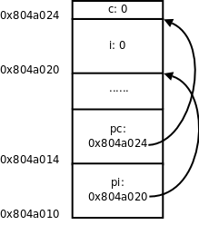
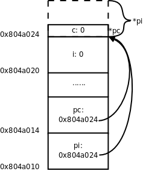
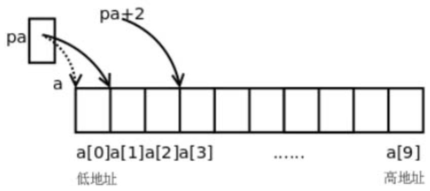
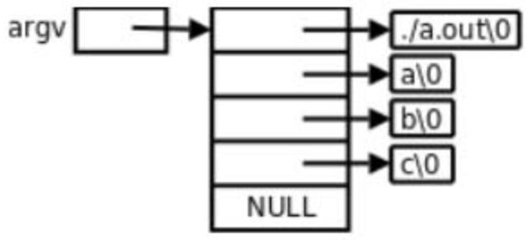
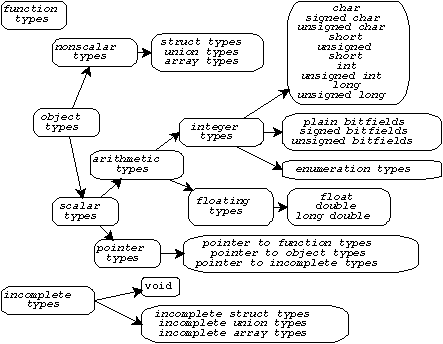

# 22. 指针

## 22.1 指针的基本概念

- 指针概念

  在第12章讲过，堆栈有栈顶指针，队列有头指针和尾指针，这些概念中的“指针”本质上是一个整数，是数组的索引，通过指针访问数组中的某个元素。

  在图19.3中我们又看到另外一种指针的概念，把一个变量所在的内存单元的地址保存在另外一个内存单元中，保存地址的这个内存单元称为指针（Pointer），访问变量要通过指针间接寻址。

- 指针定义的例子

  这种指针在C语言中可以用一个指针类型的变量表示，例如某程序中定义了以下全局变量：

  ``` c
  int i;
  int *pi = &i;
  char c;
  char *pc = &c;
  ```

  这几个变量的内存布局如图22.1所示，在初学阶段经常要借助于这样的图来理解指针。

  

  - 取地址符

    这里的&是取地址运算符（Address Operator），&i表示取变量i的地址，int *pi = &i;表示定义一个指向int型的指针变量pi，并用i的地址来初始化pi。

  - 全局变量的地址可以做常量表达式，初始化全局变量

    我们讲过全局变量只能用常量表达式来初始化，如果定义int p = i;就错了，因为i不是常量表达式。然而用i的地址来初始化一个指针却没有错，因为i的地址是在编译链接时确定的，不需要到运行时才知道，&i是常量表达式。

- 指针类型大小

  后面两行代码定义了一个字符型变量c和一个指向c的字符型指针pc，注意pi和pc虽然是不同类型的指针变量，但它们的内存单元都占4个字节，因为要保存32位的虚拟地址，同理，在64位平台上指针变量都占8个字节。

- 多个指针一起声明

  如果把多个数组放在一起声明，每个数组名后面都要有[]括号：int a[5], b[5];。

  同样道理，如果把多个指针变量放在一起声明，每个变量名前面都要有*号。例如：

  ``` c
  int *p, *q;
  ```

  如果写成`int* p, q;`就错了，这是声明了一个整型指针p和一个整型变量q，这样写很容易看错。

  比较好的写法是*号和前面的类型int之间留空格，和后面的变量名写在一起，写成`int *p, q;`就不容易看错了，很明显这是定义了一个指针和一个整型变量。

- 对指针变量重新赋地址

  如果要让pi指向另一个整型变量j，可以重新对pi赋值：

  ``` c
  pi = &j;
  ```

- 指针间接寻址运算符做 Dereference 操作

  现在要通过指针pi间接寻址到变量j，把变量j的值增加10，可以写成：

  ``` c
  *pi = *pi + 10;
  ```

  这里的`*`号是指针间接寻址运算符（Indirection Operator），`*pi`表示取指针pi所指向的变量的值，也称为Dereference操作，指针有时称为变量的引用（Reference），所以根据指针找到变量称为Dereference。

- `*` 在声明中和表达式中作用不一样

  我们知道`[]`括号用在声明中和用在表达式中有不同的含义，`[]`括号用在声明中表示声明一个数组，用在表达式中是取下标运算符。

  同样道理，*号用在声明中表示声明一个指针类型，用在表达式中是间接寻址运算符。

- `*` 和 & 互为逆运算，& 的操作数必须是左值，* 的操作数必须是指针类型

  `*`和&互为逆运算。

  &运算符的操作数必须是左值，因为只有左值才表示一个内存单元，才会有地址，运算结果是指针类型。

  `*`运算符的操作数必须是指针类型，运算结果可以做左值。

  所以，如果表达式E可以做左值，`*&E`和E等价，如果表达式E是指针类型，`&*E`和E等价。

- 指针可以相互赋值和初始化

  指针之间可以相互赋值，也可以用一个指针初始化另一个指针，例如：

  ``` c
  int *ptri = pi;
  ```

  或者：

  ``` c
  int *ptri;
  ptri = pi;
  ```

  表示pi指向哪就让ptri也指向哪，本质上就是把变量pi所保存的地址值赋给变量ptri。

  - 指针赋值时两个指针必须是同一类型的

    用一个指针给另一个指针赋值时要注意，两个指针必须是同一类型的。

    在我们的例子中，pi是`int *`型的，pc是`char *`型的，pi = pc;这样赋值就是错误的。

  - 如果不是同一类型可以强制类型转换

    但是可以先强制类型转换然后赋值，如图22.2所示。

    ``` c
    pi = (int *)pc;
    ```

    

    现在pi指向的地址和pc一样，但是通过`*pc`只能访问到一个字节，而通过`*pi`可以访问到4个字节，后3个字节已经不属于变量c了，除非你很确定变量c的一个字节和后面3个字节组合而成的int值是有意义的，否则就不应该给pi这么赋值。

- 使用指针时要小心，指针很容易指向错误的地址

  因此使用指针要特别小心，很容易将指针指向错误的地址，访问这样的地址可能导致段错误，可能读到无意义的值，也可能意外改写了某些数据，使得程序在随后的运行中出错。

- 野指针：局部指针变量没有初始化值不确定

  有一种情况需要特别注意，定义一个指针类型的局部变量而没有初始化：

  ``` c
  int main(void)
  {
      int *p;
      ...
      *p = 0;
      ...
  }
  ```

  我们知道，在栈上分配的变量初始值是不确定的，也就是说指针p所指向的内存地址是不确定的，后面用*p访问不确定的地址会导致不确定的后果，可能引发段错误，也可能意外改写了数据而导致程序在随后的运行中出错，而且后一种情况很难找到错误原因。

  像这种指向不确定地址的指针称为“野指针”（Unbound Pointer）。

- 避免出现野指针，定义指针变量时就应该初始化，可以初始化为 NULL

  为避免出现野指针，在定义指针变量时就应该明确地给它赋初值，或者把它初始化成NULL：

  ``` c
  int main(void)
  {
      int *p = NULL;
      ...
      *p = 0;
      ...
  }
  ```

  NULL在C标准库的头文件stddef.h中定义：

  ``` c
  #define NULL ((void *)0)
  ```

- 指针也是一种标量类型

  - 可以和其他标量类型可以相互强制转换

    指针也是一种标量类型，可以用()运算符做强制类型转换，其他标量类型可以转成指针类型，指针类型也可以转成其他标量类型。

  - 空指针

    比如在上面的定义中把整型的0强制转换成`void *`指针，这个指针指向0地址，称为空指针。

    操作系统不会把任何数据保存在地址0及其附近，也不会把地址0～0xfff的页面映射到物理内存，所以任何对0地址的访问（比如上面的*p = 0;）一定会引发段错误，这种错误就像放在眼前的炸弹一样很容易找到，相比之下，由野指针引起的错误就像埋下地雷一样，更难发现和排除，这次走过去没事，下次走过去就有事。

  - 指针可以做逻辑与、或、非运算的操作数和if、for、while的控制表达式

    由于指针是标量类型，因此可以做逻辑与、或、非运算的操作数和if、for、while的控制表达式，例如if (p) 语句A else 语句B，如果指针p非空则执行语句A，如果是空指针则执行语句B。

- 通用指针 void *

  讲到这里就该讲一下`void *`类型了。

  在编程时经常需要一种通用指针，可以转换成任意其他类型的指针，任意其他类型的指针也可以转换成通用指针。

  最初C语言没有`void *`类型，就把`char *`当做通用指针，需要转换时就用()运算符强制转换，ANSI在把C语言标准化时引入了`void *`类型，规定`void *`指针与其他类型的指针之间可以隐式转换，而不必用()运算符强制转换。

  - 不能定义 void 类型变量

    注意，只能定义`void *`类型的指针，而不能定义void类型的变量，因为`void *`指针和别的指针一样都占4个字节，而如果定义void型变量（即类型不确定的变量），编译器不知道该给这个变量分配几个字节。

  - void* 指针不能直接 dereference，要先转换成别的指针类型

    同样道理，`void *`指针不能直接Dereference，而必须先转换成别的类型的指针再做Dereference。

    `void *`指针常用于函数传参和传返回值，下一章讲函数接口时再分析`void *`指针的作用。

## 22.2 指针类型的参数和返回值

首先看以下程序：

``` c
#include <stdio.h>

int *swap(int *px, int *py)
{
    int temp;
    temp = *px;
    *px = *py;
    *py = temp;
    return px;
}

int main(void)
{
    int i = 10, j = 20;
    int *p = swap(&i, &j);
    printf("now i=%d j=%d *p=%d\n", i, j, *p);
    return 0;
}
```

我们知道，调用函数的传参过程相当于定义形参变量并且用实参的值来初始化，swap(&i, &j)这个调用相当于：

``` c
int *px = &i;
int *py = &j;
```

所以px和py分别指向main函数的局部变量i和j，在swap函数中读写`*px`和`*py`其实是读写main函数的局部变量i和j。尽管swap函数在它的作用域中访问不到i和j这两个变量名，却可以通过指针间接寻址到这两个变量，并且将它们的值做了交换。

上面的例子还演示了函数返回值是指针的情况，return px;语句相当于定义一个临时变量并且用px初始化：

``` c
int *tmp = px;
```

然后临时变量tmp的值成为表达式swap(&i, &j)的值，然后在main函数中又把这个值赋给了p，相当于：

``` c
int *p = tmp;
```

最后的结果是swap函数的px指向哪就让main函数的p指向哪。我们知道px指向i，所以p也指向i。

---

通过函数返回值传指针有一种常见的错误，如下面的代码所示：

``` c
int *foo(void)
{
    int a;
    ...
    return &a;
}

int main(void)
{
    int *p = foo();
    ...
}
```

foo函数的返回值是一个指向局部变量a的指针，可是foo函数返回之后它的栈帧就要释放掉，要这个指针还有什么用呢？这其实也是一种**野指针**。上面的代码错得比较明显，编译器会报警告warning: function returns address of local variable，有时候错得不那么明显，例如：

``` c
int *foo(void)
{
    int a;
    int *pa = &a;
    ...
    return pa;
}
```

编译器是不会报警告的，这就需要程序员自己多加小心了。

## 22.3 指针与数组

先看一个例子，有如下代码：

``` c
int a[10];
int *pa = &a[0];
pa++;
```

一开始指针pa里保存的是数组元素a[0]的地址，注意后缀运算符的优先级高于单目运算符，所以&a[0]是取a[0]的地址而不是取a的地址。

- 指针变量可以 ++

  然后pa++让pa指向下一个数组元素a[1]，由于pa是int *指针，一个int型元素占4个字节，所以**pa++使pa里保存的地址值加4**而不是加1。

  下面画图理解。从图22.1可以看出来，地址的具体数值其实无关紧要，关键是要说明地址之间的关系（数组a的每个元素占4个字节的内存单元，a[1]紧挨在a[0]之后）以及指针与变量之间的关系（指针里保存的是变量的地址），现在我们换一种画法，省略地址的具体数值，用方框表示内存单元，用箭头表示指针和变量之间的关系，如图22.3所示。

- 指针变量可以加减整数

  既然指针可以用++运算符，当然也可以用+和-运算符，pa+2这个表达式也是有意义的，如图22.3所示，pa指向a[1]，那么pa+2指向a[3]。

- (*((E1)+(E2))) 和 E1[E2] 当 E1 是指针时等价

  事实上，E1[E2]这种写法和`(*((E1)+(E2)))`是等价的，*(pa+2)也可以写成pa[2]，pa可以像数组名一样使用。

  

- (*((E1)+(E2))) 和 E1[E2] 当 E1 是数组名时也等价

  其实对于`*`和`[]`运算符来说数组类型和指针是统一的，在第8.1节讲过数组类型做右值时自动转换成指向首元素的指针，a做右值时自动转换成指向a[0]的`int *`指针，所以a[2]也可以写成`*(a+2)`，本质上都是通过指针间接寻址访问元素。

- E1[E2] = `(*((E1)+(E2)))` = `(*((E2)+(E1)))` = E2[E1]

  由于`(*((E1)+(E2)))`显然可以写成`(*((E2)+(E1)))`，所以E1[E2]也可以写成E2[E1]，这意味着2[a]、2[pa]这种写法也是对的，但一般不这么写。

- a 做右值时就是 &a[0]

  另外，由于a做右值使用时和&a[0]是一个意思，所以`int *pa = &a[0];`通常写成更简洁的形式int *pa = a;。

- 数组下标为负数是合法的

  在第8.1节还讲过C语言允许数组下标是负数，现在你该明白为什么这样规定了。

  在上面的例子中，表达式pa[-1]（或者写成*(pa-1)）是合法的，它和a[0]表示同一个元素。

- 两个指针只有指向同一个数组中的元素才能比较；只有指向数组元素的指针才能加减常数

  现在猜一下，两个指针变量做比较运算（> >= < <= == !=）表示什么意义？两个指针变量做减法运算又表示什么意义？

  根据什么来猜？根据第3.3节讲过的Rule of Least Surprise原则。

  你理解了指针和常数相加减的概念，再根据以往使用比较运算的经验，就应该猜到pa + 2 > pa，pa - 1 == a，所以指针之间的比较运算比的是地址。

  C语言正是这样规定的，不过C语言的规定更为严谨，只有指向同一个数组中元素的指针之间相互比较才有意义，也只有指向数组元素的指针加或减一个常数才有意义，否则都是Undefined。

- 两个指针只有指向同一个数组中的元素才能相减

  那么两个指针相减表示什么？pa - a等于几？

  因为pa - 1 == a，所以pa - a显然应该等于1，而a - pa应该等于-1，指针相减表示两个指针之间相差的元素个数，同样只有指向同一个数组中元素的指针之间相减才有意义，相减的结果是ptrdiff_t类型，这个类型名在stddef.h中定义，是一种有符号整型。

- 两个指针不能相加

  两个指针相加表示什么？

  想不出来能有什么意义，因此C语言也规定两个指针不能相加。

  假如C语言为指针相加也规定了一种意义，那就相当Surprise了，不符合一般的经验。

  无论是设计编程语言还是设计函数接口或人机界面都是这个道理，应该尽量让用户根据以往的经验知识就能推断出该系统的基本用法。

- 数组类型做右值时就是指针，做左值时和指针有区别

  数组类型做右值时和指针的语法是统一的，但如果把数组类型做左值使用，和指针就有区别了。

  例如++pa是合法的，但++a就不合法，pa = a + 1是合法的，但a= pa + 1就不合法。

  数组类型做左值时表示整个数组的存储空间，++a相当于a += 1，+=左右两边的操作数类型不符，不能给整个数组加上1，就像不能给整个结构体加上1一样，因为它们不是标量类型。

  同样道理a = pa + 1也是左右两边类型不符，=号左边是数组类型，而=号右边是指针类型。

  数组类型做左值支持&运算符，所以&a是合法的，这个表达式的类型是指向数组的指针，我们将在第22.7节介绍这种类型。

  另外要注意，sizeof a这个表达式中数组名a不是做右值，计算结果是整个数组的存储空间大小，而sizeof pa求一个指针pa的存储空间大小，计算结果应该是4个字节。

- 函数参数如果写成数组类型，实际上是指针类型

  在第8.1节讲过，在函数原型中，如果参数写成数组的形式，则该参数实际上是指针类型。例如：

  ``` c
  void func(int a[10])
  {
      ...
  }
  ```

  其实等价于：

  ``` c
  void func(int *a)
  {
      ...
  }
  ```

  第一种形式方括号中的数字也可以不写，仍然是等价的：

  ``` c
  void func(int a[])
  {
      ...
  }
  ```

  - 两种形式对编译器来说没区别，对人来说有区别

    参数写成指针形式还是数组形式对编译器来说没区别，这个参数都是指针类型，之所以规定两种形式是为了给读代码的人提供有用的信息，如果这个参数指向一个元素，通常写成指针的形式，如果这个参数指向一串元素中的首元素，则经常写成数组的形式。

## 22.4 指针与const限定符

const限定符和指针结合起来常见的情况有以下几种。

### 指针声明

- 指针类型声明的*号前面加const。例如：

  ``` c
  const int *a;
  int const *a;
  ```

  这两种写法一样，a是一个指向const int型的指针，a所指向的内存单元不可改写，所以(*a)++是不允许的，但指针a本身可以改写，即a可以指向别的内存单元，a++是允许的。

- 指针类型声明的*号后面加const。例如：

  ``` c
  int *const a;
  ```

  a是一个指向int型的const指针，*a是可以改写的，但a本身不允许改写。

- 指针类型声明的*号前后都加const。例如：

  ``` c
  int const *const a;
  const int *const a;
  ```

  这两种写法一样，a是一个指向const int型的const指针，*a和a本身都不允许改写。

### 指针赋值、初始化、穿参

在赋值、初始化或函数调用传参过程中，假设要把指针p赋给指针q，应注意const限定符的语义作用：

- 如果p指向的类型不带有const限定，而q指向的类型带有const限定，则可以把p赋给q，例如：

  ``` c
  char c = 'a';
  const char *q = &c;
  ```

  表达式&c是`char *`型的，而q是`const char *`型的，可以赋值，赋值后`*q`不允许改写，即不能通过指针q来改写变量c的值。

- 如果p指向的类型带有const限定，而q指向的类型不带有const限定，则不能把p赋给q，例如对下面的代码编译器会报警告：

  ``` c
  const char c = 'a';
  char *q = &c;
  ```

  表达式&c是`const char *`型的，而q是`char *`型的，假如允许赋值，则赋值后就可以通过指针q来改写变量c的值，等于绕过了变量c的const限定这道防线，这是很危险的，如果变量c被分配在.rodata段，改写它会导致段错误，因此编译器不允许这样赋值。

- 如果p和q指向的类型都带有const限定，或者都不带有const限定，则可以把p赋给q，这是理所当然的。

### 要把 p 赋给 q，q 指向的类型限定要比 p 指向的类型限定更加严格或一样严格

事实上，在指针赋值过程中volatile和restrict限定符也有和const限定符类似的作用，用一句话概括就是：要想把指针p赋给指针q，q指向的类型应该比p指向的类型限定得更严格，或至少是同样严格，而不能比p指向的类型限定得更宽松。

### 尽量使用 const 限定符

即使不用const限定符也能写出功能正确的程序，但良好的编程习惯应该尽量使用const限定符，理由是：

1.  const给读代码的人传达非常有用的信息。

    比如一个函数的形参是`const char *`指针，你在调用这个函数时就可以放心地传给它`char *`或`const char *`指针，而不必担心指针所指的内存单元被改写，因为该函数无法通过它的形参改写你传给它的内存单元。

2.  把程序中不该变的变量都加上const限定符，可以依靠编译器检查程序的Bug，防止运行时意外改写了不该变的数据。

3.  const对编译器优化是一个有用的提示，编译器也许会把const变量优化成常量。

    在第8.4节提到，字符串字面值和数组类型相似，做右值使用时自动转换成指向首元素的指针，字符串中的元素是char型的，因此指向首元素的指针应该是char *型。

    如果改写字符串字面值中的元素会怎么样呢？对此C标准没有明确规定（Undefined）。

    在第8.4节讲过，如果在代码中直接通过下标改写字符串字面值中的元素，gcc会报错，那么这样行不行呢：

    ``` c
    char *p = "abcd";
    p[1] = 'B';
    ```

    这样可以绕过编译器的检查，在编译时不报错，但在运行时却出现段错误。

    在第18.3节我们看到，gcc把这种字符串字面值分配在.rodata段，在运行时.rodata段加载到Text Segment，操作系统会保护Text Segment不被改写，因此改写它会导致段错误。

    综上所述，按照C标准，字符串字面值做右值时自动转换成`char *`指针，但在gcc的实现中字符串字面值是只读的，因此字符串字面值做右值时应看作`const char *`指针。

    ---

    我们知道printf函数原型的第一个参数是`const char *`型，可以把`char *`或`const char*`指针传给它，所以下面这些调用都是合法的：

    ``` c
    const char *p = "abcd";
    const char str1[5] = "abcd";
    char str2[5] = "abcd";
    printf(p);
    printf(str1);
    printf(str2);
    printf("abcd");
    ```

    注意上面的printf(p)和printf(str2)调用在编译时会报警告warning: format not a string literal and no format arguments，编译器认为用printf(p)这种形式打印一个字符串是危险的，因为字符串中可能包含%号而被printf当成转换说明，printf并不知道后面没有传其他参数，照样会从栈帧上取参数（第23.6节会详细解释怎样从栈帧上取可变参数），从而造成非法内存访问。

    比较保险的写法是printf("%s", p)。

## 22.5 指针与结构体

- 定义结构体类型、结构体变量、结构体指针

  首先定义一个结构体类型，然后定义这种类型的变量和指针：

  ``` c
  struct unit {
      char c;
      int num;
  };
  struct unit u;
  struct unit *p = &u;
  ```

- 通过结构体指针访问结构体成员

  要通过指针p访问结构体成员可以写成`(*p).c`和`(*p).num`，为了书写方便，C语言提供了->运算符，也可以写成p->c和p->num。

- 有 . 或 -> 是否是左值

  在第7.1节讲过，由.运算符组成的表达式能不能做左值取决于.运算符左边的操作数能不能做左值。

  ->运算符则不同，由->运算符组成的表达式一定能做左值，想一想为什么。

## 22.6 指向指针的指针与指针数组

### 指针可以指向指针

先前我们用指针指向int或char型，但指针也可以指向复合类型，比如指向另外一个指针类型的变量，这称为指向指针的指针。

``` c
int i;
int *pi = &i;
int **ppi = &pi;
```

这样定义之后，表达式*ppi取pi的值，表达式**ppi取i的值。请读者自己画图理解i、pi、ppi这三个变量之间的关系。

### 指向「指向指针的指针」的指针

很自然地，也可以定义指向“指向指针的指针”的指针，但是很少用到：

``` c
int ***p;
```

### 定义指针数组

数组中的每个元素也可以是指针类型。

例如定义一个数组a由10个元素组成，每个元素都是int *指针：

``` c
int *a[10];
```

这称为指针数组。

### 指针数组和指向指针的指针

int *a[10];和int **pa;之间的关系类似于int a[10];和int *pa;之间的关系：a是由一种元素组成的数组，pa则是指向这种元素的指针。所以，如果pa指向a的首元素：

``` c
int *a[10];
int **pa = &a[0];
```

则pa[0]和a[0]取的是同一个元素，唯一比原来复杂的地方在于元素的类型是int *指针，而不是基本类型。

### argc 和 char *argv[]

我们知道main函数的标准原型应该是`int main(int argc, char *argv[]);`。

argc是命令行参数（或者叫命令行选项）的个数。

而argv是一个指向指针的指针，为什么不是指针数组呢？因为前面讲过，函数原型中的[]表示指针而不表示数组，等价于`char **argv`。

那为什么要写成char *argv[]而不写成char **argv呢？这样写给读代码的人提供了有用的信息，argv不是指向单个指针，而是指向一个指针数组的首元素。数组中每个元素都是char *指针，指向一个命令行参数字符串。

``` c
#include <stdio.h>

int main(int argc, char *argv[])
{
    int i;
    for(i = 0; i < argc; i++)
        printf("argv[%d]=%s\n", i, argv[i]);
    return 0;
}
```

编译执行：

``` console
$ gcc main.c
$ ./a.out a b c
argv[0]=./a.out
argv[1]=a
argv[2]=b
argv[3]=c
$ ln -s a.out printargv
$ ./printargv d e
argv[0]=./printargv
argv[1]=d
argv[2]=e
```

注意程序名也算一个命令行参数，所以执行./a.out a b c这个命令时，argc是4，argv如图22.4所示。



由于argv[4]是NULL，我们也可以这样循环遍历argv：

``` c
for (i = 0; argv[i] != NULL; i++)
```

---

NULL标识着argv的结尾，这个循环碰到NULL就结束，因而不会访问越界，这种用法很形象地称为Sentinel，NULL就像一个哨兵守卫着数组的边界。

---

在这个例子中我们还看到，如果给程序建立符号链接，然后通过符号链接运行这个程序，就可以得到不同的argv[0]。

通常，程序会根据不同的命令行参数做不同的事情，例如ls -l和ls -R打印不同格式的文件列表，有些程序会根据不同的argv[0]做不同的事情，例如专门针对嵌入式系统的开源项目Busybox，将各种Linux命令裁剪后集于一身，编译成一个可执行文件busybox，安装时将busybox程序拷到嵌入式系统的/bin目录下，同时在/bin、/sbin、/usr/bin、/usr/sbin等目录下创建很多指向/bin/busybox的符号链接，命名为cp、ls、mv、ifconfig等，不管执行哪个命令其实最终都在执行/bin/busybox，它会根据argv[0]来扮演不同的命令。

### gdb 调试时加命令行参数

最后补充介绍一下用gdb调试时如何加命令行参数。

用gdb调试上面的代码：

``` console
$ gcc main.c -g
$ gdb a.out
GNU gdb (GDB) 7.1-ubuntu
Copyright (C) 2010 Free Software Foundation, Inc.
License GPLv3+: GNU GPL version 3 or later <http://gnu.org/licenses/gpl.html>
This is free software: you are free to change and redistribute it.
There is NO WARRANTY, to the extent permitted by law.  Type "show copying"
and "show warranty" for details.
This GDB was configured as "i486-linux-gnu".
For bug reporting instructions, please see:
<http://www.gnu.org/software/gdb/bugs/>...
Reading symbols from /home/juhan/22/a.out...done.
(gdb) run a b c
Starting program: /home/juhan/22/a.out a b c
argv[0]=/home/juhan/22/a.out
argv[1]=a
argv[2]=b
argv[3]=c

Program exited normally.
(gdb) start d e f
Temporary breakpoint 1 at 0x80483ed: file main.c, line 6.
Starting program: /home/juhan/22/a.out d e f

Temporary breakpoint 1, main (argc=4, argv=0xbffff7a4) at main.c:6
6           for(i = 0; i < argc; i++)
(gdb) c
Continuing.
argv[0]=/home/juhan/22/a.out
argv[1]=d
argv[2]=e
argv[3]=f

Program exited normally.
(gdb) set args h i j
(gdb) r
Starting program: /home/juhan/22/a.out h i j
argv[0]=/home/juhan/22/a.out
argv[1]=h
argv[2]=i
argv[3]=j

Program exited normally.
```

可以在run或start命令后面加命令行参数，也可以用set args命令设置命令行参数之后再用run或start运行程序。

## 22.7 指向数组的指针与多维数组

指针可以指向复合类型，上一节讲了指向指针的指针，这一节学习指向数组的指针。

- 指向数组的指针

  以下定义一个指向数组的指针，这种数组由10个int元素组成：

  ``` c
  int (*a)[10];
  ```

- 区分 pointer to array 和 array of pointer

  和上一节指针数组的定义`int *a[10];`相比，仅仅多了一个()括号。

  如何记住和区分这两种定义呢？我们可以认为`[]`括号比`*`号有更高的优先级（和运算符类似，后缀比前缀优先级高），如果a先和`*`号结合则表示a是一个指针，如果a先和`[]`括号结合则表示a是一个数组。

  `int *a[10];`这个定义可以拆成两句：

  ``` c
  typedef int *t;
  t a[10];
  ```

  t代表`int *`类型，a则是由这种类型的元素组成的数组。

  `int (*a)[10];`这个定义也可以拆成两句：

  ``` c
  typedef int t[10];
  t *a;
  ```

  t代表由10个int组成的数组类型，a则是指向这种类型的指针。

- 指向数组的指针和一维数组的关系

  现在看指向数组的指针如何使用：

  ``` c
  int a[10];
  int (*pa)[10] = &a;
  ```

  a是一个数组，在&a这个表达式中，数组类型做左值，取整个数组的首地址赋给指针pa。

  注意，&a[0]表示数组a的首元素的首地址，而&a表示数组a的首地址，虽然这两个地址的数值相同，但这两个表达式的类型是两种不同的指针类型，前者的类型是`int *`，而后者的类型是`int (*)[10]`。

  `*pa`就表示pa所指向的数组a，`*pa`做右值时也会自动转换成指向数组首元素的指针，所以取数组的a[0]元素也可以用表达式`(*pa)[0]`。注意到`*pa`可以写成pa[0]，所以`(*pa)[0]`这个表达式可以改写成pa[0][0]，pa就像一个二维数组的名字。

- 指向数组的指针和二维数组的关系

  下面分析一下指向数组的指针和二维数组是什么关系。

  `int a[5][10];`和`int (*pa)[10];`之间的关系同样类似于`int a[10];`和`int *pa;`之间的关系：a是由一种元素组成的数组，pa则是指向这种元素的指针。

  所以，如果pa指向a的首元素：

  ``` c
  int a[5][10];
  int (*pa)[10] = &a[0]; //&*(a + 0)
  ```

  则pa[0]和a[0]取的是同一个元素，唯一比原来复杂的地方在于元素的类型是int[10]数组，而不是基本类型。

  这样，我们可以把pa当成二维数组名来使用，pa[1][2]和a[1][2]取的也是同一个元素，而且pa比a用起来更灵活，数组类型不支持赋值、自增等运算，而指针可以支持，pa++使pa跳过二维数组的一行（40个字节），指向a[1]的首地址。

## 22.8 函数类型和函数指针类型

### pointer to function

在C语言中，函数也是一种类型，可以定义指向函数的指针。我们知道，指针变量的内存单元里存放一个地址值，而函数指针的内存单元里存放的就是函数的入口地址（位于.text段）。

### pointer to function 例子

下面看一个简单的例子：

``` c
#include <stdio.h>

void say_hello(const char *str)
{
    printf("Hello %s\n", str);
}

int main(void)
{
    void (*f)(const char *) = say_hello;
    f("Guys");
    return 0;
}
```

- 函数指针声明

  分析一下变量f的类型声明`void (*f)(const char *)`，f首先跟\*号结合在一起，因此是一个指针。`(*f)`外面是一个函数原型的格式，参数是`const char *`，返回值是void，所以f是指向这种函数的指针。

  而say_hello函数的参数是`const char *`，返回值是void，正好是这种函数，因此f可以指向say_hello函数。

- 函数类型自动类型转换

  注意，表达式say_hello是一种函数类型，函数类型和数组类型相似，做右值使用时自动转换成函数指针类型，因此可以直接赋给f，也可以写成`void (*f)(const char *) = &say_hello;`，把函数say_hello先取地址再赋给f，就不需要自动类型转换了。

- 函数调用运算符要求操作数是函数指针

  数组取下标运算符`[]`要求操作数是指针类型，a[1]等价于`*(a+1)`，如果a是数组类型则要自动转换成指向首元素的指针类型。

  同样道理，函数调用运算符()要求操作数是函数指针类型，所以f("Guys")是最直接的写法，而say_hello("Guys")或(*f)("Guys")则是把函数类型自动转换成函数指针类型然后做函数调用。

### 区分函数类型和函数指针类型

下面再举几个例子区分函数类型和函数指针类型。

- typedef 函数类型 F

  首先定义函数类型F：

  ``` c
  typedef int F(void);
  ```

  这种类型的函数不带参数，返回值是int。

- F f,g 可以

  那么可以这样声明f和g：

  ``` c
  F f, g;
  ```

  相当于声明：

  ``` c
  int f(void);
  int g(void);
  ```

- F h(void) 不行

  下面这个函数声明是错误的：

  ``` c
  F h(void);
  ```

  因为一个函数可以返回void类型、标量类型、结构体或联合体，但不能返回函数类型，也不能返回数组类型。

- F *e(void) 可以

  而下面这个函数声明是正确的：

  ``` c
  F *e(void);
  ```

  函数e返回一个F *类型的函数指针，函数指针是标量类型，可以做函数的返回值。

  如果给e多套几层括号仍然表示同样的意思：

  ``` c
  F *((e))(void);
  ```

- F *fp 可以

  但如果把*号也套在括号里就不一样了：

  ``` c
  int (*fp)(void);
  ```

  这样声明的fp是一个函数指针而不是函数。

  也可以这样声明：

  ``` c
  F *fp;
  ```

- typedef 函数指针类型 FP

  现在给这种函数指针起一个类型名叫FP：

  ``` c
  typedef int (*FP)(void);
  ```

- 将一个整数强制转换成函数指针，然后调用函数

  假设有一个地址0x12345678正好是这样一个函数的首地址，我们把它强制转换成一个函数指针并调用它，以下两种写法皆可：

  ``` c
  ((FP)0x123456789)();
  (*(FP)0x123456789)();
  ```

  不用类型名FP也可以写出强制转换运算符：

  ``` c
  ((int (*)(void))0x123456789)();
  (*(int (*)(void))0x123456789)();
  ```

### 辨析函数类型和函数指针类型的程序

下面这段程序（感谢xinwu网友提供）对于辨析函数类型和函数指针类型也非常有帮助：

``` c
#include <stdio.h>

void hello(void)
{}

int main(void)
{
    void (*hello_ptr)(void);

    printf("hello:%p\n", hello);
    printf("&hello:%p\n", &hello);
    printf("*hello:%p\n", *hello);

    hello_ptr = hello;
    printf("hello_ptr = hello;\n");

    printf("hello_ptr:%p\n", hello_ptr);
    printf("&hello_ptr:%p\n", &hello_ptr);
    printf("*hello_ptr:%p\n", *hello_ptr);

    return 0;
}
```

### 函数指针的用处

“低耦合，高内聚”（Low Coupling, High Cohesion）是程序设计的一条基本原则，这样可以更好地复用现有代码，更容易维护。

另外，这种实现用数据（函数指针数组）取代了代码（if ... else ...），和例8.4有异曲同工之处，也是应用了Data-driven Programming的思想。

## 22.9 不完全类型和复杂声明

现在C语言的语法基本讲完了，我们完整地总结一下C语言的各种类型。图22.5出自参考文献[4]。



C语言的类型分为函数类型、对象类型和不完全类型三大类。

对象类型又分为标量类型和非标量类型。

### 不完全类型

不完全类型是暂时没有完全定义好的类型，编译器不知道这种类型该占几个字节的存储空间，例如：

``` c
struct s;
union u;
char str[];
```

- 数组

  在同一个编译单元里，具有不完全类型的变量可以通过多次声明组合成一个完全类型，比如将数组str先后声明两次：

  ``` c
  extern char str[];
  extern char str[10];
  ```

  这两次声明可能来自两个不同的头文件，这两个头文件都被包含到同一个编译单元里。当编译器碰到第一个声明时，认为str的类型是不完全类型，碰到第二个声明时就组合成完全类型了，如果编译器处理到编译单元的末尾仍然无法将str的类型组合成一个完全类型就会报错。

- 结构体中可以有 pointer to incomplete type

  再说说不完全的结构体类型，看一个例子：

  ``` c
  struct s {
      struct t *pt;
  };

  struct t {
      struct s *ps;
  }
  ```

  struct s和struct t各有一个指针成员指向另一种类型。编译器从前到后依次处理，当看到`struct s { struct t* pt;};`时，认为struct t是一个不完全类型，pt是一个指向不完全类型的指针，尽管如此，这个指针却是完全类型，因为不管什么指针都占4个字节存储空间，这一点很明确。然后编译器又看到`struct t { struct s *ps;};`，这时struct t有了完整的定义，就组合成一个完全类型了，pt的类型就组合成一个指向完全类型的指针。由于struct s在前面有完整的定义，所以`struct s *ps;`也定义了一个指向完全类型的指针。

- 结构体中不能有 incomplete type

  这样的类型定义是错误的：

  ``` c
  struct s {
      struct t ot;
  };

  struct t {
      struct s os;
  }
  ```

  编译器看到struct s { struct t ot;};时，认为struct t是一个不完全类型，无法定义成员ot，因为不知道它该占几个字节。

  所以结构体中可以递归地定义指针成员，但不能递归地定义变量成员，你可以设想一下，假如允许递归地定义变量成员，struct s中有一个struct t，struct t中又有一个struct s，struct s又中有一个struct t，这就成了一个无穷递归的定义。

- 结构体引用自身

  以上是两个结构体相互引用构成的递归定义，一个结构体引用自身也可以构成递归定义：

  ``` c
  struct s {
      char data[6];
      struct s* next;
  };
  ```

  当编译器处理到第一行struct s {时，认为struct s是一个不完全类型，当处理到第三行struct s *next;时，认为next是一个指向不完全类型的指针，当处理到第四行};时，struct s成了一个完全类型，next也成了一个指向完全类型的指针。

  类似这样的结构体是很多种数据结构的基本组成单元，如链表、二叉树等，我们将在第25章详细介绍。
