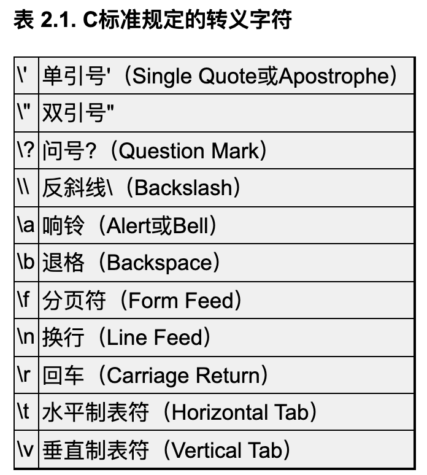

# 全书总结

## 重要的概念

- [C 语言标准](part-1/chapter-2.md#C-语言标准)
- [组合](part-1/chapter-2.md#目前学过的语法规则)
- [Side Effects](part-1/chapter-3.md#Side-Effects)
- [函数和过程](part-1/chapter-3.md#自定义函数语法规则)
- [Rule of Lease Surprise](part-1/chapter-3.md#带参数函数的定义和声明)
- [Rationale](part-1/chapter-3.md#带参数函数的定义和声明)
- [函数也叫接口](part-1/chapter-3.md#形参和实参)
- [Man Page](part-1/chapter-3.md#Man-Pages)
- [谓词](part-1/chapter-4.md#谓词)
- [代码路径、Dead Code](part-1/chapter-5.md#代码路径和-dead-code)
- [增量式开发](part-1/chapter-5.md#增量式开发)
- [手脚架](part-1/chapter-5.md#手脚架)
- [复用代码](part-1/chapter-5.md#复用代码，避免重复写代码)
- [函数的分层设计](part-1/chapter-5.md#函数的分层设计)
- [Leap of Faith](part-1/chapter-5.md#递归函数)
- [完备的 C 语言子集](part-1/chapter-5.md#目前学到的语法已经完备)
- [函数式编程和命令式编程](part-1/chapter-6.md#比较递归和循环)
- [goto 语句的危害](part-1/chapter-6.md#goto-语句)
- [学习编程语言时要注意的三方面](part-1/chapter-7.md#学习编程语言时要注意的三个方面)
- [数据抽象和抽象层](part-1/chapter-7.md#数据抽象)
- [硬编码](part-1/chapter-8.md#硬编码)
- [Epoch](part-1/chapter-8.md#8.3-数组应用实例：直方图)
- [Row-Major and Column-Major](part-1/chapter-8.md#初始化二维数组)
- [数据驱动的编程](part-1/chapter-8.md#数据驱动的编程)
- [代码是写给人看的](part-1/chapter-9.md#9.-编码风格)
- [UNIX 标准字符终端长宽](part-1/chapter-9.md#9.-编码风格)
- [Loop Invariant](part-1/chapter-11.md#11.2-插入排序)
- [Design by Contract](part-1/chapter-11.md#11.6-折半查找)
- [断言](part-1/chapter-11.md#11.6-折半查找)
- [算法 + 数据结构 = 程序](part-1/chapter-12.md#12.1-数据结构的概念)
- [Class Invariant](part-1/chapter-12.md#12.2-堆栈)
- [Implementation-Defined, Unspecified, and Undefined](part-2/chapter-14.md#Implementation-Defined,-Unspecified,-and-Undefined)
- [Magic Number](part-2/chapter-17.md#目标文件)
- [POSIX 和 SUS](part-2/chapter-18.md#UNIX-标准)
- [对齐](part-2/chapter-18.md#结构体)
- [ABI](part-2/chapter-18.md#ABI)
- [进程地址空间](part-2/chapter-19.md#进程地址空间)
- [虚拟内存的作用](part-2/chapter-19.md#虚拟内存管理机制的作用)
- [Don't Repeat Yourself 原则](part-2/chapter-21.md#重复信息应该自动维护)
- [Sentinel](part-2/chapter-22.md#argc-和-char-*argv[])
- [低耦合，高内聚](part-2/chapter-22.md#函数指针的用处)
- [High-Order Function](part-2/chapter-23.md#23.5-回调函数)
- [句柄](part-2/chapter-24.md#fopen/fclose)
- [封装](part-2/chapter-24.md#fopen/fclose)
- [EOF](part-2/chapter-24.md#fopen/fclose))
- [Stream](part-2/chapter-24.md#以字符串为单位的-I/O-函数)

## 标识符

### 标识符种类

变量名、函数名、函数参数名、标号、Tag、结构体成员名、宏定义、typedef 类型名。

### 标识符作用域

一个标识符的作用域基本上只用看标识符是在函数外声明的还是 {} 内声明的，如果标识符前面有 specifier 和 qualifier，标识符的作用域和 specifier 和 qualifier 没有任何关系。

详细见[标识符的作用域](part-2/chapter-18.md#标识符的作用域)。

- 函数作用域，标识符在函数内声明，整个函数中都有效

  只有标号属于函数作用域。

- 文件作用域，标识符在函数外声明，从声明的位置到编译单元末尾都有效

- 块作用域，标识符在 {} 中声明，从声明的位置到 } 都有效

- 函数原型作用域，标识符在函数原型（非函数定义）中声明，从声明的位置到原型结束前都有效

### 标识符命名空间

同一命名空间的重名标识符，内层作用域的标识符将覆盖外层作用域的标识符。

详细见[标识符的命名空间](part-2/chapter-18.md#标识符的命名空间)。

- 标号单独属于一个命名空间

- struct、enum、union 的 Tag 属于一个命名空间

- struct、union 的成员名属于一个命名空间

- 其他所有标识符属于一个命名空间

  如果宏定义和其他标识符重名，宏定义覆盖其他所有标识符，因为宏定义在预处理阶段先处理，而其他标识符在编译阶段处理。

### 标识符链接属性

详细见[标识符的链接属性](part-2/chapter-18.md#标识符的链接属性)。

- 外部链接

  具有External Linkage的标识符编译后在目标文件中是全局符号。

  如果同一个符号出现在多个编译单元编译成的目标文件中，且所有目标文件中这个符号都是全局的，那么把目标文件链接在一起后，这些符号都被换成了相同的一个提供符号定义的地址。

- 内部链接

  具有Internal Linkage的标识符编译后在目标文件中是局部符号，在链接时不做符号解析。

- 无链接

  具有无链接的标识符不会出现在目标文件的符号表中。

### 变量的生存期

变量的分配位置只和变量生存期有关。

详细见[变量的生存期](part-2/chapter-18.md#变量的生存期)。

- 静态生存期

  在程序开始执行时分配内存和初始化，此后便一直存在直到程序结束。这种变量通常位于.rodata、.data或.bss段。

- 自动生存期

  这种变量在进入块作用域时在栈上或寄存器中分配，在退出块作用域时释放。

- 动态分配生存期

### 标识符属性总结

- 标识符的属性

  一个标识符有：

  - 作用域
  - 命名空间
  - 链接属性

- 变量的属性

  如果标识符是变量，还有：

  - 生存期

- 变量声明前面的 specifier 和 qualifier

  - storage class specifier

    - static

    - extern

    - auto

      auto 不能修饰文件作用域的变量。

    - register

      register 不能修饰文件作用域的变量。

    - typedef

  - type qualifier

    - [const](part-2/chapter-18.md#函数体外-const-变量)

      const 可以限定 file scope 中和 block scope 中的变量。

      const 限定的变量不能更改。

    - [volatile](part-2/chapter-18.md#volatile-限定符)

    - restrict

  - type specifier

- 函数声明前面的 specifier 和 qualifier

  - storage class specifier

    - static
    - extern

  - function specifier

    - [inline](part-2/chapter-20.md#内联函数)

  - type qualifier

    - const
    - volatile
    - restrict

  - type specifier

- 判断标识符的链接属性和生存期

  一个标识符的作用域和命名空间很容易判断，但是链接属性和生存期（如果标识符是变量）不好判断。

  - 函数的链接属性判断

    被声明的函数的链接属性只由它的 storage class 和 scope 决定。

    

    链接属性决定了函数对应的符号在符号表里是是 GLOBAL 还是 LOCAL。

    previous linkage 的意思是当前声明的这个标识符具有什么样的Linkage取决于该编译单元中前面对这个标识符的声明（而且必须是文件作用域的声明），如果在前面找不到这个标识符的声明，即当前声明是该编译单元中对这个标识符的第一次声明，那么这个标识符具有External Linkage；否则标识符的 linkage 就是标识符之前被声明时有的 linkage。

    can define 表示 declaration 同时也可以是 definition。显然，函数可以在 file scope 中定义，不可以在 block scope 中定义。

    block scope 中不允许用 static 声明函数。

  - 变量的链接属性和生存期判断

    被声明的变量的链接属性和生存期只由它的 storage class（extern/static）和 scope 决定。

    

    - 第一行描述变量的链接属性

      链接属性决定了变量对应的符号在符号表里是否存在，如果存在是 GLOBAL 还是 LOCAL。

    - 第二行描述变量的生存期

      如果一个变量定义有 static duration，而变量定义还有 const 限定，那么变量分配在可执行文件 .rodata 段中；如果一个变量定义有 static duration，并且已经初始化为非 0，那么变量分配在可执行文件 .data 段；如果一个变量定义有 static duration，初始化为 0 或未初始化，那么变量分配在可执行文件 .bss 段。

      如果一个变量定义有 automatic duration，那么变量根据定义是否有 auto/register 修饰分配在栈或寄存器中。

    - 第三行描述变量该如何初始化

      static initializer 表示 initializer 只能使用常量表达式，表达式的值必须在编译时确定；

      dynamic initializer 表示 initializer 中可以使用任意右值表达式，表达式的值可以在运行时计算。

    - 第四行描述这种声明是否算定义

      先看 block scope declaration，用 none 和 static 修饰声明时，声明可以初始化也可以不初始化，声明都会给变量分配空间，声明都是定义。如果不初始化，用 none 修饰的变量是栈或寄存器中随机的值，用 static 修饰的变量是 .bss 段中的 0；用 extern 修饰声明时，声明一定不能初始化，不然会报错。所以这个声明不会给变量分配空间。

      再看 file scope declaration，用 none 和 static 修饰声明时，声明可以初始化也可以不初始化，声明都会给变量分配空间，声明都是定义。如果不初始化，这种定义叫做 tentative definition。编译器认为这个变量是在该编译单元中定义的，但初始值待定，然后继续编译下面的代码，到整个编译单元编译结束时如果没有遇到这个变量的带初始化的定义，就用0来初始化它，不初始化的变量存在 .bss 段中。

      用 extern 修饰声明时，声明根据 C99 可以初始化，声明会给变量分配空间，这个声明也就是一个定义，gcc 对这种情况会报警告，但可以正常执行。如果不初始化，那么这个声明就只是声明，不给变量分配空间。

    - gcc 和 C99 的差异

      表中标有 [*] 的单元格意思是，对于文件作用域的 extern 变量声明，C99 允许带 initializer，并认为它是一个定义。但是gcc对于这种写法会报警告，为了兼容性应避免这种写法。

      gcc对于Tentative Definition的处理也和C99的规定不一致。比如在foo.c中用int i;定义一个变量i，是Tentative Definition，C99规定这个变量应该在foo.c中定义，初始值是0，而gcc编译的结果是：

      ``` console
      $ gcc -c foo.c
      $ nm foo.o
      00000004 C i
      ```

      符号i的类型是Common，nm(1)中说Common符号的定义在链接时确定。如果bar.c中定义int i = 1;，则foo.c和bar.c链接在一起时foo.c的那个只能算声明而不算定义。如果bar.c中也定义int i;，也是一个Tentative Definition，则foo.c和bar.c链接在一起时才定义变量i，并且用0初始化。也就是说，C99对Tentative Definition的处理是在编译一个单元时做，而gcc是推迟到链接时才做。如果编译时加上-fno-common选项则不会生成Common符号，gcc对Tentative Definition的处理就和C99一致了。

## 源代码组成

### 函数体外

函数体外可以出现声明和预处理指示。

#### 声明

> 语句只能出现在函数体中，而声明既可以出现在函数体中也可以出现在所有函数之外。

- 变量定义（变量初始化）

  定义在所有函数体之外的变量叫做全局变量。

  全局变量只能用常量表达式（由常量组成的表达式）来初始化。

  如果全局变量在定义时不初始化则初始值是 0。

  更详细的判断变量属性的方法见[标识符属性总结](#标识符属性总结)。

- 变量声明

  更详细的判断变量属性的方法见[标识符属性总结](#标识符属性总结)。

- 函数声明、函数定义

- 类型声明

  - struct
  - enum
  - union
  - typedef

#### 预处理指示

一个预处理指示写成多行必须用\斜线续行，具体见[预处理指示严格定义](from-c-to-process.md#预处理指示严格定义)。

- `#include`

  > #include 包含的头文件通常位于 /usr/include 目录。

  - `#include <xxx.h>`

    gcc首先查找-I选项指定的目录；-I选项可以指定相对路径也可以指定绝对路径，如果指定相对路径，它是相对于gcc进程的当前工作目录的路径，而不是相对于正在被处理的#include指示所在的当前文件的路径。-I. 表示在 gcc 当前工作目录下寻找。

    然后查找系统的头文件目录（在我的系统上是按/usr/local/include、/usr/lib/gcc/i486-linux-gnu/4.4.3/include、/usr/i486-linux-gnu/include、/usr/include的顺序依次查找）。

  - `#include "xxx.h"`

    gcc首先查找正在被处理的#include指示所在的当前文件所在的目录；如果引号中是相对路径，则是相对于正在被处理的#include指示所在的当前文件所在目录。

    然后查找-I选项指定的目录；-I选项可以指定相对路径也可以指定绝对路径，如果指定相对路径，它是相对于gcc进程的当前工作目录的路径，而不是相对于正在被处理的#include指示所在的当前文件的路径。-I. 表示在 gcc 当前工作目录下寻找。

    然后查找系统的头文件目录。

- `#define`, `#undef`

  - 可以重复定义一个宏，但是宏的定义要一模一样

    详见 [#undef 预处理指示](part-2/chapter-20.md##undef-预处理指示)。

  - `#undef`

    给一个宏另一个不一样的定义，要用到 #undef，详见 [#undef 预处理指示](part-2/chapter-20.md##undef-预处理指示)。

  - 定义为空的宏

    注意 #define NDEBUG 和我们以前使用的宏定义有点不同，例如#define N 20将N定义为20，在预处理时把代码中所有的标识符N替换成20，而#define NDEBUG把NDEBUG定义为空，在预处理时把代码中所有的标识符NDEBUG替换成空。

    这样的宏定义主要是为了用#ifdef等预处理指示测试它定义过没有，而不是为了做替换，所以定义成什么值都无所谓，一般定义成空就足够了。

  - 变量式宏定义：`#define N 20`

    变量式宏定义中可以出现预处理运算符 ##。

    ``` c
    #define HASH_HASH # ## #
    ```

  - 函数式宏定义

    函数式宏定义和真正的函数相比有很多缺点，但只要小心使用还是会显著提高代码的执行效率，毕竟省去了分配和释放栈帧、传参、传返回值等一系列工作。

    一般来说简短的、被频繁调用的函数适合用函数式宏定义来代替实现。

    函数式宏定义一般写成这样：

    ``` c
    #define device_init_wakeup(dev,val) \
            do { \
                    device_can_wakeup(dev) = !!(val); \
                    device_set_wakeup_enable(dev,val); \
            } while(0)
    ```

    - 预处理运算符

      函数式宏定义中可以出现预处理运算符 # 和 ##。

      \# 后面应该跟着一个形参（# 和形参之间可以有空格或 tab 也可以没有），用于创建字符串字面值。

      预处理器用"号把实参括起来成为一个字符串字面值，并且实参中的连续多个空白字符被替换成一个空格。

      如果实参中包含字符常量或字符串字面值，则宏展开之后字符串的界定符"要替换成`\"`，字符常量或字符串字面值中的\和"字符要替换成`\\`和`\"`。

      \## 前后应该各有一个形参或其他预处理 token（## 和预处理 token 之间可以有空格也可以没有）。

      预处理器把 ## 前后的预处理器 token 连接成一个预处理 token。

    - 可变参数

      参数列表中用 ... 表示可变参数。

      宏定义中可变参数用 __VA_ARGS__ 表示。

      宏展开时和...对应的几个实参可以看成一个实参来替换掉__VA_ARGS__。替换的时候只做替换，末尾逗号也会保留。

    - 空参数

      除了函数原型中出现可变参数的情况，一般函数调用中的参数数量要和函数原型中的参数数量一样，不然 gcc 就会报错。

      调用函数式宏定义时也要求实参的数量和形参的数量要一样，但是实参可以是空参数。

      函数式宏定义没有形参，调用时也不允许传实参。

      函数式宏定义有一个形参，调用时可以传一个实参也可以不传，不传实参则表示传了一个空参数。

      函数式宏定义有两个形参，调用时必须有一个逗号，逗号前后可以有实参也可以没实参。如果没实参则表示传了一个空参数。

      函数式宏定义有三个形参，调用时必须有两个逗号，逗号前后可以有实参也可以没实参。如果没实参则表示传了一个空参数。

      函数式宏定义中有可变参数的情况也需要考虑。

- `#if`, `#elif`, `else`, `endif`

  `#if`, `#elif`, `else` 主要测试变量式宏定义。

  #ifdef或#if可以**嵌套使用**，但预处理指示通常都顶头写不缩进，为了区分嵌套的层次，可以像上面代码中最后一行那样，在#endif处用注释写清楚它结束的是哪个#if或#ifdef。

  可以用 #if 0 注释多行已经有 `/* ... */` 的代码。

  通过一个例子看看预处理器如何求值#if后面的表达式，这个表达式必须是常量表达式。

  ```
  #define VERSION  2
  #if defined x || y || VERSION < 3
  ```

  1.  首先看**预处理运算符**defined，defined运算符一般用作表达式中的一部分，如果单独使用，#if defined x相当于#ifdef x，而#if !defined x相当于#ifndef x。

      在这个例子中，如果x这个宏有定义，则把defined x替换成1，否则替换成0，因此变成#if 0 || y || VERSION < 3。

  2.  把有定义的宏展开，变成#if 0 || y || 2 < 3。

  3.  把没有定义的宏替换成0，变成#if 0 || 0 || 2 < 3。

      注意，即使前面定义了一个变量名是y，在这一步也还是替换成0，#if表达式在预处理时求值，预处理器不知道变量名，甚至也不知道枚举常量，#if表达式中包含的标识符只能是宏定义。

  4.  把得到的表达式0 || 0 || 2 < 3 **像C表达式一样求值**，求值的结果是#if 1，因此条件成立。

- `#ifndef`, `#endif`, `#ifdef`, `else`

  #ifndef 和 #ifdef 主要测试定义为空的宏。

  #ifdef或#if可以**嵌套使用**，但预处理指示通常都顶头写不缩进，为了区分嵌套的层次，可以像上面代码中最后一行那样，在#endif处用注释写清楚它结束的是哪个#if或#ifdef。

  `#ifndef`、`#endif` 一般做为头文件的 header guard 使用。

  每个头文件都要加上Header Guard，宏定义名就用头文件名的大写形式，这是规范的做法。

  ``` c
  #ifndef XXX_H
  #define XXX_H
  ...
  #endif
  ```

  一般来说，.c文件中可以有变量或函数定义，.h文件中应该只有变量或函数声明而没有定义。

- `#error`

  `#error UNKNOWN TARGET MACHINE`

  编译器遇到#error预处理指示就报错退出，错误信息就是UNKNOWN TARGET MACHINE。

- `#pragma`

  #pragma预处理指示供编译器实现一些扩展特性，C标准没有规定#pragma后面应该写什么以及起什么作用，由编译器自己规定。

  有的编译器用#pragma定义一些特殊功能寄存器名，有的编译器用#pragma定位链接地址，本书不做深入讨论。

  如果编译器在代码中碰到不认识的#pragma指示则忽略它，例如gcc的#pragma指示都是#pragma GCC ...这种形式，别的编译器看到这样的指示直接忽略。

### 函数体内

函数体内可以出现声明和语句。

#### 声明

- 变量定义（变量初始化）

  定义在函数体中的变量叫做局部变量。

  局部变量可以用类型相符的任意表达式来初始化。

  如果局部变量在定义时不初始化则初始值是不确定的。

  更详细的判断变量属性的方法见[标识符属性总结](#标识符属性总结)。

- 变量声明

  更详细的判断变量属性的方法见[标识符属性总结](#标识符属性总结)。

- 函数声明

- 函数定义是否可以存在

  C 语言不允许在一个函数体中定义另一个函数。

  但 gcc 的扩展特性允许这一行为。

  > 虽然在一个函数体中可以声明另一个函数，但不能定义另一个函数，C语言不允许嵌套定义函数。
  >
  > 但gcc的扩展特性允许嵌套定义函数，本书不做详细讨论。

- 类型声明

  - struct
  - enum
  - union
  - typedef

#### 语句

任何允许出现语句的地方可以出现：由 ; 结尾的一条语句；也可以是由{}括起来的若干条语句或声明组成的语句块，语句块和函数体的语法相同；也可以是单独 ; 表示的空语句。

标号后面可以跟单条语句、语句块、空语句，但是不能跟声明，可以把声明放在{}中或者在声明前面加一个 ;。标号除了可以随意写外，还可以是 `case 整型常量表达式:` 和 `default:`。一条语句前面可以有多个标号。

- 表达式语句

  表达式语句由任意表达式和表达式后的 ; 组成。

  - 表达式

    任何表达式都有**值**和**类型**两个基本属性。类型在下面讨论。

    标识符、常量、字符串和用()括号套起来的表达式是组成表达式的最基本单元，在运算中做操作数，优先级最高。常量在下面讨论。

    复合表达式由运算符和操作数组成。运算符在下面讨论。

    函数调用表达式和由运算符和操作数组成的表达式都可能会有 side effect。side effect 在下面讨论。

    - [类型](#类型（Type）)

    - [常量](#常量)

    - [运算符](#运算符)

    - [side effect](#Side-Effect)

- 改变控制流程的语句

  控制流程的表达式就是控制表达式。

  - 跳转

    - break 语句

    - continue 语句

    - goto 语句

      goto 语句和标号配合，可以在一个函数内实现无条件跳转。

  - 分支

    - if/else 语句

      if/else 中可以用单条语句、语句块、空语句。

      else 子句可以省略。

    - [switch 语句](#switch-语句)

      switch 的语句块就是一个正常的语句块，可以有声明和语句。特殊的是 switch 语句块中语句前面的标号可以是 `case 整型常量表达式:` 和 `default:`。

  - 循环

    - while 语句

      while 中可以用单条语句、语句块、空语句。

    - do/while 语句

      do/while 中可以用单条语句、语句块、空语句。

    - for 语句

      for 中可以用单条语句、语句块、空语句。

      如果控制表达式 2 为空，则认为控制表达式2的值为真。

      C99 规定了在控制表达式 1 的位置可以有变量定义。如果这样定义，那么这个变量只是 for 循环中的局部变量而不是整个函数的局部变量。

- return 语句

#### 类型（Type）

- 类型种类
- 类型大小
- 类型转换

---

- 类型种类

  

  - Object Types

    - Scalar Types

      可以表示零和非零，可以参与逻辑与、或、非运算或者做控制表达式的类型称为标量类型（Scalar Type）。

      - Arithmetic Types

        可以做算术运算的类型称为算术类型（Arithmetic Type）。

        - Integer Types

          整数类型的符号在下面讨论。

          - 布尔类型

            如果一个表达式要产生一个代表真假的值，那就两种情况，1 代表真，0 代表假。

            如果某条语句要检查一个表达式是真是假，非 0 代表真，0 代表假。

          - `char`，`signed char`，`unsigned char`，字符（Character）类型

          - `short int`/`short`/`signed short int`/`signed short`，`unsigned short int`/`unsigned short`

          - `int`/`signed int`/`signed`，`unsigned int`/`unsigned`，整数（Integer）类型

          - `long int`/`long`/`signed long int`/`signed long`，`unsigned long int`/`unsigned long`

          - `long long int`/`long long`/`signed long long int`/`signed long long`，`unsigned long long int`/`unsigned long long`

          - `enum tag` 枚举（Enumeration）类型

          - bit-field

            bit-field 用 `int`/`signed int`/`signed` 或 `unsigned int`/`unsigned` 声明。可以有名字也可以没名字，名字冒号后面的数字表示变量的位数。

            `unsigned int name:1;`

            `int :2;`

        - Floating Types

          - 单精度浮点数类型

            `float`

          - 双精度浮点数类型

            `double`

          - 精度更高的浮点数类型

            `long double`

      - Pointer Types

        指针类型在下面讨论。

        - Pointer to function types
        - Pointer to object types
        - Pointer to incomplete types

    - Nonscalar Types

      - Struct Types
      - Union Types
      - Array Types

  - Function Types

  - Incomplete Types

    - void

      void 类型只能作为函数返回值的类型，表示函数没有返回值。

      void 类型的变量不能声明和定义。

    - Incomplete struct types

    - Incomplete union types

    - Incomplete array types

- unsigned and signed

  - 有符号数的表示方式

    对于有符号数在计算机中的表示是 Sign and Magnitude、1's Complement 还是 2's Complement，C 标准也没有明确规定，也是 Implementation Defined。

    大多数体系结构都采用 2's Complement 表示法，x86 平台也是如此。

  - char

    不带 signed 或 unsigned 关键字的 char 型是无符号数还是有符号数是 implementation defined。

    x86 平台的 gcc 定义 char 型是有符号的。

  - 除了 char 以外的类型

    除了 char 型以外的这些类型如果不明确写 signed 或 unsigned 关键字都表示 signed，这一点是 C 标准明确规定的，不是 Implementation Defined。

- 指针类型

---

- 类型大小

  - 整数类型

    - char

      C 语言中 char 型占一个字节的存储空间，一个字节通常是 8 个 bit。

    - 除了 char 以外的其他整型大小

      除了 char 型在 C 标准中明确规定占一个字节之外，其他整型占几个字节都是 Implementation Defined。

      通常的编译器实现遵守 ILP32 或 LP64 规范。

      | 类型 | ILP32（位数） | LP64（位数） |
      | --------- | -- | -- |
      | char      | 8  | 8  |
      | short     | 16 | 16 |
      | int       | 32 | 32 |
      | long      | 32 | 64 |
      | long long | 64 | 64 |
      | 指针 | 32 | 64 |

    - 大小确定的整数类型

      在 C 标准库头文件 stdint.h 中定义了一些大小确定的整数类型，使用这些类型名写代码就可以屏蔽 ILP32 和 LP64 之间的差异了：

      | 类型名 | 说明 |
      | int8_t int16_t int32_t int64_t     | 8位、16位、32位、64位的有符号整数 |
      | uint8_t uint16_t uint32_t uint64_t | 8位、16位、32位、64位的无符号整数 |
      | intptr_t  | 一种有符号整数类型，指针类型可以转换成这种类型而不丢失信息 |
      | uintptr_t | 一种无符号整数类型，指针类型可以转换成这种类型而不丢失信息 |

  - 浮点数类型

    C 标准既没有规定每种类型占多少字节，也没有规定采用哪种表示形式。

    - float 和 double

      大部分平台的浮点数实现遵循 IEEE 754，float 型通常是 32 位，double 型通常是 64 位。

    - long double

      long double 型通常是比 double 型精度更高的类型，但各平台的实现有较大差异。

      在 x86 平台上，大多数编译器实现的 long double 型是 80 位，因为 x86 的浮点运算单元具有 80 位精度，gcc 实现的 long double 型是 12 字节（96 位），这是为了对齐到 4 字节边界。

---

- 类型转换

  - 两种类型转换

    - 隐式类型转换（Implicit Conversion/Coercion）

      隐式类型转换见下。

    - 显式类型转换（Explicit Conversion)/强制类型转换（Type Cast）

      用类型转换运算符就可以进行显示类型转换。

  - 类型转换具体如何进行

    见第 14 章中[编译器如何处理类型转换](part-2/chapter-14.md#编译器如何处理类型转换)

- 隐式类型转换

  - 等号两边类型不同

    如果赋值或初始化时等号两边的类型不相同，则编译器会把等号右边的类型转换成等号左边的类型再做赋值。例如int c=3.14;，编译器会把右边的double型转成int型再赋给变量c。

  - 函数

    - 函数实参和形参类型不一样

      函数调用传参的过程相当于定义形参并且用实参对其做初始化。所以由赋值或初始化产生的类型转换也适用于这种情况。

      例如一个函数的原型是int foo(int, int);，则调用foo(3.1, 4.2)时会自动把两个double型的实参转成int型赋给形参。

    - return 后面的表达式类型和函数返回类型不一样

      函数返回的过程相当于定义一个临时变量并且用return的表达式对其做初始化，所以由赋值或初始化产生的类型转换也适用于这种情况。

      如果这个函数定义中有返回语句return 1.2;，则返回值1.2会自动转成int型再返回。

    - 函数形参类型未知或使用了可变参数：Default Argument Promotion

      如果一个函数的形参类型未知，例如使用了Old Style C风格的函数声明（详见第3.2节），或者函数的参数列表中有...，那么：

      实参类型是 char、short、bit-field（不管有无符号），调用函数时要将实参提升为 int 或 unsigned int（如果实参类型取值范围用 int 表示不了）。这叫 Integer Promotion。

      比如 printf 的参数列表中有...，除了第一个形参之外，其他形参的类型都是未知的。有这样的代码 `char ch = 'A'; printf("%c", ch);`，ch 要被提升为 int 型之后再传给 printf。

      实参类型是 float ，调用函数时要将实参提升为 double 型。

      这条规则称为 Default Argument Promotion。

  - \+ - * / % > < >= <= == != & | ^ ?: 复合赋值运算符：Usual Arithmetic Conversion

    两个算术类型的操作数做算术运算，比如a+b，如果两边操作数的类型不同，编译器会自动做类型转换，使两边类型相同之后才做运算，这称为Usual Arithmetic Conversion。

    到目前为止我们学过的+ - * / % ><>= <= == !=运算符都需要做Usual Arithmetic Conversion，因为都要求两边操作数的类型一致。

    &、|、^ 运算符都是要做 Usual Arithmetic Conversion 的。

    ?: 运算符的表达式 2 和表达式 3 类型要求一致，所以这两个表达式也要做 Usual Arithmetic Conversion。

    各种复合赋值运算符要求两边的操作数类型一致，也要做 Usual Arithmetic Conversion。

    转换规则如下：

    - 如果有一边的类型是long double，则把另一边也转成long double。

    - 否则，如果有一边的类型是double，则把另一边也转成double。

    - 否则，如果有一边的类型是float，则把另一边也转成float。

    - 否则，两边应该都是整型。

      首先，操作数如果是 char、short、bit-field（不管有无符号），要将操作数提升为 int 或 unsigned int（如果操作数类型取值范围用 int 表示不了），然后才能参与计算。这叫Integer Promotion。

      例如，`unsigned char c1 = 255, c2 = 2; int n = c1 + c2;`，计算表达式c1＋c2的过程其实是先把c1和c2提升为int型然后再相加（unsigned char的取值范围是0～255，完全可以用int表示，所以提升为int就可以了，不需要提升为unsigned int），整个表达式的值也是int型，最后的结果是257。假如没有这个提升的过程，c1+c2就溢出了，溢出会得到什么结果是Undefined，在大多数平台上会把进位截掉，得到的结果应该是1。

      然后如果类型仍不相同，则需要继续转换。我们规定char、short、int、long、long long的转换级别（Integer Conversion Rank）一个比一个高，同一类型的有符号和无符号数具有相同的Rank。转换规则如下：

      - 如果两边都是有符号数，或者都是无符号数，那么较低Rank的类型转换成较高Rank的类型。例如unsigned int和unsigned long做算术运算时都转成unsigned long。

      - 否则，如果一边是无符号数另一边是有符号数，无符号数的Rank不低于有符号数的Rank，则把有符号数转成另一边的无符号类型。例如unsigned long和int做算术运算时都转成unsigned long，unsigned long和long做算术运算时也都转成unsigned long。

      - 剩下的情况是：一边有符号另一边无符号，并且无符号数的Rank低于有符号数的Rank。这时又分为两种情况，如果这个有符号数类型能够覆盖这个无符号数类型的取值范围，则把无符号数转成另一边的有符号类型。例如遵循LP64的平台上unsigned int和long在做算术运算时都转成long。

      - 否则，也就是这个有符号数类型不足以覆盖这个无符号数类型的取值范围，则把两边都转成有符号数的Rank对应的无符号类型。例如在遵循ILP32的平台上unsigned int和long在做算术运算时都转成unsigned long。

  - 单目运算符 + - ~、移位运算符 << >>

    单目运算符+ - ~只有一个操作数，移位运算符<<>>两边的操作数类型不要求一致，这些运算不需要做Usual Arithmetic Conversion，但也需要做Integer Promotion。

    移位运算符不同于+ - * / ==等运算符，两边操作数的类型不要求一致，但两边操作数都要做Integer Promotion，整个表达式的类型和左操作数提升后的类型相同。

#### 常量

- 整数常量

  - 整数常量

    整数常量进制：可以写成十进制、0 加八进制、0x/0X 加十六进制。二进制不在标准中，不建议使用。

    末尾字母：可以加 u/U、l/L、ll/LL。

    判断一个整数常量类型的方法：先根据这个常量末尾的字母在下表（出自参考文献[8]的6.4.4.1节条款5）中找到单元格，然后从上到下在单元格列出的类型中找到第一个足够大的类型，这个类型就是常量的类型。

    

  - int 型

    - 字符常量
    - 枚举常量

- 浮点数常量

  浮点数常量写法：

  - x1e/Ex2（基数为 2）

    C99 引入一种新的十六进制浮点数表示，基数是 2。

  - x1e/Ex2（基数为 10）

    x1 是尾数，x2是指数，用 e/E 隔开，基数是 10。

    x1 可以是整数可以是小数，小数的小数点左边或右边可以没数字。

    可以只写 x1，这时 x1 不能是整数；也可以只写 e/Ex2。

  浮点数常量类型判断：

  浮点数的后缀和类型之间的对应关系比较简单，没有后缀的浮点数常量是 double 型的，有后缀 f 或 F 的浮点数常量是 float 型的，有后缀 l 或 L 的浮点数常量是 long double 型的。

  例如 3.14 是 double 类型的。

#### 运算符

- 运算符优先级和结合性
- 运算符注意事项

---

- 运算符优先级和结合性

  左结合和右结合这两个概念只对双目运算符有意义，对于前缀、后缀和三目运算符我单独做了说明。

  - 后缀运算符

    函数调用 ()、后缀自增 ++、后缀自减 --、结构体取成员 .、数组取下标 []、指向结构体的指针取成员 ->

    如果一个操作数后面有多个后缀，按照离操作数从近到远的顺序（也就是从左到右）依次计算，比如a.name++，先算a.name，再++，这里的.name应该看成a的一个后缀，而不是把.看成双目运算符。

  - 单目运算符

    逻辑非 !、正号 +、负号 -、前缀自增 ++、前缀自减 --、类型转换 (类型名)、按位取反 ~、sizeof、取地址运算 &、指针间接寻址 *

    如果一个操作数前面有多个前缀，按照离操作数从近到远的顺序（也就是从右到左）依次计算，比如!~a，先算~a，再求!。

  - 乘除模运算符 左结合

    乘法 \* 除法 / 取模 %

  - 加减运算符 左结合

    加法 \+ 减法 -

  - 移位运算符 左结合

    左移 << 右移 >>

  - 关系运算符 左结合

    \> < >= <=

  - 相等性运算符 左结合

    == !=

  - 按位与运算符 & 左结合

  - 按位异或运算符 ^ 左结合

  - 按位或运算符 | 左结合

  - 逻辑与运算符 && 左结合

  - 逻辑或运算符 || 左结合

  - 条件运算符 ?:

    a ? b : c ? d : e是看成(a ? b : c) ? d : e还是a ? b : (c ? d : e)呢？C语言规定是后者。

  - 赋值运算符、复合赋值运算符 右结合

    = *= /= %= += -= <<= >>= &= ^= |=

  - 逗号运算符 , 左结合

---

- 运算符注意事项

  - 需要进行 usual arithmetic conversion 和 integer promotion 的运算符

    看上面的类型转换。

  - 类型转换运算符的操作数类型和结果类型

    操作数的类型必须是标量类型，转换之后的类型必须是标量类型或者void型。

  - 取地址运算符和指针间接寻址运算符的操作数类型和结果类型

    取地址运算符 & 的操作数必须是左值，因为只有左值才表示一个内存单元，才会有地址，运算结果是指针类型。

    指针间接寻址运算符 * 的操作数必须是指针类型，运算结果可以做左值。

    所以，如果表达式E可以做左值，`*&E`和E等价，如果表达式E是指针类型，`&*E`和E等价。

  - 位运算符的操作数类型

    四个位运算符的操作数必须是整型。

  - 逻辑与、或、非运算符的操作数类型

    逻辑与、或、非运算符的操作数要为标量类型（Scalar Type）。

  - sizeof 运算符

    使用 sizeof 的表达式有两种形式：`sizeof 表达式` 和 `sizeof(类型名)`。

    `sizeof 表达式` 中的 `表达式` 可以加括号也可以不加；`sizeof(类型名)`中的 `类型名` 必须加括号。

    `sizeof 表达式` 不对 `表达式` 求值，因为 `表达式` 的类型在编译的时候的时候就可以确定。在编译的时候 `sizeof 表达式` 就被替换成常量表达式了，不需要在运行时通过求值确定类型。（可变长度的数组是例外）

    sizeof 后面可以跟数组类型变量、字符串字面值。

    sizeof 表达式结果是 size_t 类型，C 标准规定 size_t 是一种无符号整型。不同平台编译器定义的 size_t 不一样。最好不要将 size_t 类型变量和有符号数比较。

  - 除法运算符操作数为两个整数时的结果数值

    两个整数相除结果无论是正是负，总是把小数部分截掉。

  - 取模运算符的操作数类型和结果符号

    % 运算符的两个操作数必须是整型的。

    % 运算符的结果总是与被除数同号。

  - 移位运算符

    左移运算符低位补 0。

    右移运算符对无符号数高位补 0；对有符号数正数高位补 0，负数补 1 还是补 0 是 implementation-defined。

    x86 平台的 gcc 编译器，对负数最高位移入 1，也就是仍保持负数的符号位。

    两个移位运算符右边的操作数必须小于左边操作数的总位数，否则结果是 undefined。

    两个移位运算符两边操作数的类型不要求一致，但两边操作数都要做Integer Promotion，整个表达式的类型和左操作数提升后的类型相同。

  - 关系运算符和相等性运算符的操作数类型

    这些运算符的两个操作数应该是相同类型的，两边都是整型或者都是浮点型可以做比较，但两个字符串不能做比较。

    浮点型因为精度问题，不适合用 == 运算符做精确比较。

  - 逻辑与运算符和逻辑或运算符的 short-circuit 特性

  - 条件运算符的操作数类型

    表达式1 ? 表达式2 : 表达式3

    表达式 1 必须是标量类型，表达式 2 和表达式 3 要做 usual arithmetic conversion。

  - 赋值运算符左边的操作数（左值）

    能表示存储位置的表达式才能做左值，包括变量（数组变量）、数组取下标表达式。

    函数调用表达式不能做左值。

    由 . 后缀运算符组成的表达式能不能做左值取决于 . 后缀运算符左边的操作数能不能做左值。

  - 复合赋值运算符

    复合赋值运算符只对它左边的操作数求一次值，复合赋值表达式对应的赋值表达式要对操作数求两次值，效率不一样。

    如果操作数是没有 side effect 的表达式，一次求值和两次求值结果一样；如果操作数是有 side effect 的表达式，一次求值和两次求值 side effect 分别被执行一次和两次，结果不一样。

    **自增自减运算符**等价于复合赋值表达式，而不是赋值表达式。左值也是只求值一次。

  - 逗号运算符

    表达式1，表达式2

    两个表达式不要求类型一致，左边的表达式1先求值，求完了直接把值丢掉，再求右边表达式2的值作为整个表达式的值。

    注意区分函数调用时实参之间的逗号和逗号运算符，另外可以把逗号表达式当作实参。

#### Side Effect

- 哪些操作算 side effects

  - 改变计算机存储单元里的数据
  - 做输入输出操作

- 表达式中有多个 side effect

  根据运算符的优先级，表达式的求值一定是有顺序的。但是当表达式中有 side effect 时，这些 side effect 的执行先后不一定有顺序。

  具体见第 15 章中的 [Side Effect 与 Sequence Point](part-2/chapter-15.md#15.3-Side-Effect-与-Sequence-Point)。

#### switch 语句

- 格式要求

  - case 分支

    - case 后面要跟常量表达式

      > case后面跟的表达式必须是常量表达式，这个值和全局变量的初始值一样必须在**编译时计算出来**。

    - case 后面跟的常量表达式还要是整型的

      > 第4.2节讲过浮点型不适合做精确比较，所以C语言规定case后面跟的必须是整型常量表达式。

    - 每个 case 后面跟的常量表达式必须互不相同

      > C语言规定各case分支的常量表达式必须互不相同。

  - default 分支

    - default 分支可以有，可以没有

    - default 分支通常写在最后，但也可以写在开头和中间

  - break 语句

    case 分支对应的语句和 default 分支对应的语句中可以有 break 语句，也可以没有。

- 执行流程

  将控制表达式和所有 case 分支的整型常量表达式进行比较。

  如果有一个（最多只能有一个，因为每个 case 分支的表达式互不相同）case 分支匹配上了，那么执行该 case 分支后面的语句和声明。

  如果没有 case 分支匹配上，再看有没有 default 分支。如果有 default 分支，执行对应的语句和声明。如果没有 default 分支，则跳过 switch 语句。

  在执行 case 分支和 default 分支对应的语句和声明时，除非遇到 break 语句或者执行到 switch 语句的末尾，否则一直往下执行，即使执行到其他 case 分支或 default 分支对应的语句和声明。如果遇到了 break 语句，那么跳出 switch 语句，执行后面的语句。

## GCC 使用

### C 标准

选项-std=c99。

### C 代码、汇编代码、目标文件、可执行文件之间的转换

[gcc命令的选项](part-2/images/gcc命令的选项.png)

- 输出文件名称

  - 默认输出文件名

    如果没有 -o 选项，那么 `gcc -S xxx.c` 输出 `xxx.s`；`gcc -c xxx.c` 和 `gcc -c xxx.s` 输出 `xxx.o`；`gcc xxx.c`、`gcc xxx.s` 和 `gcc xxx.o` 输出 `a.out`。

    `a.out` 是 Assembler Output 的缩写。

  - -o 选项

    -S、-c 选项都可以和 -o 搭配使用。

    -o 选项给输出文件重新命名而不使用gcc默认的输出文件名（xxx.s、xxx.o和a.out），例如gcc main.o -o main将main.o链接生成可执行文件main。

### 提示 C 代码中所有警告

- 让 GCC 提示所有警告信息

  在使用 GCC 编译的时候加上 `-Wall` 选项。

### 编译优化选项

gcc的编译优化选项有-O0、-O、-O1、-O2、-O3、-Os几种。

-O0表示不优化，这是缺省的选项。

-O1、-O2和-O3这几个选项一个比一个优化得更多，编译时间也更长。

-O和-O1相同。

-Os表示为缩小目标文件的尺寸而优化。

具体每种选项做了哪些优化请参考gcc(1)。

为调试而编译时不要指定优化选项。

### 定义宏

定义一个宏不一定非得在代码中用#define定义，我们可以用gcc的-D选项定义一个宏。

- 定义为空的宏

  `-DNDEBUG` 定义了一个定义为空的宏，相当于代码中的 `#define NDEBUG`。

- 有定义的宏

  `-DMACHINE=8086` 相当于代码中的 `#define MACHINE 8086`。

### 展示编译的整个过程

用 gcc 时加上 -v 选项，可以看到 gcc 到底调用了什么程序进行编译。

#### 从 C 代码到可执行文件

即使用gcc main.c -o main一步完成编译，gcc内部也还是要分三步来做，用-v选项可以了解详细的编译过程：

``` console
gcc -v main.c -o main
Using built-in specs.
Target: i486-linux-gnu
Configured with: ../src/configure -v --with-pkgversion='Ubuntu 4.4.3-4ubuntu5' --with-bugurl=file:///usr/share/doc/gcc-4.4/README.Bugs --enable-languages=c,c++,fortran,objc,obj-c++ --prefix=/usr --enable-shared --enable-multiarch --enable-linker-build-id --with-system-zlib --libexecdir=/usr/lib --without-included-gettext --enable-threads=posix --with-gxx-include-dir=/usr/include/c++/4.4 --program-suffix=-4.4 --enable-nls --enable-clocale=gnu --enable-libstdcxx-debug --enable-plugin --enable-objc-gc --enable-targets=all --disable-werror --with-arch-32=i486 --with-tune=generic --enable-checking=release --build=i486-linux-gnu --host=i486-linux-gnu --target=i486-linux-gnu
Thread model: posix
gcc version 4.4.3 (Ubuntu 4.4.3-4ubuntu5)
COLLECT_GCC_OPTIONS='-o' 'main' '-v' '-mtune=generic' '-march=i486'
 /usr/lib/gcc/i486-linux-gnu/4.4.3/cc1 -quiet -v main.c -D_FORTIFY_SOURCE=2 -quiet -dumpbase main.c -mtune=generic -march=i486 -auxbase main -version -fstack-protector -o /tmp/ccYbVLkd.s
GNU C (Ubuntu 4.4.3-4ubuntu5) version 4.4.3 (i486-linux-gnu)
        compiled by GNU C version 4.4.3, GMP version 4.3.2, MPFR version 2.4.2-p1.
GGC heuristics: --param ggc-min-expand=100 --param ggc-min-heapsize=131072
ignoring nonexistent directory "/usr/local/include/i486-linux-gnu"
ignoring nonexistent directory "/usr/lib/gcc/i486-linux-gnu/4.4.3/../../../../i486-linux-gnu/include"
ignoring nonexistent directory "/usr/include/i486-linux-gnu"
#include "..." search starts here:
#include <...> search starts here:
 /usr/local/include
 /usr/lib/gcc/i486-linux-gnu/4.4.3/include
 /usr/lib/gcc/i486-linux-gnu/4.4.3/include-fixed
 /usr/include
End of search list.
GNU C (Ubuntu 4.4.3-4ubuntu5) version 4.4.3 (i486-linux-gnu)
        compiled by GNU C version 4.4.3, GMP version 4.3.2, MPFR version 2.4.2-p1.
GGC heuristics: --param ggc-min-expand=100 --param ggc-min-heapsize=131072
Compiler executable checksum: 5998ce5f1765e99eea5269f4c1e38d44
COLLECT_GCC_OPTIONS='-o' 'main' '-v' '-mtune=generic' '-march=i486'
 as -V -Qy -o /tmp/ccIaCwo7.o /tmp/ccYbVLkd.s
GNU assembler version 2.20.1 (i486-linux-gnu) using BFD version (GNU Binutils for Ubuntu) 2.20.1-system.20100303
COMPILER_PATH=/usr/lib/gcc/i486-linux-gnu/4.4.3/:/usr/lib/gcc/i486-linux-gnu/4.4.3/:/usr/lib/gcc/i486-linux-gnu/:/usr/lib/gcc/i486-linux-gnu/4.4.3/:/usr/lib/gcc/i486-linux-gnu/:/usr/lib/gcc/i486-linux-gnu/4.4.3/:/usr/lib/gcc/i486-linux-gnu/
LIBRARY_PATH=/usr/lib/gcc/i486-linux-gnu/4.4.3/:/usr/lib/gcc/i486-linux-gnu/4.4.3/:/usr/lib/gcc/i486-linux-gnu/4.4.3/../../../../lib/:/lib/../lib/:/usr/lib/../lib/:/usr/lib/gcc/i486-linux-gnu/4.4.3/../../../:/lib/:/usr/lib/:/usr/lib/i486-linux-gnu/
COLLECT_GCC_OPTIONS='-o' 'main' '-v' '-mtune=generic' '-march=i486'
 /usr/lib/gcc/i486-linux-gnu/4.4.3/collect2 --build-id --eh-frame-hdr -m elf_i386 --hash-style=both -dynamic-linker /lib/ld-linux.so.2 -o main -z relro /usr/lib/gcc/i486-linux-gnu/4.4.3/../../../../lib/crt1.o /usr/lib/gcc/i486-linux-gnu/4.4.3/../../../../lib/crti.o /usr/lib/gcc/i486-linux-gnu/4.4.3/crtbegin.o -L/usr/lib/gcc/i486-linux-gnu/4.4.3 -L/usr/lib/gcc/i486-linux-gnu/4.4.3 -L/usr/lib/gcc/i486-linux-gnu/4.4.3/../../../../lib -L/lib/../lib -L/usr/lib/../lib -L/usr/lib/gcc/i486-linux-gnu/4.4.3/../../.. -L/usr/lib/i486-linux-gnu /tmp/ccIaCwo7.o -lgcc --as-needed -lgcc_s --no-as-needed -lc -lgcc --as-needed -lgcc_s --no-as-needed /usr/lib/gcc/i486-linux-gnu/4.4.3/crtend.o /usr/lib/gcc/i486-linux-gnu/4.4.3/../../../../lib/crtn.o
```

gcc只是一个外壳而不是真正的编译器，真正的C编译器是/usr/lib/gcc/i486-linuxgnu/4.4.3/cc1，gcc调动C编译器、汇编器和链接器完成C代码的编译链接工作：

1.  main.c 被 /usr/lib/gcc/i486-linuxgnu/4.4.3/cc1 编译成汇编程序 /tmp/xxx.s。
2.  /tmp/xxx.s 被 as 汇编成目标文件 /tmp/xxx.o。
3.  /tmp/xxx.o 和其他几个目标文件 crt1.o、crti.o、crtbegin.o、crtend.o、crtn.o 被 /usr/lib/gcc/i486-linux-gnu/4.4.3/collect2（链接器ld的外壳，它调动ld完成链接）链接成可执行文件 main。在链接过程中还用-l选项指定了一些库文件，有libc、libgcc、libgcc_s，其中有些库是共享库，需要动态链接，所以用-dynamic-linker选项指定动态链接器是/lib/ld-linux.so.2。

#### cc1、as、collect2 和 gcc 参数的关系

gcc -E main.c 或 cpp main.c 调动 cc1；

gcc -S main.c 调动 cc1；

gcc -c main.c 调动 cc1 和 as；

gcc main.c 调动 cc1、as、collect2。

gcc -c main.s 调动 as；

gcc main.s 调动 as 和 collect2。

gcc main.o 调动 collect2。

### -g 选项

生成可执行文件时，-g 选项的作用是在可执行文件中加入源代码的信息，比如可执行文件中第几条机器指令对应源代码的第几行，但并不是把整个源文件嵌入到可执行文件中。

使用 gcc 生成可执行文件时加上 -g，gdb 才能调试生成的可执行文件。

使用 gcc 生成可重定位的目标文件和可执行文件时加上 -g，可以用 objdump -dS 将指令和源代码穿插显示。

在编译每个目标文件时加-g选项，而不能只在最后链接时加-g选项，如果目标文件中没有调试信息，链接生成的可执行文件也不会有。

### -Wl 选项

``` console
gcc main.c -g -L. -lstack -o main -Wl,-rpath,/home/juhan/19/19.4
```

注意选项 -Wl,-rpath,/home/akaedu/testdir，-Wl表示gcc传给链接器的选项，在这个例子中传给链接器的选项是-rpath /home/akaedu/testdir。

### 从 C 代码到进程的整个过程

见[这里](from-c-to-process.md)。

### -M 选项和 -MM 选项

gcc的-M选项可以自动分析目标文件和源文件的依赖关系，以Makefile规则的格式输出：

``` console
$ gcc -M main.c
main.o: main.c /usr/include/stdio.h /usr/include/features.h \
  /usr/include/bits/predefs.h /usr/include/sys/cdefs.h \
  /usr/include/bits/wordsize.h /usr/include/gnu/stubs.h \
  /usr/include/gnu/stubs-32.h \
  /usr/lib/gcc/i486-linux-gnu/4.4.3/include/stddef.h \
  /usr/include/bits/types.h /usr/include/bits/typesizes.h \
  /usr/include/libio.h /usr/include/_G_config.h /usr/include/wchar.h \
  /usr/lib/gcc/i486-linux-gnu/4.4.3/include/stdarg.h \
  /usr/include/bits/stdio_lim.h /usr/include/bits/sys_errlist.h main.h \
  stack.h maze.h
```

gcc -M的输出结果不仅包括我们自己写的头文件main.h、stack.h和maze.h，还包括stdio.h和其他系统头文件，因为我们的程序中包含了stdio.h，而后者又包含了其他系统头文件。

系统头文件通常不需要随我们的程序一起维护，所以通常不用gcc的-M选项而是用-MM选项，输出结果中只包括我们自己写的头文件：

``` console
$ gcc -MM *.c
main.o: main.c main.h stack.h maze.h
maze.o: maze.c maze.h main.h
stack.o: stack.c stack.h main.h
```

## 转义序列

转义序列有以下两类：

- C 标准规定的转义字符

  

- ASCII 码转义序列

  > 这种转义序列由\加上1～3个八进制数字组成，或者由\x加上1～2个十六进制数字组成，可以用在**字符常量**或**字符串字面值**中。

注意事项：

- 在字符串字面值中表示 \、" 必须使用转义序列
- 在字符常量中表示 \、' 必须使用转义序列
