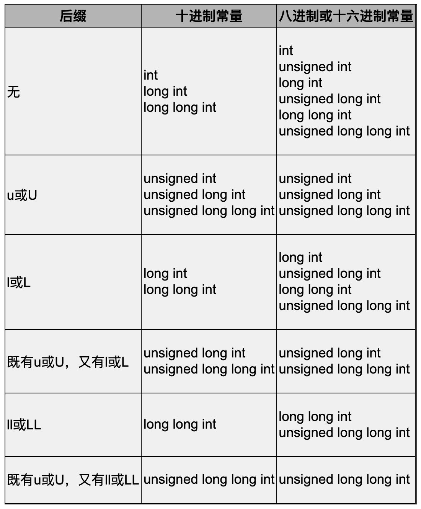

# 全书总结

## 重要的概念

- [C 语言标准](part-1/chapter-2.md#C-语言标准)
- [组合](part-1/chapter-2.md#目前学过的语法规则)
- [Side Effects](part-1/chapter-3.md#Side-Effects)
- [函数和过程](part-1/chapter-3.md#自定义函数语法规则)
- [Rule of Lease Surprise](part-1/chapter-3.md#带参数函数的定义和声明)
- [Rationale](part-1/chapter-3.md#带参数函数的定义和声明)
- [函数也叫接口](part-1/chapter-3.md#形参和实参)
- [Man Page](part-1/chapter-3.md#Man-Pages)
- [谓词](part-1/chapter-4.md#谓词)
- [代码路径、Dead Code](part-1/chapter-5.md#代码路径和-dead-code)
- [增量式开发](part-1/chapter-5.md#增量式开发)
- [手脚架](part-1/chapter-5.md#手脚架)
- [复用代码](part-1/chapter-5.md#复用代码，避免重复写代码)
- [函数的分层设计](part-1/chapter-5.md#函数的分层设计)
- [Leap of Faith](part-1/chapter-5.md#递归函数)
- [完备的 C 语言子集](part-1/chapter-5.md#目前学到的语法已经完备)
- [函数式编程和命令式编程](part-1/chapter-6.md#比较递归和循环)
- [goto 语句的危害](part-1/chapter-6.md#goto-语句)
- [学习编程语言时要注意的三方面](part-1/chapter-7.md#学习编程语言时要注意的三个方面)
- [数据抽象和抽象层](part-1/chapter-7.md#数据抽象)
- [硬编码](part-1/chapter-8.md#硬编码)
- [Epoch](part-1/chapter-8.md#8.3-数组应用实例：直方图)
- [Row-Major and Column-Major](part-1/chapter-8.md#初始化二维数组)
- [数据驱动的编程](part-1/chapter-8.md#数据驱动的编程)
- [代码是写给人看的](part-1/chapter-9.md#9.-编码风格)
- [UNIX 标准字符终端长宽](part-1/chapter-9.md#9.-编码风格)
- [Loop Invariant](part-1/chapter-11.md#11.2-插入排序)
- [Design by Contract](part-1/chapter-11.md#11.6-折半查找)
- [断言](part-1/chapter-11.md#11.6-折半查找)
- [算法 + 数据结构 = 程序](part-1/chapter-12.md#12.1-数据结构的概念)
- [Class Invariant](part-1/chapter-12.md#12.2-堆栈)
- [Implementation-Defined, Unspecified, and Undefined](part-2/chapter-14.md#Implementation-Defined,-Unspecified,-and-Undefined)

## 源代码组成

### 函数体外

函数体外可以出现声明和预处理指令。

- 声明

  > 语句只能出现在函数体中，而声明既可以出现在函数体中也可以出现在所有函数之外。

  - 变量定义（变量初始化）

    定义在所有函数体之外的变量叫做全局变量。

    全局变量只能用常量表达式（由常量组成的表达式）来初始化。

    如果全局变量在定义时不初始化则初始值是0。

  - 函数声明、函数定义

  - 类型声明

- 预处理指令

  - `#include`
  - `#define`

### 函数体内

函数体内可以出现声明和语句。

#### 声明

- 变量定义（变量初始化）

  定义在函数体中的变量叫做局部变量。

  局部变量可以用类型相符的任意表达式来初始化。

  如果局部变量在定义时不初始化则初始值是不确定的。

- 函数声明

- 函数定义是否可以存在

  C 语言不允许在一个函数体中定义另一个函数。

  但 gcc 的扩展特性允许这一行为。

  > 虽然在一个函数体中可以声明另一个函数，但不能定义另一个函数，C语言不允许嵌套定义函数。
  >
  > 但gcc的扩展特性允许嵌套定义函数，本书不做详细讨论。

- 类型声明

#### 语句

任何允许出现语句的地方可以出现：由 ; 结尾的一条语句；也可以是由{}括起来的若干条语句或声明组成的语句块，语句块和函数体的语法相同；也可以是单独 ; 表示的空语句。

标号后面可以跟单条语句、语句块、空语句，但是不能跟声明，可以把声明放在{}中或者在声明前面加一个 ;。标号除了可以随意写外，还可以是 `case 整型常量表达式:` 和 `default:`。一条语句前面可以有多个标号。

- 表达式语句

  表达式语句由任意表达式和表达式后的 ; 组成。

  - 表达式

    任何表达式都有**值**和**类型**两个基本属性。类型在下面讨论。

    标识符、常量、字符串和用()括号套起来的表达式是组成表达式的最基本单元，在运算中做操作数，优先级最高。常量在下面讨论。

    复合表达式由运算符和操作数组成。运算符在下面讨论。

    函数调用表达式和由运算符和操作数组成的表达式都可能会有 side effect。side effect 在下面讨论。

    - [类型](#类型（Type）)

    - [常量](#常量)

    - [运算符](#运算符)

    - [side effect](#Side-Effect)

- 改变控制流程的语句

  控制流程的表达式就是控制表达式。

  - 跳转

    - break 语句

    - continue 语句

    - goto 语句

      goto 语句和标号配合，可以在一个函数内实现无条件跳转。

  - 分支

    - if/else 语句

      if/else 中可以用单条语句、语句块、空语句。

      else 子句可以省略。

    - [switch 语句](#switch-语句)

      switch 的语句块就是一个正常的语句块，可以有声明和语句。特殊的是 switch 语句块中语句前面的标号可以是 `case 整型常量表达式:` 和 `default:`。

  - 循环

    - while 语句

      while 中可以用单条语句、语句块、空语句。

    - do/while 语句

      do/while 中可以用单条语句、语句块、空语句。

    - for 语句

      for 中可以用单条语句、语句块、空语句。

      如果控制表达式 2 为空，则认为控制表达式2的值为真。

      C99 规定了在控制表达式 1 的位置可以有变量定义。如果这样定义，那么这个变量只是 for 循环中的局部变量而不是整个函数的局部变量。

- return 语句

#### 类型（Type）

- 类型种类
- 类型大小
- 类型转换

---

- 类型种类

  - 标量（Scalar）类型

    可以表示零和非零，可以参与逻辑与、或、非运算或者做控制表达式的类型称为标量类型（Scalar Type）。

    - 算术（Arithmetic）类型

      可以做算术运算的类型称为算术类型（Arithmetic Type）。

      - 整数（Integer）类型

        整数类型的符号在下面讨论。

        - 布尔类型

          如果一个表达式要产生一个代表真假的值，那就两种情况，1 代表真，0 代表假。

          如果某条语句要检查一个表达式是真是假，非 0 代表真，0 代表假。

        - `char`，`signed char`，`unsigned char`，字符（Character）类型

        - `short int`/`short`/`signed short int`/`signed short`，`unsigned short int`/`unsigned short`

        - `int`/`signed int`/`signed`，`unsigned int`/`unsigned`，整数（Integer）类型

        - `long int`/`long`/`signed long int`/`signed long`，`unsigned long int`/`unsigned long`

        - `long long int`/`long long`/`signed long long int`/`signed long long`，`unsigned long long int`/`unsigned long long`

        - `enum tag` 枚举（Enumeration）类型

        - bit-field

      - 浮点数（Floating Point）类型

        - 单精度浮点数类型

          `float`

        - 双精度浮点数类型

          `double`

        - 精度更高的浮点数类型

          `long double`

    - 指针类型

  - 函数类型（Function Type）

  - void 类型

- unsigned and signed

  - 有符号数的表示方式

    对于有符号数在计算机中的表示是 Sign and Magnitude、1's Complement 还是 2's Complement，C 标准也没有明确规定，也是 Implementation Defined。

    大多数体系结构都采用 2's Complement 表示法，x86 平台也是如此。

  - char

    不带 signed 或 unsigned 关键字的 char 型是无符号数还是有符号数是 implementation defined。

    x86 平台的 gcc 定义 char 型是有符号的。

  - 除了 char 以外的类型

    除了 char 型以外的这些类型如果不明确写 signed 或 unsigned 关键字都表示 signed，这一点是 C 标准明确规定的，不是 Implementation Defined。

---

- 类型大小

  - 整数类型

    - char

      C 语言中 char 型占一个字节的存储空间，一个字节通常是 8 个 bit。

    - 除了 char 以外的其他整型大小

      除了 char 型在 C 标准中明确规定占一个字节之外，其他整型占几个字节都是 Implementation Defined。

      通常的编译器实现遵守 ILP32 或 LP64 规范。

      | 类型 | ILP32（位数） | LP64（位数） |
      | --------- | -- | -- |
      | char      | 8  | 8  |
      | short     | 16 | 16 |
      | int       | 32 | 32 |
      | long      | 32 | 64 |
      | long long | 64 | 64 |
      | 指针 | 32 | 64 |

    - 大小确定的整数类型

      在 C 标准库头文件 stdint.h 中定义了一些大小确定的整数类型，使用这些类型名写代码就可以屏蔽 ILP32 和 LP64 之间的差异了：

      | 类型名 | 说明 |
      | int8_t int16_t int32_t int64_t     | 8位、16位、32位、64位的有符号整数 |
      | uint8_t uint16_t uint32_t uint64_t | 8位、16位、32位、64位的无符号整数 |
      | intptr_t  | 一种有符号整数类型，指针类型可以转换成这种类型而不丢失信息 |
      | uintptr_t | 一种无符号整数类型，指针类型可以转换成这种类型而不丢失信息 |

  - 浮点数类型

    C 标准既没有规定每种类型占多少字节，也没有规定采用哪种表示形式。

    - float 和 double

      大部分平台的浮点数实现遵循 IEEE 754，float 型通常是 32 位，double 型通常是 64 位。

    - long double

      long double 型通常是比 double 型精度更高的类型，但各平台的实现有较大差异。

      在 x86 平台上，大多数编译器实现的 long double 型是 80 位，因为 x86 的浮点运算单元具有 80 位精度，gcc 实现的 long double 型是 12 字节（96 位），这是为了对齐到 4 字节边界。

---

- 类型转换

  - 两种类型转换

    - 隐式类型转换（Implicit Conversion/Coercion）

      隐式类型转换见下。

    - 显式类型转换（Explicit Conversion)/强制类型转换（Type Cast）

      用类型转换运算符就可以进行显示类型转换。

  - 类型转换具体如何进行

    见第 14 章中[编译器如何处理类型转换](part-2/chapter-14.md#编译器如何处理类型转换)

- 隐式类型转换

  - 等号两边类型不同

    如果赋值或初始化时等号两边的类型不相同，则编译器会把等号右边的类型转换成等号左边的类型再做赋值。例如int c=3.14;，编译器会把右边的double型转成int型再赋给变量c。

  - 函数

    - 函数实参和形参类型不一样

      函数调用传参的过程相当于定义形参并且用实参对其做初始化。所以由赋值或初始化产生的类型转换也适用于这种情况。

      例如一个函数的原型是int foo(int, int);，则调用foo(3.1, 4.2)时会自动把两个double型的实参转成int型赋给形参。

    - return 后面的表达式类型和函数返回类型不一样

      函数返回的过程相当于定义一个临时变量并且用return的表达式对其做初始化，所以由赋值或初始化产生的类型转换也适用于这种情况。

      如果这个函数定义中有返回语句return 1.2;，则返回值1.2会自动转成int型再返回。

    - 函数形参类型未知或使用了可变参数：Default Argument Promotion

      如果一个函数的形参类型未知，例如使用了Old Style C风格的函数声明（详见第3.2节），或者函数的参数列表中有...，那么：

      实参类型是 char、short、bit-field（不管有无符号），调用函数时要将实参提升为 int 或 unsigned int（如果实参类型取值范围用 int 表示不了）。这叫 Integer Promotion。

      比如 printf 的参数列表中有...，除了第一个形参之外，其他形参的类型都是未知的。有这样的代码 `char ch = 'A'; printf("%c", ch);`，ch 要被提升为 int 型之后再传给 printf。

      实参类型是 float ，调用函数时要将实参提升为 double 型。

      这条规则称为 Default Argument Promotion。

  - \+ - * / % > < >= <= == != & | ^ ?: 复合赋值运算符：Usual Arithmetic Conversion

    两个算术类型的操作数做算术运算，比如a+b，如果两边操作数的类型不同，编译器会自动做类型转换，使两边类型相同之后才做运算，这称为Usual Arithmetic Conversion。

    到目前为止我们学过的+ - * / % ><>= <= == !=运算符都需要做Usual Arithmetic Conversion，因为都要求两边操作数的类型一致。

    &、|、^ 运算符都是要做 Usual Arithmetic Conversion 的。

    ?: 运算符的表达式 2 和表达式 3 类型要求一致，所以这两个表达式也要做 Usual Arithmetic Conversion。

    各种复合赋值运算符要求两边的操作数类型一致，也要做 Usual Arithmetic Conversion。

    转换规则如下：

    - 如果有一边的类型是long double，则把另一边也转成long double。

    - 否则，如果有一边的类型是double，则把另一边也转成double。

    - 否则，如果有一边的类型是float，则把另一边也转成float。

    - 否则，两边应该都是整型。

      首先，操作数如果是 char、short、bit-field（不管有无符号），要将操作数提升为 int 或 unsigned int（如果操作数类型取值范围用 int 表示不了），然后才能参与计算。这叫Integer Promotion。

      例如，`unsigned char c1 = 255, c2 = 2; int n = c1 + c2;`，计算表达式c1＋c2的过程其实是先把c1和c2提升为int型然后再相加（unsigned char的取值范围是0～255，完全可以用int表示，所以提升为int就可以了，不需要提升为unsigned int），整个表达式的值也是int型，最后的结果是257。假如没有这个提升的过程，c1+c2就溢出了，溢出会得到什么结果是Undefined，在大多数平台上会把进位截掉，得到的结果应该是1。

      然后如果类型仍不相同，则需要继续转换。我们规定char、short、int、long、long long的转换级别（Integer Conversion Rank）一个比一个高，同一类型的有符号和无符号数具有相同的Rank。转换规则如下：

      - 如果两边都是有符号数，或者都是无符号数，那么较低Rank的类型转换成较高Rank的类型。例如unsigned int和unsigned long做算术运算时都转成unsigned long。

      - 否则，如果一边是无符号数另一边是有符号数，无符号数的Rank不低于有符号数的Rank，则把有符号数转成另一边的无符号类型。例如unsigned long和int做算术运算时都转成unsigned long，unsigned long和long做算术运算时也都转成unsigned long。

      - 剩下的情况是：一边有符号另一边无符号，并且无符号数的Rank低于有符号数的Rank。这时又分为两种情况，如果这个有符号数类型能够覆盖这个无符号数类型的取值范围，则把无符号数转成另一边的有符号类型。例如遵循LP64的平台上unsigned int和long在做算术运算时都转成long。

      - 否则，也就是这个有符号数类型不足以覆盖这个无符号数类型的取值范围，则把两边都转成有符号数的Rank对应的无符号类型。例如在遵循ILP32的平台上unsigned int和long在做算术运算时都转成unsigned long。

  - 单目运算符 + - ~、移位运算符 << >>

    单目运算符+ - ~只有一个操作数，移位运算符<<>>两边的操作数类型不要求一致，这些运算不需要做Usual Arithmetic Conversion，但也需要做Integer Promotion。

    移位运算符不同于+ - * / ==等运算符，两边操作数的类型不要求一致，但两边操作数都要做Integer Promotion，整个表达式的类型和左操作数提升后的类型相同。

  - && || ???

#### 常量

- 整数常量

  - 整数常量

    整数常量进制：可以写成十进制、0 加八进制、0x/0X 加十六进制。二进制不在标准中，不建议使用。

    末尾字母：可以加 u/U、l/L、ll/LL。

    判断一个整数常量类型的方法：先根据这个常量末尾的字母在下表（出自参考文献[8]的6.4.4.1节条款5）中找到单元格，然后从上到下在单元格列出的类型中找到第一个足够大的类型，这个类型就是常量的类型。

    

  - int 型

    - 字符常量
    - 枚举常量

- 浮点数常量

  浮点数常量写法：

  - x1e/Ex2（基数为 2）

    C99 引入一种新的十六进制浮点数表示，基数是 2。

  - x1e/Ex2（基数为 10）

    x1 是尾数，x2是指数，用 e/E 隔开，基数是 10。

    x1 可以是整数可以是小数，小数的小数点左边或右边可以没数字。

    可以只写 x1，这时 x1 不能是整数；也可以只写 e/Ex2。

  浮点数常量类型判断：

  浮点数的后缀和类型之间的对应关系比较简单，没有后缀的浮点数常量是 double 型的，有后缀 f 或 F 的浮点数常量是 float 型的，有后缀 l 或 L 的浮点数常量是 long double 型的。

  例如 3.14 是 double 类型的。

#### 运算符

- 运算符优先级和结合性
- 运算符注意事项

---

- 运算符优先级和结合性

  左结合和右结合这两个概念只对双目运算符有意义，对于前缀、后缀和三目运算符我单独做了说明。

  - 后缀运算符

    函数调用 ()、后缀自增 ++、后缀自减 --、结构体取成员 .、数组取下标 []、指向结构体的指针取成员 ->

    如果一个操作数后面有多个后缀，按照离操作数从近到远的顺序（也就是从左到右）依次计算，比如a.name++，先算a.name，再++，这里的.name应该看成a的一个后缀，而不是把.看成双目运算符。

  - 单目运算符

    逻辑非 !、正号 +、负号 -、前缀自增 ++、前缀自减 --、类型转换 (类型名)、按位取反 ~、sizeof、取地址运算 &、指针间接寻址 *

    如果一个操作数前面有多个前缀，按照离操作数从近到远的顺序（也就是从右到左）依次计算，比如!~a，先算~a，再求!。

  - 乘除模运算符 左结合

    乘法 \* 除法 / 取模 %

  - 加减运算符 左结合

    加法 \+ 减法 -

  - 移位运算符 左结合

    左移 << 右移 >>

  - 关系运算符 左结合

    \> < >= <=

  - 相等性运算符 左结合

    == !=

  - 按位与运算符 & 左结合

  - 按位异或运算符 ^ 左结合

  - 按位或运算符 | 左结合

  - 逻辑与运算符 && 左结合

  - 逻辑或运算符 || 左结合

  - 条件运算符 ?:

    a ? b : c ? d : e是看成(a ? b : c) ? d : e还是a ? b : (c ? d : e)呢？C语言规定是后者。

  - 赋值运算符、复合赋值运算符 右结合

    = *= /= %= += -= <<= >>= &= ^= |=

  - 逗号运算符 , 左结合

---

- 运算符注意事项

  - 需要进行 usual arithmetic conversion 和 integer promotion 的运算符

    看上面的类型转换。

  - 类型转换运算符的操作数类型和结果类型

    操作数的类型必须是标量类型，转换之后的类型必须是标量类型或者void型。

  - 位运算符的操作数类型

    四个位运算符的操作数必须是整型。

  - 逻辑与、或、非运算符的操作数类型

    逻辑与、或、非运算符的操作数要为标量类型（Scalar Type）。

  - sizeof 运算符

    使用 sizeof 的表达式有两种形式：`sizeof 表达式` 和 `sizeof(类型名)`。

    `sizeof 表达式` 中的 `表达式` 可以加括号也可以不加；`sizeof(类型名)`中的 `类型名` 必须加括号。

    `sizeof 表达式` 不对 `表达式` 求值，因为 `表达式` 的类型在编译的时候的时候就可以确定。在编译的时候 `sizeof 表达式` 就被替换成常量表达式了，不需要在运行时通过求值确定类型。（可变长度的数组是例外）

    sizeof 后面可以跟数组类型变量、字符串字面值。

    sizeof 表达式结果是 size_t 类型，C 标准规定 size_t 是一种无符号整型。不同平台编译器定义的 size_t 不一样。最好不要将 size_t 类型变量和有符号数比较。

  - 除法运算符操作数为两个整数时的结果数值

    两个整数相除结果无论是正是负，总是把小数部分截掉。

  - 取模运算符的操作数类型和结果符号

    % 运算符的两个操作数必须是整型的。

    % 运算符的结果总是与被除数同号。

  - 移位运算符

    左移运算符低位补 0。

    右移运算符对无符号数高位补 0；对有符号数正数高位补 0，负数补 1 还是补 0 是 implementation-defined。

    x86 平台的 gcc 编译器，对负数最高位移入 1，也就是仍保持负数的符号位。

    两个移位运算符右边的操作数必须小于左边操作数的总位数，否则结果是 undefined。

    两个移位运算符两边操作数的类型不要求一致，但两边操作数都要做Integer Promotion，整个表达式的类型和左操作数提升后的类型相同。

  - 关系运算符和相等性运算符的操作数类型

    这些运算符的两个操作数应该是相同类型的，两边都是整型或者都是浮点型可以做比较，但两个字符串不能做比较。

    浮点型因为精度问题，不适合用 == 运算符做精确比较。

  - 逻辑与运算符和逻辑或运算符的 short-circuit 特性

  - 条件运算符的操作数类型

    表达式1 ? 表达式2 : 表达式3

    表达式 1 必须是标量类型，表达式 2 和表达式 3 要做 usual arithmetic conversion。

  - 赋值运算符左边的操作数（左值）

    只有变量、数组取下标表达式可以做左值。

    函数调用表达式不能做左值。

    由 . 后缀运算符组成的表达式能不能做左值取决于 . 后缀运算符左边的操作数能不能做左值。

  - 复合赋值运算符

    复合赋值运算符只对它左边的操作数求一次值，复合赋值表达式对应的赋值表达式要对操作数求两次值，效率不一样。

    如果操作数是没有 side effect 的表达式，一次求值和两次求值结果一样；如果操作数是有 side effect 的表达式，一次求值和两次求值 side effect 分别被执行一次和两次，结果不一样。

    **自增自减运算符**等价于复合赋值表达式，而不是赋值表达式。左值也是只求值一次。

  - 逗号运算符

    表达式1，表达式2

    两个表达式不要求类型一致，左边的表达式1先求值，求完了直接把值丢掉，再求右边表达式2的值作为整个表达式的值。

    注意区分函数调用时实参之间的逗号和逗号运算符，另外可以把逗号表达式当作实参。

#### Side Effect

- 哪些操作算 side effects

  - 改变计算机存储单元里的数据
  - 做输入输出操作

- 表达式中有多个 side effect

  根据运算符的优先级，表达式的求值一定是有顺序的。但是当表达式中有 side effect 时，这些 side effect 的执行先后不一定有顺序。

  具体见第 15 章中的 [Side Effect 与 Sequence Point](15.3-Side-Effect-与-Sequence-Point)。

#### switch 语句

- 格式要求

  - case 分支

    - case 后面要跟常量表达式

      > case后面跟的表达式必须是常量表达式，这个值和全局变量的初始值一样必须在**编译时计算出来**。

    - case 后面跟的常量表达式还要是整型的

      > 第4.2节讲过浮点型不适合做精确比较，所以C语言规定case后面跟的必须是整型常量表达式。

    - 每个 case 后面跟的常量表达式必须互不相同

      > C语言规定各case分支的常量表达式必须互不相同。

  - default 分支

    - default 分支可以有，可以没有

    - default 分支通常写在最后，但也可以写在开头和中间

  - break 语句

    case 分支对应的语句和 default 分支对应的语句中可以有 break 语句，也可以没有。

- 执行流程

  将控制表达式和所有 case 分支的整型常量表达式进行比较。

  如果有一个（最多只能有一个，因为每个 case 分支的表达式互不相同）case 分支匹配上了，那么执行该 case 分支后面的语句和声明。

  如果没有 case 分支匹配上，再看有没有 default 分支。如果有 default 分支，执行对应的语句和声明。如果没有 default 分支，则跳过 switch 语句。

  在执行 case 分支和 default 分支对应的语句和声明时，除非遇到 break 语句或者执行到 switch 语句的末尾，否则一直往下执行，即使执行到其他 case 分支或 default 分支对应的语句和声明。如果遇到了 break 语句，那么跳出 switch 语句，执行后面的语句。

## GCC 使用

### C 标准

选项-std=c99。

### 从源代码到可执行文件的整个过程

一个 C 源代码文件要先被编译器翻译成汇编程序，再被汇编器翻译成机器指令，最后还要经过链接器的处理才能成为可执行文件。

编译器的工作分为两个阶段，先是预处理（Preprocess）阶段，然后才是编译阶段。

- 预处理阶段

  预处理器将源代码中的预处理指令进行预处理。

  - #include

    - 包含的头文件位置

      头文件通常位于/usr/include目录。

  - 处理之后的源代码

    可以用这两种方式查看预处理之后的源代码；

    - `$gcc -E main.c`

    - `$cpp main.c`

      cpp 是 C preprocessor 的意思。

- 编译阶段

  - 让 GCC 提示所有警告信息

    在使用 GCC 编译的时候加上 `-Wall` 选项。

- 链接阶段

  - `-l` 选项

    链接库文件时，需要根据库文件文件名用相应的选项执行 GCC。如链接 `libm.so`，命令为 `$gcc main.c -lm`。`-lc` 不用加上，这是 GCC 默认选项。

- 可执行文件

  - 默认的可执行文件名 `a.out`

    `a.out` 是 Assembler Output 的缩写。

  - 改变可执行文件名

    `$ gcc main.c -o main`

### 编译、汇编、链接

> 总结一下编译执行的过程，首先你用文本编辑器写一个C程序，然后保存成一个文件，例如program.c（通常C程序的文件名后缀是.c），这称为源代码（Source Code）或源文件，然后运行编译器对它进行编译，编译的过程并不执行程序，而是把源代码全部翻译成机器指令，再加上一些描述信息，生成一个新的文件，例如a.out，这称为可执行文件，可执行文件可以被操作系统加载运行，计算机执行该文件中由编译器生成的指令，如图1.1所示。

描述信息是什么？

## Bash

`$?`

## 转义序列

转义序列有以下两类：

- C 标准规定的转义字符

  

- ASCII 码转义序列

  > 这种转义序列由\加上1～3个八进制数字组成，或者由\x加上1～2个十六进制数字组成，可以用在**字符常量**或**字符串字面值**中。

注意事项：

- 在字符串字面值中表示 \、" 必须使用转义序列
- 在字符常量中表示 \、' 必须使用转义序列
